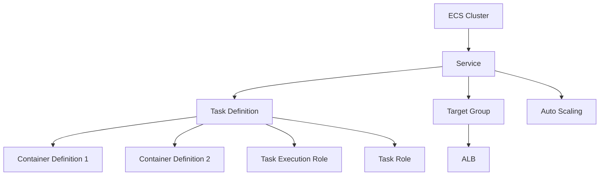

# How to Use Ansible to Create AWS ECS Clusters

Author: [nawazdhandala](https://www.github.com/nawazdhandala)

Tags: Ansible, AWS, ECS, Containers, Infrastructure as Code

Description: Step-by-step guide to creating AWS ECS clusters with Ansible including task definitions, services, Fargate configuration, and deployment automation.

---

Amazon ECS is the AWS-native way to run containers. Whether you are using Fargate (serverless containers) or EC2 launch type (you manage the instances), ECS handles orchestration, scaling, and service discovery. Setting up an ECS cluster involves multiple resources: the cluster itself, task definitions, services, load balancers, and IAM roles. Ansible lets you define all of these in a single playbook.

This guide covers creating ECS clusters, defining tasks, deploying services, and building a complete container deployment pipeline with Ansible.

## Prerequisites

You need:

- Ansible 2.14+
- The `amazon.aws` and `community.aws` collections
- AWS credentials with ECS permissions
- A VPC with subnets configured
- Python boto3

```bash
# Install dependencies
ansible-galaxy collection install amazon.aws community.aws
pip install boto3 botocore
```

## ECS Architecture

Here is how the pieces of ECS fit together:



A cluster contains services. Services run tasks based on task definitions. Task definitions describe what containers to run and their resource requirements.

## Creating an ECS Cluster

The simplest starting point is a Fargate cluster:

```yaml
# create-cluster.yml - Create an ECS Fargate cluster
---
- name: Create ECS Cluster
  hosts: localhost
  connection: local
  gather_facts: false

  vars:
    aws_region: us-east-1
    cluster_name: myapp-production

  tasks:
    # Create the ECS cluster with Container Insights enabled
    - name: Create ECS cluster
      community.aws.ecs_cluster:
        name: "{{ cluster_name }}"
        region: "{{ aws_region }}"
        state: present
        capacity_providers:
          - FARGATE
          - FARGATE_SPOT
        capacity_provider_strategy:
          - capacity_provider: FARGATE
            weight: 1
            base: 1
          - capacity_provider: FARGATE_SPOT
            weight: 3
      register: cluster_result

    - name: Show cluster ARN
      ansible.builtin.debug:
        msg: "Cluster ARN: {{ cluster_result.cluster.clusterArn }}"
```

The capacity provider strategy uses Fargate for at least one task (the base) and spreads additional tasks across Fargate Spot (which is cheaper but can be interrupted) at a 3:1 ratio.

## Creating a Task Definition

Task definitions describe your containers:

```yaml
# create-task-def.yml - Define a containerized application
---
- name: Create ECS Task Definition
  hosts: localhost
  connection: local
  gather_facts: false

  vars:
    aws_region: us-east-1
    family: myapp-web
    execution_role_arn: arn:aws:iam::123456789012:role/myapp-ecs-execution-role
    task_role_arn: arn:aws:iam::123456789012:role/myapp-ecs-task-role

  tasks:
    # Define the task with container specifications
    - name: Create task definition
      community.aws.ecs_taskdefinition:
        family: "{{ family }}"
        region: "{{ aws_region }}"
        state: present
        network_mode: awsvpc
        launch_type: FARGATE
        cpu: "512"
        memory: "1024"
        execution_role_arn: "{{ execution_role_arn }}"
        task_role_arn: "{{ task_role_arn }}"
        containers:
          - name: web
            image: "123456789012.dkr.ecr.us-east-1.amazonaws.com/myapp:latest"
            essential: true
            portMappings:
              - containerPort: 8080
                protocol: tcp
            environment:
              - name: APP_ENV
                value: production
              - name: PORT
                value: "8080"
            logConfiguration:
              logDriver: awslogs
              options:
                awslogs-group: "/ecs/myapp-web"
                awslogs-region: "{{ aws_region }}"
                awslogs-stream-prefix: web
            healthCheck:
              command:
                - CMD-SHELL
                - "curl -f http://localhost:8080/health || exit 1"
              interval: 30
              timeout: 5
              retries: 3
              startPeriod: 60
      register: task_def_result

    - name: Show task definition ARN
      ansible.builtin.debug:
        msg: "Task Definition: {{ task_def_result.taskdefinition.taskDefinitionArn }}"
```

## Multi-Container Task Definition

Some applications need sidecar containers:

```yaml
# Task with application container and log router sidecar
- name: Create multi-container task definition
  community.aws.ecs_taskdefinition:
    family: myapp-with-sidecar
    region: us-east-1
    state: present
    network_mode: awsvpc
    launch_type: FARGATE
    cpu: "1024"
    memory: "2048"
    execution_role_arn: "{{ execution_role_arn }}"
    task_role_arn: "{{ task_role_arn }}"
    containers:
      # Main application container
      - name: app
        image: "123456789012.dkr.ecr.us-east-1.amazonaws.com/myapp:{{ version }}"
        essential: true
        portMappings:
          - containerPort: 8080
            protocol: tcp
        environment:
          - name: APP_ENV
            value: production
        logConfiguration:
          logDriver: awslogs
          options:
            awslogs-group: "/ecs/myapp"
            awslogs-region: us-east-1
            awslogs-stream-prefix: app
      # Datadog agent sidecar for monitoring
      - name: datadog-agent
        image: "public.ecr.aws/datadog/agent:latest"
        essential: false
        environment:
          - name: DD_API_KEY
            value: "{{ datadog_api_key }}"
          - name: ECS_FARGATE
            value: "true"
        logConfiguration:
          logDriver: awslogs
          options:
            awslogs-group: "/ecs/myapp"
            awslogs-region: us-east-1
            awslogs-stream-prefix: datadog
```

## Creating an ECS Service

A service keeps a specified number of tasks running and integrates with load balancers:

```yaml
# create-service.yml - Deploy an ECS service behind an ALB
---
- name: Create ECS Service
  hosts: localhost
  connection: local
  gather_facts: false

  vars:
    aws_region: us-east-1
    cluster_name: myapp-production
    service_name: myapp-web
    desired_count: 3

  tasks:
    # Create the CloudWatch log group first
    - name: Create log group
      amazon.aws.cloudwatchlogs_log_group:
        log_group_name: "/ecs/myapp-web"
        region: "{{ aws_region }}"
        retention: 30
        state: present

    # Create the ECS service
    - name: Create ECS service
      community.aws.ecs_service:
        name: "{{ service_name }}"
        cluster: "{{ cluster_name }}"
        region: "{{ aws_region }}"
        state: present
        task_definition: myapp-web
        desired_count: "{{ desired_count }}"
        launch_type: FARGATE
        network_configuration:
          subnets:
            - subnet-private-1
            - subnet-private-2
          security_groups:
            - sg-0abc123def456789
          assign_public_ip: false
        load_balancers:
          - targetGroupArn: arn:aws:elasticloadbalancing:us-east-1:123456789012:targetgroup/myapp-tg/abc123
            containerName: web
            containerPort: 8080
        health_check_grace_period_seconds: 120
        deployment_configuration:
          minimum_healthy_percent: 50
          maximum_percent: 200
      register: service_result
```

The deployment configuration controls rolling updates. With `minimum_healthy_percent: 50`, ECS keeps at least half the tasks running during a deployment. `maximum_percent: 200` allows double the desired count temporarily.

## Deploying a New Version

To deploy a new version of your application, update the task definition with a new image tag, then update the service:

```yaml
# deploy-new-version.yml - Deploy a new application version
---
- name: Deploy New Version
  hosts: localhost
  connection: local
  gather_facts: false

  vars:
    version: "1.5.0"
    aws_region: us-east-1

  tasks:
    # Register a new task definition revision with the new image tag
    - name: Update task definition
      community.aws.ecs_taskdefinition:
        family: myapp-web
        region: "{{ aws_region }}"
        state: present
        network_mode: awsvpc
        launch_type: FARGATE
        cpu: "512"
        memory: "1024"
        execution_role_arn: arn:aws:iam::123456789012:role/myapp-ecs-execution-role
        task_role_arn: arn:aws:iam::123456789012:role/myapp-ecs-task-role
        containers:
          - name: web
            image: "123456789012.dkr.ecr.us-east-1.amazonaws.com/myapp:{{ version }}"
            essential: true
            portMappings:
              - containerPort: 8080
                protocol: tcp
            environment:
              - name: APP_ENV
                value: production
              - name: APP_VERSION
                value: "{{ version }}"
            logConfiguration:
              logDriver: awslogs
              options:
                awslogs-group: "/ecs/myapp-web"
                awslogs-region: "{{ aws_region }}"
                awslogs-stream-prefix: web
      register: new_task_def

    # Update the service to use the new task definition
    - name: Update service
      community.aws.ecs_service:
        name: myapp-web
        cluster: myapp-production
        region: "{{ aws_region }}"
        state: present
        task_definition: "{{ new_task_def.taskdefinition.taskDefinitionArn }}"
        force_new_deployment: true

    - name: Show deployment info
      ansible.builtin.debug:
        msg: "Deployed version {{ version }} with task def {{ new_task_def.taskdefinition.taskDefinitionArn }}"
```

## Auto Scaling

Configure auto scaling for your ECS service:

```yaml
# Set up auto scaling based on CPU utilization
- name: Register scalable target
  ansible.builtin.command:
    cmd: >
      aws application-autoscaling register-scalable-target
      --service-namespace ecs
      --resource-id service/myapp-production/myapp-web
      --scalable-dimension ecs:service:DesiredCount
      --min-capacity 2
      --max-capacity 10
      --region us-east-1
  changed_when: true

- name: Create scaling policy
  ansible.builtin.command:
    cmd: >
      aws application-autoscaling put-scaling-policy
      --service-namespace ecs
      --resource-id service/myapp-production/myapp-web
      --scalable-dimension ecs:service:DesiredCount
      --policy-name myapp-cpu-scaling
      --policy-type TargetTrackingScaling
      --target-tracking-scaling-policy-configuration
      '{"TargetValue": 70.0, "PredefinedMetricSpecification": {"PredefinedMetricType": "ECSServiceAverageCPUUtilization"}, "ScaleOutCooldown": 60, "ScaleInCooldown": 120}'
      --region us-east-1
  changed_when: true
```

## Deleting ECS Resources

Clean up in reverse order: service first, then task definition, then cluster:

```yaml
# Remove ECS service (scales down tasks first)
- name: Delete ECS service
  community.aws.ecs_service:
    name: myapp-web
    cluster: myapp-production
    region: us-east-1
    state: absent
    force_deletion: true

# Remove the cluster
- name: Delete ECS cluster
  community.aws.ecs_cluster:
    name: myapp-production
    region: us-east-1
    state: absent
```

## Wrapping Up

ECS with Ansible gives you a complete container deployment pipeline. Define your clusters, task definitions, and services in playbooks, and deploy new versions by updating the image tag and letting ECS handle the rolling update. Add auto scaling for production workloads, use Fargate Spot for cost savings on non-critical services, and always set health check grace periods to prevent healthy containers from being killed during startup.
