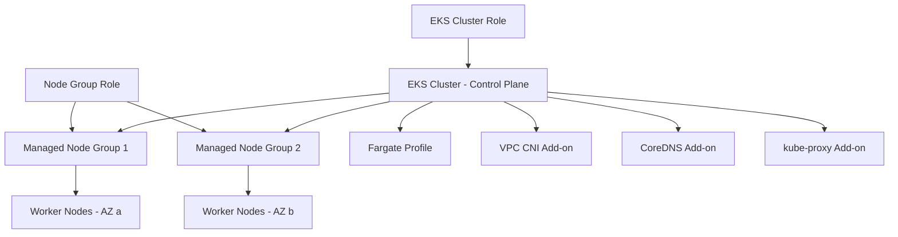

# How to Use Ansible to Create AWS EKS Clusters

Author: [nawazdhandala](https://www.github.com/nawazdhandala)

Tags: Ansible, AWS, EKS, Kubernetes, Infrastructure as Code

Description: Detailed guide to provisioning AWS EKS Kubernetes clusters with Ansible including node groups, IAM roles, networking, and cluster add-ons.

---

EKS is the managed Kubernetes service on AWS. It handles the control plane (API server, etcd, scheduler) while you manage the worker nodes. Setting up an EKS cluster involves a lot of moving parts: VPC networking, IAM roles, the cluster itself, node groups, and add-ons. Doing this manually is time-consuming and error-prone. Ansible lets you automate the entire process.

This guide walks through provisioning an EKS cluster from scratch with Ansible, including all the supporting infrastructure.

## Prerequisites

You need:

- Ansible 2.14+
- The `amazon.aws` and `community.aws` collections
- AWS credentials with EKS, EC2, and IAM permissions
- Python boto3
- kubectl installed locally

```bash
# Install dependencies
ansible-galaxy collection install amazon.aws community.aws
pip install boto3 botocore
```

## EKS Architecture

Here is what a production EKS setup looks like:



## Setting Up IAM Roles

EKS needs two roles: one for the cluster and one for the node groups.

```yaml
# eks-iam.yml - Create IAM roles for EKS
---
- name: Create EKS IAM Roles
  hosts: localhost
  connection: local
  gather_facts: false

  tasks:
    # Cluster role - allows EKS to manage AWS resources
    - name: Create EKS cluster role
      amazon.aws.iam_role:
        name: myapp-eks-cluster-role
        state: present
        assume_role_policy_document: |
          {
            "Version": "2012-10-17",
            "Statement": [
              {
                "Effect": "Allow",
                "Principal": {
                  "Service": "eks.amazonaws.com"
                },
                "Action": "sts:AssumeRole"
              }
            ]
          }
        managed_policies:
          - arn:aws:iam::aws:policy/AmazonEKSClusterPolicy
      register: cluster_role

    # Node group role - allows EC2 instances to join the cluster
    - name: Create EKS node group role
      amazon.aws.iam_role:
        name: myapp-eks-node-role
        state: present
        assume_role_policy_document: |
          {
            "Version": "2012-10-17",
            "Statement": [
              {
                "Effect": "Allow",
                "Principal": {
                  "Service": "ec2.amazonaws.com"
                },
                "Action": "sts:AssumeRole"
              }
            ]
          }
        managed_policies:
          - arn:aws:iam::aws:policy/AmazonEKSWorkerNodePolicy
          - arn:aws:iam::aws:policy/AmazonEKS_CNI_Policy
          - arn:aws:iam::aws:policy/AmazonEC2ContainerRegistryReadOnly
      register: node_role

    - name: Show role ARNs
      ansible.builtin.debug:
        msg:
          - "Cluster Role: {{ cluster_role.iam_role.arn }}"
          - "Node Role: {{ node_role.iam_role.arn }}"
```

## Creating the EKS Cluster

```yaml
# create-eks.yml - Provision the EKS cluster
---
- name: Create EKS Cluster
  hosts: localhost
  connection: local
  gather_facts: false

  vars:
    aws_region: us-east-1
    cluster_name: myapp-production
    k8s_version: "1.29"
    cluster_role_arn: arn:aws:iam::123456789012:role/myapp-eks-cluster-role
    subnet_ids:
      - subnet-private-az-a
      - subnet-private-az-b
      - subnet-public-az-a
      - subnet-public-az-b
    security_group_ids:
      - sg-0abc123def456789

  tasks:
    # Create the EKS cluster (this takes 10-15 minutes)
    - name: Create EKS cluster
      community.aws.eks_cluster:
        name: "{{ cluster_name }}"
        version: "{{ k8s_version }}"
        role_arn: "{{ cluster_role_arn }}"
        subnets: "{{ subnet_ids }}"
        security_groups: "{{ security_group_ids }}"
        region: "{{ aws_region }}"
        state: present
        wait: true
        tags:
          Environment: production
          ManagedBy: ansible
      register: eks_result

    - name: Show cluster endpoint
      ansible.builtin.debug:
        msg: "Cluster endpoint: {{ eks_result.endpoint }}"
```

The `wait: true` parameter makes Ansible wait until the cluster is fully active. This typically takes 10 to 15 minutes.

## Creating Managed Node Groups

After the cluster is up, add worker nodes:

```yaml
# create-nodegroup.yml - Add managed node groups to the cluster
---
- name: Create EKS Node Groups
  hosts: localhost
  connection: local
  gather_facts: false

  vars:
    aws_region: us-east-1
    cluster_name: myapp-production
    node_role_arn: arn:aws:iam::123456789012:role/myapp-eks-node-role

  tasks:
    # Create the primary node group for general workloads
    - name: Create general-purpose node group
      community.aws.eks_nodegroup:
        name: general-workers
        cluster_name: "{{ cluster_name }}"
        node_role: "{{ node_role_arn }}"
        region: "{{ aws_region }}"
        state: present
        subnets:
          - subnet-private-az-a
          - subnet-private-az-b
        instance_types:
          - t3.large
        scaling_config:
          min_size: 2
          max_size: 10
          desired_size: 3
        disk_size: 50
        labels:
          workload-type: general
        tags:
          Environment: production
          NodeGroup: general
        wait: true
      register: general_ng

    # Create a spot node group for batch processing workloads
    - name: Create spot node group
      community.aws.eks_nodegroup:
        name: spot-workers
        cluster_name: "{{ cluster_name }}"
        node_role: "{{ node_role_arn }}"
        region: "{{ aws_region }}"
        state: present
        subnets:
          - subnet-private-az-a
          - subnet-private-az-b
        instance_types:
          - t3.large
          - t3.xlarge
          - m5.large
        capacity_type: SPOT
        scaling_config:
          min_size: 0
          max_size: 20
          desired_size: 2
        labels:
          workload-type: batch
        taints:
          - key: batch-only
            value: "true"
            effect: NO_SCHEDULE
        wait: true
      register: spot_ng
```

The spot node group uses multiple instance types to increase the chances of getting capacity. The taint ensures only workloads that tolerate the `batch-only` taint get scheduled on these nodes.

## Configuring kubectl Access

After creating the cluster, update your kubeconfig:

```yaml
# Update kubeconfig to connect to the new cluster
- name: Update kubeconfig
  ansible.builtin.command:
    cmd: >
      aws eks update-kubeconfig
      --name {{ cluster_name }}
      --region {{ aws_region }}
  changed_when: true

# Verify connectivity
- name: Check cluster connectivity
  ansible.builtin.command:
    cmd: kubectl get nodes
  register: nodes_output

- name: Show nodes
  ansible.builtin.debug:
    msg: "{{ nodes_output.stdout_lines }}"
```

## Installing Cluster Add-ons

EKS clusters need core add-ons:

```yaml
# Install EKS add-ons using the AWS CLI
- name: Install VPC CNI add-on
  ansible.builtin.command:
    cmd: >
      aws eks create-addon
      --cluster-name {{ cluster_name }}
      --addon-name vpc-cni
      --addon-version v1.16.0-eksbuild.1
      --region {{ aws_region }}
  register: cni_result
  failed_when: false
  changed_when: "'ACTIVE' not in cni_result.stdout"

- name: Install CoreDNS add-on
  ansible.builtin.command:
    cmd: >
      aws eks create-addon
      --cluster-name {{ cluster_name }}
      --addon-name coredns
      --addon-version v1.11.1-eksbuild.6
      --region {{ aws_region }}
  register: coredns_result
  failed_when: false
  changed_when: "'ACTIVE' not in coredns_result.stdout"

- name: Install kube-proxy add-on
  ansible.builtin.command:
    cmd: >
      aws eks create-addon
      --cluster-name {{ cluster_name }}
      --addon-name kube-proxy
      --addon-version v1.29.0-eksbuild.1
      --region {{ aws_region }}
  register: proxy_result
  failed_when: false
  changed_when: "'ACTIVE' not in proxy_result.stdout"
```

## Complete EKS Setup Playbook

Here is a full playbook that brings everything together:

```yaml
# full-eks-setup.yml - Complete EKS cluster provisioning
---
- name: Full EKS Cluster Setup
  hosts: localhost
  connection: local
  gather_facts: false

  vars:
    aws_region: us-east-1
    cluster_name: myapp-production
    k8s_version: "1.29"
    env: production

  tasks:
    - name: Create EKS cluster role
      amazon.aws.iam_role:
        name: "{{ cluster_name }}-cluster-role"
        state: present
        assume_role_policy_document: |
          {
            "Version": "2012-10-17",
            "Statement": [{
              "Effect": "Allow",
              "Principal": {"Service": "eks.amazonaws.com"},
              "Action": "sts:AssumeRole"
            }]
          }
        managed_policies:
          - arn:aws:iam::aws:policy/AmazonEKSClusterPolicy
      register: cluster_role

    - name: Create EKS node role
      amazon.aws.iam_role:
        name: "{{ cluster_name }}-node-role"
        state: present
        assume_role_policy_document: |
          {
            "Version": "2012-10-17",
            "Statement": [{
              "Effect": "Allow",
              "Principal": {"Service": "ec2.amazonaws.com"},
              "Action": "sts:AssumeRole"
            }]
          }
        managed_policies:
          - arn:aws:iam::aws:policy/AmazonEKSWorkerNodePolicy
          - arn:aws:iam::aws:policy/AmazonEKS_CNI_Policy
          - arn:aws:iam::aws:policy/AmazonEC2ContainerRegistryReadOnly
      register: node_role

    # Pause to let IAM roles propagate
    - name: Wait for IAM propagation
      ansible.builtin.pause:
        seconds: 15

    - name: Create EKS cluster
      community.aws.eks_cluster:
        name: "{{ cluster_name }}"
        version: "{{ k8s_version }}"
        role_arn: "{{ cluster_role.iam_role.arn }}"
        subnets:
          - subnet-private-az-a
          - subnet-private-az-b
        region: "{{ aws_region }}"
        state: present
        wait: true
      register: eks_cluster

    - name: Create node group
      community.aws.eks_nodegroup:
        name: general-workers
        cluster_name: "{{ cluster_name }}"
        node_role: "{{ node_role.iam_role.arn }}"
        region: "{{ aws_region }}"
        state: present
        subnets:
          - subnet-private-az-a
          - subnet-private-az-b
        instance_types:
          - t3.large
        scaling_config:
          min_size: 2
          max_size: 8
          desired_size: 3
        wait: true

    - name: Update kubeconfig
      ansible.builtin.command:
        cmd: >
          aws eks update-kubeconfig
          --name {{ cluster_name }}
          --region {{ aws_region }}
      changed_when: true

    - name: Cluster ready
      ansible.builtin.debug:
        msg: "EKS cluster {{ cluster_name }} is ready at {{ eks_cluster.endpoint }}"
```

## Deleting EKS Resources

Clean up in reverse order:

```yaml
# Delete node groups first, then the cluster
- name: Delete node group
  community.aws.eks_nodegroup:
    name: general-workers
    cluster_name: myapp-production
    region: us-east-1
    state: absent
    wait: true

- name: Delete EKS cluster
  community.aws.eks_cluster:
    name: myapp-production
    region: us-east-1
    state: absent
    wait: true
```

## Wrapping Up

Provisioning EKS with Ansible automates what would otherwise be a lengthy manual process. Define your IAM roles, create the cluster, add node groups, and install add-ons all from a single playbook. For production environments, always use private subnets for node groups, configure node group scaling, and set up monitoring from the start. The time saved on repeated cluster creation for different environments makes the automation effort worthwhile from day one.
