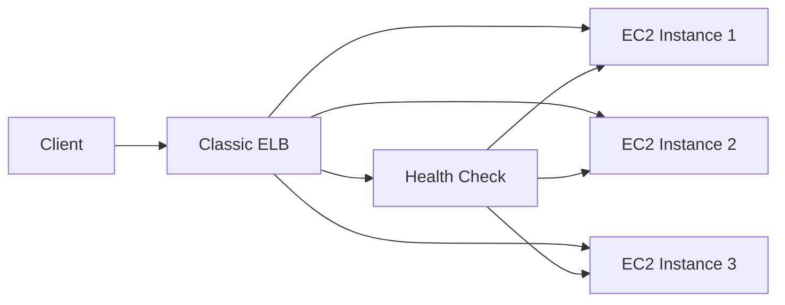

# How to Use Ansible to Create AWS Elastic Load Balancers

Author: [nawazdhandala](https://www.github.com/nawazdhandala)

Tags: Ansible, AWS, Load Balancing, ELB, Infrastructure as Code

Description: Step-by-step tutorial on creating and configuring AWS Classic Elastic Load Balancers using Ansible with health checks and listener configurations.

---

Classic Elastic Load Balancers (now called Classic Load Balancers or CLBs) have been part of AWS since 2009. While AWS recommends Application Load Balancers or Network Load Balancers for new projects, many existing systems still run on Classic ELBs. If you are managing those systems or need to automate their creation, Ansible makes it straightforward.

This post walks through creating Classic ELBs with Ansible, configuring listeners, setting up health checks, and managing the full lifecycle.

## Prerequisites

Make sure you have:

- Ansible 2.14+
- The `amazon.aws` collection installed
- AWS credentials configured
- A VPC with subnets already set up
- Python boto3 library

```bash
# Install the required collection and Python library
ansible-galaxy collection install amazon.aws
pip install boto3 botocore
```

## Classic ELB Architecture

A Classic ELB sits in front of your EC2 instances and distributes incoming traffic across them. It operates at both Layer 4 (TCP) and Layer 7 (HTTP/HTTPS).



## Creating a Basic Classic ELB

The `amazon.aws.elb_classic_lb` module handles Classic Load Balancer operations:

```yaml
# create-classic-elb.yml - Creates a Classic ELB with HTTP listener
---
- name: Create Classic Elastic Load Balancer
  hosts: localhost
  connection: local
  gather_facts: false

  vars:
    aws_region: us-east-1
    elb_name: web-classic-elb
    subnet_ids:
      - subnet-0aaa111222333
      - subnet-0bbb444555666
    security_group_ids:
      - sg-0abc123def456789

  tasks:
    # Create the Classic ELB with a basic HTTP listener
    - name: Create Classic Load Balancer
      amazon.aws.elb_classic_lb:
        name: "{{ elb_name }}"
        region: "{{ aws_region }}"
        state: present
        subnets: "{{ subnet_ids }}"
        security_group_ids: "{{ security_group_ids }}"
        listeners:
          - protocol: http
            load_balancer_port: 80
            instance_protocol: http
            instance_port: 80
        health_check:
          ping_protocol: http
          ping_port: 80
          ping_path: /health
          response_timeout: 5
          interval: 30
          unhealthy_threshold: 2
          healthy_threshold: 5
        tags:
          Name: "{{ elb_name }}"
          Environment: production
      register: elb_result

    - name: Show ELB DNS name
      ansible.builtin.debug:
        msg: "ELB DNS: {{ elb_result.elb.dns_name }}"
```

The `dns_name` in the output is what you point your DNS records at. It looks something like `web-classic-elb-1234567890.us-east-1.elb.amazonaws.com`.

## HTTPS Listener with SSL Certificate

For production workloads, you need HTTPS. You will need an SSL certificate in AWS Certificate Manager (ACM) or uploaded to IAM:

```yaml
# create-https-elb.yml - Classic ELB with HTTPS termination
---
- name: Create HTTPS Classic ELB
  hosts: localhost
  connection: local
  gather_facts: false

  vars:
    aws_region: us-east-1
    elb_name: secure-web-elb
    ssl_cert_arn: arn:aws:acm:us-east-1:123456789012:certificate/abc-def-123

  tasks:
    # ELB with both HTTP and HTTPS listeners
    # HTTPS terminates at the ELB, backend communication uses HTTP
    - name: Create Classic ELB with HTTPS
      amazon.aws.elb_classic_lb:
        name: "{{ elb_name }}"
        region: "{{ aws_region }}"
        state: present
        subnets:
          - subnet-0aaa111222333
          - subnet-0bbb444555666
        security_group_ids:
          - sg-0abc123def456789
        listeners:
          # Plain HTTP listener
          - protocol: http
            load_balancer_port: 80
            instance_protocol: http
            instance_port: 80
          # HTTPS listener with SSL termination at the ELB
          - protocol: https
            load_balancer_port: 443
            instance_protocol: http
            instance_port: 80
            ssl_certificate_id: "{{ ssl_cert_arn }}"
        health_check:
          ping_protocol: http
          ping_port: 80
          ping_path: /health
          response_timeout: 5
          interval: 30
          unhealthy_threshold: 2
          healthy_threshold: 5
      register: elb_result
```

SSL termination at the load balancer level means your backend instances do not need to handle encryption. This simplifies certificate management and reduces CPU load on your instances.

## Registering EC2 Instances

After creating the ELB, you need to register instances with it:

```yaml
# Register specific EC2 instances with the load balancer
- name: Add instances to ELB
  amazon.aws.elb_classic_lb:
    name: "{{ elb_name }}"
    region: "{{ aws_region }}"
    state: present
    instance_ids:
      - i-0abc123def456001
      - i-0abc123def456002
      - i-0abc123def456003
    # Preserve existing configuration
    purge_instance_ids: false
```

Setting `purge_instance_ids: false` is important. Without it, Ansible would deregister any instances not listed in your playbook. If you want to manage the exact set of instances, set it to `true`.

## Cross-Zone Load Balancing

By default, a Classic ELB distributes traffic only to instances in the same availability zone as the ELB node receiving the request. Enable cross-zone load balancing for even distribution:

```yaml
# Enable cross-zone load balancing for even traffic distribution
- name: Create ELB with cross-zone load balancing
  amazon.aws.elb_classic_lb:
    name: "{{ elb_name }}"
    region: "{{ aws_region }}"
    state: present
    cross_az_load_balancing: true
    subnets:
      - subnet-0aaa111222333
      - subnet-0bbb444555666
    listeners:
      - protocol: http
        load_balancer_port: 80
        instance_protocol: http
        instance_port: 80
    health_check:
      ping_protocol: http
      ping_port: 80
      ping_path: /health
      response_timeout: 5
      interval: 30
      unhealthy_threshold: 2
      healthy_threshold: 5
```

## Connection Draining

Connection draining lets in-flight requests complete before an instance is deregistered. This is critical for graceful deployments:

```yaml
# Enable connection draining with a 60-second timeout
- name: Create ELB with connection draining
  amazon.aws.elb_classic_lb:
    name: "{{ elb_name }}"
    region: "{{ aws_region }}"
    state: present
    connection_draining_timeout: 60
    subnets:
      - subnet-0aaa111222333
    listeners:
      - protocol: http
        load_balancer_port: 80
        instance_protocol: http
        instance_port: 80
    health_check:
      ping_protocol: http
      ping_port: 80
      ping_path: /health
      response_timeout: 5
      interval: 10
      unhealthy_threshold: 2
      healthy_threshold: 3
```

When you deregister an instance or it fails a health check, the ELB will stop sending new requests to it but allow existing connections up to 60 seconds to finish.

## Gathering ELB Information

Query existing load balancers to get their current configuration:

```yaml
# Get information about all Classic ELBs in the region
- name: Gather ELB facts
  amazon.aws.elb_classic_lb_info:
    region: us-east-1
    names:
      - web-classic-elb
  register: elb_info

- name: Display ELB details
  ansible.builtin.debug:
    msg:
      - "DNS: {{ elb_info.elbs[0].dns_name }}"
      - "Instances: {{ elb_info.elbs[0].instances | length }}"
      - "Health Check: {{ elb_info.elbs[0].health_check }}"
```

## Removing a Classic ELB

Deletion is straightforward:

```yaml
# Delete the Classic ELB
- name: Remove Classic Load Balancer
  amazon.aws.elb_classic_lb:
    name: web-classic-elb
    region: us-east-1
    state: absent
```

This immediately stops the ELB from accepting traffic. Make sure you have updated DNS records before deleting the load balancer.

## Access Logging

Enable access logs to track all requests hitting your ELB:

```yaml
# Enable access logging to an S3 bucket
- name: Create ELB with access logging
  amazon.aws.elb_classic_lb:
    name: "{{ elb_name }}"
    region: "{{ aws_region }}"
    state: present
    access_logs:
      interval: 5
      s3_location: my-elb-logs-bucket
      s3_prefix: classic-elb
      enabled: true
    subnets:
      - subnet-0aaa111222333
    listeners:
      - protocol: http
        load_balancer_port: 80
        instance_protocol: http
        instance_port: 80
    health_check:
      ping_protocol: http
      ping_port: 80
      ping_path: /health
      response_timeout: 5
      interval: 30
      unhealthy_threshold: 2
      healthy_threshold: 5
```

The S3 bucket must have the correct bucket policy allowing ELB to write logs. AWS documents the exact policy for each region.

## When to Use Classic vs Application Load Balancers

Classic ELBs still work, but they lack features that Application Load Balancers provide:

- No path-based routing
- No host-based routing
- No WebSocket support
- No HTTP/2 support
- No native integration with ECS or Lambda

If you are starting a new project, go with an Application Load Balancer instead. If you are maintaining existing infrastructure that uses Classic ELBs, Ansible gives you a solid way to automate that management.

## Wrapping Up

Classic ELBs are simple and reliable. With Ansible, you can define their configuration in code, version control it, and apply it consistently across environments. The key things to remember are: always configure health checks, enable cross-zone load balancing for multi-AZ deployments, and use connection draining for graceful instance removal.
