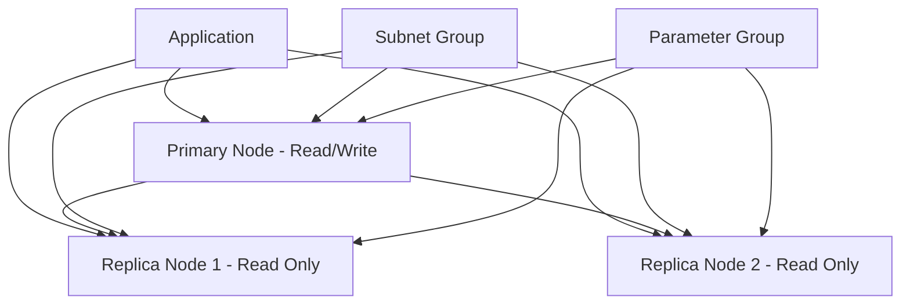

# How to Use Ansible to Create AWS ElastiCache Clusters

Author: [nawazdhandala](https://www.github.com/nawazdhandala)

Tags: Ansible, AWS, ElastiCache, Redis, Caching

Description: Step-by-step guide to creating AWS ElastiCache Redis and Memcached clusters with Ansible including replication groups and parameter tuning.

---

ElastiCache gives you managed Redis or Memcached clusters on AWS. Instead of running and patching your own cache servers, AWS handles the operational overhead while you focus on using the cache. Setting up ElastiCache properly involves subnet groups, parameter groups, security groups, and replication configuration. Ansible automates all of this.

This guide covers creating both Redis and Memcached clusters, configuring replication, tuning parameters, and managing the ElastiCache lifecycle with Ansible.

## Prerequisites

You need:

- Ansible 2.14+
- The `amazon.aws` collection
- AWS credentials with ElastiCache permissions
- A VPC with private subnets
- Python boto3

```bash
# Install dependencies
ansible-galaxy collection install amazon.aws
pip install boto3 botocore
```

## ElastiCache Architecture

Here is how a Redis replication group looks:



The primary handles writes. Replicas handle reads and provide failover capability.

## Creating a Cache Subnet Group

ElastiCache nodes run inside your VPC, so you need a subnet group first:

```yaml
# create-subnet-group.yml - ElastiCache subnet group
---
- name: Create ElastiCache Subnet Group
  hosts: localhost
  connection: local
  gather_facts: false

  tasks:
    # Subnet group spanning two AZs for high availability
    - name: Create ElastiCache subnet group
      amazon.aws.elasticache_subnet_group:
        name: myapp-cache-subnet-group
        description: "Private subnets for ElastiCache"
        region: us-east-1
        state: present
        subnets:
          - subnet-private-az-a
          - subnet-private-az-b
      register: subnet_group
```

## Creating a Redis Cluster (Single Node)

For development or simple caching needs:

```yaml
# create-redis-single.yml - Single-node Redis cluster
---
- name: Create Redis Cluster
  hosts: localhost
  connection: local
  gather_facts: false

  vars:
    aws_region: us-east-1
    cluster_id: myapp-dev-cache
    node_type: cache.t3.micro

  tasks:
    # Create a single-node Redis cluster for development
    - name: Create Redis cluster
      amazon.aws.elasticache:
        name: "{{ cluster_id }}"
        engine: redis
        engine_version: "7.1"
        node_type: "{{ node_type }}"
        num_nodes: 1
        cache_subnet_group: myapp-cache-subnet-group
        security_group_ids:
          - sg-0abc123def456789
        region: "{{ aws_region }}"
        state: present
      register: cache_result

    - name: Show cache endpoint
      ansible.builtin.debug:
        msg: "Cache endpoint: {{ cache_result.elasticache.data.CacheNodes[0].Endpoint.Address | default('pending') }}"
```

## Creating a Redis Replication Group

For production, use a replication group with automatic failover:

```yaml
# create-redis-replication.yml - Production Redis with replication
---
- name: Create Redis Replication Group
  hosts: localhost
  connection: local
  gather_facts: false

  vars:
    aws_region: us-east-1
    replication_group_id: myapp-prod-redis
    description: "Production Redis cluster for myapp"
    node_type: cache.r6g.large

  tasks:
    # Create a Redis replication group with automatic failover
    - name: Create Redis replication group
      ansible.builtin.command:
        cmd: >
          aws elasticache create-replication-group
          --replication-group-id {{ replication_group_id }}
          --replication-group-description "{{ description }}"
          --engine redis
          --engine-version 7.1
          --cache-node-type {{ node_type }}
          --num-cache-clusters 3
          --automatic-failover-enabled
          --multi-az-enabled
          --cache-subnet-group-name myapp-cache-subnet-group
          --security-group-ids sg-0abc123def456789
          --at-rest-encryption-enabled
          --transit-encryption-enabled
          --snapshot-retention-limit 7
          --preferred-maintenance-window sun:05:00-sun:06:00
          --snapshot-window 03:00-04:00
          --region {{ aws_region }}
          --tags Key=Environment,Value=production Key=Application,Value=myapp
      register: redis_result
      changed_when: true
      failed_when: >
        redis_result.rc != 0 and
        'ReplicationGroupAlreadyExistsFault' not in redis_result.stderr

    - name: Show replication group info
      ansible.builtin.debug:
        msg: "Redis replication group {{ replication_group_id }} created"
```

This creates a 3-node cluster (1 primary, 2 replicas) with:
- Automatic failover if the primary goes down
- Multi-AZ deployment for high availability
- Encryption at rest and in transit
- Daily snapshots retained for 7 days

## Creating a Memcached Cluster

Memcached is simpler than Redis but distributes data across multiple nodes:

```yaml
# create-memcached.yml - Memcached cluster
---
- name: Create Memcached Cluster
  hosts: localhost
  connection: local
  gather_facts: false

  tasks:
    # Create a Memcached cluster with 3 nodes
    - name: Create Memcached cluster
      amazon.aws.elasticache:
        name: myapp-session-cache
        engine: memcached
        engine_version: "1.6.22"
        node_type: cache.t3.medium
        num_nodes: 3
        cache_subnet_group: myapp-cache-subnet-group
        security_group_ids:
          - sg-0abc123def456789
        region: us-east-1
        state: present
      register: memcached_result
```

Memcached does not support replication or persistence. Each node is independent. If a node fails, the data on it is lost. Use Memcached when you can tolerate cache misses and need simple key-value caching.

## Custom Parameter Groups

Tune cache behavior with parameter groups:

```yaml
# Create a custom Redis parameter group
- name: Create Redis parameter group
  ansible.builtin.command:
    cmd: >
      aws elasticache create-cache-parameter-group
      --cache-parameter-group-name myapp-redis7-params
      --cache-parameter-group-family redis7
      --description "Custom Redis parameters for myapp"
      --region us-east-1
  register: pg_result
  changed_when: true
  failed_when: >
    pg_result.rc != 0 and
    'CacheParameterGroupAlreadyExists' not in pg_result.stderr

# Set custom parameter values
- name: Modify Redis parameters
  ansible.builtin.command:
    cmd: >
      aws elasticache modify-cache-parameter-group
      --cache-parameter-group-name myapp-redis7-params
      --parameter-name-values
      "ParameterName=maxmemory-policy,ParameterValue=allkeys-lru"
      "ParameterName=notify-keyspace-events,ParameterValue=Ex"
      "ParameterName=timeout,ParameterValue=300"
      --region us-east-1
  changed_when: true
```

The `maxmemory-policy` of `allkeys-lru` evicts the least recently used keys when memory is full. This is the most common policy for general-purpose caching.

## Scaling ElastiCache

Scale vertically by changing the node type:

```yaml
# Scale up the Redis replication group
- name: Modify replication group node type
  ansible.builtin.command:
    cmd: >
      aws elasticache modify-replication-group
      --replication-group-id myapp-prod-redis
      --cache-node-type cache.r6g.xlarge
      --apply-immediately
      --region us-east-1
  changed_when: true
```

Scale horizontally by adding read replicas:

```yaml
# Add a read replica to the replication group
- name: Add read replica
  ansible.builtin.command:
    cmd: >
      aws elasticache increase-replica-count
      --replication-group-id myapp-prod-redis
      --new-replica-count 4
      --apply-immediately
      --region us-east-1
  changed_when: true
```

## Monitoring Configuration

Set up CloudWatch alarms for your cache:

```yaml
# Create an alarm for high CPU on the cache cluster
- name: Create cache CPU alarm
  amazon.aws.cloudwatch_metric_alarm:
    alarm_name: "myapp-redis-high-cpu"
    metric_name: CPUUtilization
    namespace: AWS/ElastiCache
    statistic: Average
    comparison: GreaterThanThreshold
    threshold: 80
    period: 300
    evaluation_periods: 3
    dimensions:
      CacheClusterId: myapp-prod-redis-001
    alarm_actions:
      - arn:aws:sns:us-east-1:123456789012:ops-alerts
    region: us-east-1
    state: present

# Create an alarm for high memory usage
- name: Create cache memory alarm
  amazon.aws.cloudwatch_metric_alarm:
    alarm_name: "myapp-redis-high-memory"
    metric_name: DatabaseMemoryUsagePercentage
    namespace: AWS/ElastiCache
    statistic: Average
    comparison: GreaterThanThreshold
    threshold: 85
    period: 300
    evaluation_periods: 2
    dimensions:
      CacheClusterId: myapp-prod-redis-001
    alarm_actions:
      - arn:aws:sns:us-east-1:123456789012:ops-alerts
    region: us-east-1
    state: present
```

## Deleting ElastiCache Clusters

```yaml
# Delete a single-node cache cluster
- name: Delete ElastiCache cluster
  amazon.aws.elasticache:
    name: myapp-dev-cache
    region: us-east-1
    state: absent

# Delete a replication group with final snapshot
- name: Delete Redis replication group
  ansible.builtin.command:
    cmd: >
      aws elasticache delete-replication-group
      --replication-group-id myapp-staging-redis
      --final-snapshot-identifier myapp-staging-redis-final
      --region us-east-1
  changed_when: true
```

Always take a final snapshot for production clusters before deletion.

## Wrapping Up

ElastiCache with Ansible gives you repeatable cache infrastructure. Use Redis replication groups for production workloads that need persistence and failover. Use Memcached for simple, high-throughput caching where data loss is acceptable. Always deploy in private subnets, enable encryption for production, and set up monitoring from the start. The key to good caching is not just creating the cluster but also tuning the parameters and monitoring the hit rate over time.
