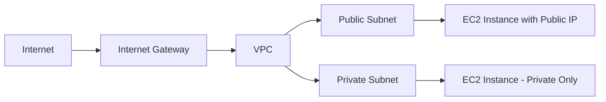

# How to Use Ansible to Create AWS Internet Gateways

Author: [nawazdhandala](https://www.github.com/nawazdhandala)

Tags: Ansible, AWS, Networking, VPC, Infrastructure as Code

Description: Learn how to create and manage AWS Internet Gateways using Ansible automation with practical playbook examples and VPC attachment workflows.

---

Internet Gateways are the bridge between your VPC and the outside world. Without one, none of your public-facing instances can reach the internet, and nobody on the internet can reach them. If you have been clicking through the AWS console to set these up, it is time to switch to Ansible and make this repeatable.

In this guide, I will walk you through creating Internet Gateways with Ansible, attaching them to VPCs, and building complete networking setups that you can version control and reuse across environments.

## Prerequisites

Before you start, make sure you have:

- Ansible 2.14 or later installed
- The `amazon.aws` collection installed
- AWS credentials configured (environment variables, AWS CLI profile, or IAM role)
- A basic understanding of AWS VPC networking

Install the required Ansible collection if you have not already:

```bash
# Install the AWS collection from Ansible Galaxy
ansible-galaxy collection install amazon.aws
```

You also need the Python boto3 library:

```bash
# boto3 is required by all AWS Ansible modules
pip install boto3 botocore
```

## Understanding Internet Gateways

An Internet Gateway (IGW) serves two purposes in AWS. First, it provides a target in your VPC route tables for internet-routable traffic. Second, it performs network address translation for instances that have public IPv4 addresses.

Here is how the components fit together:



One important constraint: a VPC can only have one Internet Gateway attached at a time. If you try to attach a second one, AWS will throw an error.

## Creating a Basic Internet Gateway

The `amazon.aws.ec2_vpc_igw` module handles Internet Gateway operations. Here is the simplest playbook that creates an IGW and attaches it to an existing VPC:

```yaml
# create-igw.yml - Creates an Internet Gateway and attaches it to a VPC
---
- name: Create AWS Internet Gateway
  hosts: localhost
  connection: local
  gather_facts: false

  vars:
    aws_region: us-east-1
    vpc_id: vpc-0abc123def456789

  tasks:
    # Create the Internet Gateway and attach it to our VPC
    - name: Create Internet Gateway
      amazon.aws.ec2_vpc_igw:
        vpc_id: "{{ vpc_id }}"
        region: "{{ aws_region }}"
        state: present
        tags:
          Name: production-igw
          Environment: production
      register: igw_result

    # Print the IGW ID so we can reference it later
    - name: Display Internet Gateway details
      ansible.builtin.debug:
        msg: "Created IGW: {{ igw_result.gateway_id }}"
```

Run this playbook with:

```bash
ansible-playbook create-igw.yml
```

The module is idempotent, meaning you can run it multiple times without creating duplicate gateways. If an IGW is already attached to that VPC, Ansible will simply confirm the existing state.

## Building a Complete VPC with Internet Gateway

In practice, you rarely create an IGW in isolation. You need a VPC, subnets, and route tables too. Here is a more realistic playbook that builds the full stack:

```yaml
# full-vpc-setup.yml - Creates VPC, IGW, subnet, and route table together
---
- name: Complete VPC Setup with Internet Gateway
  hosts: localhost
  connection: local
  gather_facts: false

  vars:
    aws_region: us-east-1
    vpc_cidr: 10.0.0.0/16
    public_subnet_cidr: 10.0.1.0/24
    environment_name: staging
    project_name: myapp

  tasks:
    # Step 1: Create the VPC first since everything else depends on it
    - name: Create VPC
      amazon.aws.ec2_vpc_net:
        name: "{{ project_name }}-{{ environment_name }}-vpc"
        cidr_block: "{{ vpc_cidr }}"
        region: "{{ aws_region }}"
        dns_support: true
        dns_hostnames: true
        tags:
          Environment: "{{ environment_name }}"
          Project: "{{ project_name }}"
      register: vpc_result

    # Step 2: Create and attach the Internet Gateway
    - name: Create Internet Gateway
      amazon.aws.ec2_vpc_igw:
        vpc_id: "{{ vpc_result.vpc.id }}"
        region: "{{ aws_region }}"
        state: present
        tags:
          Name: "{{ project_name }}-{{ environment_name }}-igw"
          Environment: "{{ environment_name }}"
      register: igw_result

    # Step 3: Create a public subnet
    - name: Create public subnet
      amazon.aws.ec2_vpc_subnet:
        vpc_id: "{{ vpc_result.vpc.id }}"
        cidr: "{{ public_subnet_cidr }}"
        az: "{{ aws_region }}a"
        region: "{{ aws_region }}"
        map_public: true
        tags:
          Name: "{{ project_name }}-{{ environment_name }}-public-subnet"
      register: subnet_result

    # Step 4: Create route table with a route to the IGW for internet access
    - name: Create public route table
      amazon.aws.ec2_vpc_route_table:
        vpc_id: "{{ vpc_result.vpc.id }}"
        region: "{{ aws_region }}"
        subnets:
          - "{{ subnet_result.subnet.id }}"
        routes:
          - dest: 0.0.0.0/0
            gateway_id: "{{ igw_result.gateway_id }}"
        tags:
          Name: "{{ project_name }}-{{ environment_name }}-public-rt"
      register: rt_result

    # Print a summary of everything we created
    - name: Summary
      ansible.builtin.debug:
        msg:
          - "VPC: {{ vpc_result.vpc.id }}"
          - "IGW: {{ igw_result.gateway_id }}"
          - "Subnet: {{ subnet_result.subnet.id }}"
          - "Route Table: {{ rt_result.route_table.id }}"
```

This playbook chains the resources together using registered variables. Each task feeds its output into the next one.

## Using Variables for Multi-Environment Deployments

Hardcoding values in playbooks is a bad habit. Use variable files so you can reuse the same playbook across environments:

```yaml
# vars/production.yml - Production environment variables
---
aws_region: us-east-1
vpc_cidr: 10.0.0.0/16
public_subnet_cidr: 10.0.1.0/24
environment_name: production
project_name: myapp
```

```yaml
# vars/staging.yml - Staging environment variables
---
aws_region: us-west-2
vpc_cidr: 10.1.0.0/16
public_subnet_cidr: 10.1.1.0/24
environment_name: staging
project_name: myapp
```

Then run with:

```bash
# Deploy to production
ansible-playbook full-vpc-setup.yml -e @vars/production.yml

# Deploy to staging
ansible-playbook full-vpc-setup.yml -e @vars/staging.yml
```

## Removing an Internet Gateway

Deleting an IGW requires detaching it from the VPC first. The Ansible module handles this automatically when you set `state: absent`:

```yaml
# remove-igw.yml - Detaches and deletes an Internet Gateway
---
- name: Remove Internet Gateway
  hosts: localhost
  connection: local
  gather_facts: false

  tasks:
    # Setting state to absent will detach and delete the IGW
    - name: Remove Internet Gateway from VPC
      amazon.aws.ec2_vpc_igw:
        vpc_id: vpc-0abc123def456789
        region: us-east-1
        state: absent
```

Keep in mind that you cannot delete an IGW if there are still public IP addresses or Elastic IPs associated with instances in the VPC. You need to release those first.

## Error Handling and Retries

AWS API calls can occasionally fail due to throttling or eventual consistency. Add retry logic to your playbooks:

```yaml
# Retry the IGW creation up to 3 times with a 5-second delay between attempts
- name: Create Internet Gateway with retries
  amazon.aws.ec2_vpc_igw:
    vpc_id: "{{ vpc_id }}"
    region: "{{ aws_region }}"
    state: present
    tags:
      Name: "{{ project_name }}-igw"
  register: igw_result
  retries: 3
  delay: 5
  until: igw_result is not failed
```

## Checking IGW Status with Facts

You can gather information about existing Internet Gateways using the info module:

```yaml
# Gather facts about all IGWs with a specific tag
- name: Get Internet Gateway facts
  amazon.aws.ec2_vpc_igw_info:
    region: us-east-1
    filters:
      "tag:Environment": production
  register: igw_facts

- name: Show IGW details
  ansible.builtin.debug:
    var: igw_facts.internet_gateways
```

This is useful for auditing your infrastructure or building playbooks that conditionally create resources only when they do not exist.

## Best Practices

Here are a few things I have learned from managing IGWs with Ansible in production:

1. **Always tag your resources.** Tags make it easier to track costs and find resources later. At minimum, include Name, Environment, and Project tags.

2. **Use the VPC ID as the identifier.** Since a VPC can only have one IGW, the module uses the VPC ID to determine if an IGW already exists. Do not try to create multiple IGWs for the same VPC.

3. **Keep your playbooks modular.** Put the IGW creation in a role so you can include it in different playbooks without duplicating code.

4. **Store state externally.** Register your outputs and consider writing them to a file or a parameter store so other playbooks can reference them.

5. **Test in a sandbox account first.** VPC networking mistakes can be hard to debug. Always test your playbooks in a non-production AWS account before rolling them out.

## Wrapping Up

Creating Internet Gateways with Ansible is straightforward once you understand how the pieces connect. The `ec2_vpc_igw` module handles creation, attachment, tagging, and deletion in a single task. Pair it with VPC, subnet, and route table modules, and you have a complete networking setup that is fully automated and version controlled.

The real value comes when you need to replicate this across multiple regions or environments. Instead of clicking through the console each time, you run one command and get a consistent result every time.
