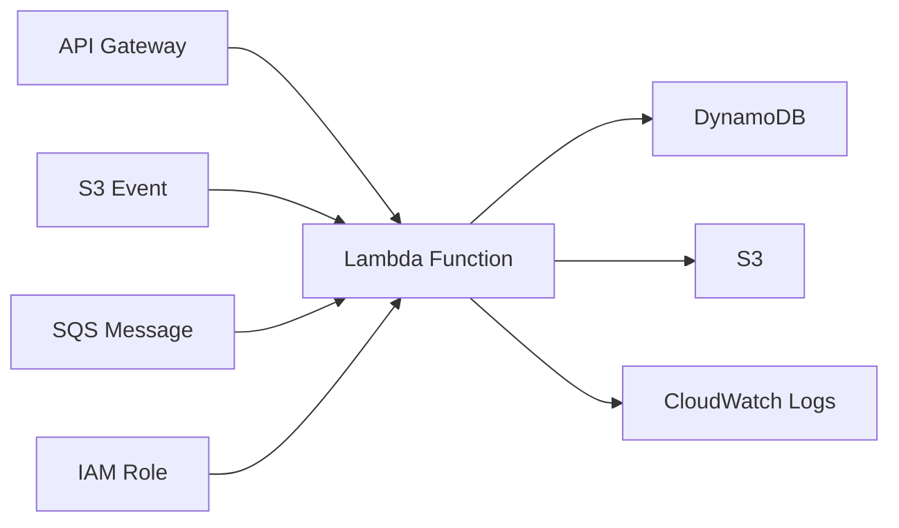

# How to Use Ansible to Create AWS Lambda Functions

Author: [nawazdhandala](https://www.github.com/nawazdhandala)

Tags: Ansible, AWS, Lambda, Serverless, Infrastructure as Code

Description: Learn how to deploy and manage AWS Lambda functions with Ansible including packaging code, setting environment variables, and configuring triggers.

---

Lambda functions let you run code without managing servers. You write a function, upload it, and AWS handles everything else: scaling, patching, monitoring. But the deployment process itself can be tedious if you are doing it through the console or writing custom scripts. Ansible gives you a clean, declarative way to manage Lambda functions alongside the rest of your infrastructure.

This guide walks through creating Lambda functions with Ansible, packaging code, configuring environment variables, setting up triggers, and managing function versions.

## Prerequisites

You need:

- Ansible 2.14+
- The `amazon.aws` collection
- AWS credentials with Lambda permissions
- Python boto3
- An IAM role for Lambda execution (covered in a previous post)

```bash
# Install dependencies
ansible-galaxy collection install amazon.aws
pip install boto3 botocore
```

## Lambda Function Architecture

Here is how a typical Lambda setup looks:



The function gets triggered by events, processes them, interacts with other AWS services, and logs to CloudWatch.

## Creating a Simple Lambda Function

First, write your Lambda function code. Here is a simple Python handler:

```python
# files/lambda/handler.py - Simple Lambda function
import json
import logging

logger = logging.getLogger()
logger.setLevel(logging.INFO)

def lambda_handler(event, context):
    """Process incoming events and return a response."""
    logger.info(f"Received event: {json.dumps(event)}")

    return {
        "statusCode": 200,
        "body": json.dumps({
            "message": "Hello from Lambda",
            "request_id": context.aws_request_id
        })
    }
```

Now create the Ansible playbook to deploy it:

```yaml
# deploy-lambda.yml - Package and deploy a Lambda function
---
- name: Deploy Lambda Function
  hosts: localhost
  connection: local
  gather_facts: false

  vars:
    aws_region: us-east-1
    function_name: myapp-processor
    runtime: python3.12
    handler: handler.lambda_handler
    role_arn: arn:aws:iam::123456789012:role/myapp-lambda-role
    lambda_src: files/lambda

  tasks:
    # Package the Lambda code into a zip file
    - name: Create deployment package
      community.general.archive:
        path: "{{ lambda_src }}/"
        dest: /tmp/lambda-package.zip
        format: zip

    # Deploy the Lambda function
    - name: Create or update Lambda function
      amazon.aws.lambda:
        name: "{{ function_name }}"
        region: "{{ aws_region }}"
        state: present
        runtime: "{{ runtime }}"
        handler: "{{ handler }}"
        role: "{{ role_arn }}"
        zip_file: /tmp/lambda-package.zip
        timeout: 30
        memory_size: 256
        description: "Processes incoming events for myapp"
        environment_variables:
          APP_ENV: production
          LOG_LEVEL: info
          DB_TABLE: myapp-events
        tags:
          Application: myapp
          Environment: production
      register: lambda_result

    - name: Show function ARN
      ansible.builtin.debug:
        msg: "Lambda ARN: {{ lambda_result.configuration.function_arn }}"
```

## Deploying from S3

For larger deployment packages, upload to S3 first:

```yaml
# deploy-lambda-s3.yml - Deploy Lambda code from S3
---
- name: Deploy Lambda from S3
  hosts: localhost
  connection: local
  gather_facts: false

  vars:
    aws_region: us-east-1
    function_name: myapp-heavy-processor
    s3_bucket: myapp-deploy-artifacts
    s3_key: "lambda/myapp-processor-{{ version }}.zip"

  tasks:
    # Package the code
    - name: Create deployment package
      community.general.archive:
        path: files/lambda/
        dest: /tmp/lambda-package.zip
        format: zip

    # Upload to S3
    - name: Upload package to S3
      amazon.aws.s3_object:
        bucket: "{{ s3_bucket }}"
        object: "{{ s3_key }}"
        src: /tmp/lambda-package.zip
        mode: put
        region: "{{ aws_region }}"

    # Deploy from S3
    - name: Deploy Lambda from S3
      amazon.aws.lambda:
        name: "{{ function_name }}"
        region: "{{ aws_region }}"
        state: present
        runtime: python3.12
        handler: handler.lambda_handler
        role: arn:aws:iam::123456789012:role/myapp-lambda-role
        s3_bucket: "{{ s3_bucket }}"
        s3_key: "{{ s3_key }}"
        timeout: 60
        memory_size: 512
```

## Lambda with Dependencies

When your function needs third-party libraries, you need to include them in the deployment package:

```yaml
# deploy-with-deps.yml - Lambda with Python dependencies
---
- name: Deploy Lambda with Dependencies
  hosts: localhost
  connection: local
  gather_facts: false

  vars:
    function_name: myapp-api-handler
    src_dir: files/lambda-api
    build_dir: /tmp/lambda-build

  tasks:
    # Create a clean build directory
    - name: Clean build directory
      ansible.builtin.file:
        path: "{{ build_dir }}"
        state: absent

    - name: Create build directory
      ansible.builtin.file:
        path: "{{ build_dir }}"
        state: directory
        mode: "0755"

    # Install Python dependencies into the build directory
    - name: Install dependencies
      ansible.builtin.pip:
        requirements: "{{ src_dir }}/requirements.txt"
        extra_args: "--target {{ build_dir }}"

    # Copy function code to build directory
    - name: Copy function code
      ansible.builtin.copy:
        src: "{{ src_dir }}/"
        dest: "{{ build_dir }}/"
        mode: "0644"

    # Package everything together
    - name: Create deployment package
      community.general.archive:
        path: "{{ build_dir }}/"
        dest: /tmp/lambda-api-package.zip
        format: zip

    # Deploy
    - name: Deploy Lambda function
      amazon.aws.lambda:
        name: "{{ function_name }}"
        region: us-east-1
        state: present
        runtime: python3.12
        handler: handler.lambda_handler
        role: arn:aws:iam::123456789012:role/myapp-lambda-role
        zip_file: /tmp/lambda-api-package.zip
        timeout: 30
        memory_size: 256
```

## Lambda Layers

For dependencies shared across multiple functions, use Lambda layers:

```yaml
# Create a Lambda layer with shared libraries
- name: Create shared dependencies layer
  amazon.aws.lambda_layer:
    name: myapp-shared-libs
    description: "Shared Python libraries for myapp"
    compatible_runtimes:
      - python3.12
    zip_file: /tmp/layer-package.zip
    region: us-east-1
    state: present
  register: layer_result

# Reference the layer in a function
- name: Deploy function with layer
  amazon.aws.lambda:
    name: myapp-lightweight-function
    region: us-east-1
    state: present
    runtime: python3.12
    handler: handler.lambda_handler
    role: arn:aws:iam::123456789012:role/myapp-lambda-role
    zip_file: /tmp/function-only.zip
    layers:
      - "{{ layer_result.layer_version_arn }}"
```

## Event Source Mappings

Connect Lambda to event sources like SQS or DynamoDB Streams:

```yaml
# Create an SQS trigger for the Lambda function
- name: Create SQS event source mapping
  amazon.aws.lambda_event:
    state: present
    event_source: sqs
    function_arn: "{{ lambda_result.configuration.function_arn }}"
    source_params:
      source_arn: arn:aws:sqs:us-east-1:123456789012:myapp-work-queue
      batch_size: 10
      maximum_batching_window_in_seconds: 5
```

```yaml
# Create a DynamoDB Streams trigger
- name: Create DynamoDB stream trigger
  amazon.aws.lambda_event:
    state: present
    event_source: stream
    function_arn: "{{ lambda_result.configuration.function_arn }}"
    source_params:
      source_arn: arn:aws:dynamodb:us-east-1:123456789012:table/myapp-events/stream/2024-01-01T00:00:00.000
      batch_size: 100
      starting_position: LATEST
```

## Function Aliases and Versions

Publish versions and create aliases for safe deployments:

```yaml
# Publish a new version of the function
- name: Publish Lambda version
  amazon.aws.lambda:
    name: myapp-processor
    region: us-east-1
    state: present
    # Publishing happens when you update the code
    zip_file: /tmp/lambda-package.zip
    runtime: python3.12
    handler: handler.lambda_handler
    role: arn:aws:iam::123456789012:role/myapp-lambda-role

# Create an alias pointing to the latest version
- name: Create production alias
  amazon.aws.lambda_alias:
    function_name: myapp-processor
    name: production
    function_version: "{{ lambda_result.configuration.version }}"
    description: "Production traffic"
    region: us-east-1
    state: present
```

## Getting Function Information

Query existing Lambda functions:

```yaml
# Get details about a Lambda function
- name: Get Lambda function info
  amazon.aws.lambda_info:
    function_name: myapp-processor
    region: us-east-1
  register: func_info

- name: Show function details
  ansible.builtin.debug:
    msg:
      - "Runtime: {{ func_info.function.runtime }}"
      - "Memory: {{ func_info.function.memory_size }}MB"
      - "Timeout: {{ func_info.function.timeout }}s"
      - "Last Modified: {{ func_info.function.last_modified }}"
```

## Deleting Lambda Functions

```yaml
# Delete a Lambda function
- name: Remove Lambda function
  amazon.aws.lambda:
    name: old-unused-function
    region: us-east-1
    state: absent
```

## Wrapping Up

Deploying Lambda functions with Ansible keeps your serverless infrastructure in the same codebase as the rest of your AWS resources. Package your code, define the function configuration, set up triggers, and manage versions all from playbooks. Combine this with IAM role management and you have a complete, version-controlled serverless deployment pipeline.
