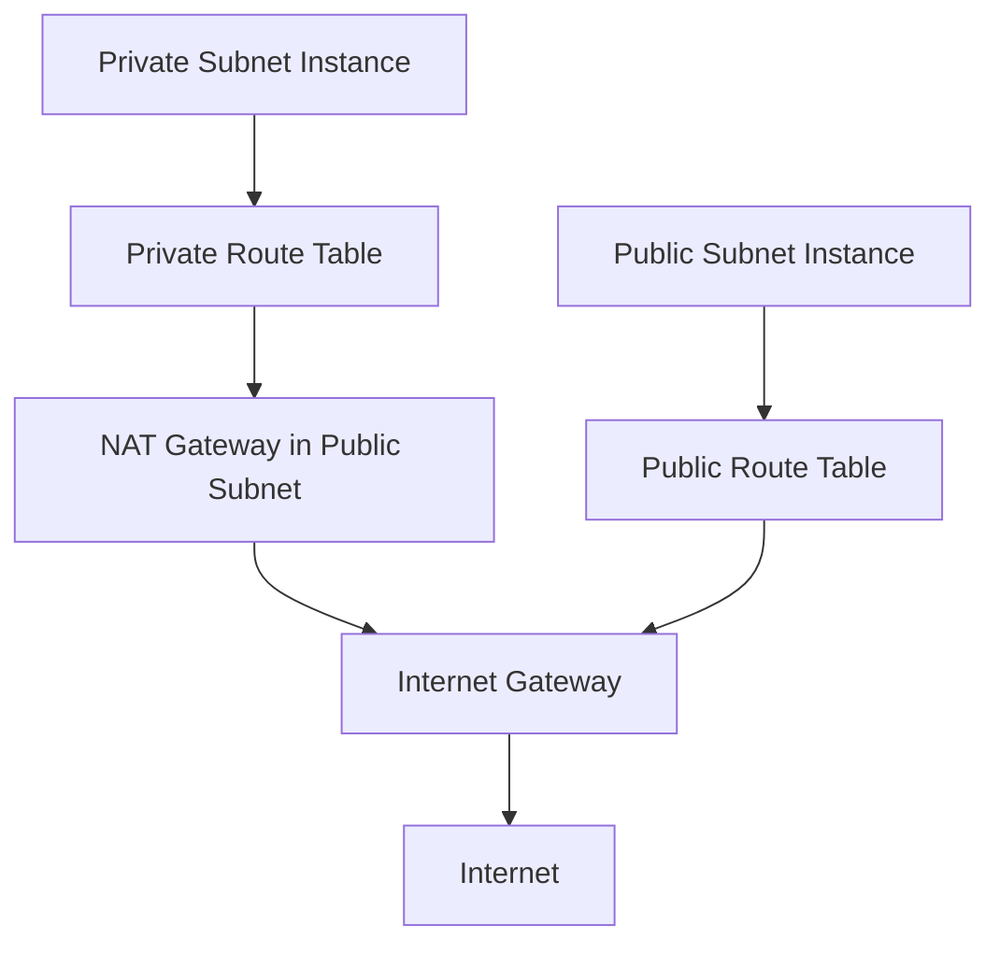

# How to Use Ansible to Create AWS NAT Gateways

Author: [nawazdhandala](https://www.github.com/nawazdhandala)

Tags: Ansible, AWS, NAT Gateway, Networking, VPC

Description: Practical guide to creating AWS NAT Gateways with Ansible for enabling internet access from private subnets with high availability configurations.

---

NAT Gateways solve a specific problem: instances in private subnets need to reach the internet (for software updates, API calls, downloading dependencies) but should not be directly reachable from the internet. A NAT Gateway sits in a public subnet, receives outbound traffic from private instances, forwards it to the internet, and routes the responses back.

This guide covers creating NAT Gateways with Ansible, configuring them for high availability, connecting them to route tables, and managing costs.

## Prerequisites

You need:

- Ansible 2.14+
- The `amazon.aws` collection
- AWS credentials with VPC and EC2 permissions
- A VPC with public and private subnets
- An Internet Gateway attached to the VPC
- Python boto3

```bash
# Install dependencies
ansible-galaxy collection install amazon.aws
pip install boto3 botocore
```

## NAT Gateway Architecture

Here is how NAT Gateways fit into VPC networking:



Traffic from private instances goes through the NAT Gateway, which has an Elastic IP. The internet sees the traffic coming from the NAT Gateway's public IP, not from the private instance.

## Creating a NAT Gateway

NAT Gateways need an Elastic IP address. Here is the full setup:

```yaml
# create-nat-gateway.yml - Create a NAT Gateway with Elastic IP
---
- name: Create NAT Gateway
  hosts: localhost
  connection: local
  gather_facts: false

  vars:
    aws_region: us-east-1
    public_subnet_id: subnet-public-az-a
    env: production

  tasks:
    # Allocate an Elastic IP for the NAT Gateway
    - name: Allocate Elastic IP
      amazon.aws.ec2_eip:
        region: "{{ aws_region }}"
        state: present
        in_vpc: true
        tags:
          Name: "{{ env }}-nat-eip"
          Environment: "{{ env }}"
      register: eip_result

    # Create the NAT Gateway in the public subnet
    - name: Create NAT Gateway
      amazon.aws.ec2_vpc_nat_gateway:
        subnet_id: "{{ public_subnet_id }}"
        allocation_id: "{{ eip_result.allocation_id }}"
        region: "{{ aws_region }}"
        state: present
        wait: true
        tags:
          Name: "{{ env }}-nat-gateway"
          Environment: "{{ env }}"
      register: nat_gw_result

    - name: Show NAT Gateway details
      ansible.builtin.debug:
        msg:
          - "NAT Gateway ID: {{ nat_gw_result.nat_gateway_id }}"
          - "Public IP: {{ eip_result.public_ip }}"
```

The `wait: true` parameter makes Ansible wait until the NAT Gateway is available. This takes 1-2 minutes.

## Connecting to Private Route Tables

After creating the NAT Gateway, update the private route table to use it:

```yaml
# Update private route table to route internet traffic through NAT Gateway
- name: Update private route table
  amazon.aws.ec2_vpc_route_table:
    vpc_id: "{{ vpc_id }}"
    region: "{{ aws_region }}"
    tags:
      Name: "{{ env }}-private-rt"
    subnets:
      - subnet-private-az-a
      - subnet-private-az-b
    routes:
      - dest: 0.0.0.0/0
        nat_gateway_id: "{{ nat_gw_result.nat_gateway_id }}"
    state: present
```

Now all outbound internet traffic from instances in the private subnets will flow through the NAT Gateway.

## High Availability Setup

A single NAT Gateway in one AZ is a single point of failure. If that AZ goes down, all private instances across all AZs lose internet access. For production, create a NAT Gateway in each AZ:

```yaml
# ha-nat-gateways.yml - NAT Gateway per availability zone
---
- name: High Availability NAT Gateway Setup
  hosts: localhost
  connection: local
  gather_facts: false

  vars:
    aws_region: us-east-1
    vpc_id: vpc-0abc123def456789
    env: production
    az_configs:
      - az: a
        public_subnet: subnet-public-az-a
        private_subnet: subnet-private-az-a
      - az: b
        public_subnet: subnet-public-az-b
        private_subnet: subnet-private-az-b
      - az: c
        public_subnet: subnet-public-az-c
        private_subnet: subnet-private-az-c

  tasks:
    # Allocate an Elastic IP for each NAT Gateway
    - name: Allocate Elastic IPs
      amazon.aws.ec2_eip:
        region: "{{ aws_region }}"
        state: present
        in_vpc: true
        tags:
          Name: "{{ env }}-nat-eip-{{ item.az }}"
          Environment: "{{ env }}"
          AZ: "{{ aws_region }}{{ item.az }}"
      loop: "{{ az_configs }}"
      loop_control:
        label: "{{ item.az }}"
      register: eip_results

    # Create a NAT Gateway in each AZ
    - name: Create NAT Gateways
      amazon.aws.ec2_vpc_nat_gateway:
        subnet_id: "{{ item.0.public_subnet }}"
        allocation_id: "{{ item.1.allocation_id }}"
        region: "{{ aws_region }}"
        state: present
        wait: true
        tags:
          Name: "{{ env }}-nat-gw-{{ item.0.az }}"
          Environment: "{{ env }}"
          AZ: "{{ aws_region }}{{ item.0.az }}"
      loop: "{{ az_configs | zip(eip_results.results) | list }}"
      loop_control:
        label: "{{ item.0.az }}"
      register: nat_gw_results

    # Create a separate private route table for each AZ
    # Each routes through its own NAT Gateway
    - name: Create per-AZ private route tables
      amazon.aws.ec2_vpc_route_table:
        vpc_id: "{{ vpc_id }}"
        region: "{{ aws_region }}"
        subnets:
          - "{{ item.0.private_subnet }}"
        routes:
          - dest: 0.0.0.0/0
            nat_gateway_id: "{{ item.1.nat_gateway_id }}"
        tags:
          Name: "{{ env }}-private-rt-{{ item.0.az }}"
          Environment: "{{ env }}"
          AZ: "{{ aws_region }}{{ item.0.az }}"
      loop: "{{ az_configs | zip(nat_gw_results.results) | list }}"
      loop_control:
        label: "{{ item.0.az }}"

    - name: Show NAT Gateway summary
      ansible.builtin.debug:
        msg: "Created {{ nat_gw_results.results | length }} NAT Gateways for HA"
```

This creates three NAT Gateways, one in each AZ. Each private subnet routes through the NAT Gateway in its own AZ. If one AZ goes down, the other AZs continue to function independently.

## Complete VPC with NAT Gateways

Here is a full VPC setup that includes NAT Gateways:

```yaml
# complete-vpc.yml - Full VPC setup with public and private subnets
---
- name: Complete VPC Setup
  hosts: localhost
  connection: local
  gather_facts: false

  vars:
    aws_region: us-east-1
    vpc_cidr: 10.0.0.0/16
    env: production
    project: myapp

  tasks:
    - name: Create VPC
      amazon.aws.ec2_vpc_net:
        name: "{{ project }}-{{ env }}-vpc"
        cidr_block: "{{ vpc_cidr }}"
        region: "{{ aws_region }}"
        dns_support: true
        dns_hostnames: true
      register: vpc

    - name: Create Internet Gateway
      amazon.aws.ec2_vpc_igw:
        vpc_id: "{{ vpc.vpc.id }}"
        region: "{{ aws_region }}"
        tags:
          Name: "{{ project }}-{{ env }}-igw"
      register: igw

    - name: Create public subnet AZ-a
      amazon.aws.ec2_vpc_subnet:
        vpc_id: "{{ vpc.vpc.id }}"
        cidr: 10.0.1.0/24
        az: "{{ aws_region }}a"
        region: "{{ aws_region }}"
        map_public: true
        tags:
          Name: "{{ project }}-{{ env }}-public-a"
      register: public_subnet_a

    - name: Create private subnet AZ-a
      amazon.aws.ec2_vpc_subnet:
        vpc_id: "{{ vpc.vpc.id }}"
        cidr: 10.0.10.0/24
        az: "{{ aws_region }}a"
        region: "{{ aws_region }}"
        tags:
          Name: "{{ project }}-{{ env }}-private-a"
      register: private_subnet_a

    - name: Create public route table
      amazon.aws.ec2_vpc_route_table:
        vpc_id: "{{ vpc.vpc.id }}"
        region: "{{ aws_region }}"
        subnets:
          - "{{ public_subnet_a.subnet.id }}"
        routes:
          - dest: 0.0.0.0/0
            gateway_id: "{{ igw.gateway_id }}"
        tags:
          Name: "{{ project }}-{{ env }}-public-rt"

    - name: Allocate Elastic IP for NAT
      amazon.aws.ec2_eip:
        region: "{{ aws_region }}"
        state: present
        in_vpc: true
        tags:
          Name: "{{ project }}-{{ env }}-nat-eip"
      register: nat_eip

    - name: Create NAT Gateway
      amazon.aws.ec2_vpc_nat_gateway:
        subnet_id: "{{ public_subnet_a.subnet.id }}"
        allocation_id: "{{ nat_eip.allocation_id }}"
        region: "{{ aws_region }}"
        state: present
        wait: true
        tags:
          Name: "{{ project }}-{{ env }}-nat-gw"
      register: nat_gw

    - name: Create private route table
      amazon.aws.ec2_vpc_route_table:
        vpc_id: "{{ vpc.vpc.id }}"
        region: "{{ aws_region }}"
        subnets:
          - "{{ private_subnet_a.subnet.id }}"
        routes:
          - dest: 0.0.0.0/0
            nat_gateway_id: "{{ nat_gw.nat_gateway_id }}"
        tags:
          Name: "{{ project }}-{{ env }}-private-rt"

    - name: Infrastructure summary
      ansible.builtin.debug:
        msg:
          - "VPC: {{ vpc.vpc.id }}"
          - "Public Subnet: {{ public_subnet_a.subnet.id }}"
          - "Private Subnet: {{ private_subnet_a.subnet.id }}"
          - "NAT Gateway: {{ nat_gw.nat_gateway_id }}"
          - "NAT Public IP: {{ nat_eip.public_ip }}"
```

## Cost Considerations

NAT Gateways are not cheap. As of early 2026, you pay:

- An hourly charge per NAT Gateway (roughly $0.045/hour or about $32/month)
- A per-GB charge for data processed

For a 3-AZ HA setup, that is about $96/month just in hourly charges before any data transfer. For non-production environments, consider these cost-saving options:

```yaml
# For dev/staging, use a single NAT Gateway to save costs
- name: Create cost-effective NAT setup for staging
  amazon.aws.ec2_vpc_nat_gateway:
    subnet_id: "{{ public_subnet_a }}"
    allocation_id: "{{ eip.allocation_id }}"
    region: "{{ aws_region }}"
    state: present
    wait: true
    tags:
      Name: staging-nat-gw-shared
```

Point all private route tables at this single NAT Gateway. You lose HA, but for non-production workloads that is usually an acceptable trade-off.

## Gathering NAT Gateway Information

Query existing NAT Gateways:

```yaml
# Get information about NAT Gateways in the VPC
- name: Get NAT Gateway info
  amazon.aws.ec2_vpc_nat_gateway_info:
    region: us-east-1
    filters:
      vpc-id: "{{ vpc_id }}"
      state:
        - available
  register: nat_info

- name: Show NAT Gateways
  ansible.builtin.debug:
    msg: "{{ item.nat_gateway_id }} - {{ item.nat_gateway_addresses[0].public_ip }}"
  loop: "{{ nat_info.result }}"
  loop_control:
    label: "{{ item.nat_gateway_id }}"
```

## Deleting NAT Gateways

Delete in the right order: NAT Gateway first, then the Elastic IP:

```yaml
# Remove NAT Gateway
- name: Delete NAT Gateway
  amazon.aws.ec2_vpc_nat_gateway:
    nat_gateway_id: nat-0abc123def456789
    region: us-east-1
    state: absent
    wait: true

# Release the Elastic IP after the NAT Gateway is fully deleted
- name: Release Elastic IP
  amazon.aws.ec2_eip:
    region: us-east-1
    state: absent
    public_ip: 203.0.113.10
```

The Elastic IP cannot be released while it is still associated with the NAT Gateway, so wait for the deletion to complete first.

## Wrapping Up

NAT Gateways are essential for production VPCs where private instances need internet access. With Ansible, you can automate the creation of Elastic IPs, NAT Gateways, and route table updates in a single playbook. Use a per-AZ setup for production high availability and a single NAT Gateway for non-production to save costs. Remember to account for NAT Gateway costs in your infrastructure budget, as they can add up quickly in multi-AZ deployments.
