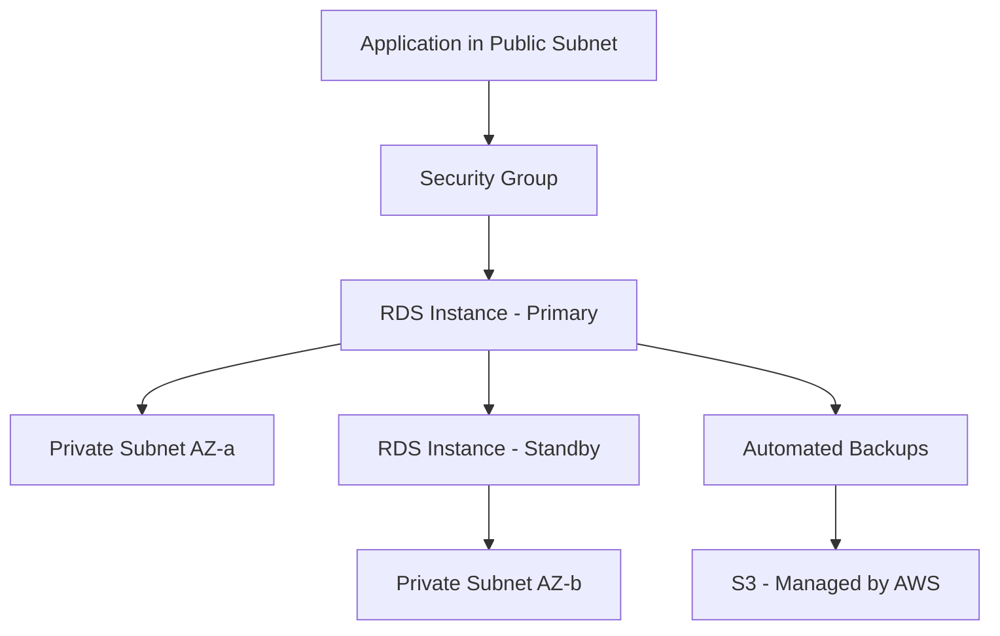

# How to Use Ansible to Create AWS RDS Instances

Author: [nawazdhandala](https://www.github.com/nawazdhandala)

Tags: Ansible, AWS, RDS, Databases, Infrastructure as Code

Description: Complete tutorial on provisioning and managing AWS RDS database instances with Ansible including Multi-AZ, backups, and parameter groups.

---

Provisioning databases manually is one of the riskiest parts of infrastructure management. One wrong click and you end up with the wrong instance size, missing backups, or a publicly accessible database. Ansible takes the guesswork out of RDS provisioning by letting you define every setting in code.

This guide covers creating RDS instances with Ansible, configuring backups, setting up Multi-AZ deployments, managing parameter groups, and handling the full database lifecycle.

## Prerequisites

You need:

- Ansible 2.14+
- The `amazon.aws` collection
- AWS credentials with RDS permissions
- A VPC with private subnets and a DB subnet group
- Python boto3

```bash
# Install dependencies
ansible-galaxy collection install amazon.aws
pip install boto3 botocore
```

## RDS Architecture

An RDS instance runs inside your VPC in a specific subnet group. Here is the typical setup:



The database sits in private subnets and is only accessible through security groups. Multi-AZ mode maintains a standby replica in a different availability zone.

## Creating a DB Subnet Group

Before creating an RDS instance, you need a DB subnet group that spans at least two availability zones:

```yaml
# create-subnet-group.yml - DB subnet group for RDS placement
---
- name: Create RDS Subnet Group
  hosts: localhost
  connection: local
  gather_facts: false

  tasks:
    # The subnet group tells RDS which subnets it can use
    - name: Create DB subnet group
      amazon.aws.rds_subnet_group:
        name: myapp-db-subnet-group
        description: Private subnets for database instances
        region: us-east-1
        state: present
        subnets:
          - subnet-private-az-a
          - subnet-private-az-b
        tags:
          Environment: production
          ManagedBy: ansible
```

## Creating a Basic RDS Instance

Here is a straightforward PostgreSQL instance:

```yaml
# create-rds.yml - Provision a PostgreSQL RDS instance
---
- name: Create RDS Instance
  hosts: localhost
  connection: local
  gather_facts: false

  vars:
    aws_region: us-east-1
    db_identifier: myapp-production-db
    db_instance_class: db.t3.medium
    db_engine: postgres
    db_engine_version: "15.4"
    db_name: myapp
    db_username: myapp_admin
    db_password: "{{ vault_db_password }}"
    db_storage: 100
    db_subnet_group: myapp-db-subnet-group
    vpc_security_group_ids:
      - sg-0abc123def456789

  tasks:
    # Create the RDS instance with production-ready settings
    - name: Create PostgreSQL RDS instance
      amazon.aws.rds_instance:
        db_instance_identifier: "{{ db_identifier }}"
        db_instance_class: "{{ db_instance_class }}"
        engine: "{{ db_engine }}"
        engine_version: "{{ db_engine_version }}"
        db_name: "{{ db_name }}"
        master_username: "{{ db_username }}"
        master_user_password: "{{ db_password }}"
        allocated_storage: "{{ db_storage }}"
        storage_type: gp3
        db_subnet_group_name: "{{ db_subnet_group }}"
        vpc_security_group_ids: "{{ vpc_security_group_ids }}"
        multi_az: true
        publicly_accessible: false
        backup_retention_period: 7
        preferred_backup_window: "03:00-04:00"
        preferred_maintenance_window: "sun:04:00-sun:05:00"
        auto_minor_version_upgrade: true
        copy_tags_to_snapshot: true
        deletion_protection: true
        region: "{{ aws_region }}"
        state: present
        tags:
          Name: "{{ db_identifier }}"
          Environment: production
      register: rds_result

    - name: Show RDS endpoint
      ansible.builtin.debug:
        msg: "RDS Endpoint: {{ rds_result.endpoint.address }}"
```

A few important notes on this configuration:

- `storage_type: gp3` gives you better IOPS and throughput than gp2 at a lower cost for most workloads.
- `multi_az: true` creates a standby instance in another AZ for automatic failover.
- `publicly_accessible: false` keeps the database off the internet.
- `deletion_protection: true` prevents accidental deletion through the console or API.
- `copy_tags_to_snapshot: true` makes it easier to identify snapshots later.

## Using Ansible Vault for Passwords

Never hardcode database passwords in your playbooks. Use Ansible Vault:

```bash
# Create an encrypted variable file for database credentials
ansible-vault create vars/db-secrets.yml
```

Inside the vault file:

```yaml
vault_db_password: "your-strong-password-here"
```

Then reference it in your playbook:

```yaml
- name: Create RDS Instance
  hosts: localhost
  vars_files:
    - vars/db-secrets.yml
  tasks:
    - name: Create database
      amazon.aws.rds_instance:
        master_user_password: "{{ vault_db_password }}"
        # ... other settings
```

Run with:

```bash
ansible-playbook create-rds.yml --ask-vault-pass
```

## Creating a MySQL Instance

The process is similar for MySQL. Here are the MySQL-specific settings:

```yaml
# MySQL RDS instance with specific parameter group
- name: Create MySQL RDS instance
  amazon.aws.rds_instance:
    db_instance_identifier: myapp-mysql-db
    db_instance_class: db.r6g.large
    engine: mysql
    engine_version: "8.0.35"
    db_name: myapp
    master_username: admin
    master_user_password: "{{ vault_db_password }}"
    allocated_storage: 200
    max_allocated_storage: 500
    storage_type: gp3
    storage_encrypted: true
    kms_key_id: "arn:aws:kms:us-east-1:123456789012:key/abc-123"
    db_subnet_group_name: myapp-db-subnet-group
    vpc_security_group_ids:
      - sg-0abc123def456789
    multi_az: true
    publicly_accessible: false
    region: us-east-1
    state: present
```

The `max_allocated_storage` parameter enables storage autoscaling. RDS will automatically increase storage up to 500 GB when it detects you are running low.

## Custom Parameter Groups

Parameter groups let you customize database engine settings:

```yaml
# Create a custom parameter group for PostgreSQL tuning
- name: Create RDS parameter group
  amazon.aws.rds_param_group:
    name: myapp-postgres15-params
    description: Custom parameters for myapp PostgreSQL 15
    engine: postgres15
    region: us-east-1
    state: present
    params:
      shared_preload_libraries: "pg_stat_statements"
      log_min_duration_statement: "1000"
      max_connections: "200"
      work_mem: "16384"
    tags:
      Environment: production

# Then reference it when creating the RDS instance
- name: Create RDS with custom parameters
  amazon.aws.rds_instance:
    db_instance_identifier: myapp-production-db
    db_parameter_group_name: myapp-postgres15-params
    # ... other settings
```

Changing some parameters requires a reboot. The module will tell you if a reboot is needed, but it will not automatically reboot the instance.

## Read Replicas

For read-heavy workloads, create read replicas:

```yaml
# Create a read replica from an existing RDS instance
- name: Create read replica
  amazon.aws.rds_instance:
    db_instance_identifier: myapp-production-db-replica
    source_db_instance_identifier: myapp-production-db
    db_instance_class: db.t3.medium
    region: us-east-1
    state: present
    tags:
      Name: myapp-production-db-replica
      Role: read-replica
```

Read replicas are asynchronous, so there is a small replication lag. They are great for analytics queries, reporting, or distributing read load.

## Taking Manual Snapshots

Before major changes, take a manual snapshot:

```yaml
# Create a manual snapshot before making changes
- name: Create DB snapshot
  amazon.aws.rds_snapshot:
    db_instance_identifier: myapp-production-db
    db_snapshot_identifier: "myapp-pre-upgrade-{{ ansible_date_time.date }}"
    region: us-east-1
    state: present
    tags:
      Reason: pre-upgrade-backup
    wait: true
```

The `wait: true` parameter makes Ansible wait until the snapshot is complete before moving on. This can take several minutes depending on database size.

## Modifying an Existing Instance

To change instance settings like the size or storage:

```yaml
# Scale up the instance class (requires a brief outage during apply)
- name: Modify RDS instance
  amazon.aws.rds_instance:
    db_instance_identifier: myapp-production-db
    db_instance_class: db.r6g.large
    apply_immediately: false
    region: us-east-1
    state: present
```

Setting `apply_immediately: false` schedules the change for the next maintenance window instead of applying it right away. This is safer for production databases.

## Deleting an RDS Instance

To delete an RDS instance, you must first disable deletion protection:

```yaml
# Step 1: Disable deletion protection
- name: Disable deletion protection
  amazon.aws.rds_instance:
    db_instance_identifier: myapp-staging-db
    deletion_protection: false
    region: us-east-1
    state: present

# Step 2: Delete with a final snapshot
- name: Delete RDS instance
  amazon.aws.rds_instance:
    db_instance_identifier: myapp-staging-db
    skip_final_snapshot: false
    final_db_snapshot_identifier: myapp-staging-final-snapshot
    region: us-east-1
    state: absent
```

Always take a final snapshot unless you are sure you do not need the data.

## Wrapping Up

RDS provisioning with Ansible removes manual error from database setup. Define your instance specifications, security settings, backup policies, and parameter groups in code. Use Ansible Vault for credentials, enable Multi-AZ for production, and always configure automated backups. With these patterns, you can confidently spin up identical database environments for development, staging, and production.
