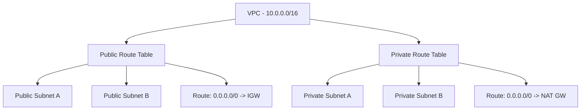

# How to Use Ansible to Create AWS Route Tables

Author: [nawazdhandala](https://www.github.com/nawazdhandala)

Tags: Ansible, AWS, Networking, VPC, Route Tables

Description: A practical guide to creating and managing AWS VPC route tables using Ansible playbooks with real examples for public and private routing.

---

Route tables control where network traffic goes inside your VPC. Every subnet needs one, and getting them wrong means your instances either cannot reach the internet or cannot talk to each other. Manually configuring route tables through the console works for one-off setups, but it falls apart when you need consistency across environments.

This guide covers creating, configuring, and managing AWS route tables with Ansible. We will build public and private route tables, associate them with subnets, and handle common routing patterns.

## Prerequisites

You need the following before starting:

- Ansible 2.14+
- The `amazon.aws` collection
- AWS credentials with VPC permissions
- Python boto3 library

```bash
# Install required dependencies
ansible-galaxy collection install amazon.aws
pip install boto3 botocore
```

## How AWS Route Tables Work

Every VPC comes with a main route table that automatically handles local traffic within the VPC. When you create additional subnets, they inherit this main route table unless you explicitly associate a different one.

Here is a typical routing architecture:



Public subnets route internet traffic through an Internet Gateway. Private subnets route it through a NAT Gateway. This separation is fundamental to AWS networking.

## Creating a Basic Route Table

The `amazon.aws.ec2_vpc_route_table` module creates and manages route tables. Here is a minimal example:

```yaml
# create-route-table.yml - Creates a basic public route table
---
- name: Create AWS Route Table
  hosts: localhost
  connection: local
  gather_facts: false

  vars:
    aws_region: us-east-1
    vpc_id: vpc-0abc123def456789
    igw_id: igw-0abc123def456789

  tasks:
    # Create a public route table with a default route to the internet gateway
    - name: Create public route table
      amazon.aws.ec2_vpc_route_table:
        vpc_id: "{{ vpc_id }}"
        region: "{{ aws_region }}"
        tags:
          Name: public-route-table
          Environment: production
        routes:
          - dest: 0.0.0.0/0
            gateway_id: "{{ igw_id }}"
      register: public_rt

    - name: Show route table ID
      ansible.builtin.debug:
        msg: "Route Table ID: {{ public_rt.route_table.id }}"
```

The local route (for traffic within the VPC) is automatically included. You do not need to add it manually.

## Public and Private Route Tables Together

Most VPC designs need both a public and a private route table. Here is a playbook that creates both:

```yaml
# dual-route-tables.yml - Creates public and private route tables
---
- name: Create Public and Private Route Tables
  hosts: localhost
  connection: local
  gather_facts: false

  vars:
    aws_region: us-east-1
    vpc_id: vpc-0abc123def456789
    igw_id: igw-0abc123def456789
    nat_gw_id: nat-0abc123def456789
    public_subnet_ids:
      - subnet-0aaa111222333
      - subnet-0bbb444555666
    private_subnet_ids:
      - subnet-0ccc777888999
      - subnet-0ddd000111222

  tasks:
    # Public route table sends internet traffic to the Internet Gateway
    - name: Create public route table
      amazon.aws.ec2_vpc_route_table:
        vpc_id: "{{ vpc_id }}"
        region: "{{ aws_region }}"
        subnets: "{{ public_subnet_ids }}"
        routes:
          - dest: 0.0.0.0/0
            gateway_id: "{{ igw_id }}"
        tags:
          Name: public-rt
          Type: public
      register: public_rt

    # Private route table sends internet traffic through NAT Gateway
    - name: Create private route table
      amazon.aws.ec2_vpc_route_table:
        vpc_id: "{{ vpc_id }}"
        region: "{{ aws_region }}"
        subnets: "{{ private_subnet_ids }}"
        routes:
          - dest: 0.0.0.0/0
            nat_gateway_id: "{{ nat_gw_id }}"
        tags:
          Name: private-rt
          Type: private
      register: private_rt

    - name: Summary
      ansible.builtin.debug:
        msg:
          - "Public RT: {{ public_rt.route_table.id }}"
          - "Private RT: {{ private_rt.route_table.id }}"
```

## Full VPC Networking Stack

In real projects, you build everything from the VPC up. Here is a complete playbook:

```yaml
# full-networking.yml - Builds complete VPC networking with route tables
---
- name: Full VPC Networking Stack
  hosts: localhost
  connection: local
  gather_facts: false

  vars:
    aws_region: us-east-1
    vpc_cidr: 10.0.0.0/16
    env: staging
    project: webapp
    public_subnets:
      - cidr: 10.0.1.0/24
        az: us-east-1a
      - cidr: 10.0.2.0/24
        az: us-east-1b
    private_subnets:
      - cidr: 10.0.10.0/24
        az: us-east-1a
      - cidr: 10.0.11.0/24
        az: us-east-1b

  tasks:
    - name: Create VPC
      amazon.aws.ec2_vpc_net:
        name: "{{ project }}-{{ env }}-vpc"
        cidr_block: "{{ vpc_cidr }}"
        region: "{{ aws_region }}"
        dns_support: true
        dns_hostnames: true
      register: vpc

    - name: Create Internet Gateway
      amazon.aws.ec2_vpc_igw:
        vpc_id: "{{ vpc.vpc.id }}"
        region: "{{ aws_region }}"
        tags:
          Name: "{{ project }}-{{ env }}-igw"
      register: igw

    # Create public subnets using a loop
    - name: Create public subnets
      amazon.aws.ec2_vpc_subnet:
        vpc_id: "{{ vpc.vpc.id }}"
        cidr: "{{ item.cidr }}"
        az: "{{ item.az }}"
        region: "{{ aws_region }}"
        map_public: true
        tags:
          Name: "{{ project }}-{{ env }}-public-{{ item.az }}"
      loop: "{{ public_subnets }}"
      register: public_subnet_results

    # Create private subnets using a loop
    - name: Create private subnets
      amazon.aws.ec2_vpc_subnet:
        vpc_id: "{{ vpc.vpc.id }}"
        cidr: "{{ item.cidr }}"
        az: "{{ item.az }}"
        region: "{{ aws_region }}"
        tags:
          Name: "{{ project }}-{{ env }}-private-{{ item.az }}"
      loop: "{{ private_subnets }}"
      register: private_subnet_results

    # Build list of subnet IDs for route table association
    - name: Set subnet ID lists
      ansible.builtin.set_fact:
        public_subnet_ids: "{{ public_subnet_results.results | map(attribute='subnet.id') | list }}"
        private_subnet_ids: "{{ private_subnet_results.results | map(attribute='subnet.id') | list }}"

    # Public route table with IGW route
    - name: Create public route table
      amazon.aws.ec2_vpc_route_table:
        vpc_id: "{{ vpc.vpc.id }}"
        region: "{{ aws_region }}"
        subnets: "{{ public_subnet_ids }}"
        routes:
          - dest: 0.0.0.0/0
            gateway_id: "{{ igw.gateway_id }}"
        tags:
          Name: "{{ project }}-{{ env }}-public-rt"
      register: public_rt

    - name: Networking Stack Summary
      ansible.builtin.debug:
        msg:
          - "VPC: {{ vpc.vpc.id }}"
          - "IGW: {{ igw.gateway_id }}"
          - "Public Subnets: {{ public_subnet_ids }}"
          - "Private Subnets: {{ private_subnet_ids }}"
          - "Public RT: {{ public_rt.route_table.id }}"
```

## Adding VPC Peering Routes

When you peer two VPCs together, you need routes in both VPCs pointing to the peering connection:

```yaml
# Add a route for traffic destined for the peered VPC
- name: Add VPC peering route to route table
  amazon.aws.ec2_vpc_route_table:
    vpc_id: "{{ vpc_id }}"
    region: "{{ aws_region }}"
    route_table_id: "{{ existing_rt_id }}"
    routes:
      - dest: 0.0.0.0/0
        gateway_id: "{{ igw_id }}"
      - dest: 10.1.0.0/16
        vpc_peering_connection_id: "{{ peering_id }}"
    tags:
      Name: public-rt-with-peering
```

When you specify `route_table_id`, Ansible updates the existing route table instead of creating a new one. This is important when you need to add routes to tables that already exist.

## Gathering Route Table Information

Use the info module to query existing route tables:

```yaml
# Query route tables filtered by VPC and tags
- name: Get route table facts
  amazon.aws.ec2_vpc_route_table_info:
    region: us-east-1
    filters:
      vpc-id: "{{ vpc_id }}"
      "tag:Type": public
  register: rt_info

- name: Display route tables
  ansible.builtin.debug:
    msg: "Found {{ rt_info.route_tables | length }} route tables"
```

## Deleting Route Tables

To remove a route table, set `state: absent` and provide either the route table ID or use lookup by tags:

```yaml
# Remove a specific route table by ID
- name: Delete route table
  amazon.aws.ec2_vpc_route_table:
    vpc_id: "{{ vpc_id }}"
    region: us-east-1
    route_table_id: rtb-0abc123def456789
    state: absent
```

You cannot delete the main route table of a VPC, and you cannot delete a route table that still has subnet associations (other than the main table association). Ansible will report an error if you try.

## Common Mistakes to Avoid

**Forgetting subnet associations.** Creating a route table without associating it to any subnet means it does nothing. Always include the `subnets` parameter.

**Overwriting routes accidentally.** When you specify routes in the module, Ansible replaces all non-local routes with the ones you define. If you had a peering route and you run the playbook without it, that route gets removed. Always include all routes you want in the table.

**Not using purge_routes carefully.** The `purge_routes` parameter controls whether routes not listed in your playbook get removed. Set it to `false` if other tools or manual processes add routes you want to keep:

```yaml
# Keep existing routes that are not defined in this playbook
- name: Add route without purging existing ones
  amazon.aws.ec2_vpc_route_table:
    vpc_id: "{{ vpc_id }}"
    region: "{{ aws_region }}"
    route_table_id: "{{ rt_id }}"
    purge_routes: false
    routes:
      - dest: 10.2.0.0/16
        vpc_peering_connection_id: "{{ new_peering_id }}"
```

## Wrapping Up

Route tables are a foundational piece of AWS networking. With Ansible, you can define them declaratively, version control your network configuration, and replicate it across environments without manual errors. Start with the basics, build up to multi-subnet architectures, and always test in a non-production account before making changes to live infrastructure.
