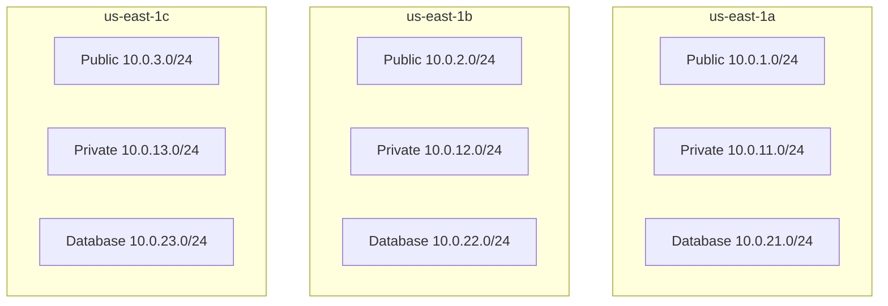

# How to Use Ansible to Create AWS Subnets

Author: [nawazdhandala](https://www.github.com/nawazdhandala)

Tags: Ansible, AWS, Subnets, VPC, Networking

Description: Create and manage AWS VPC subnets with Ansible including CIDR planning, availability zone distribution, and route table associations.

---

Subnets divide your VPC into segments with different network characteristics. Public subnets connect to the internet, private subnets access the internet through NAT, and isolated subnets have no internet connectivity at all. Getting the subnet layout right is important because changing it later means migrating running instances. Ansible makes it easy to define your subnet architecture as code and apply it consistently.

## Subnet Fundamentals

Every subnet in AWS lives in a single availability zone and has a CIDR block that is a subset of the VPC's CIDR. Instances launched in a subnet get an IP address from that CIDR range.

Key properties:
- A subnet spans exactly one availability zone
- The CIDR block must be within the VPC CIDR and cannot overlap with other subnets in the VPC
- AWS reserves 5 IPs in each subnet (first 4 and last 1)
- A /24 subnet gives you 251 usable IPs, not 256

## CIDR Planning

Before creating subnets, plan your CIDR allocation. Here is a common pattern for a /16 VPC.

```text
VPC: 10.0.0.0/16 (65,536 IPs)

Public subnets (internet-facing):
  10.0.1.0/24   - us-east-1a (251 IPs)
  10.0.2.0/24   - us-east-1b (251 IPs)
  10.0.3.0/24   - us-east-1c (251 IPs)

Private subnets (app servers):
  10.0.11.0/24  - us-east-1a (251 IPs)
  10.0.12.0/24  - us-east-1b (251 IPs)
  10.0.13.0/24  - us-east-1c (251 IPs)

Database subnets (isolated):
  10.0.21.0/24  - us-east-1a (251 IPs)
  10.0.22.0/24  - us-east-1b (251 IPs)
  10.0.23.0/24  - us-east-1c (251 IPs)

Reserved for future use:
  10.0.100.0/22 - Large subnet for EKS pods
  10.0.200.0/22 - VPN/Direct Connect
```

Leave gaps between ranges so you can add more subnets later without CIDR conflicts.

## Creating a Single Subnet

```yaml
# create-subnet.yml
---
- name: Create a subnet
  hosts: localhost
  connection: local
  gather_facts: false

  vars:
    aws_region: us-east-1
    vpc_id: vpc-0123456789abcdef0

  tasks:
    - name: Create public subnet in AZ a
      amazon.aws.ec2_vpc_subnet:
        vpc_id: "{{ vpc_id }}"
        cidr: "10.0.1.0/24"
        az: "{{ aws_region }}a"
        region: "{{ aws_region }}"
        map_public: true
        tags:
          Name: production-public-a
          Tier: public
          Environment: production
          ManagedBy: ansible
        state: present
      register: subnet

    - name: Show subnet details
      ansible.builtin.debug:
        msg: |
          Subnet ID: {{ subnet.subnet.id }}
          CIDR: {{ subnet.subnet.cidr_block }}
          AZ: {{ subnet.subnet.availability_zone }}
          Public IP on launch: {{ subnet.subnet.map_public_ip_on_launch }}
```

The `map_public` parameter controls whether instances in this subnet automatically receive a public IPv4 address on launch. Set it to `true` for public subnets and `false` (or omit it) for private ones.

## Creating Subnets Across Multiple AZs

Spreading subnets across availability zones provides high availability. If one AZ goes down, your application continues running in the others.

```yaml
# create-multi-az-subnets.yml
---
- name: Create subnets across multiple AZs
  hosts: localhost
  connection: local
  gather_facts: false

  vars:
    aws_region: us-east-1
    vpc_id: vpc-0123456789abcdef0
    azs:
      - a
      - b
      - c

    public_subnets:
      - { cidr: "10.0.1.0/24", az: a }
      - { cidr: "10.0.2.0/24", az: b }
      - { cidr: "10.0.3.0/24", az: c }

    private_subnets:
      - { cidr: "10.0.11.0/24", az: a }
      - { cidr: "10.0.12.0/24", az: b }
      - { cidr: "10.0.13.0/24", az: c }

    database_subnets:
      - { cidr: "10.0.21.0/24", az: a }
      - { cidr: "10.0.22.0/24", az: b }
      - { cidr: "10.0.23.0/24", az: c }

  tasks:
    - name: Create public subnets
      amazon.aws.ec2_vpc_subnet:
        vpc_id: "{{ vpc_id }}"
        cidr: "{{ item.cidr }}"
        az: "{{ aws_region }}{{ item.az }}"
        region: "{{ aws_region }}"
        map_public: true
        tags:
          Name: "production-public-{{ item.az }}"
          Tier: public
          AZ: "{{ aws_region }}{{ item.az }}"
          ManagedBy: ansible
        state: present
      loop: "{{ public_subnets }}"
      register: created_public

    - name: Create private subnets
      amazon.aws.ec2_vpc_subnet:
        vpc_id: "{{ vpc_id }}"
        cidr: "{{ item.cidr }}"
        az: "{{ aws_region }}{{ item.az }}"
        region: "{{ aws_region }}"
        tags:
          Name: "production-private-{{ item.az }}"
          Tier: private
          AZ: "{{ aws_region }}{{ item.az }}"
          ManagedBy: ansible
        state: present
      loop: "{{ private_subnets }}"
      register: created_private

    - name: Create database subnets
      amazon.aws.ec2_vpc_subnet:
        vpc_id: "{{ vpc_id }}"
        cidr: "{{ item.cidr }}"
        az: "{{ aws_region }}{{ item.az }}"
        region: "{{ aws_region }}"
        tags:
          Name: "production-database-{{ item.az }}"
          Tier: database
          AZ: "{{ aws_region }}{{ item.az }}"
          ManagedBy: ansible
        state: present
      loop: "{{ database_subnets }}"
      register: created_database

    - name: Collect subnet IDs by tier
      ansible.builtin.set_fact:
        public_subnet_ids: "{{ created_public.results | map(attribute='subnet.id') | list }}"
        private_subnet_ids: "{{ created_private.results | map(attribute='subnet.id') | list }}"
        database_subnet_ids: "{{ created_database.results | map(attribute='subnet.id') | list }}"

    - name: Show all subnet IDs
      ansible.builtin.debug:
        msg:
          - "Public: {{ public_subnet_ids }}"
          - "Private: {{ private_subnet_ids }}"
          - "Database: {{ database_subnet_ids }}"
```

## Subnet Distribution Diagram



## Associating Subnets with Route Tables

Subnets need route table associations to control traffic flow. Without an explicit route table, a subnet uses the VPC's main route table (which only has local routing).

```yaml
    # Associate public subnets with the public route table
    - name: Create and associate public route table
      amazon.aws.ec2_vpc_route_table:
        vpc_id: "{{ vpc_id }}"
        region: "{{ aws_region }}"
        subnets: "{{ public_subnet_ids }}"
        routes:
          - dest: 0.0.0.0/0
            gateway_id: "{{ igw_id }}"
        tags:
          Name: production-public-rt
          ManagedBy: ansible

    # Associate private subnets with a route table pointing to NAT gateway
    - name: Create and associate private route table for AZ a
      amazon.aws.ec2_vpc_route_table:
        vpc_id: "{{ vpc_id }}"
        region: "{{ aws_region }}"
        subnets:
          - "{{ private_subnet_ids[0] }}"
        routes:
          - dest: 0.0.0.0/0
            nat_gateway_id: "{{ nat_gw_a_id }}"
        tags:
          Name: production-private-rt-a
          ManagedBy: ansible

    # Database subnets have no internet route (isolated)
    - name: Create isolated route table for database subnets
      amazon.aws.ec2_vpc_route_table:
        vpc_id: "{{ vpc_id }}"
        region: "{{ aws_region }}"
        subnets: "{{ database_subnet_ids }}"
        routes: []
        tags:
          Name: production-database-rt
          ManagedBy: ansible
```

## Creating an RDS Subnet Group

RDS requires a DB subnet group that spans at least two availability zones. Your database subnets feed into this.

```yaml
    - name: Create RDS subnet group
      amazon.aws.rds_subnet_group:
        name: production-db-subnet-group
        description: Database subnets for production
        region: "{{ aws_region }}"
        subnets: "{{ database_subnet_ids }}"
        state: present
```

## Creating Large Subnets for EKS

EKS clusters need large subnets because each pod can get its own VPC IP address.

```yaml
    # Large subnets for EKS pods
    - name: Create EKS pod subnets
      amazon.aws.ec2_vpc_subnet:
        vpc_id: "{{ vpc_id }}"
        cidr: "{{ item.cidr }}"
        az: "{{ aws_region }}{{ item.az }}"
        region: "{{ aws_region }}"
        tags:
          Name: "production-eks-{{ item.az }}"
          Tier: eks
          "kubernetes.io/role/internal-elb": "1"
          ManagedBy: ansible
        state: present
      loop:
        - { cidr: "10.0.100.0/22", az: a }    # 1019 usable IPs
        - { cidr: "10.0.104.0/22", az: b }    # 1019 usable IPs
        - { cidr: "10.0.108.0/22", az: c }    # 1019 usable IPs
```

The special Kubernetes tags tell the AWS Load Balancer Controller where to place internal load balancers.

## IPv6 Subnets

If your VPC has an IPv6 CIDR block associated, you can create dual-stack subnets.

```yaml
    - name: Create dual-stack subnet
      amazon.aws.ec2_vpc_subnet:
        vpc_id: "{{ vpc_id }}"
        cidr: "10.0.50.0/24"
        ipv6_cidr: "{{ vpc_ipv6_cidr | regex_replace('::/56', ':50::/64') }}"
        az: "{{ aws_region }}a"
        region: "{{ aws_region }}"
        assign_instances_ipv6: true
        tags:
          Name: production-dual-stack-a
          ManagedBy: ansible
        state: present
```

## Querying Existing Subnets

```yaml
# Find all subnets in a VPC
- name: Get all subnets
  amazon.aws.ec2_vpc_subnet_info:
    region: "{{ aws_region }}"
    filters:
      vpc-id: "{{ vpc_id }}"
  register: all_subnets

- name: Show subnet summary
  ansible.builtin.debug:
    msg: "{{ item.tags.Name | default('unnamed') }}: {{ item.id }} ({{ item.cidr_block }}, {{ item.availability_zone }}, {{ item.available_ip_address_count }} IPs free)"
  loop: "{{ all_subnets.subnets | sort(attribute='cidr_block') }}"
  loop_control:
    label: "{{ item.cidr_block }}"

# Find subnets by tag
- name: Get only private subnets
  amazon.aws.ec2_vpc_subnet_info:
    region: "{{ aws_region }}"
    filters:
      vpc-id: "{{ vpc_id }}"
      "tag:Tier": private
  register: private_only
```

## Environment-Specific Subnet Configurations

Use separate variable files for each environment, keeping the playbook the same.

```yaml
# vars/subnets-production.yml
---
vpc_cidr: "10.0.0.0/16"
subnet_config:
  public:
    - { cidr: "10.0.1.0/24", az: a }
    - { cidr: "10.0.2.0/24", az: b }
    - { cidr: "10.0.3.0/24", az: c }
  private:
    - { cidr: "10.0.11.0/24", az: a }
    - { cidr: "10.0.12.0/24", az: b }
    - { cidr: "10.0.13.0/24", az: c }
```

```yaml
# vars/subnets-staging.yml
---
vpc_cidr: "10.1.0.0/16"
subnet_config:
  public:
    - { cidr: "10.1.1.0/24", az: a }
    - { cidr: "10.1.2.0/24", az: b }
  private:
    - { cidr: "10.1.11.0/24", az: a }
    - { cidr: "10.1.12.0/24", az: b }
```

```bash
# Deploy production subnets
ansible-playbook create-subnets.yml -e @vars/subnets-production.yml

# Deploy staging subnets
ansible-playbook create-subnets.yml -e @vars/subnets-staging.yml
```

## Subnet NACL Associations

Network ACLs (NACLs) provide a second layer of network security at the subnet level. Unlike security groups, NACLs are stateless and evaluate rules in order.

```yaml
    - name: Create NACL for database subnets
      amazon.aws.ec2_vpc_nacl:
        vpc_id: "{{ vpc_id }}"
        name: production-database-nacl
        region: "{{ aws_region }}"
        subnets: "{{ database_subnet_ids }}"
        ingress:
          # Allow PostgreSQL from private subnets only
          - [100, "tcp", "allow", "10.0.11.0/24", null, null, 5432, 5432]
          - [110, "tcp", "allow", "10.0.12.0/24", null, null, 5432, 5432]
          - [120, "tcp", "allow", "10.0.13.0/24", null, null, 5432, 5432]
          # Allow ephemeral ports for return traffic
          - [900, "tcp", "allow", "10.0.0.0/16", null, null, 1024, 65535]
        egress:
          # Allow responses back to private subnets
          - [100, "tcp", "allow", "10.0.11.0/24", null, null, 1024, 65535]
          - [110, "tcp", "allow", "10.0.12.0/24", null, null, 1024, 65535]
          - [120, "tcp", "allow", "10.0.13.0/24", null, null, 1024, 65535]
        tags:
          Name: production-database-nacl
          ManagedBy: ansible
        state: present
```

## Deleting Subnets

```yaml
# Delete a subnet
- name: Remove old subnet
  amazon.aws.ec2_vpc_subnet:
    vpc_id: "{{ vpc_id }}"
    cidr: "10.0.99.0/24"
    region: "{{ aws_region }}"
    state: absent
```

A subnet can only be deleted if it has no running instances or other resources attached. Terminate all instances in the subnet first.

## Capacity Planning Tips

When planning subnet sizes:
- **/24 (251 IPs)** works for most workloads with moderate instance counts
- **/22 (1,019 IPs)** for EKS clusters or large auto-scaling groups
- **/20 (4,091 IPs)** for very large deployments
- Leave at least 20% of your VPC CIDR unallocated for future needs
- Plan for 3 AZs even if you start with 2, because adding a third AZ later means finding CIDR space that does not overlap

## Wrapping Up

Subnet design is one of those decisions that is hard to change after the fact, so getting it right up front matters. Define your CIDR plan in variable files, use Ansible to create subnets consistently across environments, and tag everything so you can query subnets by tier and AZ. Spread subnets across at least two (preferably three) availability zones for high availability, and leave room in your CIDR plan for growth. The `ec2_vpc_subnet` module is idempotent, so running your subnet playbook repeatedly is safe and serves as a form of drift detection.
