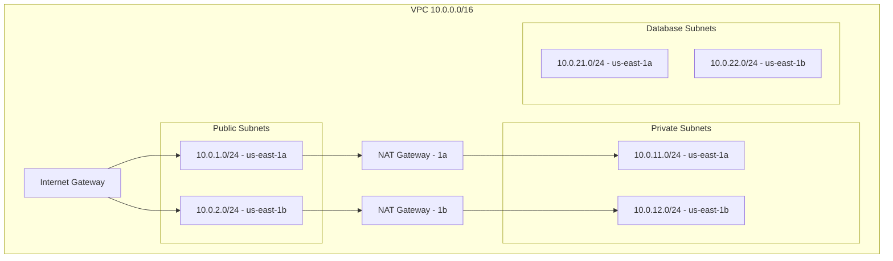

# How to Use Ansible to Create AWS VPCs

Author: [nawazdhandala](https://www.github.com/nawazdhandala)

Tags: Ansible, AWS, VPC, Networking, Infrastructure as Code

Description: Build complete AWS VPC environments with Ansible including subnets, route tables, internet gateways, and NAT gateways using the amazon.aws collection.

---

A VPC is the foundation of every AWS deployment. Before you can launch EC2 instances, create RDS databases, or deploy EKS clusters, you need a VPC with properly configured subnets, route tables, and gateways. Ansible lets you define your entire VPC architecture as code and spin it up with a single playbook run.

## VPC Architecture Overview

A production VPC typically has public subnets (for load balancers and bastion hosts), private subnets (for application servers), and isolated subnets (for databases). Each subnet type has its own route table controlling internet access.



## Creating a Basic VPC

Start with the VPC itself.

```yaml
# create-vpc.yml
---
- name: Create a VPC
  hosts: localhost
  connection: local
  gather_facts: false

  vars:
    aws_region: us-east-1
    vpc_cidr: "10.0.0.0/16"
    vpc_name: "production-vpc"

  tasks:
    - name: Create VPC
      amazon.aws.ec2_vpc_net:
        name: "{{ vpc_name }}"
        cidr_block: "{{ vpc_cidr }}"
        region: "{{ aws_region }}"
        dns_support: true
        dns_hostnames: true
        tenancy: default
        tags:
          Environment: production
          ManagedBy: ansible
        state: present
      register: vpc

    - name: Show VPC ID
      ansible.builtin.debug:
        msg: "VPC ID: {{ vpc.vpc.id }}"
```

The `dns_support` and `dns_hostnames` settings are important. Without `dns_hostnames`, your EC2 instances will not get public DNS names even if they have public IPs.

## Creating Subnets

```yaml
    # Public subnets
    - name: Create public subnet in AZ a
      amazon.aws.ec2_vpc_subnet:
        vpc_id: "{{ vpc.vpc.id }}"
        cidr: "10.0.1.0/24"
        az: "{{ aws_region }}a"
        region: "{{ aws_region }}"
        map_public: true
        tags:
          Name: "{{ vpc_name }}-public-a"
          Tier: public
          ManagedBy: ansible
        state: present
      register: public_subnet_a

    - name: Create public subnet in AZ b
      amazon.aws.ec2_vpc_subnet:
        vpc_id: "{{ vpc.vpc.id }}"
        cidr: "10.0.2.0/24"
        az: "{{ aws_region }}b"
        region: "{{ aws_region }}"
        map_public: true
        tags:
          Name: "{{ vpc_name }}-public-b"
          Tier: public
          ManagedBy: ansible
        state: present
      register: public_subnet_b

    # Private subnets
    - name: Create private subnet in AZ a
      amazon.aws.ec2_vpc_subnet:
        vpc_id: "{{ vpc.vpc.id }}"
        cidr: "10.0.11.0/24"
        az: "{{ aws_region }}a"
        region: "{{ aws_region }}"
        tags:
          Name: "{{ vpc_name }}-private-a"
          Tier: private
          ManagedBy: ansible
        state: present
      register: private_subnet_a

    - name: Create private subnet in AZ b
      amazon.aws.ec2_vpc_subnet:
        vpc_id: "{{ vpc.vpc.id }}"
        cidr: "10.0.12.0/24"
        az: "{{ aws_region }}b"
        region: "{{ aws_region }}"
        tags:
          Name: "{{ vpc_name }}-private-b"
          Tier: private
          ManagedBy: ansible
        state: present
      register: private_subnet_b
```

The `map_public: true` setting on public subnets means instances launched in that subnet automatically get a public IP address.

## Creating an Internet Gateway

An internet gateway gives instances in public subnets access to the internet.

```yaml
    - name: Create internet gateway
      amazon.aws.ec2_vpc_igw:
        vpc_id: "{{ vpc.vpc.id }}"
        region: "{{ aws_region }}"
        tags:
          Name: "{{ vpc_name }}-igw"
          ManagedBy: ansible
        state: present
      register: igw
```

## Creating NAT Gateways

NAT gateways let instances in private subnets reach the internet (for software updates and API calls) without being directly accessible from the internet.

```yaml
    # Allocate Elastic IPs for NAT gateways
    - name: Allocate EIP for NAT gateway a
      amazon.aws.ec2_eip:
        region: "{{ aws_region }}"
        in_vpc: true
        tags:
          Name: "{{ vpc_name }}-nat-eip-a"
          ManagedBy: ansible
        state: present
      register: nat_eip_a

    - name: Allocate EIP for NAT gateway b
      amazon.aws.ec2_eip:
        region: "{{ aws_region }}"
        in_vpc: true
        tags:
          Name: "{{ vpc_name }}-nat-eip-b"
          ManagedBy: ansible
        state: present
      register: nat_eip_b

    # Create NAT gateways in public subnets
    - name: Create NAT gateway in AZ a
      amazon.aws.ec2_vpc_nat_gateway:
        subnet_id: "{{ public_subnet_a.subnet.id }}"
        eip_address: "{{ nat_eip_a.public_ip }}"
        region: "{{ aws_region }}"
        tags:
          Name: "{{ vpc_name }}-nat-a"
          ManagedBy: ansible
        state: present
        wait: true
      register: nat_gw_a

    - name: Create NAT gateway in AZ b
      amazon.aws.ec2_vpc_nat_gateway:
        subnet_id: "{{ public_subnet_b.subnet.id }}"
        eip_address: "{{ nat_eip_b.public_ip }}"
        region: "{{ aws_region }}"
        tags:
          Name: "{{ vpc_name }}-nat-b"
          ManagedBy: ansible
        state: present
        wait: true
      register: nat_gw_b
```

## Creating Route Tables

Route tables control where network traffic goes. Public subnets route to the internet gateway; private subnets route to NAT gateways.

```yaml
    # Public route table - routes to internet gateway
    - name: Create public route table
      amazon.aws.ec2_vpc_route_table:
        vpc_id: "{{ vpc.vpc.id }}"
        region: "{{ aws_region }}"
        subnets:
          - "{{ public_subnet_a.subnet.id }}"
          - "{{ public_subnet_b.subnet.id }}"
        routes:
          - dest: 0.0.0.0/0
            gateway_id: "{{ igw.gateway_id }}"
        tags:
          Name: "{{ vpc_name }}-public-rt"
          ManagedBy: ansible
      register: public_rt

    # Private route table AZ a - routes to NAT gateway a
    - name: Create private route table AZ a
      amazon.aws.ec2_vpc_route_table:
        vpc_id: "{{ vpc.vpc.id }}"
        region: "{{ aws_region }}"
        subnets:
          - "{{ private_subnet_a.subnet.id }}"
        routes:
          - dest: 0.0.0.0/0
            nat_gateway_id: "{{ nat_gw_a.nat_gateway_id }}"
        tags:
          Name: "{{ vpc_name }}-private-rt-a"
          ManagedBy: ansible
      register: private_rt_a

    # Private route table AZ b - routes to NAT gateway b
    - name: Create private route table AZ b
      amazon.aws.ec2_vpc_route_table:
        vpc_id: "{{ vpc.vpc.id }}"
        region: "{{ aws_region }}"
        subnets:
          - "{{ private_subnet_b.subnet.id }}"
        routes:
          - dest: 0.0.0.0/0
            nat_gateway_id: "{{ nat_gw_b.nat_gateway_id }}"
        tags:
          Name: "{{ vpc_name }}-private-rt-b"
          ManagedBy: ansible
      register: private_rt_b
```

## Complete VPC Playbook Using Variables

For cleaner code, define the VPC layout in variables and use loops.

```yaml
# vars/vpc-production.yml
---
vpc_name: production-vpc
vpc_cidr: "10.0.0.0/16"
aws_region: us-east-1

subnets:
  public:
    - cidr: "10.0.1.0/24"
      az: a
      name: public-a
    - cidr: "10.0.2.0/24"
      az: b
      name: public-b
  private:
    - cidr: "10.0.11.0/24"
      az: a
      name: private-a
    - cidr: "10.0.12.0/24"
      az: b
      name: private-b
  database:
    - cidr: "10.0.21.0/24"
      az: a
      name: database-a
    - cidr: "10.0.22.0/24"
      az: b
      name: database-b
```

```yaml
# create-vpc-from-vars.yml
---
- name: Create VPC from variable definitions
  hosts: localhost
  connection: local
  gather_facts: false

  vars_files:
    - vars/vpc-production.yml

  tasks:
    - name: Create VPC
      amazon.aws.ec2_vpc_net:
        name: "{{ vpc_name }}"
        cidr_block: "{{ vpc_cidr }}"
        region: "{{ aws_region }}"
        dns_support: true
        dns_hostnames: true
        tags:
          Environment: production
          ManagedBy: ansible
        state: present
      register: vpc

    - name: Create public subnets
      amazon.aws.ec2_vpc_subnet:
        vpc_id: "{{ vpc.vpc.id }}"
        cidr: "{{ item.cidr }}"
        az: "{{ aws_region }}{{ item.az }}"
        region: "{{ aws_region }}"
        map_public: true
        tags:
          Name: "{{ vpc_name }}-{{ item.name }}"
          Tier: public
          ManagedBy: ansible
      loop: "{{ subnets.public }}"
      register: public_subnets

    - name: Create private subnets
      amazon.aws.ec2_vpc_subnet:
        vpc_id: "{{ vpc.vpc.id }}"
        cidr: "{{ item.cidr }}"
        az: "{{ aws_region }}{{ item.az }}"
        region: "{{ aws_region }}"
        tags:
          Name: "{{ vpc_name }}-{{ item.name }}"
          Tier: private
          ManagedBy: ansible
      loop: "{{ subnets.private }}"
      register: private_subnets

    - name: Create database subnets
      amazon.aws.ec2_vpc_subnet:
        vpc_id: "{{ vpc.vpc.id }}"
        cidr: "{{ item.cidr }}"
        az: "{{ aws_region }}{{ item.az }}"
        region: "{{ aws_region }}"
        tags:
          Name: "{{ vpc_name }}-{{ item.name }}"
          Tier: database
          ManagedBy: ansible
      loop: "{{ subnets.database }}"
      register: database_subnets

    - name: Create internet gateway
      amazon.aws.ec2_vpc_igw:
        vpc_id: "{{ vpc.vpc.id }}"
        region: "{{ aws_region }}"
        tags:
          Name: "{{ vpc_name }}-igw"
        state: present
      register: igw

    - name: Create public route table
      amazon.aws.ec2_vpc_route_table:
        vpc_id: "{{ vpc.vpc.id }}"
        region: "{{ aws_region }}"
        subnets: "{{ public_subnets.results | map(attribute='subnet.id') | list }}"
        routes:
          - dest: 0.0.0.0/0
            gateway_id: "{{ igw.gateway_id }}"
        tags:
          Name: "{{ vpc_name }}-public-rt"
          ManagedBy: ansible

    - name: Show VPC summary
      ansible.builtin.debug:
        msg:
          - "VPC: {{ vpc.vpc.id }}"
          - "Public subnets: {{ public_subnets.results | map(attribute='subnet.id') | list }}"
          - "Private subnets: {{ private_subnets.results | map(attribute='subnet.id') | list }}"
          - "Database subnets: {{ database_subnets.results | map(attribute='subnet.id') | list }}"
          - "Internet Gateway: {{ igw.gateway_id }}"
```

## VPC Flow Logs

Enable VPC Flow Logs for network traffic monitoring and troubleshooting.

```yaml
    - name: Create CloudWatch log group for flow logs
      amazon.aws.cloudwatchlogs_log_group:
        log_group_name: "/vpc/{{ vpc_name }}/flow-logs"
        region: "{{ aws_region }}"
        retention: 30
        state: present
```

## Querying VPC Information

```yaml
# Get VPC details
- name: Get VPC info
  amazon.aws.ec2_vpc_net_info:
    region: "{{ aws_region }}"
    filters:
      "tag:Name": "{{ vpc_name }}"
  register: vpc_info

- name: Get all subnets in VPC
  amazon.aws.ec2_vpc_subnet_info:
    region: "{{ aws_region }}"
    filters:
      vpc-id: "{{ vpc_info.vpcs[0].id }}"
  register: subnet_info

- name: Show subnet details
  ansible.builtin.debug:
    msg: "{{ item.tags.Name }}: {{ item.id }} ({{ item.cidr_block }}, {{ item.availability_zone }})"
  loop: "{{ subnet_info.subnets }}"
  loop_control:
    label: "{{ item.tags.Name | default(item.id) }}"
```

## Deleting a VPC

Deleting a VPC requires removing all dependent resources first. Here is the teardown order.

```yaml
# teardown-vpc.yml
---
- name: Tear down VPC and all resources
  hosts: localhost
  connection: local
  gather_facts: false

  vars:
    aws_region: us-east-1
    vpc_name: production-vpc

  tasks:
    - name: Get VPC ID
      amazon.aws.ec2_vpc_net_info:
        region: "{{ aws_region }}"
        filters:
          "tag:Name": "{{ vpc_name }}"
      register: vpc_info

    - name: Set VPC ID
      ansible.builtin.set_fact:
        vpc_id: "{{ vpc_info.vpcs[0].id }}"
      when: vpc_info.vpcs | length > 0

    # Teardown order: NAT GWs, then route tables, then IGW,
    # then subnets, then security groups, then VPC

    - name: Delete NAT gateways
      amazon.aws.ec2_vpc_nat_gateway:
        nat_gateway_id: "{{ item.nat_gateway_id }}"
        region: "{{ aws_region }}"
        state: absent
        wait: true
      loop: "{{ nat_gateways }}"
      when: nat_gateways is defined

    - name: Delete VPC
      amazon.aws.ec2_vpc_net:
        name: "{{ vpc_name }}"
        cidr_block: "{{ vpc_info.vpcs[0].cidr_block }}"
        region: "{{ aws_region }}"
        state: absent
      when: vpc_info.vpcs | length > 0
```

## Wrapping Up

Building VPCs with Ansible gives you reproducible network infrastructure. Define the CIDR blocks, subnet layout, and routing in variable files, and use the same playbook across environments with different variable values. The key modules are `ec2_vpc_net`, `ec2_vpc_subnet`, `ec2_vpc_igw`, `ec2_vpc_nat_gateway`, and `ec2_vpc_route_table`. All of them are idempotent, so running the playbook multiple times is safe. Start with the architecture diagram, translate it to variables, and let Ansible build it.
