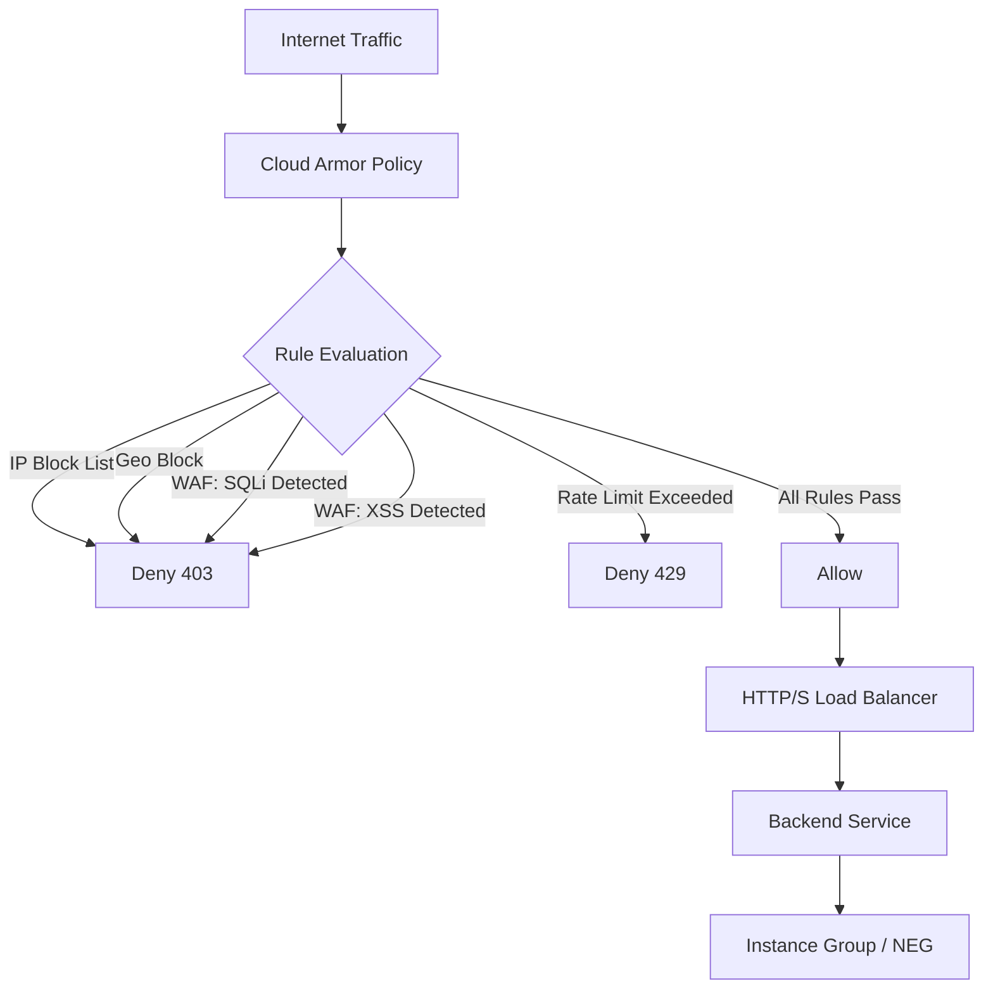

# How to Use Ansible to Create GCP Cloud Armor Policies

Author: [nawazdhandala](https://www.github.com/nawazdhandala)

Tags: Ansible, GCP, Cloud Armor, Security, WAF

Description: Learn how to create and manage GCP Cloud Armor security policies using Ansible to protect your applications from DDoS attacks and web exploits.

---

Cloud Armor is Google Cloud's edge security service that protects your applications from DDoS attacks, cross-site scripting, SQL injection, and other web-based threats. It sits in front of your HTTP(S) load balancers and evaluates every incoming request against a set of rules you define. In this post, we will use Ansible to create and manage Cloud Armor security policies, giving you version-controlled, repeatable security configurations.

## What Cloud Armor Does

Cloud Armor provides several layers of protection:

- **IP-based access control**: Allow or deny traffic from specific IP ranges
- **Geo-based access control**: Block or allow traffic by country
- **Rate limiting**: Throttle requests from sources that send too much traffic
- **WAF rules**: Preconfigured rules for common attacks like SQL injection and XSS
- **Custom rules**: Write your own rules using Google's Common Expression Language (CEL)

## Prerequisites

- Ansible 2.10+ with the `google.cloud` collection
- A GCP project with an HTTP(S) load balancer
- A service account with Compute Security Admin permissions

```bash
# Install the GCP Ansible collection
ansible-galaxy collection install google.cloud
```

## Creating a Basic Security Policy

Let us start with a simple policy that blocks traffic from specific IP ranges and allows everything else.

```yaml
# create-armor-policy.yml - Create a basic Cloud Armor security policy
---
- name: Create Cloud Armor Security Policy
  hosts: localhost
  connection: local
  gather_facts: false

  vars:
    gcp_project: "my-project-id"
    gcp_auth_kind: "serviceaccount"
    gcp_service_account_file: "/path/to/service-account-key.json"

  tasks:
    - name: Create the security policy
      google.cloud.gcp_compute_security_policy:
        name: "web-app-security-policy"
        description: "Security policy for the web application load balancer"
        # The default rule applies when no other rule matches
        rules:
          # Rule 1: Block known malicious IP ranges
          - action: "deny(403)"
            priority: 1000
            description: "Block known bad IPs"
            match:
              versioned_expr: "SRC_IPS_V1"
              config:
                src_ip_ranges:
                  - "198.51.100.0/24"
                  - "203.0.113.0/24"
          # Rule 2: Allow traffic from corporate office
          - action: "allow"
            priority: 2000
            description: "Allow corporate office IPs"
            match:
              versioned_expr: "SRC_IPS_V1"
              config:
                src_ip_ranges:
                  - "35.200.100.0/24"
                  - "35.200.101.0/24"
          # Default rule: Allow all other traffic
          - action: "allow"
            priority: 2147483647
            description: "Default allow rule"
            match:
              versioned_expr: "SRC_IPS_V1"
              config:
                src_ip_ranges:
                  - "*"
        project: "{{ gcp_project }}"
        auth_kind: "{{ gcp_auth_kind }}"
        service_account_file: "{{ gcp_service_account_file }}"
        state: present
      register: policy

    - name: Show policy info
      ansible.builtin.debug:
        msg: |
          Security policy created: {{ policy.name }}
          Rules count: {{ policy.rules | length }}
          Attach this to your backend service.
```

## Geo-Based Blocking

If your application only serves users in specific countries, you can block traffic from other regions.

```yaml
# geo-blocking-policy.yml - Block traffic by country
---
- name: Create Geo-Blocking Cloud Armor Policy
  hosts: localhost
  connection: local
  gather_facts: false

  vars:
    gcp_project: "my-project-id"
    gcp_auth_kind: "serviceaccount"
    gcp_service_account_file: "/path/to/service-account-key.json"

  tasks:
    - name: Create policy with geo-based rules
      google.cloud.gcp_compute_security_policy:
        name: "geo-restricted-policy"
        description: "Allow traffic only from US, CA, GB, DE"
        rules:
          # Allow traffic from specific countries
          - action: "allow"
            priority: 1000
            description: "Allow US, Canada, UK, Germany"
            match:
              expr:
                expression: "origin.region_code == 'US' || origin.region_code == 'CA' || origin.region_code == 'GB' || origin.region_code == 'DE'"
          # Block everything else
          - action: "deny(403)"
            priority: 2147483647
            description: "Block all other countries"
            match:
              versioned_expr: "SRC_IPS_V1"
              config:
                src_ip_ranges:
                  - "*"
        project: "{{ gcp_project }}"
        auth_kind: "{{ gcp_auth_kind }}"
        service_account_file: "{{ gcp_service_account_file }}"
        state: present
```

## WAF Rules for Common Attacks

Cloud Armor includes preconfigured WAF rules that protect against OWASP Top 10 attacks. Here is how to enable them.

```yaml
# waf-policy.yml - Enable WAF rules for common web attacks
---
- name: Create WAF-Enabled Cloud Armor Policy
  hosts: localhost
  connection: local
  gather_facts: false

  vars:
    gcp_project: "my-project-id"
    gcp_auth_kind: "serviceaccount"
    gcp_service_account_file: "/path/to/service-account-key.json"

  tasks:
    - name: Create policy with WAF rules
      google.cloud.gcp_compute_security_policy:
        name: "waf-security-policy"
        description: "WAF policy with OWASP Top 10 protection"
        rules:
          # Block SQL injection attempts
          - action: "deny(403)"
            priority: 1000
            description: "Block SQL injection"
            match:
              expr:
                expression: "evaluatePreconfiguredExpr('sqli-v33-stable')"
          # Block cross-site scripting (XSS)
          - action: "deny(403)"
            priority: 1100
            description: "Block XSS attacks"
            match:
              expr:
                expression: "evaluatePreconfiguredExpr('xss-v33-stable')"
          # Block remote code execution
          - action: "deny(403)"
            priority: 1200
            description: "Block remote code execution"
            match:
              expr:
                expression: "evaluatePreconfiguredExpr('rce-v33-stable')"
          # Block local file inclusion
          - action: "deny(403)"
            priority: 1300
            description: "Block local file inclusion"
            match:
              expr:
                expression: "evaluatePreconfiguredExpr('lfi-v33-stable')"
          # Block remote file inclusion
          - action: "deny(403)"
            priority: 1400
            description: "Block remote file inclusion"
            match:
              expr:
                expression: "evaluatePreconfiguredExpr('rfi-v33-stable')"
          # Block protocol attacks
          - action: "deny(403)"
            priority: 1500
            description: "Block protocol attacks"
            match:
              expr:
                expression: "evaluatePreconfiguredExpr('protocolattack-v33-stable')"
          # Default: allow everything else
          - action: "allow"
            priority: 2147483647
            description: "Default allow"
            match:
              versioned_expr: "SRC_IPS_V1"
              config:
                src_ip_ranges:
                  - "*"
        project: "{{ gcp_project }}"
        auth_kind: "{{ gcp_auth_kind }}"
        service_account_file: "{{ gcp_service_account_file }}"
        state: present
```

## Cloud Armor Architecture



## Rate Limiting

Rate limiting prevents any single source from overwhelming your application with too many requests.

```yaml
# rate-limit-policy.yml - Add rate limiting rules
---
- name: Create Rate Limiting Cloud Armor Policy
  hosts: localhost
  connection: local
  gather_facts: false

  vars:
    gcp_project: "my-project-id"
    gcp_auth_kind: "serviceaccount"
    gcp_service_account_file: "/path/to/service-account-key.json"

  tasks:
    - name: Create policy with rate limiting
      google.cloud.gcp_compute_security_policy:
        name: "rate-limited-policy"
        description: "Policy with rate limiting for API protection"
        rules:
          # Rate limit: 100 requests per minute per IP
          - action: "rate_based_ban"
            priority: 1000
            description: "Rate limit to 100 req/min per IP"
            match:
              versioned_expr: "SRC_IPS_V1"
              config:
                src_ip_ranges:
                  - "*"
            rate_limit_options:
              conform_action: "allow"
              exceed_action: "deny(429)"
              rate_limit_threshold:
                count: 100
                interval_sec: 60
              ban_duration_sec: 300
              enforce_on_key: "IP"
          # Stricter rate limit for login endpoint
          - action: "throttle"
            priority: 900
            description: "Rate limit login to 10 req/min per IP"
            match:
              expr:
                expression: "request.path.matches('/api/login')"
            rate_limit_options:
              conform_action: "allow"
              exceed_action: "deny(429)"
              rate_limit_threshold:
                count: 10
                interval_sec: 60
              enforce_on_key: "IP"
          # Default allow
          - action: "allow"
            priority: 2147483647
            description: "Default allow"
            match:
              versioned_expr: "SRC_IPS_V1"
              config:
                src_ip_ranges:
                  - "*"
        project: "{{ gcp_project }}"
        auth_kind: "{{ gcp_auth_kind }}"
        service_account_file: "{{ gcp_service_account_file }}"
        state: present
```

## Attaching a Policy to a Backend Service

The security policy needs to be attached to a backend service to take effect.

```yaml
# attach-policy.yml - Attach Cloud Armor policy to backend service
---
- name: Attach Cloud Armor Policy to Backend Service
  hosts: localhost
  connection: local
  gather_facts: false

  vars:
    gcp_project: "my-project-id"
    gcp_auth_kind: "serviceaccount"
    gcp_service_account_file: "{{ gcp_service_account_file }}"

  tasks:
    - name: Get the security policy
      google.cloud.gcp_compute_security_policy:
        name: "waf-security-policy"
        project: "{{ gcp_project }}"
        auth_kind: "{{ gcp_auth_kind }}"
        service_account_file: "{{ gcp_service_account_file }}"
        state: present
      register: policy

    - name: Attach policy to the backend service
      google.cloud.gcp_compute_backend_service:
        name: "web-backend-service"
        security_policy:
          selfLink: "{{ policy.selfLink }}"
        health_checks:
          - selfLink: "projects/{{ gcp_project }}/global/healthChecks/web-health-check"
        project: "{{ gcp_project }}"
        auth_kind: "{{ gcp_auth_kind }}"
        service_account_file: "{{ gcp_service_account_file }}"
        state: present
```

## Comprehensive Production Policy

Here is a complete policy that combines multiple protection layers.

```yaml
# production-armor-policy.yml - Full production security policy
---
- name: Create Comprehensive Production Security Policy
  hosts: localhost
  connection: local
  gather_facts: false

  vars:
    gcp_project: "my-project-id"
    gcp_auth_kind: "serviceaccount"
    gcp_service_account_file: "/path/to/service-account-key.json"

    # IPs that should always be blocked
    blocked_ips:
      - "198.51.100.0/24"
    # IPs that should always be allowed (bypasses all rules)
    allowlisted_ips:
      - "35.200.100.0/24"

  tasks:
    - name: Create comprehensive security policy
      google.cloud.gcp_compute_security_policy:
        name: "production-security-policy"
        description: "Multi-layer security for production workloads"
        rules:
          # Priority 100: Always allow trusted IPs
          - action: "allow"
            priority: 100
            description: "Allowlist trusted IPs"
            match:
              versioned_expr: "SRC_IPS_V1"
              config:
                src_ip_ranges: "{{ allowlisted_ips }}"
          # Priority 200: Block known bad IPs
          - action: "deny(403)"
            priority: 200
            description: "Block known bad IPs"
            match:
              versioned_expr: "SRC_IPS_V1"
              config:
                src_ip_ranges: "{{ blocked_ips }}"
          # Priority 1000-1500: WAF rules
          - action: "deny(403)"
            priority: 1000
            description: "WAF - SQL injection"
            match:
              expr:
                expression: "evaluatePreconfiguredExpr('sqli-v33-stable')"
          - action: "deny(403)"
            priority: 1100
            description: "WAF - XSS"
            match:
              expr:
                expression: "evaluatePreconfiguredExpr('xss-v33-stable')"
          - action: "deny(403)"
            priority: 1200
            description: "WAF - RCE"
            match:
              expr:
                expression: "evaluatePreconfiguredExpr('rce-v33-stable')"
          # Priority 2000: Rate limiting
          - action: "rate_based_ban"
            priority: 2000
            description: "Global rate limit"
            match:
              versioned_expr: "SRC_IPS_V1"
              config:
                src_ip_ranges:
                  - "*"
            rate_limit_options:
              conform_action: "allow"
              exceed_action: "deny(429)"
              rate_limit_threshold:
                count: 500
                interval_sec: 60
              ban_duration_sec: 600
              enforce_on_key: "IP"
          # Default: allow
          - action: "allow"
            priority: 2147483647
            description: "Default allow"
            match:
              versioned_expr: "SRC_IPS_V1"
              config:
                src_ip_ranges:
                  - "*"
        project: "{{ gcp_project }}"
        auth_kind: "{{ gcp_auth_kind }}"
        service_account_file: "{{ gcp_service_account_file }}"
        state: present
```

## Best Practices

1. **Start in preview mode.** Before enforcing new rules, use Cloud Armor's preview mode to see what would be blocked without actually blocking it. Review the logs first.

2. **Use meaningful rule priorities.** Leave gaps between priority numbers (100, 200, 1000, 2000) so you can insert rules later without renumbering everything.

3. **Always have a default rule.** The default rule (priority 2147483647) should explicitly allow or deny. Do not leave it ambiguous.

4. **Monitor your rules.** Check Cloud Armor logs in Cloud Logging to see how many requests each rule is matching. This helps you tune false positives.

5. **Version control your policies.** Store your Ansible playbooks in git so you have a history of every security policy change.

6. **Test WAF rules with your application.** Some WAF rules can cause false positives with legitimate requests. Test thoroughly before enabling in production.

## Conclusion

Cloud Armor provides essential protection for any internet-facing application on GCP, and Ansible makes it manageable. By defining your security policies as code, you get repeatable, auditable, and version-controlled security configurations. Start with basic IP blocking and rate limiting, then layer on WAF rules as you understand your application's traffic patterns. The combination of Cloud Armor's capabilities and Ansible's automation gives you a strong security posture without the operational overhead of managing it manually.
