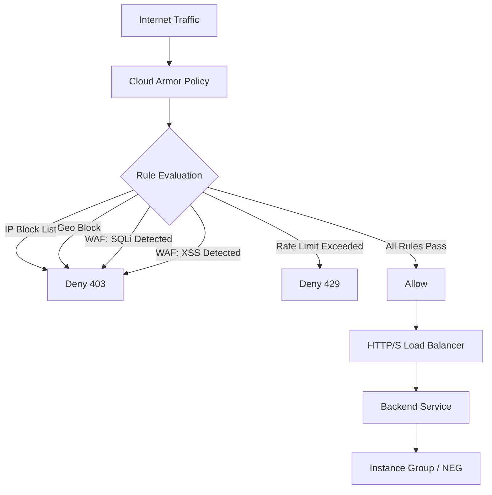

# How to Use Ansible to Create GCP Cloud Armor Policies

Author: [nawazdhandala](https://www.github.com/nawazdhandala)

Tags: Ansible, GCP, Cloud Armor, Security, WAF

Description: Learn how to create and manage GCP Cloud Armor security policies using Ansible to protect your applications from DDoS attacks and web exploits.

---

Cloud Armor is Google Cloud's edge security service that protects your applications from DDoS attacks, cross-site scripting, SQL injection, and other web-based threats. It sits in front of your HTTP(S) load balancers and evaluates every incoming request against a set of rules you define. In this post, we will use Ansible to create and manage Cloud Armor security policies, giving you version-controlled security configurations.

## What Cloud Armor Does

Cloud Armor provides several layers of protection:

- **IP-based access control**: Allow or deny traffic from specific IP ranges
- **Geo-based access control**: Block or allow traffic by country
- **Rate limiting**: Throttle requests from sources that send too much traffic
- **WAF rules**: Preconfigured rules for common attacks like SQL injection and XSS
- **Custom rules**: Write your own rules using Google's Common Expression Language (CEL)

## Prerequisites

- Ansible with the Google Cloud CLI installed
- A GCP project with an HTTP(S) load balancer
- A service account with Compute Security Admin permissions to create policies and Compute Network Admin permissions to attach them to backend services

```bash
# Authenticate the Google Cloud CLI with a service account

gcloud auth activate-service-account --key-file=/path/to/service-account-key.json
```

## Creating a Basic Security Policy

Let us start with a simple policy that blocks traffic from example IP ranges and allows everything else.

```yaml
# create-armor-policy.yml - Create a basic Cloud Armor security policy
---
- name: Create Cloud Armor Security Policy
  hosts: localhost
  connection: local
  gather_facts: false

  vars:
    gcp_project: "my-project-id"
    policy_name: "web-app-security-policy"

  tasks:
    - name: Create the security policy
      ansible.builtin.command: >-
        gcloud compute security-policies create {{ policy_name }}
        --project={{ gcp_project }}
        --type=CLOUD_ARMOR
        --description="Security policy for the web application load balancer"

    - name: Add security policy rules
      ansible.builtin.command: "{{ item }}"
      loop:
        # Rule 1: Block example IP ranges
        - >-
          gcloud compute security-policies rules create 1000
          --security-policy={{ policy_name }}
          --project={{ gcp_project }}
          --action=deny-403
          --src-ip-ranges=198.51.100.0/24,203.0.113.0/24
          --description="Block example IPs"
        # Rule 2: Allow traffic from corporate office
        - >-
          gcloud compute security-policies rules create 2000
          --security-policy={{ policy_name }}
          --project={{ gcp_project }}
          --action=allow
          --src-ip-ranges=35.200.100.0/24,35.200.101.0/24
          --description="Allow corporate office IPs"

    - name: Set the default rule to allow all other traffic
      ansible.builtin.command: >-
        gcloud compute security-policies rules update 2147483647
        --security-policy={{ policy_name }}
        --project={{ gcp_project }}
        --action=allow
        --src-ip-ranges="*"
        --description="Default allow rule"

    - name: Show policy info
      ansible.builtin.debug:
        msg: |
          Security policy created: {{ policy_name }}
          Attach this to your backend service.
```

## Geo-Based Blocking

If your application only serves users in specific countries, you can block traffic from other regions.

```yaml
# geo-blocking-policy.yml - Block traffic by country
---
- name: Create Geo-Blocking Cloud Armor Policy
  hosts: localhost
  connection: local
  gather_facts: false

  vars:
    gcp_project: "my-project-id"
    policy_name: "geo-restricted-policy"

  tasks:
    - name: Create policy
      ansible.builtin.command: >-
        gcloud compute security-policies create {{ policy_name }}
        --project={{ gcp_project }}
        --type=CLOUD_ARMOR
        --description="Allow traffic only from US, CA, GB, DE"

    - name: Allow traffic from specific countries
      ansible.builtin.command: >-
        gcloud compute security-policies rules create 1000
        --security-policy={{ policy_name }}
        --project={{ gcp_project }}
        --action=allow
        --expression="origin.region_code == 'US' || origin.region_code == 'CA' || origin.region_code == 'GB' || origin.region_code == 'DE'"
        --description="Allow US, Canada, UK, Germany"

    - name: Block everything else
      ansible.builtin.command: >-
        gcloud compute security-policies rules update 2147483647
        --security-policy={{ policy_name }}
        --project={{ gcp_project }}
        --action=deny-403
        --src-ip-ranges="*"
        --description="Block all other countries"
```

## WAF Rules for Common Attacks

Cloud Armor includes preconfigured WAF rules that protect against OWASP Top 10 attacks. Here is how to enable them.

```yaml
# waf-policy.yml - Enable WAF rules for common web attacks
---
- name: Create WAF-Enabled Cloud Armor Policy
  hosts: localhost
  connection: local
  gather_facts: false

  vars:
    gcp_project: "my-project-id"
    policy_name: "waf-security-policy"

  tasks:
    - name: Create policy
      ansible.builtin.command: >-
        gcloud compute security-policies create {{ policy_name }}
        --project={{ gcp_project }}
        --type=CLOUD_ARMOR
        --description="WAF policy with OWASP Top 10 protection"

    - name: Create policy with WAF rules
      ansible.builtin.command: "{{ item }}"
      loop:
        # Block SQL injection attempts
        - >-
          gcloud compute security-policies rules create 1000
          --security-policy={{ policy_name }}
          --project={{ gcp_project }}
          --action=deny-403
          --expression="evaluatePreconfiguredWaf('sqli-v422-stable')"
          --description="Block SQL injection"
        # Block cross-site scripting (XSS)
        - >-
          gcloud compute security-policies rules create 1100
          --security-policy={{ policy_name }}
          --project={{ gcp_project }}
          --action=deny-403
          --expression="evaluatePreconfiguredWaf('xss-v422-stable')"
          --description="Block XSS attacks"
        # Block remote code execution
        - >-
          gcloud compute security-policies rules create 1200
          --security-policy={{ policy_name }}
          --project={{ gcp_project }}
          --action=deny-403
          --expression="evaluatePreconfiguredWaf('rce-v422-stable')"
          --description="Block remote code execution"
        # Block local file inclusion
        - >-
          gcloud compute security-policies rules create 1300
          --security-policy={{ policy_name }}
          --project={{ gcp_project }}
          --action=deny-403
          --expression="evaluatePreconfiguredWaf('lfi-v422-stable')"
          --description="Block local file inclusion"
        # Block remote file inclusion
        - >-
          gcloud compute security-policies rules create 1400
          --security-policy={{ policy_name }}
          --project={{ gcp_project }}
          --action=deny-403
          --expression="evaluatePreconfiguredWaf('rfi-v422-stable')"
          --description="Block remote file inclusion"
        # Block protocol attacks
        - >-
          gcloud compute security-policies rules create 1500
          --security-policy={{ policy_name }}
          --project={{ gcp_project }}
          --action=deny-403
          --expression="evaluatePreconfiguredWaf('protocolattack-v422-stable')"
          --description="Block protocol attacks"

    - name: Set the default rule to allow everything else
      ansible.builtin.command: >-
        gcloud compute security-policies rules update 2147483647
        --security-policy={{ policy_name }}
        --project={{ gcp_project }}
        --action=allow
        --src-ip-ranges="*"
        --description="Default allow"
```

## Cloud Armor Architecture


```mermaid
graph TD
    A[Internet Traffic] --> B[Cloud Armor Policy]
    B --> C{Rule Evaluation}
    C -->|IP Block List| D[Deny 403]
    C -->|Geo Block| D
    C -->|WAF: SQLi Detected| D
    C -->|WAF: XSS Detected| D
    C -->|Rate Limit Exceeded| E[Deny 429]
    C -->|All Rules Pass| F[Allow]
    F --> G[HTTP/S Load Balancer]
    G --> H[Backend Service]
    H --> I[Instance Group / NEG]
```

## Rate Limiting

Rate limiting prevents any single source from overwhelming your application with too many requests.

```yaml
# rate-limit-policy.yml - Add rate limiting rules
---
- name: Create Rate Limiting Cloud Armor Policy
  hosts: localhost
  connection: local
  gather_facts: false

  vars:
    gcp_project: "my-project-id"
    policy_name: "rate-limited-policy"

  tasks:
    - name: Create policy
      ansible.builtin.command: >-
        gcloud compute security-policies create {{ policy_name }}
        --project={{ gcp_project }}
        --type=CLOUD_ARMOR
        --description="Policy with rate limiting for API protection"

    - name: Add rate limiting rules
      ansible.builtin.command: "{{ item }}"
      loop:
        # Rate limit: 100 requests per minute per IP
        - >-
          gcloud compute security-policies rules create 1000
          --security-policy={{ policy_name }}
          --project={{ gcp_project }}
          --action=rate-based-ban
          --src-ip-ranges="*"
          --rate-limit-threshold-count=100
          --rate-limit-threshold-interval-sec=60
          --ban-duration-sec=300
          --conform-action=allow
          --exceed-action=deny-429
          --enforce-on-key=IP
          --description="Rate limit to 100 req/min per IP"
        # Stricter rate limit for login endpoint
        - >-
          gcloud compute security-policies rules create 900
          --security-policy={{ policy_name }}
          --project={{ gcp_project }}
          --action=throttle
          --expression="request.path.matches('/api/login')"
          --rate-limit-threshold-count=10
          --rate-limit-threshold-interval-sec=60
          --conform-action=allow
          --exceed-action=deny-429
          --enforce-on-key=IP
          --description="Rate limit login to 10 req/min per IP"

    - name: Set the default rule to allow everything else
      ansible.builtin.command: >-
        gcloud compute security-policies rules update 2147483647
        --security-policy={{ policy_name }}
        --project={{ gcp_project }}
        --action=allow
        --src-ip-ranges="*"
        --description="Default allow"
```

## Attaching a Policy to a Backend Service

The security policy needs to be attached to a backend service to take effect.

```yaml
# attach-policy.yml - Attach Cloud Armor policy to backend service
---
- name: Attach Cloud Armor Policy to Backend Service
  hosts: localhost
  connection: local
  gather_facts: false

  vars:
    gcp_project: "my-project-id"
    backend_service: "web-backend-service"
    policy_name: "waf-security-policy"

  tasks:
    - name: Attach policy to the backend service
      ansible.builtin.command: >-
        gcloud compute backend-services update {{ backend_service }}
        --project={{ gcp_project }}
        --global
        --security-policy={{ policy_name }}
```

## Comprehensive Production Policy

Here is a complete policy that combines multiple protection layers.

```yaml
# production-armor-policy.yml - Full production security policy
---
- name: Create Comprehensive Production Security Policy
  hosts: localhost
  connection: local
  gather_facts: false

  vars:
    gcp_project: "my-project-id"
    policy_name: "production-security-policy"

    # Example IPs that should always be blocked
    blocked_ips:
      - "198.51.100.0/24"
    # IPs that should always be allowed (bypasses all rules)
    allowlisted_ips:
      - "35.200.100.0/24"

  tasks:
    - name: Create comprehensive security policy
      ansible.builtin.command: >-
        gcloud compute security-policies create {{ policy_name }}
        --project={{ gcp_project }}
        --type=CLOUD_ARMOR
        --description="Multi-layer security for production workloads"

    - name: Add comprehensive security policy rules
      ansible.builtin.command: "{{ item }}"
      loop:
        # Priority 100: Always allow trusted IPs
        - >-
          gcloud compute security-policies rules create 100
          --security-policy={{ policy_name }}
          --project={{ gcp_project }}
          --action=allow
          --src-ip-ranges={{ allowlisted_ips | join(',') }}
          --description="Allowlist trusted IPs"
        # Priority 200: Block example IPs
        - >-
          gcloud compute security-policies rules create 200
          --security-policy={{ policy_name }}
          --project={{ gcp_project }}
          --action=deny-403
          --src-ip-ranges={{ blocked_ips | join(',') }}
          --description="Block example IPs"
        # Priority 1000-1500: WAF rules
        - >-
          gcloud compute security-policies rules create 1000
          --security-policy={{ policy_name }}
          --project={{ gcp_project }}
          --action=deny-403
          --expression="evaluatePreconfiguredWaf('sqli-v422-stable')"
          --description="WAF - SQL injection"
        - >-
          gcloud compute security-policies rules create 1100
          --security-policy={{ policy_name }}
          --project={{ gcp_project }}
          --action=deny-403
          --expression="evaluatePreconfiguredWaf('xss-v422-stable')"
          --description="WAF - XSS"
        - >-
          gcloud compute security-policies rules create 1200
          --security-policy={{ policy_name }}
          --project={{ gcp_project }}
          --action=deny-403
          --expression="evaluatePreconfiguredWaf('rce-v422-stable')"
          --description="WAF - RCE"
        # Priority 2000: Rate limiting
        - >-
          gcloud compute security-policies rules create 2000
          --security-policy={{ policy_name }}
          --project={{ gcp_project }}
          --action=rate-based-ban
          --src-ip-ranges="*"
          --rate-limit-threshold-count=500
          --rate-limit-threshold-interval-sec=60
          --ban-duration-sec=600
          --conform-action=allow
          --exceed-action=deny-429
          --enforce-on-key=IP
          --description="Global rate limit"

    - name: Set the default rule to allow everything else
      ansible.builtin.command: >-
        gcloud compute security-policies rules update 2147483647
        --security-policy={{ policy_name }}
        --project={{ gcp_project }}
        --action=allow
        --src-ip-ranges="*"
        --description="Default allow"
```

## Best Practices

1. **Start in preview mode.** Before enforcing new rules, use Cloud Armor's preview mode to see what would be blocked without actually blocking it. Review the logs first.

2. **Use meaningful rule priorities.** Leave gaps between priority numbers (100, 200, 1000, 2000) so you can insert rules later without renumbering everything.

3. **Always have a default rule.** The default rule (priority 2147483647) should explicitly allow or deny. Do not leave it ambiguous.

4. **Monitor your rules.** Check Cloud Armor logs in Cloud Logging to see how many requests each rule is matching. This helps you tune false positives.

5. **Version control your policies.** Store your Ansible playbooks in git so you have a history of every security policy change.

6. **Test WAF rules with your application.** Some WAF rules can cause false positives with legitimate requests. Test thoroughly before enabling in production.

## Conclusion

Cloud Armor provides essential protection for any internet-facing application on GCP, and Ansible makes it manageable. By defining your security policies as code, you get auditable and version-controlled security configurations. Start with basic IP blocking and rate limiting, then layer on WAF rules as you understand your application's traffic patterns. The combination of Cloud Armor's capabilities and Ansible's automation gives you a strong security posture without the operational overhead of managing it manually.
