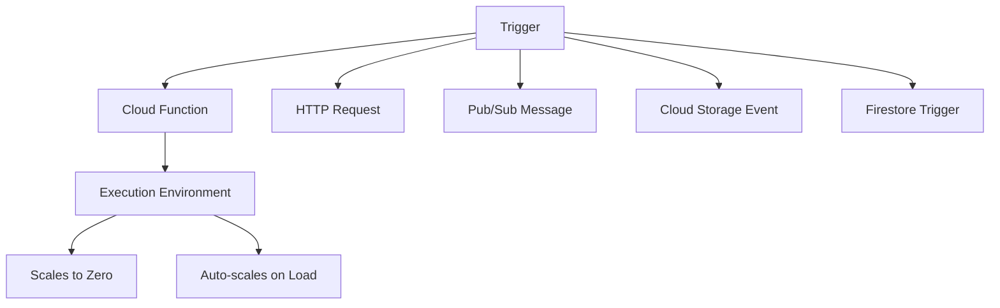

# How to Use Ansible to Create GCP Cloud Functions

Author: [nawazdhandala](https://www.github.com/nawazdhandala)

Tags: Ansible, GCP, Cloud Functions, Serverless, FaaS

Description: Deploy and manage GCP Cloud Functions with Ansible including HTTP triggers, Pub/Sub triggers, environment variables, and VPC connectors.

---

Cloud Functions is Google's serverless compute platform for running event-driven code without managing servers. You write a function, deploy it, and GCP handles scaling, patching, and infrastructure. While the `gcloud functions deploy` command works for simple cases, Ansible gives you a way to manage Cloud Functions alongside the rest of your infrastructure. This is particularly useful when your function depends on other resources like Pub/Sub topics, Cloud Storage buckets, or VPC networks that you are already managing with Ansible.

## Prerequisites

- Ansible 2.9+ with the `google.cloud` collection
- GCP service account with Cloud Functions Developer role
- Cloud Functions API and Cloud Build API enabled
- Source code packaged and uploaded to a Cloud Storage bucket

```bash
ansible-galaxy collection install google.cloud
pip install google-auth requests google-api-python-client

gcloud services enable cloudfunctions.googleapis.com cloudbuild.googleapis.com --project=my-project-123
```

## Cloud Functions Architecture



## Preparing Function Source Code

Cloud Functions expects source code in a Cloud Storage bucket as a zip file. Let's first create a simple function and upload it:

```yaml
# prepare-function-source.yml - Package and upload function source code
---
- name: Prepare Function Source
  hosts: localhost
  connection: local
  gather_facts: false

  vars:
    gcp_project: "my-project-123"
    function_name: "process-upload"
    source_dir: "/opt/ansible/functions/{{ function_name }}"
    bucket_name: "{{ gcp_project }}-function-source"

  tasks:
    - name: Create the source directory
      ansible.builtin.file:
        path: "{{ source_dir }}"
        state: directory
        mode: "0755"

    - name: Write the function code
      ansible.builtin.copy:
        content: |
          import functions_framework
          from google.cloud import storage
          import json

          @functions_framework.http
          def handle_request(request):
              """HTTP Cloud Function that processes uploaded files."""
              request_json = request.get_json(silent=True)

              if not request_json or 'filename' not in request_json:
                  return json.dumps({"error": "filename is required"}), 400

              filename = request_json['filename']
              bucket_name = request_json.get('bucket', 'default-bucket')

              # Process the file
              client = storage.Client()
              bucket = client.bucket(bucket_name)
              blob = bucket.blob(filename)

              if not blob.exists():
                  return json.dumps({"error": f"File {filename} not found"}), 404

              return json.dumps({
                  "status": "processed",
                  "filename": filename,
                  "size": blob.size
              }), 200
        dest: "{{ source_dir }}/main.py"
        mode: "0644"

    - name: Write requirements.txt
      ansible.builtin.copy:
        content: |
          functions-framework==3.*
          google-cloud-storage==2.*
        dest: "{{ source_dir }}/requirements.txt"
        mode: "0644"

    - name: Create zip archive of the function source
      ansible.builtin.archive:
        path: "{{ source_dir }}/"
        dest: "/tmp/{{ function_name }}.zip"
        format: zip

    - name: Upload source to Cloud Storage
      ansible.builtin.command: >
        gsutil cp /tmp/{{ function_name }}.zip
        gs://{{ bucket_name }}/functions/{{ function_name }}/{{ function_name }}.zip
      changed_when: true
```

## Deploying an HTTP-Triggered Function

Using gcloud through Ansible for Cloud Functions deployment (the google.cloud collection module for Cloud Functions is limited, so using the CLI is more reliable):

```yaml
# deploy-http-function.yml - Deploy an HTTP-triggered Cloud Function
---
- name: Deploy HTTP Cloud Function
  hosts: localhost
  connection: local
  gather_facts: false

  vars:
    gcp_project: "my-project-123"
    region: "us-central1"
    function_name: "process-upload"
    runtime: "python311"
    entry_point: "handle_request"
    source_bucket: "{{ gcp_project }}-function-source"

  tasks:
    - name: Deploy the Cloud Function
      ansible.builtin.command: >
        gcloud functions deploy {{ function_name }}
        --project={{ gcp_project }}
        --region={{ region }}
        --runtime={{ runtime }}
        --trigger-http
        --entry-point={{ entry_point }}
        --source=gs://{{ source_bucket }}/functions/{{ function_name }}/{{ function_name }}.zip
        --memory=256MB
        --timeout=60s
        --max-instances=10
        --min-instances=0
        --set-env-vars=PROJECT_ID={{ gcp_project }},ENVIRONMENT=production
        --service-account={{ function_name }}-sa@{{ gcp_project }}.iam.gserviceaccount.com
        --allow-unauthenticated
        --quiet
      register: deploy_result
      changed_when: true

    - name: Get the function URL
      ansible.builtin.command: >
        gcloud functions describe {{ function_name }}
        --project={{ gcp_project }}
        --region={{ region }}
        --format="value(httpsTrigger.url)"
      register: function_url
      changed_when: false

    - name: Show function URL
      ansible.builtin.debug:
        msg: "Function deployed at: {{ function_url.stdout }}"
```

Key parameters explained:
- `--max-instances=10` caps scaling to prevent runaway costs
- `--min-instances=0` allows scaling to zero when idle (saves money, but first request has cold start latency)
- `--allow-unauthenticated` makes the function publicly accessible via HTTP (remove this for internal functions)
- `--service-account` specifies which identity the function runs as

## Deploying a Pub/Sub-Triggered Function

Functions triggered by Pub/Sub messages are common for event-driven architectures:

```yaml
# deploy-pubsub-function.yml - Deploy a Pub/Sub triggered Cloud Function
---
- name: Deploy Pub/Sub Triggered Function
  hosts: localhost
  connection: local
  gather_facts: false

  vars:
    gcp_project: "my-project-123"
    region: "us-central1"
    function_name: "process-events"
    topic_name: "user-events"
    source_bucket: "{{ gcp_project }}-function-source"

  tasks:
    - name: Ensure the Pub/Sub topic exists
      ansible.builtin.command: >
        gcloud pubsub topics create {{ topic_name }}
        --project={{ gcp_project }}
      register: topic_result
      changed_when: "'Created topic' in topic_result.stderr"
      failed_when: "topic_result.rc != 0 and 'already exists' not in topic_result.stderr"

    - name: Write the event processing function
      ansible.builtin.copy:
        content: |
          import base64
          import json
          import functions_framework
          from google.cloud import bigquery

          @functions_framework.cloud_event
          def process_event(cloud_event):
              """Process a Pub/Sub message and write to BigQuery."""
              message_data = base64.b64decode(cloud_event.data["message"]["data"]).decode()
              event = json.loads(message_data)

              client = bigquery.Client()
              table_ref = client.dataset("analytics").table("user_events")

              errors = client.insert_rows_json(table_ref, [event])
              if errors:
                  print(f"BigQuery insert errors: {errors}")
                  raise RuntimeError(f"Failed to insert event: {errors}")

              print(f"Processed event: {event.get('event_type', 'unknown')}")
        dest: "/tmp/{{ function_name }}/main.py"
        mode: "0644"

    - name: Write requirements for the function
      ansible.builtin.copy:
        content: |
          functions-framework==3.*
          google-cloud-bigquery==3.*
        dest: "/tmp/{{ function_name }}/requirements.txt"
        mode: "0644"

    - name: Deploy the Pub/Sub function
      ansible.builtin.command: >
        gcloud functions deploy {{ function_name }}
        --project={{ gcp_project }}
        --region={{ region }}
        --runtime=python311
        --trigger-topic={{ topic_name }}
        --entry-point=process_event
        --source=/tmp/{{ function_name }}
        --memory=512MB
        --timeout=120s
        --max-instances=50
        --set-env-vars=PROJECT_ID={{ gcp_project }}
        --service-account=worker@{{ gcp_project }}.iam.gserviceaccount.com
        --quiet
      register: deploy_result
      changed_when: true

    - name: Confirm deployment
      ansible.builtin.debug:
        msg: "Function {{ function_name }} deployed, triggered by topic {{ topic_name }}"
```

## Deploying a Cloud Storage-Triggered Function

React to file uploads in a bucket:

```yaml
# deploy-gcs-function.yml - Deploy a function triggered by Cloud Storage events
---
- name: Deploy GCS Triggered Function
  hosts: localhost
  connection: local
  gather_facts: false

  vars:
    gcp_project: "my-project-123"
    region: "us-central1"
    function_name: "process-file-upload"
    trigger_bucket: "{{ gcp_project }}-uploads"

  tasks:
    - name: Write the file processing function
      ansible.builtin.copy:
        content: |
          import functions_framework
          from google.cloud import storage, vision

          @functions_framework.cloud_event
          def process_upload(cloud_event):
              """Process newly uploaded files."""
              data = cloud_event.data
              bucket_name = data["bucket"]
              file_name = data["name"]

              print(f"Processing file: gs://{bucket_name}/{file_name}")

              # Skip non-image files
              if not file_name.lower().endswith(('.png', '.jpg', '.jpeg', '.gif')):
                  print(f"Skipping non-image file: {file_name}")
                  return

              # Process the image
              storage_client = storage.Client()
              bucket = storage_client.bucket(bucket_name)
              blob = bucket.blob(file_name)

              print(f"Image processed: {file_name}, size: {blob.size}")
        dest: "/tmp/{{ function_name }}/main.py"
        mode: "0644"

    - name: Deploy the GCS-triggered function
      ansible.builtin.command: >
        gcloud functions deploy {{ function_name }}
        --project={{ gcp_project }}
        --region={{ region }}
        --runtime=python311
        --trigger-event=google.storage.object.finalize
        --trigger-resource={{ trigger_bucket }}
        --entry-point=process_upload
        --source=/tmp/{{ function_name }}
        --memory=256MB
        --timeout=120s
        --quiet
      register: deploy_result
      changed_when: true
```

## Deploying Multiple Functions

Managing a suite of functions in one playbook:

```yaml
# deploy-all-functions.yml - Deploy all project functions
---
- name: Deploy All Functions
  hosts: localhost
  connection: local
  gather_facts: false

  vars:
    gcp_project: "my-project-123"
    region: "us-central1"
    functions:
      - name: "api-handler"
        trigger: "--trigger-http --allow-unauthenticated"
        memory: "256MB"
        timeout: "30s"
        entry_point: "handle_api"
      - name: "event-processor"
        trigger: "--trigger-topic=app-events"
        memory: "512MB"
        timeout: "120s"
        entry_point: "process_event"
      - name: "scheduled-cleanup"
        trigger: "--trigger-topic=cleanup-schedule"
        memory: "256MB"
        timeout: "300s"
        entry_point: "run_cleanup"

  tasks:
    - name: Deploy each function
      ansible.builtin.command: >
        gcloud functions deploy {{ item.name }}
        --project={{ gcp_project }}
        --region={{ region }}
        --runtime=python311
        {{ item.trigger }}
        --entry-point={{ item.entry_point }}
        --source=gs://{{ gcp_project }}-function-source/functions/{{ item.name }}/{{ item.name }}.zip
        --memory={{ item.memory }}
        --timeout={{ item.timeout }}
        --set-env-vars=PROJECT_ID={{ gcp_project }},ENVIRONMENT=production
        --quiet
      loop: "{{ functions }}"
      register: deploy_results
      changed_when: true

    - name: Deployment summary
      ansible.builtin.debug:
        msg: "Deployed {{ functions | length }} functions in {{ region }}"
```

## Deleting Functions

```yaml
# delete-function.yml - Remove a Cloud Function
---
- name: Delete Cloud Function
  hosts: localhost
  connection: local
  gather_facts: false

  vars:
    gcp_project: "my-project-123"
    region: "us-central1"
    function_name: "old-function"

  tasks:
    - name: Delete the function
      ansible.builtin.command: >
        gcloud functions delete {{ function_name }}
        --project={{ gcp_project }}
        --region={{ region }}
        --quiet
      register: delete_result
      changed_when: true

    - name: Confirm deletion
      ansible.builtin.debug:
        msg: "Function {{ function_name }} deleted"
```

## Summary

Managing Cloud Functions with Ansible keeps your serverless deployments consistent and reproducible. The key practices are: use dedicated service accounts for each function with minimal permissions, set appropriate memory and timeout limits to control costs, use max-instances to cap scaling, store function source in Cloud Storage for versioning, and manage the supporting infrastructure (Pub/Sub topics, Storage buckets, IAM bindings) in the same playbook as the function deployment. This gives you a complete picture of each function and its dependencies in a single file.
