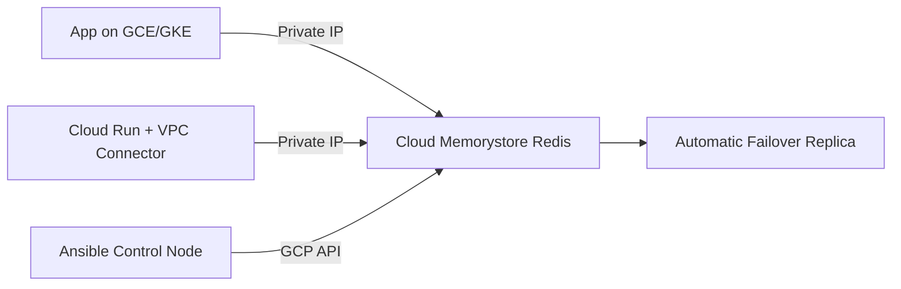

# How to Use Ansible to Create GCP Cloud Memorystore

Author: [nawazdhandala](https://www.github.com/nawazdhandala)

Tags: Ansible, GCP, Cloud Memorystore, Redis, Infrastructure as Code

Description: Learn how to provision and configure GCP Cloud Memorystore Redis instances using Ansible playbooks with practical examples and best practices.

---

Cloud Memorystore is Google Cloud's managed in-memory data store service, supporting both Redis and Memcached. If your applications depend on low-latency caching or session storage, Memorystore is one of the simplest ways to get a production-ready Redis instance running in GCP. In this post, we will walk through how to automate Memorystore provisioning using Ansible.

## Why Automate Memorystore with Ansible?

Manually clicking through the GCP Console to create Redis instances works for one-off experiments, but it falls apart when you need consistency across environments. Maybe you need identical Redis instances in dev, staging, and production. Maybe you want to tear down and recreate environments on demand. Ansible gives you repeatable, version-controlled infrastructure definitions that you can run from any CI/CD pipeline.

## Prerequisites

Before you start, you need a few things in place:

- Ansible 2.10 or newer installed on your control machine
- The `google.cloud` Ansible collection installed
- A GCP service account with permissions to manage Memorystore instances
- A GCP project with the Memorystore API enabled

Install the GCP collection if you have not already:

```bash
# Install the official Google Cloud Ansible collection
ansible-galaxy collection install google.cloud
```

Enable the Memorystore API in your project:

```bash
# Enable the Redis API in your GCP project
gcloud services enable redis.googleapis.com --project=my-project-id
```

## Setting Up Authentication

Ansible needs a way to authenticate with GCP. The cleanest approach is to use a service account JSON key file. You can also use application default credentials if you are running on a GCP instance or have `gcloud auth application-default login` configured.

Here is how to set up your variables for authentication:

```yaml
# group_vars/all.yml - shared variables for GCP authentication
gcp_project: "my-project-id"
gcp_auth_kind: "serviceaccount"
gcp_service_account_file: "/path/to/service-account-key.json"
gcp_region: "us-central1"
```

## Creating a Basic Redis Instance

Let us start with a simple playbook that creates a basic-tier Memorystore Redis instance. The basic tier gives you a single Redis node without replication, which is fine for development and caching workloads where you can tolerate data loss.

```yaml
# create-memorystore.yml - Provision a basic Cloud Memorystore Redis instance
---
- name: Create GCP Cloud Memorystore Redis Instance
  hosts: localhost
  connection: local
  gather_facts: false

  vars:
    gcp_project: "my-project-id"
    gcp_auth_kind: "serviceaccount"
    gcp_service_account_file: "/path/to/service-account-key.json"
    region: "us-central1"
    instance_name: "app-cache-redis"
    memory_size_gb: 2
    redis_version: "REDIS_7_0"

  tasks:
    - name: Create a Cloud Memorystore Redis instance
      google.cloud.gcp_redis_instance:
        name: "{{ instance_name }}"
        region: "{{ region }}"
        memory_size_gb: "{{ memory_size_gb }}"
        tier: "BASIC"
        redis_version: "{{ redis_version }}"
        display_name: "Application Cache Redis"
        project: "{{ gcp_project }}"
        auth_kind: "{{ gcp_auth_kind }}"
        service_account_file: "{{ gcp_service_account_file }}"
        state: present
      register: redis_instance

    - name: Display the Redis instance details
      ansible.builtin.debug:
        msg: |
          Redis instance created successfully.
          Host: {{ redis_instance.host }}
          Port: {{ redis_instance.port }}
          Current status: {{ redis_instance.state }}
```

Run this playbook with:

```bash
# Execute the playbook to create the Memorystore instance
ansible-playbook create-memorystore.yml
```

Note that Memorystore creation can take several minutes. Ansible will wait for the operation to complete before moving on to the next task.

## Creating a Standard Tier Instance with High Availability

For production workloads, you almost certainly want the standard tier. This gives you automatic failover with a replica in a different zone. If the primary node goes down, GCP automatically promotes the replica.

```yaml
# create-memorystore-ha.yml - Provision a high-availability Memorystore instance
---
- name: Create HA Cloud Memorystore Redis Instance
  hosts: localhost
  connection: local
  gather_facts: false

  vars:
    gcp_project: "my-project-id"
    gcp_auth_kind: "serviceaccount"
    gcp_service_account_file: "/path/to/service-account-key.json"
    region: "us-central1"
    instance_name: "production-redis"

  tasks:
    - name: Create a standard-tier Redis instance with replication
      google.cloud.gcp_redis_instance:
        name: "{{ instance_name }}"
        region: "{{ region }}"
        memory_size_gb: 5
        tier: "STANDARD_HA"
        redis_version: "REDIS_7_0"
        display_name: "Production Redis Cache"
        # Specify the network for private connectivity
        authorized_network: "projects/{{ gcp_project }}/global/networks/default"
        # Redis configuration parameters
        redis_configs:
          maxmemory-policy: "allkeys-lru"
          notify-keyspace-events: ""
        # Labels for organization and billing
        labels:
          environment: "production"
          team: "backend"
          managed_by: "ansible"
        project: "{{ gcp_project }}"
        auth_kind: "{{ gcp_auth_kind }}"
        service_account_file: "{{ gcp_service_account_file }}"
        state: present
      register: redis_instance

    - name: Show connection information
      ansible.builtin.debug:
        msg: |
          Instance: {{ redis_instance.name }}
          Host: {{ redis_instance.host }}
          Port: {{ redis_instance.port }}
          Memory: {{ redis_instance.memorySizeGb }} GB
          Tier: {{ redis_instance.tier }}
```

## Connecting Your Application to Memorystore

Memorystore instances are only accessible from within the same VPC network. You cannot connect to them from the public internet. This is actually a good security feature, but it means your application needs to be running inside GCP (on a VM, GKE, Cloud Run with VPC connector, etc.).

Here is a playbook that creates the Redis instance and then configures a Compute Engine VM to connect to it:

```yaml
# setup-app-with-redis.yml - Create Redis and configure app VM
---
- name: Setup Application with Memorystore Backend
  hosts: localhost
  connection: local
  gather_facts: false

  vars:
    gcp_project: "my-project-id"
    gcp_auth_kind: "serviceaccount"
    gcp_service_account_file: "/path/to/service-account-key.json"
    region: "us-central1"
    zone: "us-central1-a"

  tasks:
    - name: Create the Memorystore Redis instance
      google.cloud.gcp_redis_instance:
        name: "app-session-store"
        region: "{{ region }}"
        memory_size_gb: 1
        tier: "BASIC"
        redis_version: "REDIS_7_0"
        authorized_network: "projects/{{ gcp_project }}/global/networks/default"
        project: "{{ gcp_project }}"
        auth_kind: "{{ gcp_auth_kind }}"
        service_account_file: "{{ gcp_service_account_file }}"
        state: present
      register: redis_result

    - name: Store Redis host for later use
      ansible.builtin.set_fact:
        redis_host: "{{ redis_result.host }}"
        redis_port: "{{ redis_result.port }}"

    - name: Write Redis connection info to a config file
      ansible.builtin.copy:
        content: |
          REDIS_HOST={{ redis_host }}
          REDIS_PORT={{ redis_port }}
        dest: "/tmp/redis-config.env"
```

## Managing Memorystore Lifecycle

You will eventually need to update or delete instances. Here is how to handle those operations:

```yaml
# manage-memorystore.yml - Scale up memory or delete an instance
---
- name: Manage Memorystore Instance Lifecycle
  hosts: localhost
  connection: local
  gather_facts: false

  vars:
    gcp_project: "my-project-id"
    gcp_auth_kind: "serviceaccount"
    gcp_service_account_file: "/path/to/service-account-key.json"

  tasks:
    # Scale up the memory on an existing instance
    - name: Scale up Redis memory from 2GB to 4GB
      google.cloud.gcp_redis_instance:
        name: "app-cache-redis"
        region: "us-central1"
        memory_size_gb: 4
        tier: "BASIC"
        redis_version: "REDIS_7_0"
        project: "{{ gcp_project }}"
        auth_kind: "{{ gcp_auth_kind }}"
        service_account_file: "{{ gcp_service_account_file }}"
        state: present

    # To delete an instance, set state to absent
    - name: Delete a Redis instance that is no longer needed
      google.cloud.gcp_redis_instance:
        name: "old-cache-redis"
        region: "us-central1"
        project: "{{ gcp_project }}"
        auth_kind: "{{ gcp_auth_kind }}"
        service_account_file: "{{ gcp_service_account_file }}"
        state: absent
      tags:
        - cleanup
```

## Architecture Overview

Here is a typical architecture when using Memorystore with your application:



## Tips from Production Experience

After running Memorystore in production for a while, here are a few things worth knowing:

1. **Always use the standard tier for production.** The basic tier has no replication. If the node goes down, your data is gone and you wait for a new node to spin up.

2. **Set `maxmemory-policy` explicitly.** The default is `volatile-lru`, which only evicts keys with TTLs set. If you forget to set TTLs on your keys, Redis will run out of memory and start rejecting writes. For most caching use cases, `allkeys-lru` is what you want.

3. **Size your instance based on actual data, not traffic.** Memorystore pricing is based on memory provisioned, not on the number of operations. A 1GB instance can handle tens of thousands of operations per second.

4. **Use labels consistently.** They make it much easier to track costs and manage resources across environments.

5. **Monitor with Cloud Monitoring.** Memorystore automatically exports metrics. Set up alerts for memory usage and connection counts.

## Conclusion

Automating Cloud Memorystore with Ansible is straightforward once you have the authentication and collection set up. The `google.cloud.gcp_redis_instance` module handles all the heavy lifting, and you get the same idempotent behavior you expect from any Ansible module. Whether you are setting up a simple dev cache or a production-grade session store with automatic failover, defining it in a playbook means you can reproduce it reliably every time.
