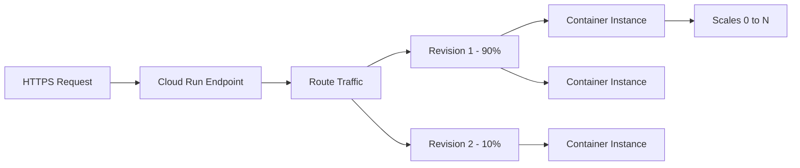

# How to Use Ansible to Create GCP Cloud Run Services

Author: [nawazdhandala](https://www.github.com/nawazdhandala)

Tags: Ansible, GCP, Cloud Run, Containers, Serverless

Description: Deploy and manage GCP Cloud Run services with Ansible including container configuration, traffic splitting, custom domains, and VPC connectivity.

---

Cloud Run is Google's managed platform for running containerized applications. You give it a container image, it handles scaling, TLS, load balancing, and infrastructure. Unlike Cloud Functions, Cloud Run can run any language or framework as long as it is packaged in a container that listens on a port. This makes it a great fit for web APIs, microservices, and background workers. Ansible can manage Cloud Run services alongside the rest of your GCP infrastructure, keeping everything in one place.

## How Cloud Run Works



Cloud Run uses a revision model. Each deployment creates a new revision, and you can split traffic between revisions for canary deployments or gradual rollouts.

## Prerequisites

- Ansible 2.9+ with the `google.cloud` collection
- GCP service account with Cloud Run Admin role
- Cloud Run API enabled
- A container image in Artifact Registry or Container Registry

```bash
ansible-galaxy collection install google.cloud
pip install google-auth requests google-api-python-client

gcloud services enable run.googleapis.com artifactregistry.googleapis.com --project=my-project-123
```

## Building and Pushing a Container Image

Before deploying to Cloud Run, you need a container image:

```yaml
# build-and-push.yml - Build a container and push to Artifact Registry
---
- name: Build and Push Container Image
  hosts: localhost
  connection: local
  gather_facts: false

  vars:
    gcp_project: "my-project-123"
    region: "us-central1"
    repo_name: "docker-repo"
    image_name: "my-api"
    image_tag: "v1.0.0"

  tasks:
    - name: Create Artifact Registry repository if it does not exist
      ansible.builtin.command: >
        gcloud artifacts repositories create {{ repo_name }}
        --repository-format=docker
        --location={{ region }}
        --project={{ gcp_project }}
        --description="Docker images for applications"
      register: repo_result
      changed_when: "'Created repository' in repo_result.stderr"
      failed_when: "repo_result.rc != 0 and 'already exists' not in repo_result.stderr"

    - name: Configure Docker authentication for Artifact Registry
      ansible.builtin.command: >
        gcloud auth configure-docker {{ region }}-docker.pkg.dev --quiet
      changed_when: true

    - name: Build the container image
      ansible.builtin.command: >
        docker build
        -t {{ region }}-docker.pkg.dev/{{ gcp_project }}/{{ repo_name }}/{{ image_name }}:{{ image_tag }}
        -f /opt/app/Dockerfile
        /opt/app
      changed_when: true

    - name: Push the image to Artifact Registry
      ansible.builtin.command: >
        docker push {{ region }}-docker.pkg.dev/{{ gcp_project }}/{{ repo_name }}/{{ image_name }}:{{ image_tag }}
      changed_when: true
```

## Deploying a Basic Cloud Run Service

```yaml
# deploy-cloud-run.yml - Deploy a container to Cloud Run
---
- name: Deploy Cloud Run Service
  hosts: localhost
  connection: local
  gather_facts: false

  vars:
    gcp_project: "my-project-123"
    region: "us-central1"
    service_name: "my-api"
    image: "us-central1-docker.pkg.dev/my-project-123/docker-repo/my-api:v1.0.0"

  tasks:
    - name: Deploy the service to Cloud Run
      ansible.builtin.command: >
        gcloud run deploy {{ service_name }}
        --project={{ gcp_project }}
        --region={{ region }}
        --image={{ image }}
        --platform=managed
        --port=8080
        --memory=512Mi
        --cpu=1
        --min-instances=1
        --max-instances=10
        --concurrency=80
        --timeout=300
        --set-env-vars="PROJECT_ID={{ gcp_project }},ENVIRONMENT=production"
        --service-account={{ service_name }}-sa@{{ gcp_project }}.iam.gserviceaccount.com
        --allow-unauthenticated
        --quiet
      register: deploy_result
      changed_when: true

    - name: Get the service URL
      ansible.builtin.command: >
        gcloud run services describe {{ service_name }}
        --project={{ gcp_project }}
        --region={{ region }}
        --format="value(status.url)"
      register: service_url
      changed_when: false

    - name: Show service URL
      ansible.builtin.debug:
        msg: "Service deployed at: {{ service_url.stdout }}"
```

Key parameters:
- `--min-instances=1` keeps at least one instance warm to avoid cold starts. Set to 0 if you want to save money and can tolerate cold start latency.
- `--max-instances=10` caps scaling to control costs
- `--concurrency=80` means each container handles up to 80 simultaneous requests before Cloud Run spins up another instance
- `--timeout=300` gives each request up to 5 minutes to complete

## Deploying with VPC Connectivity

For services that need to access private resources like Cloud SQL or Memorystore:

```yaml
# deploy-with-vpc.yml - Cloud Run service with VPC connector
---
- name: Deploy Cloud Run with VPC Access
  hosts: localhost
  connection: local
  gather_facts: false

  vars:
    gcp_project: "my-project-123"
    region: "us-central1"
    service_name: "backend-api"
    image: "us-central1-docker.pkg.dev/my-project-123/docker-repo/backend-api:v2.0.0"
    vpc_connector: "projects/{{ gcp_project }}/locations/{{ region }}/connectors/serverless-connector"

  tasks:
    - name: Create VPC connector if it does not exist
      ansible.builtin.command: >
        gcloud compute networks vpc-access connectors create serverless-connector
        --project={{ gcp_project }}
        --region={{ region }}
        --network=production-vpc
        --range=10.8.0.0/28
        --min-instances=2
        --max-instances=10
      register: connector_result
      changed_when: "'Created connector' in connector_result.stderr"
      failed_when: "connector_result.rc != 0 and 'already exists' not in connector_result.stderr"

    - name: Deploy with VPC connector
      ansible.builtin.command: >
        gcloud run deploy {{ service_name }}
        --project={{ gcp_project }}
        --region={{ region }}
        --image={{ image }}
        --platform=managed
        --port=8080
        --memory=1Gi
        --cpu=2
        --min-instances=2
        --max-instances=20
        --concurrency=100
        --vpc-connector=serverless-connector
        --vpc-egress=private-ranges-only
        --set-env-vars="DB_HOST=10.0.1.100,REDIS_HOST=10.0.1.101,PROJECT_ID={{ gcp_project }}"
        --service-account={{ service_name }}-sa@{{ gcp_project }}.iam.gserviceaccount.com
        --allow-unauthenticated
        --quiet
      register: deploy_result
      changed_when: true
```

The `--vpc-egress=private-ranges-only` setting routes only RFC 1918 traffic through the VPC connector. Public internet traffic goes directly through Cloud Run's default route. This is more efficient than routing all traffic through the connector.

## Traffic Splitting for Canary Deployments

Deploy a new version and gradually shift traffic to it:

```yaml
# canary-deployment.yml - Gradual traffic shift between revisions
---
- name: Canary Deployment on Cloud Run
  hosts: localhost
  connection: local
  gather_facts: false

  vars:
    gcp_project: "my-project-123"
    region: "us-central1"
    service_name: "my-api"
    new_image: "us-central1-docker.pkg.dev/my-project-123/docker-repo/my-api:v2.0.0"

  tasks:
    - name: Deploy new revision without serving traffic
      ansible.builtin.command: >
        gcloud run deploy {{ service_name }}
        --project={{ gcp_project }}
        --region={{ region }}
        --image={{ new_image }}
        --platform=managed
        --no-traffic
        --tag=canary
        --quiet
      register: canary_deploy
      changed_when: true

    - name: Route 10 percent of traffic to the canary
      ansible.builtin.command: >
        gcloud run services update-traffic {{ service_name }}
        --project={{ gcp_project }}
        --region={{ region }}
        --to-tags=canary=10
        --quiet
      changed_when: true

    - name: Report canary status
      ansible.builtin.debug:
        msg: "Canary deployed. 10% of traffic is now going to the new revision."

    - name: Pause for monitoring (in real workflow, you would check metrics here)
      ansible.builtin.pause:
        seconds: 30
        prompt: "Check metrics and press enter to proceed, or Ctrl+C to abort"

    - name: Route all traffic to the new revision
      ansible.builtin.command: >
        gcloud run services update-traffic {{ service_name }}
        --project={{ gcp_project }}
        --region={{ region }}
        --to-latest
        --quiet
      changed_when: true

    - name: Full rollout complete
      ansible.builtin.debug:
        msg: "100% of traffic is now on the new revision"
```

The `--no-traffic` flag deploys the revision without routing any traffic to it. The `--tag=canary` creates a tagged URL you can use to test the new revision directly before sending real traffic to it.

## Setting Up a Custom Domain

Map a custom domain to your Cloud Run service:

```yaml
# setup-custom-domain.yml - Map a custom domain to a Cloud Run service
---
- name: Set Up Custom Domain
  hosts: localhost
  connection: local
  gather_facts: false

  vars:
    gcp_project: "my-project-123"
    region: "us-central1"
    service_name: "my-api"
    custom_domain: "api.example.com"

  tasks:
    - name: Map the custom domain to the service
      ansible.builtin.command: >
        gcloud run domain-mappings create
        --service={{ service_name }}
        --domain={{ custom_domain }}
        --project={{ gcp_project }}
        --region={{ region }}
      register: domain_result
      changed_when: "'Created domain mapping' in domain_result.stderr or domain_result.rc == 0"
      failed_when: "domain_result.rc != 0 and 'already exists' not in domain_result.stderr"

    - name: Get DNS records to configure
      ansible.builtin.command: >
        gcloud run domain-mappings describe
        --domain={{ custom_domain }}
        --project={{ gcp_project }}
        --region={{ region }}
        --format=json
      register: dns_info
      changed_when: false

    - name: Show DNS configuration instructions
      ansible.builtin.debug:
        msg: "Configure your DNS to point {{ custom_domain }} to the provided IP. SSL is provisioned automatically."
```

## Deploying Multiple Services

Managing a suite of microservices:

```yaml
# deploy-all-services.yml - Deploy multiple Cloud Run services
---
- name: Deploy All Services
  hosts: localhost
  connection: local
  gather_facts: false

  vars:
    gcp_project: "my-project-123"
    region: "us-central1"
    registry: "us-central1-docker.pkg.dev/my-project-123/docker-repo"
    services:
      - name: "api-gateway"
        image_tag: "v3.1.0"
        memory: "512Mi"
        cpu: "1"
        min_instances: 2
        max_instances: 20
        public: true
      - name: "user-service"
        image_tag: "v2.5.0"
        memory: "256Mi"
        cpu: "1"
        min_instances: 1
        max_instances: 10
        public: false
      - name: "notification-service"
        image_tag: "v1.8.0"
        memory: "256Mi"
        cpu: "1"
        min_instances: 0
        max_instances: 5
        public: false

  tasks:
    - name: Deploy each service
      ansible.builtin.command: >
        gcloud run deploy {{ item.name }}
        --project={{ gcp_project }}
        --region={{ region }}
        --image={{ registry }}/{{ item.name }}:{{ item.image_tag }}
        --platform=managed
        --memory={{ item.memory }}
        --cpu={{ item.cpu }}
        --min-instances={{ item.min_instances }}
        --max-instances={{ item.max_instances }}
        --service-account={{ item.name }}-sa@{{ gcp_project }}.iam.gserviceaccount.com
        {{ '--allow-unauthenticated' if item.public else '--no-allow-unauthenticated' }}
        --quiet
      loop: "{{ services }}"
      register: deploy_results
      changed_when: true

    - name: Deployment summary
      ansible.builtin.debug:
        msg: "Deployed {{ services | length }} Cloud Run services"
```

## Deleting a Service

```yaml
# delete-service.yml - Remove a Cloud Run service
---
- name: Delete Cloud Run Service
  hosts: localhost
  connection: local
  gather_facts: false

  vars:
    gcp_project: "my-project-123"
    region: "us-central1"

  tasks:
    - name: Delete the service
      ansible.builtin.command: >
        gcloud run services delete old-service
        --project={{ gcp_project }}
        --region={{ region }}
        --quiet
      register: delete_result
      changed_when: true
```

## Summary

Managing Cloud Run with Ansible integrates serverless container deployments into your infrastructure-as-code workflow. The key practices are: use min-instances to avoid cold starts for latency-sensitive services, use VPC connectors for private resource access, implement traffic splitting for safe canary deployments, and keep each service's container image tagged with meaningful version numbers. By defining your services in a playbook alongside their supporting infrastructure (VPC connectors, service accounts, Pub/Sub topics), you get a complete picture of each service and its dependencies.
