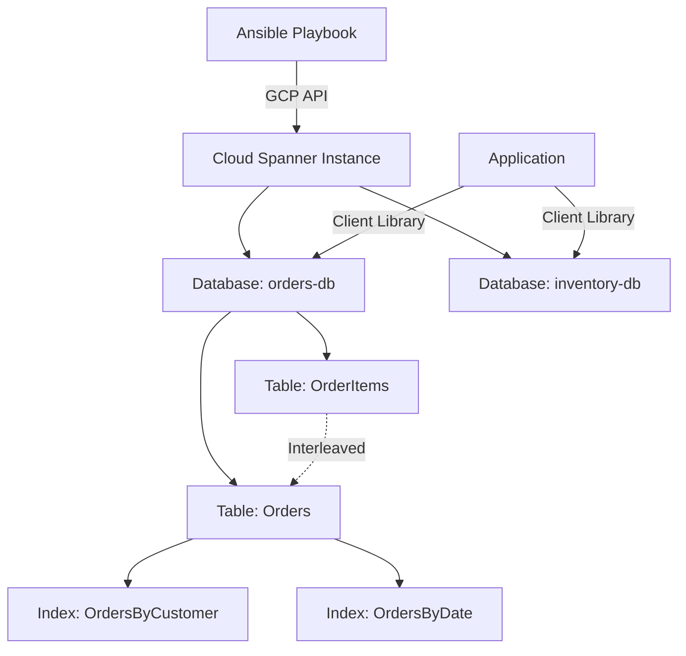

# How to Use Ansible to Create GCP Cloud Spanner Instances

Author: [nawazdhandala](https://www.github.com/nawazdhandala)

Tags: Ansible, GCP, Cloud Spanner, Database, Infrastructure as Code

Description: Learn how to provision and manage GCP Cloud Spanner instances and databases using Ansible playbooks with practical configuration examples.

---

Cloud Spanner is Google's globally distributed, strongly consistent relational database. It is one of the few databases that offers both horizontal scalability and full ACID transactions across regions. It is used by some of the largest applications in the world, and while it comes at a premium price, there are workloads where nothing else will do. In this post, we will automate the provisioning of Cloud Spanner instances and databases using Ansible.

## When to Use Cloud Spanner

Cloud Spanner is not a general-purpose database that you reach for by default. It shines in specific scenarios:

- Applications that need global distribution with strong consistency
- Workloads that have outgrown Cloud SQL's scalability limits
- Financial or inventory systems where distributed transactions are critical
- Applications that need five-nines availability (99.999% SLA for multi-region)

If you just need a PostgreSQL or MySQL database, Cloud SQL is cheaper and simpler. Spanner is for when you need what only Spanner can provide.

## Prerequisites

- Ansible 2.10+ with the `google.cloud` collection
- A GCP service account with Cloud Spanner Admin permissions
- The Cloud Spanner API enabled

```bash
# Install the GCP Ansible collection
ansible-galaxy collection install google.cloud

# Enable the Spanner API
gcloud services enable spanner.googleapis.com --project=my-project-id
```

## Creating a Cloud Spanner Instance

A Spanner instance is the container that holds your databases. You choose the instance configuration (which determines where your data is stored) and the number of processing units or nodes.

```yaml
# create-spanner-instance.yml - Provision a Cloud Spanner instance
---
- name: Create Cloud Spanner Instance
  hosts: localhost
  connection: local
  gather_facts: false

  vars:
    gcp_project: "my-project-id"
    gcp_auth_kind: "serviceaccount"
    gcp_service_account_file: "/path/to/service-account-key.json"

  tasks:
    - name: Create a regional Spanner instance
      google.cloud.gcp_spanner_instance:
        name: "app-spanner-instance"
        display_name: "Application Spanner Instance"
        # Regional config - data stays in one region (cheaper)
        config: "projects/{{ gcp_project }}/instanceConfigs/regional-us-central1"
        # Node count - each node provides ~10,000 QPS reads, ~2,000 QPS writes
        node_count: 1
        labels:
          environment: "production"
          team: "backend"
          managed_by: "ansible"
        project: "{{ gcp_project }}"
        auth_kind: "{{ gcp_auth_kind }}"
        service_account_file: "{{ gcp_service_account_file }}"
        state: present
      register: spanner_instance

    - name: Show instance details
      ansible.builtin.debug:
        msg: |
          Spanner instance created: {{ spanner_instance.name }}
          Display name: {{ spanner_instance.displayName }}
          Node count: {{ spanner_instance.nodeCount }}
          Config: regional-us-central1
```

## Using Processing Units Instead of Nodes

For smaller workloads, you can use processing units instead of full nodes. One node equals 1000 processing units. You can start with as few as 100 processing units.

```yaml
# create-small-spanner.yml - Create a small Spanner instance with processing units
---
- name: Create Small Spanner Instance
  hosts: localhost
  connection: local
  gather_facts: false

  vars:
    gcp_project: "my-project-id"
    gcp_auth_kind: "serviceaccount"
    gcp_service_account_file: "/path/to/service-account-key.json"

  tasks:
    - name: Create Spanner instance with processing units
      google.cloud.gcp_spanner_instance:
        name: "dev-spanner"
        display_name: "Development Spanner Instance"
        config: "projects/{{ gcp_project }}/instanceConfigs/regional-us-central1"
        # Use processing units for fine-grained sizing
        # 100 PU is the minimum, increments of 100 up to 1000
        processing_units: 100
        labels:
          environment: "development"
          managed_by: "ansible"
        project: "{{ gcp_project }}"
        auth_kind: "{{ gcp_auth_kind }}"
        service_account_file: "{{ gcp_service_account_file }}"
        state: present
      register: instance

    - name: Show instance info
      ansible.builtin.debug:
        msg: |
          Instance: {{ instance.name }}
          Processing units: 100
          This is the smallest Spanner configuration available.
```

## Multi-Region Instance

For applications that need global distribution and the highest availability, use a multi-region configuration.

```yaml
# create-multi-region-spanner.yml - Create a globally distributed Spanner instance
---
- name: Create Multi-Region Spanner Instance
  hosts: localhost
  connection: local
  gather_facts: false

  vars:
    gcp_project: "my-project-id"
    gcp_auth_kind: "serviceaccount"
    gcp_service_account_file: "/path/to/service-account-key.json"

  tasks:
    - name: Create multi-region Spanner instance
      google.cloud.gcp_spanner_instance:
        name: "global-spanner"
        display_name: "Global Spanner Instance"
        # nam7 = North America multi-region
        # Other options: nam-eur-asia1, eur6, nam6
        config: "projects/{{ gcp_project }}/instanceConfigs/nam7"
        node_count: 3
        labels:
          environment: "production"
          tier: "critical"
          managed_by: "ansible"
        project: "{{ gcp_project }}"
        auth_kind: "{{ gcp_auth_kind }}"
        service_account_file: "{{ gcp_service_account_file }}"
        state: present
      register: instance

    - name: Show multi-region instance
      ansible.builtin.debug:
        msg: |
          Global Spanner instance: {{ instance.name }}
          Config: nam7 (North America multi-region)
          Nodes: 3
          SLA: 99.999% availability
```

## Creating a Database

After creating the instance, you need to create databases within it. Databases contain the tables where your data actually lives.

```yaml
# create-spanner-database.yml - Create a database in a Spanner instance
---
- name: Create Cloud Spanner Database
  hosts: localhost
  connection: local
  gather_facts: false

  vars:
    gcp_project: "my-project-id"
    gcp_auth_kind: "serviceaccount"
    gcp_service_account_file: "/path/to/service-account-key.json"

  tasks:
    - name: Get the Spanner instance reference
      google.cloud.gcp_spanner_instance:
        name: "app-spanner-instance"
        display_name: "Application Spanner Instance"
        config: "projects/{{ gcp_project }}/instanceConfigs/regional-us-central1"
        node_count: 1
        project: "{{ gcp_project }}"
        auth_kind: "{{ gcp_auth_kind }}"
        service_account_file: "{{ gcp_service_account_file }}"
        state: present
      register: instance

    - name: Create the application database
      google.cloud.gcp_spanner_database:
        name: "orders-db"
        instance: "{{ instance }}"
        # DDL statements to create the initial schema
        extra_statements:
          - |
            CREATE TABLE Orders (
              OrderId STRING(36) NOT NULL,
              CustomerId STRING(36) NOT NULL,
              OrderDate TIMESTAMP NOT NULL,
              TotalAmount FLOAT64 NOT NULL,
              Status STRING(20) NOT NULL,
              CreatedAt TIMESTAMP NOT NULL OPTIONS (allow_commit_timestamp=true)
            ) PRIMARY KEY (OrderId)
          - |
            CREATE TABLE OrderItems (
              OrderId STRING(36) NOT NULL,
              ItemId STRING(36) NOT NULL,
              ProductId STRING(36) NOT NULL,
              Quantity INT64 NOT NULL,
              Price FLOAT64 NOT NULL
            ) PRIMARY KEY (OrderId, ItemId),
              INTERLEAVE IN PARENT Orders ON DELETE CASCADE
          - |
            CREATE INDEX OrdersByCustomer ON Orders(CustomerId)
          - |
            CREATE INDEX OrdersByDate ON Orders(OrderDate DESC)
        project: "{{ gcp_project }}"
        auth_kind: "{{ gcp_auth_kind }}"
        service_account_file: "{{ gcp_service_account_file }}"
        state: present
      register: database

    - name: Show database info
      ansible.builtin.debug:
        msg: |
          Database created: {{ database.name }}
          Instance: app-spanner-instance
          Tables: Orders, OrderItems
          Indexes: OrdersByCustomer, OrdersByDate
```

## Spanner Architecture



## Scaling a Spanner Instance

One of Spanner's strengths is that you can scale up without downtime. Just increase the node count or processing units.

```yaml
# scale-spanner.yml - Scale a Spanner instance up or down
---
- name: Scale Spanner Instance
  hosts: localhost
  connection: local
  gather_facts: false

  vars:
    gcp_project: "my-project-id"
    gcp_auth_kind: "serviceaccount"
    gcp_service_account_file: "/path/to/service-account-key.json"

  tasks:
    - name: Scale up the Spanner instance to 3 nodes
      google.cloud.gcp_spanner_instance:
        name: "app-spanner-instance"
        display_name: "Application Spanner Instance"
        config: "projects/{{ gcp_project }}/instanceConfigs/regional-us-central1"
        # Increase from 1 to 3 nodes for higher throughput
        node_count: 3
        labels:
          environment: "production"
          managed_by: "ansible"
        project: "{{ gcp_project }}"
        auth_kind: "{{ gcp_auth_kind }}"
        service_account_file: "{{ gcp_service_account_file }}"
        state: present

    - name: Scaling complete
      ansible.builtin.debug:
        msg: |
          Instance scaled to 3 nodes.
          Estimated capacity: ~30,000 QPS reads, ~6,000 QPS writes.
          Scaling is online - no downtime required.
```

## Complete Setup Playbook

Here is a playbook that sets up a complete Spanner environment with multiple databases.

```yaml
# complete-spanner-setup.yml - Full Spanner environment setup
---
- name: Complete Spanner Environment Setup
  hosts: localhost
  connection: local
  gather_facts: false

  vars:
    gcp_project: "my-project-id"
    gcp_auth_kind: "serviceaccount"
    gcp_service_account_file: "/path/to/service-account-key.json"
    environment_name: "production"

  tasks:
    - name: Create the Spanner instance
      google.cloud.gcp_spanner_instance:
        name: "{{ environment_name }}-spanner"
        display_name: "{{ environment_name | title }} Spanner Instance"
        config: "projects/{{ gcp_project }}/instanceConfigs/regional-us-central1"
        node_count: 2
        labels:
          environment: "{{ environment_name }}"
          managed_by: "ansible"
        project: "{{ gcp_project }}"
        auth_kind: "{{ gcp_auth_kind }}"
        service_account_file: "{{ gcp_service_account_file }}"
        state: present
      register: instance

    - name: Create the users database
      google.cloud.gcp_spanner_database:
        name: "users-db"
        instance: "{{ instance }}"
        extra_statements:
          - |
            CREATE TABLE Users (
              UserId STRING(36) NOT NULL,
              Email STRING(255) NOT NULL,
              Name STRING(100) NOT NULL,
              CreatedAt TIMESTAMP NOT NULL OPTIONS (allow_commit_timestamp=true)
            ) PRIMARY KEY (UserId)
          - |
            CREATE UNIQUE INDEX UsersByEmail ON Users(Email)
        project: "{{ gcp_project }}"
        auth_kind: "{{ gcp_auth_kind }}"
        service_account_file: "{{ gcp_service_account_file }}"
        state: present

    - name: Create the transactions database
      google.cloud.gcp_spanner_database:
        name: "transactions-db"
        instance: "{{ instance }}"
        extra_statements:
          - |
            CREATE TABLE Transactions (
              TransactionId STRING(36) NOT NULL,
              AccountId STRING(36) NOT NULL,
              Amount FLOAT64 NOT NULL,
              Currency STRING(3) NOT NULL,
              Status STRING(20) NOT NULL,
              Timestamp TIMESTAMP NOT NULL OPTIONS (allow_commit_timestamp=true)
            ) PRIMARY KEY (TransactionId)
          - |
            CREATE INDEX TransactionsByAccount ON Transactions(AccountId, Timestamp DESC)
        project: "{{ gcp_project }}"
        auth_kind: "{{ gcp_auth_kind }}"
        service_account_file: "{{ gcp_service_account_file }}"
        state: present

    - name: Setup complete
      ansible.builtin.debug:
        msg: |
          Spanner environment ready.
          Instance: {{ environment_name }}-spanner (2 nodes)
          Databases: users-db, transactions-db
```

## Cleanup

Be very careful with this. Deleting a Spanner instance destroys all databases and data within it.

```yaml
# cleanup-spanner.yml - Remove Spanner resources
---
- name: Cleanup Spanner Resources
  hosts: localhost
  connection: local
  gather_facts: false

  vars:
    gcp_project: "my-project-id"
    gcp_auth_kind: "serviceaccount"
    gcp_service_account_file: "/path/to/service-account-key.json"

  tasks:
    - name: Delete the Spanner instance and all its databases
      google.cloud.gcp_spanner_instance:
        name: "dev-spanner"
        display_name: "Development Spanner Instance"
        config: "projects/{{ gcp_project }}/instanceConfigs/regional-us-central1"
        project: "{{ gcp_project }}"
        auth_kind: "{{ gcp_auth_kind }}"
        service_account_file: "{{ gcp_service_account_file }}"
        state: absent
```

## Best Practices

1. **Start with processing units for small workloads.** There is no need to pay for a full node (1000 PU) if your workload only needs 100 PU.

2. **Use interleaved tables for parent-child relationships.** Interleaving co-locates child rows with their parent row on the same split, which dramatically reduces the latency of joins.

3. **Design your primary keys carefully.** Avoid sequential keys (like auto-increment integers) because they create hotspots. Use UUIDs or hash-prefixed keys instead.

4. **Monitor CPU utilization.** Spanner recommends keeping CPU utilization below 65% for regional instances and 45% for multi-region instances. Scale up before you hit these thresholds.

5. **Use the right instance configuration.** Regional configs are cheaper and have lower latency for single-region workloads. Multi-region configs are for when you truly need global distribution.

## Conclusion

Cloud Spanner is a powerful but specialized database, and Ansible makes it practical to manage the infrastructure side of Spanner. By defining your instances, databases, and schemas in playbooks, you get repeatable provisioning across environments and a clear audit trail of configuration changes. Whether you are setting up a small development instance with 100 processing units or a globally distributed production instance with multi-region replication, Ansible playbooks give you the consistency and automation you need.
