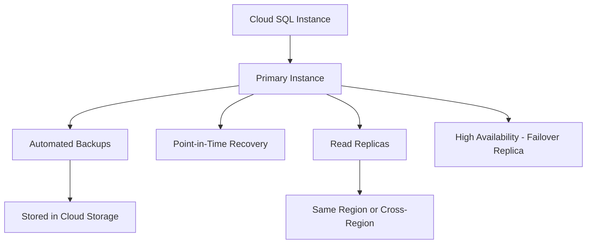

# How to Use Ansible to Create GCP Cloud SQL Instances

Author: [nawazdhandala](https://www.github.com/nawazdhandala)

Tags: Ansible, GCP, Cloud SQL, Database, PostgreSQL

Description: Provision and configure GCP Cloud SQL instances with Ansible including PostgreSQL and MySQL setup, replicas, backups, and private networking.

---

Cloud SQL is GCP's managed relational database service supporting MySQL, PostgreSQL, and SQL Server. It handles patching, backups, replication, and failover so you can focus on your application. But the initial setup still involves a lot of configuration: instance tier, storage, networking, backup schedules, maintenance windows, and database flags. Ansible lets you capture all these settings as code, making it trivial to create consistent database instances across environments.

## Prerequisites

- Ansible 2.9+ with the `google.cloud` collection
- GCP service account with Cloud SQL Admin role
- Cloud SQL Admin API enabled
- Service Networking API enabled (for private IP)

```bash
ansible-galaxy collection install google.cloud
pip install google-auth requests google-api-python-client

# Enable required APIs
gcloud services enable sqladmin.googleapis.com servicenetworking.googleapis.com --project=my-project-123
```

## Cloud SQL Architecture



## Creating a PostgreSQL Instance

Here is a playbook that creates a production-ready PostgreSQL instance:

```yaml
# create-postgres.yml - Create a Cloud SQL PostgreSQL instance
---
- name: Create Cloud SQL PostgreSQL Instance
  hosts: localhost
  connection: local
  gather_facts: false

  vars:
    gcp_project: "my-project-123"
    gcp_cred_kind: "serviceaccount"
    gcp_cred_file: "/opt/ansible/gcp-credentials.json"
    region: "us-central1"

  tasks:
    - name: Create PostgreSQL instance
      google.cloud.gcp_sql_instance:
        name: "prod-postgres-01"
        region: "{{ region }}"
        database_version: "POSTGRES_15"
        settings:
          tier: "db-custom-4-16384"
          ip_configuration:
            ipv4_enabled: false
            private_network: "projects/{{ gcp_project }}/global/networks/production-vpc"
          backup_configuration:
            enabled: true
            start_time: "03:00"
            point_in_time_recovery_enabled: true
            transaction_log_retention_days: 7
            backup_retention_settings:
              retained_backups: 14
              retention_unit: COUNT
          maintenance_window:
            day: 7
            hour: 4
            update_track: stable
          availability_type: REGIONAL
          disk_type: PD_SSD
          disk_size: 100
          disk_autoresize: true
          disk_autoresize_limit: 500
          database_flags:
            - name: max_connections
              value: "200"
            - name: log_min_duration_statement
              value: "1000"
            - name: shared_buffers
              value: "4096"
          user_labels:
            environment: production
            team: backend
            managed_by: ansible
        project: "{{ gcp_project }}"
        auth_kind: "{{ gcp_cred_kind }}"
        service_account_file: "{{ gcp_cred_file }}"
        state: present
      register: sql_instance

    - name: Show instance details
      ansible.builtin.debug:
        msg:
          - "Instance: {{ sql_instance.name }}"
          - "Connection: {{ sql_instance.connectionName }}"
          - "IP: {{ sql_instance.ipAddresses[0].ipAddress | default('pending') }}"
```

Let me walk through the important settings:

- `tier: db-custom-4-16384` creates an instance with 4 vCPUs and 16 GB RAM. You can also use predefined tiers like `db-n1-standard-4`.
- `ipv4_enabled: false` with `private_network` set means the instance only has a private IP within your VPC. This is the recommended setup for production.
- `availability_type: REGIONAL` enables high availability with automatic failover to a standby in a different zone.
- `disk_autoresize: true` with a limit prevents running out of storage without letting costs spiral.
- The `database_flags` section tunes PostgreSQL parameters. `log_min_duration_statement: 1000` logs queries that take longer than 1 second, which is invaluable for performance troubleshooting.

## Creating a MySQL Instance

The module works the same way for MySQL with different version and flags:

```yaml
# create-mysql.yml - Create a Cloud SQL MySQL instance
---
- name: Create Cloud SQL MySQL Instance
  hosts: localhost
  connection: local
  gather_facts: false

  vars:
    gcp_project: "my-project-123"
    gcp_cred_kind: "serviceaccount"
    gcp_cred_file: "/opt/ansible/gcp-credentials.json"

  tasks:
    - name: Create MySQL instance
      google.cloud.gcp_sql_instance:
        name: "prod-mysql-01"
        region: "us-central1"
        database_version: "MYSQL_8_0"
        settings:
          tier: "db-custom-2-8192"
          ip_configuration:
            ipv4_enabled: false
            private_network: "projects/{{ gcp_project }}/global/networks/production-vpc"
          backup_configuration:
            enabled: true
            binary_log_enabled: true
            start_time: "03:00"
          availability_type: REGIONAL
          disk_type: PD_SSD
          disk_size: 50
          disk_autoresize: true
          database_flags:
            - name: slow_query_log
              value: "on"
            - name: long_query_time
              value: "2"
            - name: innodb_buffer_pool_size
              value: "5368709120"
          user_labels:
            environment: production
            engine: mysql
        project: "{{ gcp_project }}"
        auth_kind: "{{ gcp_cred_kind }}"
        service_account_file: "{{ gcp_cred_file }}"
        state: present
```

For MySQL, `binary_log_enabled: true` is required for point-in-time recovery and for creating read replicas.

## Creating a Database and User

After the instance is up, create databases and users:

```yaml
# create-database-and-user.yml - Create a database and user on the instance
---
- name: Create Database and User
  hosts: localhost
  connection: local
  gather_facts: false

  vars:
    gcp_project: "my-project-123"
    gcp_cred_kind: "serviceaccount"
    gcp_cred_file: "/opt/ansible/gcp-credentials.json"
    instance_name: "prod-postgres-01"

  tasks:
    - name: Create the application database
      google.cloud.gcp_sql_database:
        name: "myapp_production"
        charset: "UTF8"
        instance: "{{ instance_name }}"
        project: "{{ gcp_project }}"
        auth_kind: "{{ gcp_cred_kind }}"
        service_account_file: "{{ gcp_cred_file }}"
        state: present

    - name: Create the application database user
      google.cloud.gcp_sql_user:
        name: "app_user"
        password: "{{ vault_db_password }}"
        instance: "{{ instance_name }}"
        host: "%"
        project: "{{ gcp_project }}"
        auth_kind: "{{ gcp_cred_kind }}"
        service_account_file: "{{ gcp_cred_file }}"
        state: present
```

Store the password in Ansible Vault rather than in plaintext. Use `ansible-vault encrypt_string` to create the encrypted variable.

## Creating a Read Replica

For read-heavy workloads, add read replicas:

```yaml
# create-read-replica.yml - Create a read replica of an existing instance
---
- name: Create Read Replica
  hosts: localhost
  connection: local
  gather_facts: false

  vars:
    gcp_project: "my-project-123"
    gcp_cred_kind: "serviceaccount"
    gcp_cred_file: "/opt/ansible/gcp-credentials.json"
    primary_instance: "prod-postgres-01"

  tasks:
    - name: Create read replica
      google.cloud.gcp_sql_instance:
        name: "prod-postgres-01-replica-01"
        region: "us-central1"
        database_version: "POSTGRES_15"
        master_instance_name: "{{ primary_instance }}"
        replica_configuration:
          failover_target: false
        settings:
          tier: "db-custom-2-8192"
          ip_configuration:
            ipv4_enabled: false
            private_network: "projects/{{ gcp_project }}/global/networks/production-vpc"
          disk_type: PD_SSD
          disk_size: 100
          disk_autoresize: true
          user_labels:
            role: read-replica
            primary: "{{ primary_instance }}"
        project: "{{ gcp_project }}"
        auth_kind: "{{ gcp_cred_kind }}"
        service_account_file: "{{ gcp_cred_file }}"
        state: present
      register: replica

    - name: Show replica details
      ansible.builtin.debug:
        msg: "Replica {{ replica.name }} replicating from {{ primary_instance }}"
```

The replica tier can be different from the primary. For analytics workloads that run complex queries, you might use a larger tier for the replica than the primary.

## Complete Database Setup

Putting it all together in a single playbook:

```yaml
# full-db-setup.yml - Complete database infrastructure setup
---
- name: Complete Database Infrastructure
  hosts: localhost
  connection: local
  gather_facts: false

  vars:
    gcp_project: "my-project-123"
    gcp_cred_kind: "serviceaccount"
    gcp_cred_file: "/opt/ansible/gcp-credentials.json"
    region: "us-central1"
    instance_name: "prod-postgres-main"

  tasks:
    - name: Create primary PostgreSQL instance
      google.cloud.gcp_sql_instance:
        name: "{{ instance_name }}"
        region: "{{ region }}"
        database_version: "POSTGRES_15"
        settings:
          tier: "db-custom-4-16384"
          availability_type: REGIONAL
          disk_type: PD_SSD
          disk_size: 100
          disk_autoresize: true
          ip_configuration:
            ipv4_enabled: false
            private_network: "projects/{{ gcp_project }}/global/networks/production-vpc"
          backup_configuration:
            enabled: true
            start_time: "03:00"
            point_in_time_recovery_enabled: true
          user_labels:
            environment: production
        project: "{{ gcp_project }}"
        auth_kind: "{{ gcp_cred_kind }}"
        service_account_file: "{{ gcp_cred_file }}"
        state: present

    - name: Create application database
      google.cloud.gcp_sql_database:
        name: "app_db"
        instance: "{{ instance_name }}"
        project: "{{ gcp_project }}"
        auth_kind: "{{ gcp_cred_kind }}"
        service_account_file: "{{ gcp_cred_file }}"
        state: present

    - name: Create application user
      google.cloud.gcp_sql_user:
        name: "app_user"
        password: "{{ vault_db_password }}"
        instance: "{{ instance_name }}"
        project: "{{ gcp_project }}"
        auth_kind: "{{ gcp_cred_kind }}"
        service_account_file: "{{ gcp_cred_file }}"
        state: present

    - name: Create read replica
      google.cloud.gcp_sql_instance:
        name: "{{ instance_name }}-replica-01"
        region: "{{ region }}"
        database_version: "POSTGRES_15"
        master_instance_name: "{{ instance_name }}"
        settings:
          tier: "db-custom-2-8192"
          disk_type: PD_SSD
          disk_size: 100
          disk_autoresize: true
          ip_configuration:
            ipv4_enabled: false
            private_network: "projects/{{ gcp_project }}/global/networks/production-vpc"
          user_labels:
            role: read-replica
        project: "{{ gcp_project }}"
        auth_kind: "{{ gcp_cred_kind }}"
        service_account_file: "{{ gcp_cred_file }}"
        state: present
```

## Deleting Instances

```yaml
# delete-sql-instance.yml - Remove a Cloud SQL instance
---
- name: Delete Cloud SQL Instance
  hosts: localhost
  connection: local
  gather_facts: false

  vars:
    gcp_project: "my-project-123"
    gcp_cred_kind: "serviceaccount"
    gcp_cred_file: "/opt/ansible/gcp-credentials.json"

  tasks:
    - name: Delete replicas first
      google.cloud.gcp_sql_instance:
        name: "staging-postgres-replica-01"
        project: "{{ gcp_project }}"
        auth_kind: "{{ gcp_cred_kind }}"
        service_account_file: "{{ gcp_cred_file }}"
        state: absent

    - name: Delete the primary instance
      google.cloud.gcp_sql_instance:
        name: "staging-postgres-01"
        project: "{{ gcp_project }}"
        auth_kind: "{{ gcp_cred_kind }}"
        service_account_file: "{{ gcp_cred_file }}"
        state: absent
```

Always delete replicas before deleting the primary instance, or the deletion will fail.

## Summary

Cloud SQL management with Ansible gives you reproducible database infrastructure across all your environments. The most important configuration decisions are: choose the right tier based on your workload, enable high availability for production, use private IP networking to keep database traffic off the public internet, configure automated backups with point-in-time recovery, and tune database flags based on your application's needs. Having all of this in a playbook means spinning up a new environment with a fully configured database is a single command.
