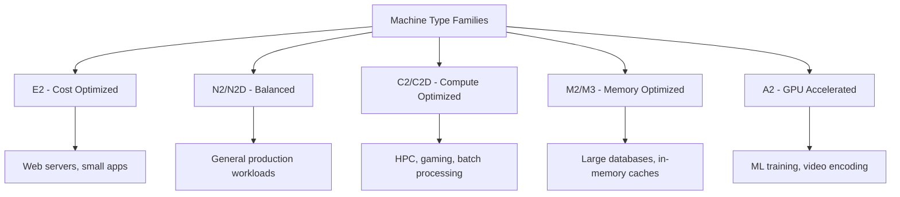

# How to Use Ansible to Create GCP Compute Instances

Author: [nawazdhandala](https://www.github.com/nawazdhandala)

Tags: Ansible, GCP, Compute Engine, Virtual Machines, Cloud Automation

Description: Create and manage Google Cloud Compute Engine instances with Ansible including machine types, disks, networking, and startup scripts.

---

Compute Engine is the backbone of GCP's infrastructure. Whether you are running a simple web server or a complex distributed system, it starts with creating virtual machines. Doing this through the console is fine for experimentation, but production infrastructure needs to be repeatable. Ansible's `google.cloud` collection provides modules for the full lifecycle of Compute Engine instances, from creation to deletion.

## Prerequisites

- Ansible 2.9+ with the `google.cloud` collection
- GCP service account with Compute Admin role
- A GCP project with Compute Engine API enabled

```bash
# Install the GCP collection and dependencies
ansible-galaxy collection install google.cloud
pip install google-auth requests google-api-python-client
```

Enable the Compute Engine API if you have not already:

```bash
# Enable the Compute Engine API
gcloud services enable compute.googleapis.com --project=my-project-123
```

## Creating a Basic Instance

The `google.cloud.gcp_compute_instance` module handles VM creation:

```yaml
# create-instance.yml - Create a basic Compute Engine instance
---
- name: Create GCP Compute Instance
  hosts: localhost
  connection: local
  gather_facts: false

  vars:
    gcp_project: "my-project-123"
    gcp_cred_kind: "serviceaccount"
    gcp_cred_file: "/opt/ansible/gcp-credentials.json"
    zone: "us-central1-a"

  tasks:
    - name: Create a simple Compute Engine VM
      google.cloud.gcp_compute_instance:
        name: "web-server-01"
        machine_type: "e2-medium"
        zone: "{{ zone }}"
        project: "{{ gcp_project }}"
        auth_kind: "{{ gcp_cred_kind }}"
        service_account_file: "{{ gcp_cred_file }}"
        disks:
          - auto_delete: true
            boot: true
            initialize_params:
              source_image: "projects/debian-cloud/global/images/family/debian-12"
              disk_size_gb: 20
              disk_type: "pd-balanced"
        network_interfaces:
          - network:
              selfLink: "global/networks/default"
            access_configs:
              - name: "External NAT"
                type: "ONE_TO_ONE_NAT"
        labels:
          environment: production
          team: platform
          managed_by: ansible
        state: present
      register: instance

    - name: Show instance details
      ansible.builtin.debug:
        msg: "Instance {{ instance.name }} created at {{ instance.networkInterfaces[0].networkIP }}"
```

A few things to note about this playbook. The `disks` parameter takes a list because an instance can have multiple disks. The first one with `boot: true` is the boot disk. The `access_configs` section under `network_interfaces` gives the instance a public IP. If you remove that section, the instance only gets a private IP.

## Machine Type Selection

GCP has a wide variety of machine types for different workloads:



You can also use custom machine types:

```yaml
# Custom machine type with specific vCPU and memory
- name: Create instance with custom machine type
  google.cloud.gcp_compute_instance:
    name: "custom-instance"
    machine_type: "custom-4-16384"
    zone: "us-central1-a"
    project: "{{ gcp_project }}"
    auth_kind: "{{ gcp_cred_kind }}"
    service_account_file: "{{ gcp_cred_file }}"
    disks:
      - auto_delete: true
        boot: true
        initialize_params:
          source_image: "projects/ubuntu-os-cloud/global/images/family/ubuntu-2204-lts"
    network_interfaces:
      - network:
              selfLink: "global/networks/default"
    state: present
```

The `custom-4-16384` notation means 4 vCPUs and 16384 MB (16 GB) of memory.

## Creating an Instance with a Startup Script

Startup scripts run when the instance first boots, letting you install software and configure the system:

```yaml
# create-with-startup.yml - Instance with a startup script for initial configuration
---
- name: Create Instance with Startup Script
  hosts: localhost
  connection: local
  gather_facts: false

  vars:
    gcp_project: "my-project-123"
    gcp_cred_kind: "serviceaccount"
    gcp_cred_file: "/opt/ansible/gcp-credentials.json"

  tasks:
    - name: Create web server with Nginx startup script
      google.cloud.gcp_compute_instance:
        name: "nginx-server"
        machine_type: "e2-small"
        zone: "us-central1-a"
        project: "{{ gcp_project }}"
        auth_kind: "{{ gcp_cred_kind }}"
        service_account_file: "{{ gcp_cred_file }}"
        disks:
          - auto_delete: true
            boot: true
            initialize_params:
              source_image: "projects/debian-cloud/global/images/family/debian-12"
              disk_size_gb: 20
        network_interfaces:
          - network:
              selfLink: "global/networks/default"
            access_configs:
              - name: "External NAT"
                type: "ONE_TO_ONE_NAT"
        metadata:
          startup-script: |
            #!/bin/bash
            apt-get update
            apt-get install -y nginx
            systemctl enable nginx
            systemctl start nginx
            echo "Managed by Ansible - $(hostname)" > /var/www/html/index.html
        tags:
          items:
            - http-server
            - https-server
        labels:
          role: webserver
          environment: production
        state: present
      register: web_instance

    - name: Show the public IP
      ansible.builtin.debug:
        msg: "Nginx running at http://{{ web_instance.networkInterfaces[0].accessConfigs[0].natIP }}"
```

The `tags.items` field adds network tags to the instance, which are used by firewall rules to target specific instances. The `http-server` and `https-server` tags are commonly used with default GCP firewall rules that allow inbound traffic on ports 80 and 443.

## Creating an Instance with Additional Disks

For workloads that need separate data storage:

```yaml
# create-with-extra-disks.yml - Instance with boot disk plus additional data disk
---
- name: Create Instance with Multiple Disks
  hosts: localhost
  connection: local
  gather_facts: false

  vars:
    gcp_project: "my-project-123"
    gcp_cred_kind: "serviceaccount"
    gcp_cred_file: "/opt/ansible/gcp-credentials.json"
    zone: "us-central1-a"

  tasks:
    - name: Create a persistent data disk first
      google.cloud.gcp_compute_disk:
        name: "db-data-disk"
        size_gb: 200
        type: "pd-ssd"
        zone: "{{ zone }}"
        project: "{{ gcp_project }}"
        auth_kind: "{{ gcp_cred_kind }}"
        service_account_file: "{{ gcp_cred_file }}"
        labels:
          purpose: database-storage
        state: present
      register: data_disk

    - name: Create database instance with boot and data disks
      google.cloud.gcp_compute_instance:
        name: "db-server-01"
        machine_type: "n2-standard-4"
        zone: "{{ zone }}"
        project: "{{ gcp_project }}"
        auth_kind: "{{ gcp_cred_kind }}"
        service_account_file: "{{ gcp_cred_file }}"
        disks:
          - auto_delete: true
            boot: true
            initialize_params:
              source_image: "projects/debian-cloud/global/images/family/debian-12"
              disk_size_gb: 20
              disk_type: "pd-balanced"
          - auto_delete: false
            boot: false
            source: "{{ data_disk }}"
        network_interfaces:
          - network:
              selfLink: "global/networks/default"
        labels:
          role: database
          environment: production
        state: present
      register: db_instance

    - name: Show database instance info
      ansible.builtin.debug:
        msg: "DB instance {{ db_instance.name }} created with 200GB SSD data disk"
```

Note that `auto_delete: false` on the data disk means the disk persists even if the instance is deleted. This is what you want for database storage.

## Creating Multiple Instances

Deploying a fleet of instances for a web tier:

```yaml
# create-fleet.yml - Create multiple instances for a web tier
---
- name: Create Web Server Fleet
  hosts: localhost
  connection: local
  gather_facts: false

  vars:
    gcp_project: "my-project-123"
    gcp_cred_kind: "serviceaccount"
    gcp_cred_file: "/opt/ansible/gcp-credentials.json"
    instances:
      - name: "web-01"
        zone: "us-central1-a"
      - name: "web-02"
        zone: "us-central1-b"
      - name: "web-03"
        zone: "us-central1-c"

  tasks:
    - name: Create each web server instance
      google.cloud.gcp_compute_instance:
        name: "{{ item.name }}"
        machine_type: "e2-medium"
        zone: "{{ item.zone }}"
        project: "{{ gcp_project }}"
        auth_kind: "{{ gcp_cred_kind }}"
        service_account_file: "{{ gcp_cred_file }}"
        disks:
          - auto_delete: true
            boot: true
            initialize_params:
              source_image: "projects/debian-cloud/global/images/family/debian-12"
              disk_size_gb: 20
        network_interfaces:
          - network:
              selfLink: "global/networks/default"
            access_configs:
              - name: "External NAT"
                type: "ONE_TO_ONE_NAT"
        tags:
          items:
            - http-server
            - web-tier
        labels:
          role: webserver
          fleet: web-tier
          environment: production
        state: present
      loop: "{{ instances }}"
      register: fleet_results

    - name: Show created instances
      ansible.builtin.debug:
        msg: "{{ item.name }} ({{ item.zone }}): {{ item.networkInterfaces[0].accessConfigs[0].natIP }}"
      loop: "{{ fleet_results.results | map(attribute='invocation') | list }}"
```

## Stopping and Starting Instances

For cost savings, stop instances that are not needed outside business hours:

```yaml
# manage-instance-state.yml - Stop and start instances
---
- name: Manage Instance State
  hosts: localhost
  connection: local
  gather_facts: false

  vars:
    gcp_project: "my-project-123"
    gcp_cred_kind: "serviceaccount"
    gcp_cred_file: "/opt/ansible/gcp-credentials.json"
    zone: "us-central1-a"

  tasks:
    - name: Stop a development instance to save costs
      google.cloud.gcp_compute_instance:
        name: "dev-server"
        zone: "{{ zone }}"
        project: "{{ gcp_project }}"
        auth_kind: "{{ gcp_cred_kind }}"
        service_account_file: "{{ gcp_cred_file }}"
        status: TERMINATED
        state: present
```

## Deleting Instances

```yaml
# delete-instance.yml - Remove a Compute Engine instance
---
- name: Delete Instance
  hosts: localhost
  connection: local
  gather_facts: false

  vars:
    gcp_project: "my-project-123"
    gcp_cred_kind: "serviceaccount"
    gcp_cred_file: "/opt/ansible/gcp-credentials.json"

  tasks:
    - name: Delete the instance
      google.cloud.gcp_compute_instance:
        name: "old-server"
        zone: "us-central1-a"
        project: "{{ gcp_project }}"
        auth_kind: "{{ gcp_cred_kind }}"
        service_account_file: "{{ gcp_cred_file }}"
        state: absent
      register: delete_result

    - name: Confirm deletion
      ansible.builtin.debug:
        msg: "Instance deleted successfully"
```

## Summary

Managing GCP Compute Engine instances with Ansible gives you repeatable, version-controlled infrastructure provisioning. The `gcp_compute_instance` module covers the full lifecycle from creation through state management to deletion. Key considerations include choosing the right machine type family for your workload, separating data disks from boot disks for persistence, using network tags for firewall rule targeting, and applying consistent labels for cost tracking and organization. With these patterns in place, spinning up new environments or scaling your infrastructure becomes a single playbook run.
