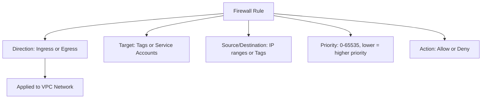

# How to Use Ansible to Create GCP Firewall Rules

Author: [nawazdhandala](https://www.github.com/nawazdhandala)

Tags: Ansible, GCP, Firewall, Security, Networking

Description: Create and manage GCP firewall rules with Ansible for controlling traffic to Compute Engine instances using tags and service accounts.

---

GCP firewall rules control which network traffic can reach your instances and which traffic your instances can send out. They are stateful, meaning if you allow inbound traffic, the corresponding outbound response is automatically permitted. Unlike traditional firewalls that apply to network segments, GCP firewall rules are applied to individual instances based on network tags or service accounts. Ansible makes managing these rules straightforward, especially when you need consistent security policies across multiple projects.

## How GCP Firewall Rules Work



Every VPC network has two implied rules that you cannot delete: a default deny-all ingress rule (priority 65535) and a default allow-all egress rule (priority 65535). Your custom rules override these based on priority.

## Prerequisites

- Ansible 2.9+ with the `google.cloud` collection
- GCP service account with Compute Security Admin role
- An existing VPC network

```bash
ansible-galaxy collection install google.cloud
pip install google-auth requests google-api-python-client
```

## Creating Basic Firewall Rules

Here is a rule that allows SSH access from a specific IP range:

```yaml
# create-ssh-rule.yml - Allow SSH from a trusted IP range
---
- name: Create SSH Firewall Rule
  hosts: localhost
  connection: local
  gather_facts: false

  vars:
    gcp_project: "my-project-123"
    gcp_cred_kind: "serviceaccount"
    gcp_cred_file: "/opt/ansible/gcp-credentials.json"

  tasks:
    - name: Allow SSH from office network
      google.cloud.gcp_compute_firewall:
        name: "allow-ssh-from-office"
        network:
          selfLink: "global/networks/production-vpc"
        direction: INGRESS
        priority: 1000
        source_ranges:
          - "203.0.113.0/24"
        allowed:
          - ip_protocol: tcp
            ports:
              - "22"
        target_tags:
          - ssh-allowed
        description: "Allow SSH from office network to tagged instances"
        project: "{{ gcp_project }}"
        auth_kind: "{{ gcp_cred_kind }}"
        service_account_file: "{{ gcp_cred_file }}"
        state: present
      register: ssh_rule

    - name: Show rule details
      ansible.builtin.debug:
        msg: "Firewall rule '{{ ssh_rule.name }}' created with priority {{ ssh_rule.priority }}"
```

The `target_tags` field means this rule only applies to instances that have the `ssh-allowed` network tag. If you omit `target_tags`, the rule applies to all instances in the network.

## Creating Web Server Firewall Rules

For web servers that need HTTP and HTTPS traffic:

```yaml
# create-web-rules.yml - Allow HTTP and HTTPS traffic to web servers
---
- name: Create Web Server Firewall Rules
  hosts: localhost
  connection: local
  gather_facts: false

  vars:
    gcp_project: "my-project-123"
    gcp_cred_kind: "serviceaccount"
    gcp_cred_file: "/opt/ansible/gcp-credentials.json"

  tasks:
    - name: Allow HTTP traffic to web servers
      google.cloud.gcp_compute_firewall:
        name: "allow-http"
        network:
          selfLink: "global/networks/production-vpc"
        direction: INGRESS
        priority: 1000
        source_ranges:
          - "0.0.0.0/0"
        allowed:
          - ip_protocol: tcp
            ports:
              - "80"
        target_tags:
          - http-server
        description: "Allow HTTP from anywhere to instances tagged http-server"
        project: "{{ gcp_project }}"
        auth_kind: "{{ gcp_cred_kind }}"
        service_account_file: "{{ gcp_cred_file }}"
        state: present

    - name: Allow HTTPS traffic to web servers
      google.cloud.gcp_compute_firewall:
        name: "allow-https"
        network:
          selfLink: "global/networks/production-vpc"
        direction: INGRESS
        priority: 1000
        source_ranges:
          - "0.0.0.0/0"
        allowed:
          - ip_protocol: tcp
            ports:
              - "443"
        target_tags:
          - https-server
        description: "Allow HTTPS from anywhere to instances tagged https-server"
        project: "{{ gcp_project }}"
        auth_kind: "{{ gcp_cred_kind }}"
        service_account_file: "{{ gcp_cred_file }}"
        state: present
```

## Internal Communication Rules

Allow instances to communicate with each other within the VPC:

```yaml
# create-internal-rules.yml - Allow internal traffic between instance groups
---
- name: Create Internal Firewall Rules
  hosts: localhost
  connection: local
  gather_facts: false

  vars:
    gcp_project: "my-project-123"
    gcp_cred_kind: "serviceaccount"
    gcp_cred_file: "/opt/ansible/gcp-credentials.json"
    vpc_cidr: "10.0.0.0/16"

  tasks:
    - name: Allow all internal traffic within the VPC
      google.cloud.gcp_compute_firewall:
        name: "allow-internal"
        network:
          selfLink: "global/networks/production-vpc"
        direction: INGRESS
        priority: 1000
        source_ranges:
          - "{{ vpc_cidr }}"
        allowed:
          - ip_protocol: tcp
            ports:
              - "0-65535"
          - ip_protocol: udp
            ports:
              - "0-65535"
          - ip_protocol: icmp
        description: "Allow all internal traffic within VPC CIDR"
        project: "{{ gcp_project }}"
        auth_kind: "{{ gcp_cred_kind }}"
        service_account_file: "{{ gcp_cred_file }}"
        state: present

    - name: Allow web servers to reach database servers
      google.cloud.gcp_compute_firewall:
        name: "allow-web-to-db"
        network:
          selfLink: "global/networks/production-vpc"
        direction: INGRESS
        priority: 900
        source_tags:
          - web-tier
        allowed:
          - ip_protocol: tcp
            ports:
              - "5432"
              - "3306"
        target_tags:
          - db-tier
        description: "Allow PostgreSQL and MySQL from web tier to database tier"
        project: "{{ gcp_project }}"
        auth_kind: "{{ gcp_cred_kind }}"
        service_account_file: "{{ gcp_cred_file }}"
        state: present
```

Using `source_tags` instead of `source_ranges` is a powerful pattern. It means "allow traffic from any instance tagged `web-tier`" regardless of their IP address. This is more resilient than IP-based rules because you do not need to update firewall rules when instances change IP addresses.

## Creating a Complete Security Policy

Let me show a playbook that sets up a full set of firewall rules for a typical three-tier application:

```yaml
# complete-firewall-policy.yml - Full firewall policy for a three-tier architecture
---
- name: Complete Firewall Policy
  hosts: localhost
  connection: local
  gather_facts: false

  vars:
    gcp_project: "my-project-123"
    gcp_cred_kind: "serviceaccount"
    gcp_cred_file: "/opt/ansible/gcp-credentials.json"
    vpc_network: "global/networks/production-vpc"
    office_cidr: "203.0.113.0/24"
    health_check_ranges:
      - "130.211.0.0/22"
      - "35.191.0.0/16"

    firewall_rules:
      # SSH access from office
      - name: "fw-allow-ssh-office"
        priority: 1000
        source_ranges: ["{{ office_cidr }}"]
        allowed:
          - ip_protocol: tcp
            ports: ["22"]
        target_tags: ["ssh-allowed"]
        description: "SSH from office"

      # Health check probes from GCP load balancers
      - name: "fw-allow-health-checks"
        priority: 900
        source_ranges: "{{ health_check_ranges }}"
        allowed:
          - ip_protocol: tcp
            ports: ["80", "443", "8080"]
        target_tags: ["lb-backend"]
        description: "Health checks from GCP load balancer ranges"

      # HTTPS from internet to load balancer backends
      - name: "fw-allow-https-internet"
        priority: 1000
        source_ranges: ["0.0.0.0/0"]
        allowed:
          - ip_protocol: tcp
            ports: ["443"]
        target_tags: ["https-server"]
        description: "HTTPS from internet"

      # Web tier to app tier
      - name: "fw-allow-web-to-app"
        priority: 1000
        source_tags: ["web-tier"]
        allowed:
          - ip_protocol: tcp
            ports: ["8080", "8443"]
        target_tags: ["app-tier"]
        description: "Web to app tier on ports 8080 and 8443"

      # App tier to database tier
      - name: "fw-allow-app-to-db"
        priority: 1000
        source_tags: ["app-tier"]
        allowed:
          - ip_protocol: tcp
            ports: ["5432"]
        target_tags: ["db-tier"]
        description: "App to database on PostgreSQL port"

      # ICMP for troubleshooting within VPC
      - name: "fw-allow-icmp-internal"
        priority: 1000
        source_ranges: ["10.0.0.0/16"]
        allowed:
          - ip_protocol: icmp
        description: "ICMP within VPC for troubleshooting"

  tasks:
    - name: Create each firewall rule
      google.cloud.gcp_compute_firewall:
        name: "{{ item.name }}"
        network:
          selfLink: "{{ vpc_network }}"
        direction: INGRESS
        priority: "{{ item.priority }}"
        source_ranges: "{{ item.source_ranges | default(omit) }}"
        source_tags: "{{ item.source_tags | default(omit) }}"
        allowed: "{{ item.allowed }}"
        target_tags: "{{ item.target_tags | default(omit) }}"
        description: "{{ item.description }}"
        project: "{{ gcp_project }}"
        auth_kind: "{{ gcp_cred_kind }}"
        service_account_file: "{{ gcp_cred_file }}"
        state: present
      loop: "{{ firewall_rules }}"
      register: rule_results

    - name: Summary
      ansible.builtin.debug:
        msg: "Created {{ rule_results.results | length }} firewall rules"
```

The health check source ranges (`130.211.0.0/22` and `35.191.0.0/16`) are Google's documented IP ranges for load balancer health checks. If you use GCP load balancers, you must allow traffic from these ranges or your backends will be marked unhealthy.

## Creating Deny Rules

Sometimes you need to explicitly block traffic:

```yaml
# create-deny-rule.yml - Block traffic from known bad sources
---
- name: Create Deny Firewall Rules
  hosts: localhost
  connection: local
  gather_facts: false

  vars:
    gcp_project: "my-project-123"
    gcp_cred_kind: "serviceaccount"
    gcp_cred_file: "/opt/ansible/gcp-credentials.json"

  tasks:
    - name: Block traffic from known malicious ranges
      google.cloud.gcp_compute_firewall:
        name: "fw-deny-blocklist"
        network:
          selfLink: "global/networks/production-vpc"
        direction: INGRESS
        priority: 500
        source_ranges:
          - "198.51.100.0/24"
          - "192.0.2.0/24"
        denied:
          - ip_protocol: all
        description: "Block known malicious IP ranges"
        project: "{{ gcp_project }}"
        auth_kind: "{{ gcp_cred_kind }}"
        service_account_file: "{{ gcp_cred_file }}"
        state: present
```

Deny rules use the `denied` field instead of `allowed`. Priority matters here. A deny rule with priority 500 takes effect before an allow rule with priority 1000. Lower numbers mean higher priority.

## Deleting Firewall Rules

Clean up rules that are no longer needed:

```yaml
# delete-firewall-rules.yml - Remove deprecated firewall rules
---
- name: Delete Firewall Rules
  hosts: localhost
  connection: local
  gather_facts: false

  vars:
    gcp_project: "my-project-123"
    gcp_cred_kind: "serviceaccount"
    gcp_cred_file: "/opt/ansible/gcp-credentials.json"
    rules_to_delete:
      - "old-allow-http"
      - "temp-debug-rule"
      - "legacy-ssh-allow"

  tasks:
    - name: Remove deprecated firewall rules
      google.cloud.gcp_compute_firewall:
        name: "{{ item }}"
        network:
          selfLink: "global/networks/production-vpc"
        project: "{{ gcp_project }}"
        auth_kind: "{{ gcp_cred_kind }}"
        service_account_file: "{{ gcp_cred_file }}"
        state: absent
      loop: "{{ rules_to_delete }}"
```

## Summary

GCP firewall rules managed through Ansible give you a version-controlled, auditable security posture. The most important design patterns are: use network tags for targeting instead of IP addresses whenever possible, set appropriate priorities to control rule evaluation order, include health check ranges for load-balanced services, and follow the principle of least privilege by only opening the specific ports your application needs. Storing your firewall rules as Ansible playbooks means every security change is tracked in git, reviewed in pull requests, and applied consistently.
