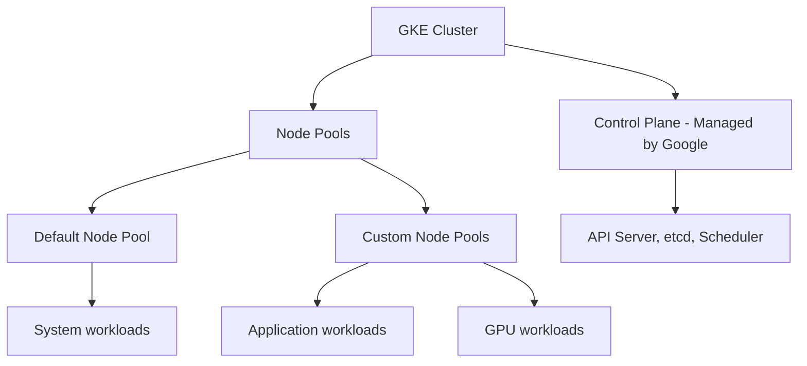

# How to Use Ansible to Create GCP GKE Clusters

Author: [nawazdhandala](https://www.github.com/nawazdhandala)

Tags: Ansible, GCP, GKE, Kubernetes, Container Orchestration

Description: Provision and configure Google Kubernetes Engine clusters with Ansible including node pools, networking, security settings, and auto-scaling.

---

Google Kubernetes Engine (GKE) is one of the most mature managed Kubernetes offerings available. It handles the control plane, node upgrades, and cluster networking so you can focus on deploying workloads. But creating a production-grade GKE cluster involves dozens of configuration decisions: networking mode, node pool sizing, auto-scaling parameters, security settings, and maintenance windows. Ansible lets you capture all of these decisions in code and create identical clusters across environments.

## Prerequisites

- Ansible 2.9+ with the `google.cloud` collection
- GCP service account with Kubernetes Engine Admin role
- Container API enabled
- A VPC network with subnets configured (including secondary ranges for pods and services)

```bash
ansible-galaxy collection install google.cloud
pip install google-auth requests google-api-python-client

gcloud services enable container.googleapis.com --project=my-project-123
```

## GKE Cluster Architecture



## Creating a Basic GKE Cluster

Here is a VPC-native cluster with reasonable production defaults:

```yaml
# create-gke-cluster.yml - Create a production-ready GKE cluster
---
- name: Create GKE Cluster
  hosts: localhost
  connection: local
  gather_facts: false

  vars:
    gcp_project: "my-project-123"
    gcp_cred_kind: "serviceaccount"
    gcp_cred_file: "/opt/ansible/gcp-credentials.json"
    region: "us-central1"
    cluster_name: "prod-cluster"

  tasks:
    - name: Create the GKE cluster
      google.cloud.gcp_container_cluster:
        name: "{{ cluster_name }}"
        location: "{{ region }}"
        initial_node_count: 1
        network: "projects/{{ gcp_project }}/global/networks/production-vpc"
        subnetwork: "projects/{{ gcp_project }}/regions/{{ region }}/subnetworks/gke-subnet"
        ip_allocation_policy:
          cluster_secondary_range_name: "gke-pods"
          services_secondary_range_name: "gke-services"
        master_auth:
          client_certificate_config:
            issue_client_certificate: false
        addons_config:
          http_load_balancing:
            disabled: false
          horizontal_pod_autoscaling:
            disabled: false
          network_policy_config:
            disabled: false
        network_policy:
          enabled: true
          provider: CALICO
        logging_service: "logging.googleapis.com/kubernetes"
        monitoring_service: "monitoring.googleapis.com/kubernetes"
        resource_labels:
          environment: production
          team: platform
          managed_by: ansible
        maintenance_policy:
          window:
            daily_maintenance_window:
              start_time: "03:00"
        project: "{{ gcp_project }}"
        auth_kind: "{{ gcp_cred_kind }}"
        service_account_file: "{{ gcp_cred_file }}"
        state: present
      register: cluster

    - name: Show cluster details
      ansible.builtin.debug:
        msg:
          - "Cluster: {{ cluster.name }}"
          - "Endpoint: {{ cluster.endpoint }}"
          - "Location: {{ cluster.location }}"
```

Let me explain the key configuration choices:

- `location` is set to a region (not a zone), which creates a regional cluster with the control plane replicated across three zones. This is required for production.
- `ip_allocation_policy` enables VPC-native networking, where pods get IPs from the subnet's secondary range. This is required for private clusters and recommended for all clusters.
- `network_policy` with Calico enables Kubernetes NetworkPolicy resources, giving you fine-grained control over pod-to-pod traffic.
- `issue_client_certificate: false` disables legacy certificate-based authentication. Use `gcloud` or OIDC instead.

## Creating a Private Cluster

For production, you typically want the cluster nodes and potentially the control plane on private IPs only:

```yaml
# create-private-cluster.yml - Private GKE cluster with restricted access
---
- name: Create Private GKE Cluster
  hosts: localhost
  connection: local
  gather_facts: false

  vars:
    gcp_project: "my-project-123"
    gcp_cred_kind: "serviceaccount"
    gcp_cred_file: "/opt/ansible/gcp-credentials.json"
    region: "us-central1"

  tasks:
    - name: Create private GKE cluster
      google.cloud.gcp_container_cluster:
        name: "prod-private-cluster"
        location: "{{ region }}"
        initial_node_count: 1
        network: "projects/{{ gcp_project }}/global/networks/production-vpc"
        subnetwork: "projects/{{ gcp_project }}/regions/{{ region }}/subnetworks/gke-subnet"
        ip_allocation_policy:
          cluster_secondary_range_name: "gke-pods"
          services_secondary_range_name: "gke-services"
        private_cluster_config:
          enable_private_nodes: true
          enable_private_endpoint: false
          master_ipv4_cidr_block: "172.16.0.0/28"
        master_authorized_networks_config:
          enabled: true
          cidr_blocks:
            - display_name: "Office Network"
              cidr_block: "203.0.113.0/24"
            - display_name: "VPN"
              cidr_block: "10.10.0.0/16"
        master_auth:
          client_certificate_config:
            issue_client_certificate: false
        addons_config:
          http_load_balancing:
            disabled: false
          horizontal_pod_autoscaling:
            disabled: false
        logging_service: "logging.googleapis.com/kubernetes"
        monitoring_service: "monitoring.googleapis.com/kubernetes"
        resource_labels:
          environment: production
          cluster_type: private
        project: "{{ gcp_project }}"
        auth_kind: "{{ gcp_cred_kind }}"
        service_account_file: "{{ gcp_cred_file }}"
        state: present
      register: private_cluster

    - name: Show private cluster info
      ansible.builtin.debug:
        msg:
          - "Private cluster: {{ private_cluster.name }}"
          - "Master endpoint: {{ private_cluster.endpoint }}"
```

`enable_private_nodes: true` ensures nodes only get internal IPs. `enable_private_endpoint: false` keeps the Kubernetes API server accessible from authorized external networks (you could set it to true if you only access the cluster from within the VPC). The `master_authorized_networks_config` restricts which IP ranges can reach the API server.

## Creating Node Pools

The initial cluster comes with a default node pool. For production, you typically want separate node pools for different workload types:

```yaml
# create-node-pools.yml - Add custom node pools to an existing cluster
---
- name: Create GKE Node Pools
  hosts: localhost
  connection: local
  gather_facts: false

  vars:
    gcp_project: "my-project-123"
    gcp_cred_kind: "serviceaccount"
    gcp_cred_file: "/opt/ansible/gcp-credentials.json"
    cluster_name: "prod-cluster"
    region: "us-central1"

  tasks:
    - name: Create application node pool
      google.cloud.gcp_container_node_pool:
        name: "app-pool"
        cluster:
          name: "{{ cluster_name }}"
          location: "{{ region }}"
        location: "{{ region }}"
        initial_node_count: 2
        autoscaling:
          enabled: true
          min_node_count: 2
          max_node_count: 20
        config:
          machine_type: "e2-standard-4"
          disk_size_gb: 100
          disk_type: "pd-balanced"
          oauth_scopes:
            - "https://www.googleapis.com/auth/cloud-platform"
          labels:
            pool: application
          tags:
            - gke-app-node
        management:
          auto_repair: true
          auto_upgrade: true
        project: "{{ gcp_project }}"
        auth_kind: "{{ gcp_cred_kind }}"
        service_account_file: "{{ gcp_cred_file }}"
        state: present

    - name: Create high-memory node pool for databases
      google.cloud.gcp_container_node_pool:
        name: "db-pool"
        cluster:
          name: "{{ cluster_name }}"
          location: "{{ region }}"
        location: "{{ region }}"
        initial_node_count: 1
        autoscaling:
          enabled: true
          min_node_count: 1
          max_node_count: 5
        config:
          machine_type: "n2-highmem-4"
          disk_size_gb: 200
          disk_type: "pd-ssd"
          oauth_scopes:
            - "https://www.googleapis.com/auth/cloud-platform"
          labels:
            pool: database
          taints:
            - key: dedicated
              value: database
              effect: NO_SCHEDULE
        management:
          auto_repair: true
          auto_upgrade: true
        project: "{{ gcp_project }}"
        auth_kind: "{{ gcp_cred_kind }}"
        service_account_file: "{{ gcp_cred_file }}"
        state: present
```

The database node pool uses a taint (`dedicated=database:NoSchedule`) which prevents regular pods from being scheduled on these nodes. Only pods with a matching toleration will run here, ensuring your database workloads get dedicated resources.

## Configuring kubectl Access

After creating the cluster, configure kubectl:

```yaml
# configure-kubectl.yml - Set up kubectl access to the new cluster
---
- name: Configure kubectl
  hosts: localhost
  connection: local
  gather_facts: false

  vars:
    gcp_project: "my-project-123"
    cluster_name: "prod-cluster"
    region: "us-central1"

  tasks:
    - name: Get cluster credentials
      ansible.builtin.command: >
        gcloud container clusters get-credentials {{ cluster_name }}
        --region={{ region }}
        --project={{ gcp_project }}
      changed_when: true

    - name: Verify cluster access
      ansible.builtin.command: kubectl get nodes
      register: nodes
      changed_when: false

    - name: Show cluster nodes
      ansible.builtin.debug:
        var: nodes.stdout_lines
```

## Deleting a Cluster

```yaml
# delete-cluster.yml - Remove a GKE cluster
---
- name: Delete GKE Cluster
  hosts: localhost
  connection: local
  gather_facts: false

  vars:
    gcp_project: "my-project-123"
    gcp_cred_kind: "serviceaccount"
    gcp_cred_file: "/opt/ansible/gcp-credentials.json"

  tasks:
    - name: Delete the GKE cluster
      google.cloud.gcp_container_cluster:
        name: "staging-cluster"
        location: "us-central1"
        project: "{{ gcp_project }}"
        auth_kind: "{{ gcp_cred_kind }}"
        service_account_file: "{{ gcp_cred_file }}"
        state: absent
```

This deletes the entire cluster including all node pools. Make sure your workloads are migrated or backed up before running this.

## Summary

Creating GKE clusters with Ansible ensures every cluster gets the same security, networking, and scaling configuration. The essential decisions are: use regional clusters for production availability, enable VPC-native networking for pod IP management, create private clusters to keep nodes off the public internet, use separate node pools for different workload types, and enable auto-scaling to handle traffic spikes without manual intervention. With these configurations captured in playbooks, standing up a new cluster for a new team or environment is predictable and fast.
