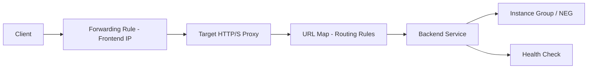

# How to Use Ansible to Create GCP Load Balancers

Author: [nawazdhandala](https://www.github.com/nawazdhandala)

Tags: Ansible, GCP, Load Balancer, Networking, High Availability

Description: Set up GCP load balancers with Ansible including HTTP(S), TCP, health checks, backend services, and SSL certificate configuration.

---

Load balancing in GCP is a rich topic because Google offers several types of load balancers for different use cases. The most common is the HTTP(S) load balancer, which operates at Layer 7 and provides global anycast routing, SSL termination, and content-based routing. Setting one up manually involves creating multiple interconnected resources: health checks, backend services, URL maps, target proxies, and forwarding rules. Ansible can wire all of these together in a single playbook.

## GCP Load Balancer Architecture

The HTTP(S) load balancer consists of several components that form a pipeline:



Each component is a separate GCP resource that you create and link together.

## Prerequisites

- Ansible 2.9+ with the `google.cloud` collection
- GCP service account with Compute Load Balancer Admin role
- Compute Engine instances or instance groups to serve as backends

```bash
ansible-galaxy collection install google.cloud
pip install google-auth requests google-api-python-client
```

## Creating a Health Check

Health checks determine whether backends are healthy enough to receive traffic:

```yaml
# create-health-check.yml - Create an HTTP health check
---
- name: Create Health Check
  hosts: localhost
  connection: local
  gather_facts: false

  vars:
    gcp_project: "my-project-123"
    gcp_cred_kind: "serviceaccount"
    gcp_cred_file: "/opt/ansible/gcp-credentials.json"

  tasks:
    - name: Create HTTP health check
      google.cloud.gcp_compute_health_check:
        name: "web-health-check"
        type: HTTP
        http_health_check:
          port: 80
          request_path: "/healthz"
        check_interval_sec: 10
        timeout_sec: 5
        healthy_threshold: 2
        unhealthy_threshold: 3
        project: "{{ gcp_project }}"
        auth_kind: "{{ gcp_cred_kind }}"
        service_account_file: "{{ gcp_cred_file }}"
        state: present
      register: health_check

    - name: Show health check details
      ansible.builtin.debug:
        msg: "Health check '{{ health_check.name }}' created checking /healthz every {{ health_check.checkIntervalSec }}s"
```

The health check hits `/healthz` on port 80 every 10 seconds. An instance is considered healthy after 2 consecutive successful checks and unhealthy after 3 consecutive failures. Make sure your application actually serves a health endpoint at this path.

## Creating an Instance Group

Instance groups organize your VMs into a group that the backend service can route to:

```yaml
# create-instance-group.yml - Create an unmanaged instance group
---
- name: Create Instance Group
  hosts: localhost
  connection: local
  gather_facts: false

  vars:
    gcp_project: "my-project-123"
    gcp_cred_kind: "serviceaccount"
    gcp_cred_file: "/opt/ansible/gcp-credentials.json"
    zone: "us-central1-a"

  tasks:
    - name: Create an instance group
      google.cloud.gcp_compute_instance_group:
        name: "web-servers-group"
        zone: "{{ zone }}"
        named_ports:
          - name: http
            port: 80
          - name: https
            port: 443
        network:
          selfLink: "global/networks/production-vpc"
        project: "{{ gcp_project }}"
        auth_kind: "{{ gcp_cred_kind }}"
        service_account_file: "{{ gcp_cred_file }}"
        state: present
      register: instance_group

    - name: Show instance group
      ansible.builtin.debug:
        msg: "Instance group '{{ instance_group.name }}' created in {{ zone }}"
```

Named ports define how the backend service references ports. When the backend service specifies `port_name: http`, it maps to port 80 as defined here.

## Creating a Backend Service

The backend service connects the health check to the instance group:

```yaml
# create-backend-service.yml - Create a backend service with an instance group
---
- name: Create Backend Service
  hosts: localhost
  connection: local
  gather_facts: false

  vars:
    gcp_project: "my-project-123"
    gcp_cred_kind: "serviceaccount"
    gcp_cred_file: "/opt/ansible/gcp-credentials.json"

  tasks:
    - name: Get health check reference
      google.cloud.gcp_compute_health_check:
        name: "web-health-check"
        type: HTTP
        http_health_check:
          port: 80
          request_path: "/healthz"
        project: "{{ gcp_project }}"
        auth_kind: "{{ gcp_cred_kind }}"
        service_account_file: "{{ gcp_cred_file }}"
        state: present
      register: hc

    - name: Get instance group reference
      google.cloud.gcp_compute_instance_group:
        name: "web-servers-group"
        zone: "us-central1-a"
        project: "{{ gcp_project }}"
        auth_kind: "{{ gcp_cred_kind }}"
        service_account_file: "{{ gcp_cred_file }}"
        state: present
      register: ig

    - name: Create the backend service
      google.cloud.gcp_compute_backend_service:
        name: "web-backend-service"
        health_checks:
          - "{{ hc.selfLink }}"
        backends:
          - group: "{{ ig.selfLink }}"
            balancing_mode: UTILIZATION
            max_utilization: 0.8
            capacity_scaler: 1.0
        port_name: http
        protocol: HTTP
        timeout_sec: 30
        connection_draining:
          draining_timeout_sec: 300
        log_config:
          enable: true
          sample_rate: 1.0
        project: "{{ gcp_project }}"
        auth_kind: "{{ gcp_cred_kind }}"
        service_account_file: "{{ gcp_cred_file }}"
        state: present
      register: backend

    - name: Show backend service
      ansible.builtin.debug:
        msg: "Backend service '{{ backend.name }}' created"
```

`connection_draining.draining_timeout_sec: 300` gives in-flight requests up to 5 minutes to complete when a backend is removed. The `log_config` with `sample_rate: 1.0` logs every request. In high-traffic environments, you might lower this to reduce logging costs.

## Creating the URL Map

The URL map defines routing rules. A simple one just sends all traffic to a single backend:

```yaml
# create-url-map.yml - Create a URL map for routing
---
- name: Create URL Map
  hosts: localhost
  connection: local
  gather_facts: false

  vars:
    gcp_project: "my-project-123"
    gcp_cred_kind: "serviceaccount"
    gcp_cred_file: "/opt/ansible/gcp-credentials.json"

  tasks:
    - name: Get backend service reference
      google.cloud.gcp_compute_backend_service:
        name: "web-backend-service"
        project: "{{ gcp_project }}"
        auth_kind: "{{ gcp_cred_kind }}"
        service_account_file: "{{ gcp_cred_file }}"
        state: present
      register: backend

    - name: Create the URL map
      google.cloud.gcp_compute_url_map:
        name: "web-url-map"
        default_service: "{{ backend }}"
        project: "{{ gcp_project }}"
        auth_kind: "{{ gcp_cred_kind }}"
        service_account_file: "{{ gcp_cred_file }}"
        state: present
      register: url_map

    - name: Show URL map
      ansible.builtin.debug:
        msg: "URL map '{{ url_map.name }}' routes to {{ backend.name }}"
```

## Creating the Target Proxy and Forwarding Rule

The target proxy terminates HTTP or HTTPS connections. The forwarding rule assigns a public IP:

```yaml
# create-frontend.yml - Create target proxy and forwarding rule for HTTP
---
- name: Create Load Balancer Frontend
  hosts: localhost
  connection: local
  gather_facts: false

  vars:
    gcp_project: "my-project-123"
    gcp_cred_kind: "serviceaccount"
    gcp_cred_file: "/opt/ansible/gcp-credentials.json"

  tasks:
    - name: Get URL map reference
      google.cloud.gcp_compute_url_map:
        name: "web-url-map"
        project: "{{ gcp_project }}"
        auth_kind: "{{ gcp_cred_kind }}"
        service_account_file: "{{ gcp_cred_file }}"
        state: present
      register: url_map

    - name: Reserve a global static IP
      google.cloud.gcp_compute_global_address:
        name: "web-lb-ip"
        project: "{{ gcp_project }}"
        auth_kind: "{{ gcp_cred_kind }}"
        service_account_file: "{{ gcp_cred_file }}"
        state: present
      register: lb_ip

    - name: Create HTTP target proxy
      google.cloud.gcp_compute_target_http_proxy:
        name: "web-http-proxy"
        url_map: "{{ url_map }}"
        project: "{{ gcp_project }}"
        auth_kind: "{{ gcp_cred_kind }}"
        service_account_file: "{{ gcp_cred_file }}"
        state: present
      register: http_proxy

    - name: Create forwarding rule
      google.cloud.gcp_compute_global_forwarding_rule:
        name: "web-http-forwarding"
        ip_address: "{{ lb_ip.address }}"
        ip_protocol: TCP
        port_range: "80"
        target: "{{ http_proxy.selfLink }}"
        project: "{{ gcp_project }}"
        auth_kind: "{{ gcp_cred_kind }}"
        service_account_file: "{{ gcp_cred_file }}"
        state: present
      register: forwarding_rule

    - name: Show load balancer IP
      ansible.builtin.debug:
        msg: "Load balancer is accessible at http://{{ lb_ip.address }}"
```

## Adding HTTPS with SSL Certificate

For production, add HTTPS support with a managed SSL certificate:

```yaml
# add-https.yml - Add HTTPS frontend with managed SSL certificate
---
- name: Add HTTPS to Load Balancer
  hosts: localhost
  connection: local
  gather_facts: false

  vars:
    gcp_project: "my-project-123"
    gcp_cred_kind: "serviceaccount"
    gcp_cred_file: "/opt/ansible/gcp-credentials.json"
    domain: "example.com"

  tasks:
    - name: Create Google-managed SSL certificate
      google.cloud.gcp_compute_ssl_certificate:
        name: "web-ssl-cert"
        managed:
          domains:
            - "{{ domain }}"
            - "www.{{ domain }}"
        project: "{{ gcp_project }}"
        auth_kind: "{{ gcp_cred_kind }}"
        service_account_file: "{{ gcp_cred_file }}"
        state: present
      register: ssl_cert

    - name: Get URL map reference
      google.cloud.gcp_compute_url_map:
        name: "web-url-map"
        project: "{{ gcp_project }}"
        auth_kind: "{{ gcp_cred_kind }}"
        service_account_file: "{{ gcp_cred_file }}"
        state: present
      register: url_map

    - name: Create HTTPS target proxy
      google.cloud.gcp_compute_target_https_proxy:
        name: "web-https-proxy"
        url_map: "{{ url_map }}"
        ssl_certificates:
          - "{{ ssl_cert.selfLink }}"
        project: "{{ gcp_project }}"
        auth_kind: "{{ gcp_cred_kind }}"
        service_account_file: "{{ gcp_cred_file }}"
        state: present
      register: https_proxy

    - name: Create HTTPS forwarding rule
      google.cloud.gcp_compute_global_forwarding_rule:
        name: "web-https-forwarding"
        ip_address: "{{ lb_ip.address | default('') }}"
        ip_protocol: TCP
        port_range: "443"
        target: "{{ https_proxy.selfLink }}"
        project: "{{ gcp_project }}"
        auth_kind: "{{ gcp_cred_kind }}"
        service_account_file: "{{ gcp_cred_file }}"
        state: present
```

Google-managed SSL certificates are free and auto-renew. They require that your DNS is already pointing to the load balancer IP, because Google needs to validate domain ownership during provisioning. It can take up to 60 minutes for the certificate to become active.

## Summary

Building a GCP load balancer with Ansible involves creating and linking several resources: health checks, instance groups, backend services, URL maps, target proxies, and forwarding rules. While this feels like a lot of pieces, each component has a clear responsibility, and Ansible ties them together into a single, repeatable playbook. The key decisions are: use HTTP(S) load balancers for web traffic (they give you global anycast and SSL termination), set appropriate health check intervals, enable connection draining for graceful backends, and use Google-managed SSL certificates to avoid certificate renewal headaches.
