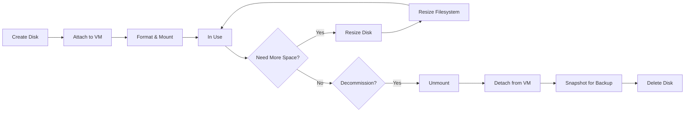

# How to Use Ansible to Create GCP Persistent Disks

Author: [nawazdhandala](https://www.github.com/nawazdhandala)

Tags: Ansible, GCP, Persistent Disks, Storage, Infrastructure as Code

Description: Step-by-step guide to creating and managing GCP Persistent Disks using Ansible playbooks, covering disk types, resizing, and attachment to VMs.

---

Persistent Disks are the bread and butter of block storage in Google Cloud. Every Compute Engine VM needs at least one for its boot disk, and most applications need additional disks for data storage. Managing these disks manually through the console is slow and error-prone, especially when you have dozens or hundreds of VMs. Ansible lets you define your disk configurations as code and provision them consistently across environments.

## Understanding GCP Persistent Disk Types

Before jumping into Ansible playbooks, it helps to understand what disk types are available:

- **pd-standard**: Standard HDD. Cheapest option, good for sequential reads and bulk storage.
- **pd-balanced**: SSD-backed with a good balance of price and performance. This is what most workloads should use.
- **pd-ssd**: Higher performance SSD. For databases and latency-sensitive applications.
- **pd-extreme**: Highest performance. For the most demanding workloads like SAP HANA.

The performance of persistent disks scales with size. A larger disk gets more IOPS and throughput, regardless of type.

## Prerequisites

Make sure you have:

- Ansible 2.10+ installed
- The `google.cloud` collection installed
- A GCP service account with Compute Engine permissions

```bash
# Install the Google Cloud Ansible collection
ansible-galaxy collection install google.cloud
```

## Creating a Basic Persistent Disk

Let us start with the simplest case: creating a single persistent disk in a specific zone.

```yaml
# create-disk.yml - Create a basic persistent disk
---
- name: Create GCP Persistent Disk
  hosts: localhost
  connection: local
  gather_facts: false

  vars:
    gcp_project: "my-project-id"
    gcp_auth_kind: "serviceaccount"
    gcp_service_account_file: "/path/to/service-account-key.json"
    zone: "us-central1-a"

  tasks:
    - name: Create a 100GB balanced persistent disk
      google.cloud.gcp_compute_disk:
        name: "data-disk-01"
        size_gb: 100
        type: "pd-balanced"
        zone: "{{ zone }}"
        labels:
          environment: "production"
          purpose: "database-storage"
          managed_by: "ansible"
        project: "{{ gcp_project }}"
        auth_kind: "{{ gcp_auth_kind }}"
        service_account_file: "{{ gcp_service_account_file }}"
        state: present
      register: disk_result

    - name: Show disk details
      ansible.builtin.debug:
        msg: |
          Disk name: {{ disk_result.name }}
          Size: {{ disk_result.sizeGb }} GB
          Type: {{ disk_result.type }}
          Status: {{ disk_result.status }}
```

## Creating Multiple Disks at Once

Real-world setups often need several disks. Maybe you need separate disks for data, logs, and backups. Loops make this clean.

```yaml
# create-multiple-disks.yml - Provision several disks with different specs
---
- name: Create Multiple Persistent Disks
  hosts: localhost
  connection: local
  gather_facts: false

  vars:
    gcp_project: "my-project-id"
    gcp_auth_kind: "serviceaccount"
    gcp_service_account_file: "/path/to/service-account-key.json"
    zone: "us-central1-a"

    # Define all disks as a list of dictionaries
    disks:
      - name: "db-data-disk"
        size_gb: 500
        type: "pd-ssd"
        labels:
          purpose: "database-data"
      - name: "db-log-disk"
        size_gb: 100
        type: "pd-ssd"
        labels:
          purpose: "database-logs"
      - name: "backup-disk"
        size_gb: 1000
        type: "pd-standard"
        labels:
          purpose: "backups"

  tasks:
    - name: Create all disks
      google.cloud.gcp_compute_disk:
        name: "{{ item.name }}"
        size_gb: "{{ item.size_gb }}"
        type: "{{ item.type }}"
        zone: "{{ zone }}"
        labels: "{{ item.labels | combine({'managed_by': 'ansible'}) }}"
        project: "{{ gcp_project }}"
        auth_kind: "{{ gcp_auth_kind }}"
        service_account_file: "{{ gcp_service_account_file }}"
        state: present
      loop: "{{ disks }}"
      register: disk_results

    - name: List all created disks
      ansible.builtin.debug:
        msg: "Created disk: {{ item.item.name }} ({{ item.item.size_gb }}GB {{ item.item.type }})"
      loop: "{{ disk_results.results }}"
```

## Creating a Disk from a Source Image

Sometimes you want to create a disk pre-loaded with an operating system image or a custom image you have built. This is how boot disks are typically created.

```yaml
# create-disk-from-image.yml - Create a boot disk from an OS image
---
- name: Create Disk from Image
  hosts: localhost
  connection: local
  gather_facts: false

  vars:
    gcp_project: "my-project-id"
    gcp_auth_kind: "serviceaccount"
    gcp_service_account_file: "/path/to/service-account-key.json"
    zone: "us-central1-a"

  tasks:
    - name: Create a boot disk from Ubuntu 22.04 image
      google.cloud.gcp_compute_disk:
        name: "web-server-boot-disk"
        size_gb: 30
        type: "pd-balanced"
        zone: "{{ zone }}"
        # Use a public image family for the latest Ubuntu 22.04
        source_image: "projects/ubuntu-os-cloud/global/images/family/ubuntu-2204-lts"
        labels:
          role: "web-server"
          os: "ubuntu-2204"
        project: "{{ gcp_project }}"
        auth_kind: "{{ gcp_auth_kind }}"
        service_account_file: "{{ gcp_service_account_file }}"
        state: present
      register: boot_disk

    - name: Show boot disk info
      ansible.builtin.debug:
        msg: |
          Boot disk: {{ boot_disk.name }}
          Source image: {{ boot_disk.sourceImage }}
          Size: {{ boot_disk.sizeGb }} GB
```

## Attaching a Disk to a VM

Creating a disk is only half the story. You need to attach it to a VM instance for it to be useful.

```yaml
# attach-disk-to-vm.yml - Create a disk and attach it to an existing VM
---
- name: Attach Persistent Disk to VM
  hosts: localhost
  connection: local
  gather_facts: false

  vars:
    gcp_project: "my-project-id"
    gcp_auth_kind: "serviceaccount"
    gcp_service_account_file: "/path/to/service-account-key.json"
    zone: "us-central1-a"
    vm_name: "my-app-server"
    disk_name: "app-data-disk"

  tasks:
    - name: Create the data disk
      google.cloud.gcp_compute_disk:
        name: "{{ disk_name }}"
        size_gb: 200
        type: "pd-balanced"
        zone: "{{ zone }}"
        project: "{{ gcp_project }}"
        auth_kind: "{{ gcp_auth_kind }}"
        service_account_file: "{{ gcp_service_account_file }}"
        state: present
      register: data_disk

    - name: Attach the disk to the VM
      google.cloud.gcp_compute_attached_disk:
        instance:
          name: "{{ vm_name }}"
          zone: "{{ zone }}"
        source:
          selfLink: "{{ data_disk.selfLink }}"
        mode: "READ_WRITE"
        project: "{{ gcp_project }}"
        auth_kind: "{{ gcp_auth_kind }}"
        service_account_file: "{{ gcp_service_account_file }}"
        state: present
```

After attaching the disk, you still need to format and mount it inside the VM. Here is a follow-up play that connects to the VM and does that:

```yaml
# format-and-mount.yml - Format and mount the attached disk on the VM
---
- name: Format and Mount the Attached Disk
  hosts: my_app_server
  become: true
  gather_facts: true

  tasks:
    - name: Check if the disk is already formatted
      ansible.builtin.command: blkid /dev/sdb
      register: blkid_result
      failed_when: false
      changed_when: false

    - name: Format the disk with ext4 if unformatted
      ansible.builtin.command: mkfs.ext4 -F /dev/sdb
      when: blkid_result.rc != 0

    - name: Create the mount point directory
      ansible.builtin.file:
        path: /mnt/data
        state: directory
        mode: "0755"

    - name: Mount the disk
      ansible.posix.mount:
        path: /mnt/data
        src: /dev/sdb
        fstype: ext4
        opts: defaults,nofail
        state: mounted

    - name: Verify the mount
      ansible.builtin.command: df -h /mnt/data
      register: mount_check
      changed_when: false

    - name: Show mount status
      ansible.builtin.debug:
        msg: "{{ mount_check.stdout }}"
```

## Disk Lifecycle Diagram



## Resizing a Persistent Disk

One of the nice things about GCP Persistent Disks is that you can grow them online. No downtime required. You increase the disk size in GCP, then expand the filesystem inside the VM.

```yaml
# resize-disk.yml - Grow a persistent disk without downtime
---
- name: Resize Persistent Disk
  hosts: localhost
  connection: local
  gather_facts: false

  vars:
    gcp_project: "my-project-id"
    gcp_auth_kind: "serviceaccount"
    gcp_service_account_file: "/path/to/service-account-key.json"
    zone: "us-central1-a"

  tasks:
    - name: Resize the data disk from 200GB to 500GB
      google.cloud.gcp_compute_disk:
        name: "app-data-disk"
        size_gb: 500
        type: "pd-balanced"
        zone: "{{ zone }}"
        project: "{{ gcp_project }}"
        auth_kind: "{{ gcp_auth_kind }}"
        service_account_file: "{{ gcp_service_account_file }}"
        state: present
```

After resizing the disk in GCP, expand the filesystem on the VM:

```yaml
# expand-filesystem.yml - Grow the filesystem after resizing the disk
---
- name: Expand Filesystem After Disk Resize
  hosts: my_app_server
  become: true

  tasks:
    - name: Resize the ext4 filesystem to use all available space
      ansible.builtin.command: resize2fs /dev/sdb
      register: resize_result

    - name: Verify new size
      ansible.builtin.command: df -h /mnt/data
      register: df_output
      changed_when: false

    - name: Show updated disk space
      ansible.builtin.debug:
        msg: "{{ df_output.stdout }}"
```

## Cleaning Up Disks

Unused disks cost money. Here is how to clean them up:

```yaml
# cleanup-disks.yml - Remove disks that are no longer needed
---
- name: Cleanup Unused Persistent Disks
  hosts: localhost
  connection: local
  gather_facts: false

  vars:
    gcp_project: "my-project-id"
    gcp_auth_kind: "serviceaccount"
    gcp_service_account_file: "/path/to/service-account-key.json"
    zone: "us-central1-a"
    disks_to_delete:
      - "old-data-disk"
      - "test-disk-01"
      - "test-disk-02"

  tasks:
    - name: Delete unused disks
      google.cloud.gcp_compute_disk:
        name: "{{ item }}"
        zone: "{{ zone }}"
        project: "{{ gcp_project }}"
        auth_kind: "{{ gcp_auth_kind }}"
        service_account_file: "{{ gcp_service_account_file }}"
        state: absent
      loop: "{{ disks_to_delete }}"
```

## Tips for Production

1. **Always label your disks.** Labels are free and make it much easier to track what disks belong to what application. They also help with billing reports.

2. **Use `pd-balanced` as your default.** It covers most use cases well. Only switch to `pd-ssd` or `pd-extreme` when you have measured and confirmed you need more IOPS.

3. **Never shrink disks.** GCP does not support shrinking persistent disks. If you overprovisioned, your only option is to create a smaller disk and copy the data.

4. **Snapshot before making changes.** Before resizing or deleting a disk, take a snapshot. It is cheap insurance.

5. **Remember that disks are zonal.** A disk in `us-central1-a` can only be attached to VMs in `us-central1-a`. Regional persistent disks exist but cost more and have some limitations.

## Conclusion

Persistent Disks are a foundational part of any GCP infrastructure, and Ansible makes managing them straightforward. Whether you are provisioning individual disks, creating sets of disks for database servers, or managing the full lifecycle from creation through resizing to cleanup, Ansible playbooks give you repeatable, auditable infrastructure management. The key is to treat your disk definitions as code, store them in version control, and use labels religiously for tracking.
