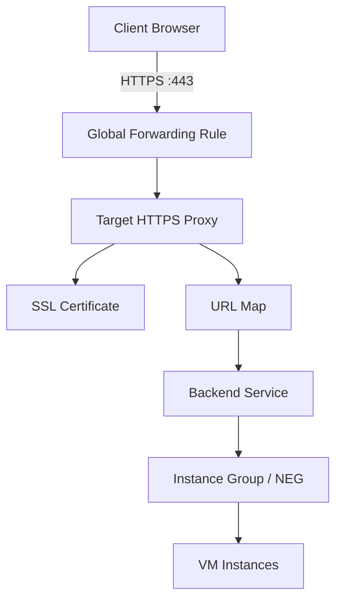

# How to Use Ansible to Create GCP SSL Certificates

Author: [nawazdhandala](https://www.github.com/nawazdhandala)

Tags: Ansible, GCP, SSL Certificates, HTTPS, Load Balancing

Description: Learn how to provision and manage GCP SSL certificates using Ansible, including both self-managed and Google-managed certificate options.

---

SSL certificates are a non-negotiable part of running any public-facing service. In GCP, SSL certificates are used with load balancers to terminate HTTPS traffic. You have two options: upload your own certificates (self-managed) or let Google automatically provision and renew them (Google-managed). Both approaches can be automated with Ansible, and in this post we will cover how to do exactly that.

## Self-Managed vs Google-Managed Certificates

Before diving into playbooks, let us clarify the difference.

**Self-managed certificates** are ones you obtain yourself, maybe from Let's Encrypt, your corporate CA, or a commercial provider. You upload the certificate and private key to GCP and attach them to your load balancer. You are responsible for renewal.

**Google-managed certificates** are provisioned automatically by Google. You specify the domain names, attach the certificate resource to a load balancer, and Google handles the rest, including renewal. The catch is that your DNS must already point to the load balancer's IP for domain validation to work.

## Prerequisites

- Ansible 2.10+ with the `google.cloud` collection
- A GCP service account with Load Balancer Admin permissions
- For Google-managed certs, your domain must resolve to the load balancer IP

```bash
# Install the GCP collection
ansible-galaxy collection install google.cloud
```

## Creating a Self-Managed SSL Certificate

If you already have a certificate and private key (perhaps from Let's Encrypt), here is how to upload it to GCP.

```yaml
# create-self-managed-cert.yml - Upload your own SSL certificate to GCP
---
- name: Create Self-Managed SSL Certificate
  hosts: localhost
  connection: local
  gather_facts: false

  vars:
    gcp_project: "my-project-id"
    gcp_auth_kind: "serviceaccount"
    gcp_service_account_file: "/path/to/service-account-key.json"

  tasks:
    - name: Read the certificate file
      ansible.builtin.slurp:
        src: "/etc/letsencrypt/live/example.com/fullchain.pem"
      register: cert_content

    - name: Read the private key file
      ansible.builtin.slurp:
        src: "/etc/letsencrypt/live/example.com/privkey.pem"
      register: key_content

    - name: Create the SSL certificate resource in GCP
      google.cloud.gcp_compute_ssl_certificate:
        name: "example-com-cert-202602"
        certificate: "{{ cert_content.content | b64decode }}"
        private_key: "{{ key_content.content | b64decode }}"
        description: "SSL certificate for example.com - uploaded Feb 2026"
        project: "{{ gcp_project }}"
        auth_kind: "{{ gcp_auth_kind }}"
        service_account_file: "{{ gcp_service_account_file }}"
        state: present
      register: ssl_cert

    - name: Show certificate info
      ansible.builtin.debug:
        msg: |
          Certificate: {{ ssl_cert.name }}
          Self link: {{ ssl_cert.selfLink }}
          Attach this to your HTTPS target proxy.
```

## Creating a Google-Managed SSL Certificate

Google-managed certificates are the easier option when you are using GCP load balancers. Google handles provisioning and renewal automatically.

```yaml
# create-google-managed-cert.yml - Let Google manage your SSL certificate
---
- name: Create Google-Managed SSL Certificate
  hosts: localhost
  connection: local
  gather_facts: false

  vars:
    gcp_project: "my-project-id"
    gcp_auth_kind: "serviceaccount"
    gcp_service_account_file: "/path/to/service-account-key.json"

  tasks:
    - name: Create a Google-managed SSL certificate
      google.cloud.gcp_compute_managed_ssl_certificate:
        name: "example-com-managed-cert"
        managed:
          domains:
            - "example.com"
            - "www.example.com"
        project: "{{ gcp_project }}"
        auth_kind: "{{ gcp_auth_kind }}"
        service_account_file: "{{ gcp_service_account_file }}"
        state: present
      register: managed_cert

    - name: Show managed certificate details
      ansible.builtin.debug:
        msg: |
          Certificate: {{ managed_cert.name }}
          Domains: example.com, www.example.com
          Status: Provisioning will complete once DNS points to the load balancer.
```

Note that Google-managed certificates can take up to 60 minutes to provision after you point your DNS to the load balancer. During that time, the certificate status will show as "PROVISIONING".

## Attaching SSL Certificate to a Load Balancer

Creating the certificate is only the first step. You need to attach it to an HTTPS load balancer. Here is a more complete playbook that sets up the full chain.

```yaml
# setup-https-lb.yml - Create an HTTPS load balancer with SSL certificate
---
- name: Setup HTTPS Load Balancer with SSL
  hosts: localhost
  connection: local
  gather_facts: false

  vars:
    gcp_project: "my-project-id"
    gcp_auth_kind: "serviceaccount"
    gcp_service_account_file: "/path/to/service-account-key.json"

  tasks:
    - name: Create the Google-managed SSL certificate
      google.cloud.gcp_compute_managed_ssl_certificate:
        name: "myapp-managed-cert"
        managed:
          domains:
            - "app.example.com"
        project: "{{ gcp_project }}"
        auth_kind: "{{ gcp_auth_kind }}"
        service_account_file: "{{ gcp_service_account_file }}"
        state: present
      register: ssl_cert

    - name: Reserve a static external IP address
      google.cloud.gcp_compute_global_address:
        name: "myapp-lb-ip"
        project: "{{ gcp_project }}"
        auth_kind: "{{ gcp_auth_kind }}"
        service_account_file: "{{ gcp_service_account_file }}"
        state: present
      register: lb_ip

    - name: Create a URL map (routing rules)
      google.cloud.gcp_compute_url_map:
        name: "myapp-url-map"
        default_service:
          selfLink: "projects/{{ gcp_project }}/global/backendServices/myapp-backend"
        project: "{{ gcp_project }}"
        auth_kind: "{{ gcp_auth_kind }}"
        service_account_file: "{{ gcp_service_account_file }}"
        state: present
      register: url_map

    - name: Create the HTTPS target proxy with SSL certificate
      google.cloud.gcp_compute_target_https_proxy:
        name: "myapp-https-proxy"
        url_map:
          selfLink: "{{ url_map.selfLink }}"
        ssl_certificates:
          - selfLink: "{{ ssl_cert.selfLink }}"
        project: "{{ gcp_project }}"
        auth_kind: "{{ gcp_auth_kind }}"
        service_account_file: "{{ gcp_service_account_file }}"
        state: present
      register: https_proxy

    - name: Create the global forwarding rule
      google.cloud.gcp_compute_global_forwarding_rule:
        name: "myapp-https-rule"
        ip_address: "{{ lb_ip.address }}"
        ip_protocol: "TCP"
        port_range: "443-443"
        target: "{{ https_proxy.selfLink }}"
        project: "{{ gcp_project }}"
        auth_kind: "{{ gcp_auth_kind }}"
        service_account_file: "{{ gcp_service_account_file }}"
        state: present

    - name: Display setup information
      ansible.builtin.debug:
        msg: |
          HTTPS Load Balancer configured.
          IP Address: {{ lb_ip.address }}
          Point your DNS A record for app.example.com to {{ lb_ip.address }}
          Certificate will auto-provision once DNS propagates.
```

## Load Balancer Architecture with SSL



## Managing Multiple Certificates

If you run multiple services behind different load balancers, you might manage several certificates. Here is how to handle that with variables.

```yaml
# manage-multiple-certs.yml - Manage certificates for multiple domains
---
- name: Manage Multiple SSL Certificates
  hosts: localhost
  connection: local
  gather_facts: false

  vars:
    gcp_project: "my-project-id"
    gcp_auth_kind: "serviceaccount"
    gcp_service_account_file: "/path/to/service-account-key.json"

    # Define all certificates as a list
    certificates:
      - name: "main-site-cert"
        domains:
          - "example.com"
          - "www.example.com"
      - name: "api-cert"
        domains:
          - "api.example.com"
      - name: "admin-cert"
        domains:
          - "admin.example.com"
          - "dashboard.example.com"

  tasks:
    - name: Create Google-managed certificates for all domains
      google.cloud.gcp_compute_managed_ssl_certificate:
        name: "{{ item.name }}"
        managed:
          domains: "{{ item.domains }}"
        project: "{{ gcp_project }}"
        auth_kind: "{{ gcp_auth_kind }}"
        service_account_file: "{{ gcp_service_account_file }}"
        state: present
      loop: "{{ certificates }}"
      register: cert_results

    - name: Show all certificate statuses
      ansible.builtin.debug:
        msg: "Certificate '{{ item.item.name }}' for domains: {{ item.item.domains | join(', ') }}"
      loop: "{{ cert_results.results }}"
```

## Rotating Self-Managed Certificates

Self-managed certificates expire, so you need a rotation strategy. The approach is to create a new certificate resource, update the target proxy to use it, then delete the old one.

```yaml
# rotate-certificate.yml - Replace an expiring certificate
---
- name: Rotate SSL Certificate
  hosts: localhost
  connection: local
  gather_facts: false

  vars:
    gcp_project: "my-project-id"
    gcp_auth_kind: "serviceaccount"
    gcp_service_account_file: "/path/to/service-account-key.json"
    old_cert_name: "example-com-cert-202602"
    new_cert_name: "example-com-cert-202605"

  tasks:
    - name: Read the new certificate
      ansible.builtin.slurp:
        src: "/etc/letsencrypt/live/example.com/fullchain.pem"
      register: new_cert_content

    - name: Read the new private key
      ansible.builtin.slurp:
        src: "/etc/letsencrypt/live/example.com/privkey.pem"
      register: new_key_content

    - name: Upload the new certificate
      google.cloud.gcp_compute_ssl_certificate:
        name: "{{ new_cert_name }}"
        certificate: "{{ new_cert_content.content | b64decode }}"
        private_key: "{{ new_key_content.content | b64decode }}"
        project: "{{ gcp_project }}"
        auth_kind: "{{ gcp_auth_kind }}"
        service_account_file: "{{ gcp_service_account_file }}"
        state: present
      register: new_cert

    - name: Update the HTTPS proxy to use the new certificate
      google.cloud.gcp_compute_target_https_proxy:
        name: "myapp-https-proxy"
        url_map:
          selfLink: "projects/{{ gcp_project }}/global/urlMaps/myapp-url-map"
        ssl_certificates:
          - selfLink: "{{ new_cert.selfLink }}"
        project: "{{ gcp_project }}"
        auth_kind: "{{ gcp_auth_kind }}"
        service_account_file: "{{ gcp_service_account_file }}"
        state: present

    - name: Delete the old certificate
      google.cloud.gcp_compute_ssl_certificate:
        name: "{{ old_cert_name }}"
        project: "{{ gcp_project }}"
        auth_kind: "{{ gcp_auth_kind }}"
        service_account_file: "{{ gcp_service_account_file }}"
        state: absent

    - name: Confirm rotation
      ansible.builtin.debug:
        msg: "Certificate rotated from {{ old_cert_name }} to {{ new_cert_name }}"
```

## Best Practices

1. **Use Google-managed certificates whenever possible.** They handle provisioning and renewal automatically, which eliminates a whole class of outages caused by expired certificates.

2. **Include dates in self-managed certificate names.** This makes it obvious when a certificate was uploaded and helps track expiration.

3. **Set up monitoring for certificate expiration.** Even with Google-managed certs, things can go wrong (DNS changes, for example). Monitor your certificate status.

4. **Plan for zero-downtime rotation.** GCP allows multiple certificates on a target proxy during rotation, so you can add the new cert before removing the old one.

5. **Keep your private keys secure.** Never commit private keys to version control. Use Ansible Vault or a secrets manager to handle them.

## Conclusion

Managing SSL certificates with Ansible removes the manual hassle and reduces the risk of expired certificates causing outages. Google-managed certificates are the simplest option, but when you need self-managed certificates, Ansible playbooks give you a repeatable process for uploading and rotating them. Combined with monitoring and alerting on certificate status, you get a robust HTTPS setup that you can trust.
