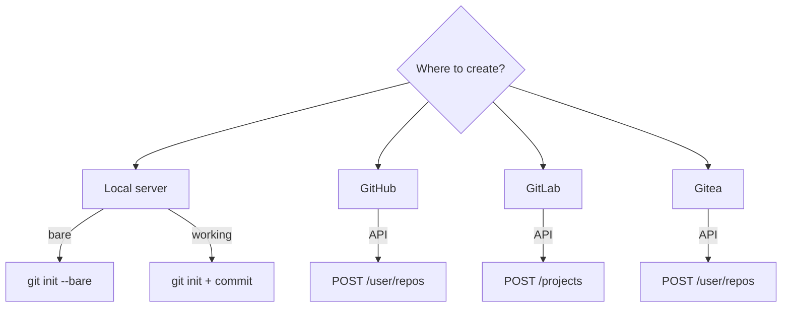

# How to Use Ansible to Create Git Repositories

Author: [nawazdhandala](https://www.github.com/nawazdhandala)

Tags: Ansible, Git, Repository Management, Automation

Description: Learn how to use Ansible to create Git repositories on local servers, GitHub, and GitLab including bare repos, initial commits, and branch protection setup.

---

Creating Git repositories programmatically is a common automation task. Whether you are bootstrapping project structures, setting up Git servers, or provisioning repositories on GitHub/GitLab, Ansible handles it. This post covers creating repositories locally, on self-hosted Git servers, and on hosted platforms via their APIs.

## Creating a Local Bare Repository

Bare repositories are what Git servers use. They have no working directory:

```yaml
# playbook-bare-repo.yml
# Creates a bare Git repository on a server for receiving pushes
- name: Create bare repositories
  hosts: git_servers
  become: true
  vars:
    repo_base: /opt/git/repositories
    repositories:
      - name: frontend
        description: "Frontend web application"
      - name: backend-api
        description: "Backend REST API"
      - name: infrastructure
        description: "Infrastructure as code"

  tasks:
    - name: Create base directory
      ansible.builtin.file:
        path: "{{ repo_base }}"
        state: directory
        owner: git
        group: git

    - name: Create bare repositories
      ansible.builtin.shell: |
        git init --bare "{{ repo_base }}/{{ item.name }}.git"
      args:
        creates: "{{ repo_base }}/{{ item.name }}.git/HEAD"
      loop: "{{ repositories }}"
      loop_control:
        label: "{{ item.name }}"

    - name: Set repository descriptions
      ansible.builtin.copy:
        content: "{{ item.description }}\n"
        dest: "{{ repo_base }}/{{ item.name }}.git/description"
        owner: git
        group: git
      loop: "{{ repositories }}"
      loop_control:
        label: "{{ item.name }}"

    - name: Set repository ownership
      ansible.builtin.file:
        path: "{{ repo_base }}/{{ item.name }}.git"
        owner: git
        group: git
        recurse: true
      loop: "{{ repositories }}"
      loop_control:
        label: "{{ item.name }}"
```

## Creating a Repository with Initial Commit

```yaml
# playbook-init-repo.yml
# Creates a Git repository with an initial commit including README and .gitignore
- name: Create repository with initial content
  hosts: localhost
  become: true
  vars:
    repo_path: /opt/new-project
    project_name: my-new-project

  tasks:
    - name: Create project directory
      ansible.builtin.file:
        path: "{{ repo_path }}"
        state: directory

    - name: Initialize Git repository
      ansible.builtin.shell: |
        cd {{ repo_path }}
        git init
        git checkout -b main
      args:
        creates: "{{ repo_path }}/.git"

    - name: Create initial files
      ansible.builtin.copy:
        content: |
          # {{ project_name }}

          Project description here.

          ## Getting Started

          ```bash
          git clone <repository-url>
          cd {{ project_name }}
          ```
        dest: "{{ repo_path }}/README.md"

    - name: Create .gitignore
      ansible.builtin.copy:
        content: |
          # Python
          __pycache__/
          *.pyc
          .venv/

          # Environment
          .env
          .env.local

          # IDE
          .idea/
          .vscode/

          # OS
          .DS_Store
          Thumbs.db
        dest: "{{ repo_path }}/.gitignore"

    - name: Configure git user
      ansible.builtin.shell: |
        cd {{ repo_path }}
        git config user.name "Ansible"
        git config user.email "ansible@example.com"

    - name: Create initial commit
      ansible.builtin.shell: |
        cd {{ repo_path }}
        git add -A
        git commit -m "Initial commit - project scaffolding"
      register: commit_result
      changed_when: "'nothing to commit' not in commit_result.stdout"
```

## Repository Creation Flow



## Creating GitHub Repositories

Use the GitHub API to create repositories:

```yaml
# playbook-github-repo.yml
# Creates repositories on GitHub using the REST API
- name: Create GitHub repositories
  hosts: localhost
  gather_facts: false
  vars:
    github_token: "{{ lookup('env', 'GITHUB_TOKEN') }}"
    github_org: myorg
    repos_to_create:
      - name: new-service
        description: "New microservice"
        private: true
        auto_init: true
      - name: shared-library
        description: "Shared utility library"
        private: false
        auto_init: true

  tasks:
    - name: Create repositories on GitHub
      ansible.builtin.uri:
        url: "https://api.github.com/orgs/{{ github_org }}/repos"
        method: POST
        headers:
          Authorization: "Bearer {{ github_token }}"
          Accept: "application/vnd.github.v3+json"
        body_format: json
        body:
          name: "{{ item.name }}"
          description: "{{ item.description }}"
          private: "{{ item.private }}"
          auto_init: "{{ item.auto_init }}"
          default_branch: main
        status_code: [201, 422]
      loop: "{{ repos_to_create }}"
      loop_control:
        label: "{{ item.name }}"
      register: create_results

    - name: Show results
      ansible.builtin.debug:
        msg: "{{ item.item.name }}: {{ 'created' if item.status == 201 else 'already exists' }}"
      loop: "{{ create_results.results }}"
      loop_control:
        label: "{{ item.item.name }}"
```

## Creating GitLab Repositories

```yaml
# playbook-gitlab-repo.yml
# Creates projects on GitLab using the REST API
- name: Create GitLab repositories
  hosts: localhost
  gather_facts: false
  vars:
    gitlab_url: "https://gitlab.example.com"
    gitlab_token: "{{ lookup('env', 'GITLAB_TOKEN') }}"

  tasks:
    - name: Create GitLab project
      ansible.builtin.uri:
        url: "{{ gitlab_url }}/api/v4/projects"
        method: POST
        headers:
          PRIVATE-TOKEN: "{{ gitlab_token }}"
        body_format: json
        body:
          name: "new-service"
          description: "New microservice"
          visibility: "private"
          initialize_with_readme: true
          default_branch: "main"
        status_code: [201, 400]
      register: gitlab_result

    - name: Show result
      ansible.builtin.debug:
        msg: "{{ gitlab_result.json.web_url | default('Project may already exist') }}"
```

## Bootstrapping a Project Structure

Create a repository with a complete project scaffold:

```yaml
# playbook-scaffold.yml
# Creates a Python project scaffold with standard directory structure and config files
- name: Scaffold new Python project
  hosts: localhost
  vars:
    project_name: my-python-service
    project_dir: "/tmp/{{ project_name }}"
    python_version: "3.11"

  tasks:
    - name: Create project structure
      ansible.builtin.file:
        path: "{{ project_dir }}/{{ item }}"
        state: directory
      loop:
        - src
        - src/{{ project_name | replace('-', '_') }}
        - tests
        - docs
        - .github/workflows

    - name: Create __init__.py
      ansible.builtin.copy:
        content: |
          """{{ project_name }} - Main package."""
          __version__ = "0.1.0"
        dest: "{{ project_dir }}/src/{{ project_name | replace('-', '_') }}/__init__.py"

    - name: Create pyproject.toml
      ansible.builtin.copy:
        content: |
          [project]
          name = "{{ project_name }}"
          version = "0.1.0"
          requires-python = ">={{ python_version }}"

          [build-system]
          requires = ["setuptools>=61.0"]
          build-backend = "setuptools.backends._legacy:_Backend"
        dest: "{{ project_dir }}/pyproject.toml"

    - name: Create Dockerfile
      ansible.builtin.copy:
        content: |
          FROM python:{{ python_version }}-slim
          WORKDIR /app
          COPY . .
          RUN pip install .
          CMD ["python", "-m", "{{ project_name | replace('-', '_') }}"]
        dest: "{{ project_dir }}/Dockerfile"

    - name: Create .gitignore
      ansible.builtin.copy:
        content: |
          __pycache__/
          *.pyc
          .venv/
          dist/
          *.egg-info/
          .env
        dest: "{{ project_dir }}/.gitignore"

    - name: Initialize and commit
      ansible.builtin.shell: |
        cd {{ project_dir }}
        git init -b main
        git config user.name "Ansible"
        git config user.email "ansible@example.com"
        git add -A
        git commit -m "Initial scaffold for {{ project_name }}"
```

## Batch Repository Creation

```yaml
# playbook-batch-repos.yml
# Creates multiple repositories from a YAML definition file
- name: Batch create repositories
  hosts: localhost
  gather_facts: false
  vars:
    github_token: "{{ lookup('env', 'GITHUB_TOKEN') }}"
    org: myorg
    team_repos:
      platform:
        - { name: "platform-api", private: true, desc: "Platform API" }
        - { name: "platform-ui", private: true, desc: "Platform UI" }
      data:
        - { name: "data-pipeline", private: true, desc: "Data pipeline" }
        - { name: "data-warehouse", private: true, desc: "Data warehouse" }

  tasks:
    - name: Create all repositories
      ansible.builtin.uri:
        url: "https://api.github.com/orgs/{{ org }}/repos"
        method: POST
        headers:
          Authorization: "Bearer {{ github_token }}"
        body_format: json
        body:
          name: "{{ item.1.name }}"
          description: "{{ item.1.desc }}"
          private: "{{ item.1.private }}"
          auto_init: true
          default_branch: main
        status_code: [201, 422]
      loop: "{{ team_repos | dict2items | subelements('value') }}"
      loop_control:
        label: "{{ item.0.key }}/{{ item.1.name }}"
```

## Summary

Creating Git repositories with Ansible covers a wide range of scenarios. For self-hosted servers, use `git init --bare` for bare repositories and `git init` plus initial file creation for working repositories. For hosted platforms like GitHub and GitLab, their REST APIs let you create repositories, set descriptions, configure visibility, and initialize with README files. Combine repository creation with project scaffolding to bootstrap complete project structures. Use batch processing with loops to create many repositories at once, and register results to report what was created versus what already existed.
