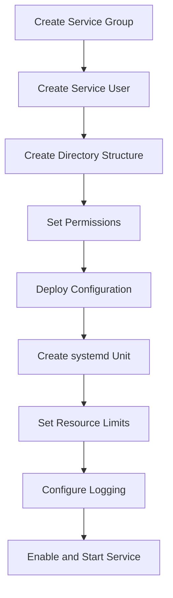

# How to Use Ansible to Create Service Accounts

Author: [nawazdhandala](https://www.github.com/nawazdhandala)

Tags: Ansible, Service Accounts, Security, Linux, DevOps

Description: Learn how to create and manage service accounts with Ansible following the principle of least privilege, including full provisioning workflows.

---

Service accounts are dedicated user accounts that run applications, daemons, and background processes. They are fundamentally different from human user accounts, and treating them the same way leads to security problems. A service account should have no interactive login, no password (or a locked one), and the minimum permissions needed to do its job. Ansible makes it straightforward to create properly configured service accounts at scale.

## What Makes a Service Account Different

A service account differs from a regular user account in several key ways:

| Property | Human User | Service Account |
|----------|-----------|-----------------|
| Login shell | /bin/bash or /bin/zsh | /usr/sbin/nologin |
| Home directory | /home/username | /opt/service or /var/lib/service |
| Password | Set and rotated | Locked or not set |
| UID range | 1000+ | 100-999 (system range) |
| Interactive login | Yes | No |
| SSH keys | For remote access | For service-to-service auth |
| Group membership | Team-based | Service-specific |

## Creating a Basic Service Account

Here is the minimal configuration for a secure service account:

```yaml
# create-service-account.yml - Basic service account
- name: Create a service account
  hosts: all
  become: yes
  tasks:
    - name: Create service group
      ansible.builtin.group:
        name: myapp
        system: yes
        state: present

    - name: Create service account
      ansible.builtin.user:
        name: myapp
        group: myapp
        system: yes
        shell: /usr/sbin/nologin
        home: /opt/myapp
        create_home: yes
        comment: "MyApp Service Account"
        state: present
```

The `system: yes` parameter allocates a UID from the system range. The `nologin` shell prevents anyone from logging in as this user interactively.

## The Service Account Provisioning Workflow

A complete service account setup involves more than just creating the user:



## Complete Service Account Provisioning

Here is a full playbook that handles the entire lifecycle:

```yaml
# provision-service-account.yml - Complete service account setup
- name: Provision application service account
  hosts: appservers
  become: yes
  vars:
    service_name: myapi
    service_port: 8080
    service_user: myapi
    service_group: myapi
    service_home: /opt/myapi
  tasks:
    # Step 1: Create group and user
    - name: Create service group
      ansible.builtin.group:
        name: "{{ service_group }}"
        system: yes
        state: present

    - name: Create service user
      ansible.builtin.user:
        name: "{{ service_user }}"
        group: "{{ service_group }}"
        system: yes
        shell: /usr/sbin/nologin
        home: "{{ service_home }}"
        create_home: yes
        password: "!"
        password_lock: yes
        comment: "{{ service_name }} service account"
        state: present

    # Step 2: Create directory structure
    - name: Create application directories
      ansible.builtin.file:
        path: "{{ item.path }}"
        state: directory
        owner: "{{ service_user }}"
        group: "{{ service_group }}"
        mode: "{{ item.mode }}"
      loop:
        - { path: "{{ service_home }}/bin", mode: "0755" }
        - { path: "{{ service_home }}/conf", mode: "0750" }
        - { path: "{{ service_home }}/data", mode: "0750" }
        - { path: "{{ service_home }}/logs", mode: "0755" }
        - { path: "{{ service_home }}/tmp", mode: "0750" }

    # Step 3: Create log directory
    - name: Create log directory
      ansible.builtin.file:
        path: "/var/log/{{ service_name }}"
        state: directory
        owner: "{{ service_user }}"
        group: "{{ service_group }}"
        mode: "0755"

    # Step 4: Deploy systemd service
    - name: Deploy systemd unit file
      ansible.builtin.copy:
        dest: "/etc/systemd/system/{{ service_name }}.service"
        content: |
          [Unit]
          Description={{ service_name }} Service
          After=network-online.target
          Wants=network-online.target

          [Service]
          Type=simple
          User={{ service_user }}
          Group={{ service_group }}
          WorkingDirectory={{ service_home }}
          ExecStart={{ service_home }}/bin/{{ service_name }} --port {{ service_port }}
          Restart=always
          RestartSec=5

          # Security hardening
          NoNewPrivileges=yes
          ProtectSystem=strict
          ProtectHome=yes
          ReadWritePaths={{ service_home }}/data {{ service_home }}/logs {{ service_home }}/tmp /var/log/{{ service_name }}
          PrivateTmp=yes
          ProtectKernelTunables=yes
          ProtectKernelModules=yes
          ProtectControlGroups=yes

          # Resource limits
          LimitNOFILE=65536
          LimitNPROC=4096

          [Install]
          WantedBy=multi-user.target
        mode: '0644'
      notify: reload systemd

    # Step 5: Configure log rotation
    - name: Configure log rotation
      ansible.builtin.copy:
        dest: "/etc/logrotate.d/{{ service_name }}"
        content: |
          /var/log/{{ service_name }}/*.log {
              daily
              rotate 14
              compress
              delaycompress
              missingok
              notifempty
              create 0644 {{ service_user }} {{ service_group }}
              postrotate
                  systemctl reload {{ service_name }} 2>/dev/null || true
              endscript
          }
        mode: '0644'

  handlers:
    - name: reload systemd
      ansible.builtin.systemd:
        daemon_reload: yes
```

## Service Account for Different Application Types

Different types of applications need slightly different service account configurations.

### Web Application Service Account

```yaml
# webapp-service-account.yml - Web application service account
- name: Create web application service account
  hosts: webservers
  become: yes
  tasks:
    - name: Create webapp group
      ansible.builtin.group:
        name: webapp
        system: yes
        state: present

    - name: Create webapp user
      ansible.builtin.user:
        name: webapp
        group: webapp
        groups:
          - ssl-cert
        append: yes
        system: yes
        shell: /usr/sbin/nologin
        home: /opt/webapp
        create_home: yes
        state: present

    - name: Set up webapp directories
      ansible.builtin.file:
        path: "{{ item }}"
        state: directory
        owner: webapp
        group: webapp
        mode: '0755'
      loop:
        - /opt/webapp/public
        - /opt/webapp/uploads
        - /opt/webapp/sessions
```

### Database Backup Service Account

```yaml
# backup-service-account.yml - Database backup agent
- name: Create backup service account
  hosts: dbservers
  become: yes
  tasks:
    - name: Create backup group
      ansible.builtin.group:
        name: backup_agent
        system: yes
        state: present

    - name: Create backup user
      ansible.builtin.user:
        name: backup_agent
        group: backup_agent
        system: yes
        shell: /bin/bash  # Needs shell for backup scripts
        home: /var/lib/backup_agent
        create_home: yes
        generate_ssh_key: yes
        ssh_key_type: ed25519
        ssh_key_comment: "backup_agent@{{ inventory_hostname }}"
        state: present

    - name: Create backup directories
      ansible.builtin.file:
        path: "{{ item }}"
        state: directory
        owner: backup_agent
        group: backup_agent
        mode: '0750'
      loop:
        - /var/lib/backup_agent/scripts
        - /var/backups/database
```

Notice that the backup agent gets `/bin/bash` as its shell because it needs to run backup scripts. This is one of the few cases where a service account needs a real shell.

### Monitoring Agent Service Account

```yaml
# monitoring-service-account.yml - Monitoring agent
- name: Create monitoring service account
  hosts: all
  become: yes
  tasks:
    - name: Create monitoring group
      ansible.builtin.group:
        name: node_exporter
        system: yes
        state: present

    - name: Create monitoring user
      ansible.builtin.user:
        name: node_exporter
        group: node_exporter
        system: yes
        shell: /usr/sbin/nologin
        create_home: no
        state: present

    - name: Deploy node_exporter binary
      ansible.builtin.copy:
        src: files/node_exporter
        dest: /usr/local/bin/node_exporter
        owner: root
        group: root
        mode: '0755'

    - name: Create node_exporter systemd service
      ansible.builtin.copy:
        dest: /etc/systemd/system/node_exporter.service
        content: |
          [Unit]
          Description=Prometheus Node Exporter
          After=network.target

          [Service]
          Type=simple
          User=node_exporter
          Group=node_exporter
          ExecStart=/usr/local/bin/node_exporter
          Restart=always

          [Install]
          WantedBy=multi-user.target
        mode: '0644'
      notify: reload systemd

  handlers:
    - name: reload systemd
      ansible.builtin.systemd:
        daemon_reload: yes
```

## Reusable Service Account Role

Create a reusable Ansible role for service accounts:

```yaml
# roles/service-account/defaults/main.yml
svc_name: ""
svc_group: "{{ svc_name }}"
svc_home: "/opt/{{ svc_name }}"
svc_shell: /usr/sbin/nologin
svc_create_home: yes
svc_extra_groups: []
svc_directories: []
svc_generate_ssh_key: false
svc_ssh_key_type: ed25519
```

```yaml
# roles/service-account/tasks/main.yml
- name: Create service group
  ansible.builtin.group:
    name: "{{ svc_group }}"
    system: yes
    state: present

- name: Create service account
  ansible.builtin.user:
    name: "{{ svc_name }}"
    group: "{{ svc_group }}"
    groups: "{{ svc_extra_groups | default(omit) }}"
    append: yes
    system: yes
    shell: "{{ svc_shell }}"
    home: "{{ svc_home }}"
    create_home: "{{ svc_create_home }}"
    password: "!"
    password_lock: yes
    generate_ssh_key: "{{ svc_generate_ssh_key }}"
    ssh_key_type: "{{ svc_ssh_key_type }}"
    comment: "{{ svc_name }} service account"
    state: present

- name: Create additional directories
  ansible.builtin.file:
    path: "{{ item.path }}"
    state: directory
    owner: "{{ svc_name }}"
    group: "{{ svc_group }}"
    mode: "{{ item.mode | default('0755') }}"
  loop: "{{ svc_directories }}"
  when: svc_directories | length > 0
```

Use the role:

```yaml
# deploy-services.yml - Deploy multiple service accounts
- name: Deploy service accounts
  hosts: all
  become: yes
  tasks:
    - name: Create Redis service account
      ansible.builtin.include_role:
        name: service-account
      vars:
        svc_name: redis
        svc_home: /var/lib/redis
        svc_directories:
          - { path: /var/lib/redis/data, mode: "0750" }
          - { path: /var/log/redis, mode: "0755" }

    - name: Create Grafana service account
      ansible.builtin.include_role:
        name: service-account
      vars:
        svc_name: grafana
        svc_home: /opt/grafana
        svc_directories:
          - { path: /opt/grafana/data, mode: "0750" }
          - { path: /opt/grafana/plugins, mode: "0755" }
          - { path: /var/log/grafana, mode: "0755" }
```

## Security Hardening for Service Accounts

Apply additional security controls:

```yaml
# harden-service-account.yml - Security hardening
- name: Harden service accounts
  hosts: all
  become: yes
  tasks:
    # Prevent sudo for service accounts
    - name: Ensure no sudoers entries for service accounts
      ansible.builtin.file:
        path: "/etc/sudoers.d/{{ item }}"
        state: absent
      loop:
        - myapp
        - redis
        - prometheus

    # Restrict cron access for service accounts
    - name: Add service accounts to cron.deny
      ansible.builtin.lineinfile:
        path: /etc/cron.deny
        line: "{{ item }}"
        create: yes
      loop:
        - myapp
        - node_exporter
```

## Best Practices

1. **Always use `system: yes`**. System accounts get UIDs from the system range, keeping your UID space organized.

2. **Always set `shell: /usr/sbin/nologin`** unless the service absolutely needs shell access for scripts.

3. **Lock the password**. Use `password: "!"` and `password_lock: yes`. Service accounts should never authenticate with passwords.

4. **Use systemd security features**. `ProtectSystem`, `ProtectHome`, `NoNewPrivileges`, and `PrivateTmp` add defense in depth.

5. **Create dedicated groups**. Each service should have its own group. Sharing groups between services expands the blast radius of a compromise.

6. **Minimize permissions**. Only give the service account access to the directories it actually needs.

7. **Do not put service homes under /home**. Use `/opt`, `/var/lib`, or `/srv`. Reserve `/home` for human users.

8. **Generate SSH keys only when needed**. Most services do not need SSH. Only create keys for services that need to communicate via SSH (like backup agents).

Service accounts are a fundamental building block of secure server architecture. Getting them right with Ansible means every service runs with the minimum privileges it needs, and the configuration is consistent across your entire fleet.
