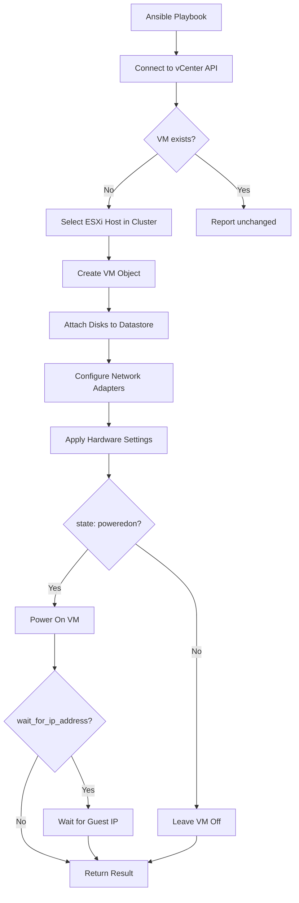

# How to Use Ansible to Create VMware Virtual Machines

Author: [nawazdhandala](https://www.github.com/nawazdhandala)

Tags: Ansible, VMware, Virtual Machines, Automation, vSphere

Description: Step-by-step guide to creating VMware virtual machines with Ansible using the community.vmware.vmware_guest module with practical examples.

---

Creating virtual machines through the vSphere Client is fine when you need one or two, but when you are provisioning dozens of VMs across multiple environments, doing it manually becomes a bottleneck. Ansible's `community.vmware.vmware_guest` module lets you define VMs as code and create them programmatically. In this guide, I will walk through creating VMs from scratch, configuring their hardware, setting up networking, and handling multi-VM deployments.

## Prerequisites

Make sure you have the VMware collection and dependencies installed.

```bash
# Install required components
pip install ansible-core pyVmomi
ansible-galaxy collection install community.vmware
```

## Creating a Basic Virtual Machine

The simplest VM creation requires a name, datacenter, cluster, and some basic hardware specifications.

```yaml
# create-basic-vm.yml
---
- name: Create a basic virtual machine in VMware
  hosts: localhost
  gather_facts: false

  vars:
    vcenter_hostname: "vcenter.example.com"
    vcenter_username: "administrator@vsphere.local"
    vcenter_password: "{{ vault_vcenter_password }}"

  tasks:
    - name: Create virtual machine with minimal configuration
      community.vmware.vmware_guest:
        hostname: "{{ vcenter_hostname }}"
        username: "{{ vcenter_username }}"
        password: "{{ vcenter_password }}"
        validate_certs: false
        name: "web-server-01"
        state: present
        datacenter: "DC01"
        cluster: "Production"
        folder: "/DC01/vm/WebServers"
        guest_id: "rhel9_64Guest"
        disk:
          - size_gb: 50
            type: thin
            datastore: "vsanDatastore"
        hardware:
          memory_mb: 4096
          num_cpus: 2
          num_cpu_cores_per_socket: 1
          scsi: paravirtual
        networks:
          - name: "VLAN-100-Production"
            device_type: vmxnet3
      register: vm_result

    - name: Display VM creation result
      ansible.builtin.debug:
        msg: "VM '{{ vm_result.instance.hw_name }}' created with UUID {{ vm_result.instance.hw_product_uuid }}"
```

## Understanding Guest IDs

The `guest_id` parameter tells vSphere what operating system the VM will run. This affects the default hardware configuration and VMware Tools compatibility. Here are common values.

```yaml
# Common guest_id values for reference
# Red Hat Enterprise Linux
# rhel8_64Guest - RHEL 8 64-bit
# rhel9_64Guest - RHEL 9 64-bit

# CentOS
# centos8_64Guest - CentOS 8 64-bit
# centos9_64Guest - CentOS 9 64-bit

# Ubuntu
# ubuntu64Guest - Ubuntu Linux 64-bit

# Windows
# windows2019srv_64Guest - Windows Server 2019
# windows2022srvNext_64Guest - Windows Server 2022

# Other
# debian11_64Guest - Debian 11 64-bit
# other4xLinux64Guest - Other Linux 4.x or later 64-bit
```

## Creating a VM with Full Configuration

Here is a more complete example that includes networking, multiple disks, and advanced hardware settings.

```yaml
# create-full-vm.yml
---
- name: Create fully configured virtual machine
  hosts: localhost
  gather_facts: false

  module_defaults:
    group/community.vmware.vmware:
      hostname: "{{ vcenter_hostname }}"
      username: "{{ vcenter_username }}"
      password: "{{ vcenter_password }}"
      validate_certs: false

  vars:
    vcenter_hostname: "vcenter.example.com"
    vcenter_username: "administrator@vsphere.local"
    vcenter_password: "{{ vault_vcenter_password }}"

  tasks:
    - name: Create production web server with full configuration
      community.vmware.vmware_guest:
        name: "prod-web-01"
        state: poweredon
        datacenter: "DC01"
        cluster: "Production"
        folder: "/DC01/vm/Production/WebServers"
        guest_id: "rhel9_64Guest"
        # Hardware configuration
        hardware:
          memory_mb: 8192
          memory_reservation_lock: false
          num_cpus: 4
          num_cpu_cores_per_socket: 2
          cpu_hot_add_enabled: true
          cpu_hot_remove_enabled: true
          mem_hot_add_enabled: true
          scsi: paravirtual
          boot_firmware: efi
          secure_boot: true
          version: 19  # VM hardware version
        # Disk configuration - OS disk and data disk
        disk:
          - size_gb: 80
            type: thin
            datastore: "vsanDatastore"
            controller_type: paravirtual
            controller_number: 0
            unit_number: 0
          - size_gb: 200
            type: thin
            datastore: "vsanDatastore"
            controller_type: paravirtual
            controller_number: 0
            unit_number: 1
        # Network configuration - production and management NICs
        networks:
          - name: "VLAN-100-Production"
            device_type: vmxnet3
            ip: "10.100.1.50"
            netmask: "255.255.255.0"
            gateway: "10.100.1.1"
            dns_servers:
              - "10.100.1.10"
              - "10.100.1.11"
            domain: "prod.example.com"
            connected: true
            start_connected: true
          - name: "VLAN-200-Management"
            device_type: vmxnet3
            ip: "10.200.1.50"
            netmask: "255.255.255.0"
            connected: true
            start_connected: true
        # Customization specification for guest OS
        customization:
          hostname: "prod-web-01"
          domain: "prod.example.com"
          dns_servers:
            - "10.100.1.10"
            - "10.100.1.11"
          dns_suffix:
            - "prod.example.com"
        # Wait for the VM's IP to be available
        wait_for_ip_address: true
        wait_for_ip_address_timeout: 300
      register: vm_info

    - name: Display the VM IP address
      ansible.builtin.debug:
        msg: "VM {{ vm_info.instance.hw_name }} is running at {{ vm_info.instance.ipv4 }}"
```

## Bulk VM Creation

When you need to create multiple VMs, use a variable list and a loop.

```yaml
# create-multiple-vms.yml
---
- name: Create multiple virtual machines from a list
  hosts: localhost
  gather_facts: false

  module_defaults:
    group/community.vmware.vmware:
      hostname: "{{ vcenter_hostname }}"
      username: "{{ vcenter_username }}"
      password: "{{ vcenter_password }}"
      validate_certs: false

  vars:
    vcenter_hostname: "vcenter.example.com"
    vcenter_username: "administrator@vsphere.local"
    vcenter_password: "{{ vault_vcenter_password }}"

    # Define all VMs to create
    vm_list:
      - name: "app-server-01"
        cpus: 4
        memory_mb: 8192
        disk_gb: 100
        network: "VLAN-100-Production"
        ip: "10.100.1.51"
        folder: "/DC01/vm/Production/AppServers"
      - name: "app-server-02"
        cpus: 4
        memory_mb: 8192
        disk_gb: 100
        network: "VLAN-100-Production"
        ip: "10.100.1.52"
        folder: "/DC01/vm/Production/AppServers"
      - name: "db-server-01"
        cpus: 8
        memory_mb: 32768
        disk_gb: 500
        network: "VLAN-150-Database"
        ip: "10.150.1.51"
        folder: "/DC01/vm/Production/Databases"

  tasks:
    - name: Create each virtual machine
      community.vmware.vmware_guest:
        name: "{{ item.name }}"
        state: present
        datacenter: "DC01"
        cluster: "Production"
        folder: "{{ item.folder }}"
        guest_id: "rhel9_64Guest"
        hardware:
          memory_mb: "{{ item.memory_mb }}"
          num_cpus: "{{ item.cpus }}"
          scsi: paravirtual
        disk:
          - size_gb: "{{ item.disk_gb }}"
            type: thin
            datastore: "vsanDatastore"
        networks:
          - name: "{{ item.network }}"
            device_type: vmxnet3
            ip: "{{ item.ip }}"
            netmask: "255.255.255.0"
      loop: "{{ vm_list }}"
      register: created_vms

    - name: Show created VM names
      ansible.builtin.debug:
        msg: "Created: {{ item.instance.hw_name }}"
      loop: "{{ created_vms.results }}"
      when: item.changed
```

## VM Creation Workflow

Here is how the VM creation process flows through the vSphere infrastructure.



## Idempotency Considerations

The `vmware_guest` module is idempotent when used correctly. Running the same playbook twice will not create duplicate VMs.

```yaml
# The module checks for existing VMs by name within the specified folder
# If the VM already exists, it compares the current state to the desired state
# and makes changes only if needed

- name: This task is safe to run multiple times
  community.vmware.vmware_guest:
    name: "web-server-01"
    state: present
    datacenter: "DC01"
    folder: "/DC01/vm/WebServers"
    # ... rest of configuration
```

Be careful with the `folder` parameter. If you create a VM in one folder and then change the folder in your playbook, Ansible will create a second VM in the new folder rather than moving the existing one.

## Handling Creation Errors

Wrap VM creation with error handling so failures in one VM do not block the rest.

```yaml
# Robust VM creation with error handling
- name: Create virtual machines with error handling
  block:
    - name: Create the virtual machine
      community.vmware.vmware_guest:
        name: "{{ vm_name }}"
        state: poweredon
        datacenter: "DC01"
        cluster: "Production"
        folder: "/DC01/vm/Production"
        guest_id: "rhel9_64Guest"
        hardware:
          memory_mb: 4096
          num_cpus: 2
        disk:
          - size_gb: 50
            type: thin
            datastore: "vsanDatastore"
        networks:
          - name: "VLAN-100-Production"
            device_type: vmxnet3
        wait_for_ip_address: true
        wait_for_ip_address_timeout: 600
      register: vm_result

  rescue:
    - name: Log the failure
      ansible.builtin.debug:
        msg: "Failed to create VM {{ vm_name }}: {{ ansible_failed_result.msg }}"

    - name: Clean up partially created VM
      community.vmware.vmware_guest:
        name: "{{ vm_name }}"
        state: absent
        datacenter: "DC01"
        force: true
      ignore_errors: true
```

## Post-Creation Configuration

After creating a VM, you often need to wait for it to become reachable and then configure it.

```yaml
# Wait for SSH to become available after VM creation
- name: Wait for SSH on the new VM
  ansible.builtin.wait_for:
    host: "{{ vm_result.instance.ipv4 }}"
    port: 22
    delay: 30
    timeout: 300
  when: vm_result.changed

# Add the new VM to the in-memory inventory
- name: Add new VM to inventory
  ansible.builtin.add_host:
    name: "{{ vm_result.instance.ipv4 }}"
    groups: new_vms
  when: vm_result.changed
```

Creating VMware VMs with Ansible gives you a repeatable, version-controlled process that can scale from one VM to hundreds. The key is defining your VM specifications in variables and letting the `vmware_guest` module handle the vCenter API interactions. Start with basic VMs and gradually add customization, networking, and post-deployment configuration as your needs grow.
