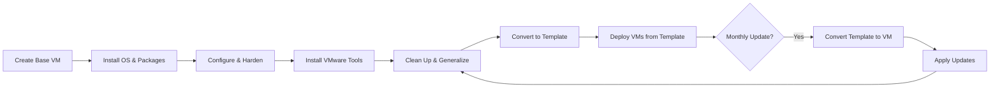

# How to Use Ansible to Create VMware VM Templates

Author: [nawazdhandala](https://www.github.com/nawazdhandala)

Tags: Ansible, VMware, Templates, vSphere, Golden Images

Description: Learn how to create and manage VMware VM templates with Ansible for standardized, repeatable virtual machine deployments across your environment.

---

VM templates are the foundation of any well-managed VMware environment. Instead of building every VM from scratch, you create a golden image with your base OS, security hardening, monitoring agents, and common packages, then stamp out new VMs from that template. Ansible can automate the entire template lifecycle: building the base VM, configuring it, converting it to a template, and keeping it updated. This guide covers practical patterns for template management that I have used in production environments.

## Template Lifecycle

A well-managed template goes through several stages.



## Building a Base VM for the Template

Start by creating a VM that will become your template. This VM gets the OS installed and configured before being converted.

```yaml
# create-template-base.yml
---
- name: Create base VM for template conversion
  hosts: localhost
  gather_facts: false

  module_defaults:
    group/community.vmware.vmware:
      hostname: "{{ vcenter_hostname }}"
      username: "{{ vcenter_username }}"
      password: "{{ vcenter_password }}"
      validate_certs: false

  vars:
    vcenter_hostname: "vcenter.example.com"
    vcenter_username: "administrator@vsphere.local"
    vcenter_password: "{{ vault_vcenter_password }}"
    template_name: "golden-rhel9-base"

  tasks:
    - name: Create the base VM that will become a template
      community.vmware.vmware_guest:
        name: "{{ template_name }}-build"
        state: present
        datacenter: "DC01"
        cluster: "Production"
        folder: "/DC01/vm/Templates/Build"
        guest_id: "rhel9_64Guest"
        hardware:
          memory_mb: 4096
          num_cpus: 2
          num_cpu_cores_per_socket: 2
          scsi: paravirtual
          boot_firmware: efi
          version: 19
        disk:
          - size_gb: 60
            type: thin
            datastore: "vsanDatastore"
        networks:
          - name: "VLAN-100-Production"
            device_type: vmxnet3
        cdrom:
          - controller_number: 0
            unit_number: 0
            type: iso
            iso_path: "[vsanDatastore] ISO/rhel-9.3-x86_64-dvd.iso"
            state: present
      register: base_vm

    - name: Power on VM for OS installation
      community.vmware.vmware_guest_powerstate:
        name: "{{ template_name }}-build"
        folder: "/DC01/vm/Templates/Build"
        state: powered-on
```

## Configuring the Template VM

After the OS is installed (either via kickstart/preseed or manually), configure the VM with your standard packages and settings.

```yaml
# configure-template-vm.yml
---
- name: Configure the base VM before template conversion
  hosts: template_build
  become: true

  tasks:
    - name: Update all packages to latest
      ansible.builtin.dnf:
        name: "*"
        state: latest
        update_cache: true

    - name: Install standard packages for all VMs
      ansible.builtin.dnf:
        name:
          - open-vm-tools
          - chrony
          - rsyslog
          - audit
          - aide
          - firewalld
          - python3
          - curl
          - wget
          - vim
          - tmux
          - lvm2
        state: present

    - name: Enable and start VMware Tools
      ansible.builtin.systemd:
        name: vmtoolsd
        enabled: true
        state: started

    - name: Enable and start chronyd for time sync
      ansible.builtin.systemd:
        name: chronyd
        enabled: true
        state: started

    - name: Configure firewalld default zone
      ansible.posix.firewalld:
        zone: public
        state: enabled
        permanent: true
        immediate: true

    - name: Set standard SSH configuration
      ansible.builtin.lineinfile:
        path: /etc/ssh/sshd_config
        regexp: "{{ item.regexp }}"
        line: "{{ item.line }}"
      loop:
        - regexp: "^#?PermitRootLogin"
          line: "PermitRootLogin no"
        - regexp: "^#?PasswordAuthentication"
          line: "PasswordAuthentication no"
        - regexp: "^#?MaxAuthTries"
          line: "MaxAuthTries 3"

    - name: Deploy standard MOTD
      ansible.builtin.copy:
        content: |
          ============================================
          This system is managed by Ansible.
          Unauthorized access is prohibited.
          ============================================
        dest: /etc/motd
        owner: root
        group: root
        mode: "0644"
```

## Generalizing the VM Before Template Conversion

Before converting to a template, clean up machine-specific data so each clone gets unique identifiers.

```yaml
# generalize-vm.yml
---
- name: Generalize the VM for template conversion
  hosts: template_build
  become: true

  tasks:
    - name: Remove SSH host keys (regenerated on first boot)
      ansible.builtin.file:
        path: "{{ item }}"
        state: absent
      loop:
        - /etc/ssh/ssh_host_rsa_key
        - /etc/ssh/ssh_host_rsa_key.pub
        - /etc/ssh/ssh_host_ecdsa_key
        - /etc/ssh/ssh_host_ecdsa_key.pub
        - /etc/ssh/ssh_host_ed25519_key
        - /etc/ssh/ssh_host_ed25519_key.pub

    - name: Clean machine ID (regenerated on first boot)
      ansible.builtin.copy:
        content: ""
        dest: /etc/machine-id
        owner: root
        group: root
        mode: "0444"

    - name: Remove persistent network rules
      ansible.builtin.file:
        path: /etc/udev/rules.d/70-persistent-net.rules
        state: absent

    - name: Clean DNF cache
      ansible.builtin.command:
        cmd: dnf clean all
      changed_when: true

    - name: Remove temporary files
      ansible.builtin.file:
        path: "{{ item }}"
        state: absent
      loop:
        - /tmp/*
        - /var/tmp/*

    - name: Truncate log files
      ansible.builtin.shell:
        cmd: "find /var/log -type f -exec truncate -s 0 {} \\;"
      changed_when: true

    - name: Remove bash history
      ansible.builtin.file:
        path: /root/.bash_history
        state: absent

    - name: Shutdown the VM for template conversion
      ansible.builtin.command:
        cmd: shutdown -h now
      async: 0
      poll: 0
      ignore_errors: true
```

## Converting a VM to a Template

Once the VM is generalized and powered off, convert it to a template.

```yaml
# convert-to-template.yml
---
- name: Convert VM to template
  hosts: localhost
  gather_facts: false

  module_defaults:
    group/community.vmware.vmware:
      hostname: "{{ vcenter_hostname }}"
      username: "{{ vcenter_username }}"
      password: "{{ vcenter_password }}"
      validate_certs: false

  vars:
    vcenter_hostname: "vcenter.example.com"
    vcenter_username: "administrator@vsphere.local"
    vcenter_password: "{{ vault_vcenter_password }}"
    template_name: "golden-rhel9-base"

  tasks:
    # Wait for the VM to be fully powered off
    - name: Wait for VM to power off
      community.vmware.vmware_guest_info:
        datacenter: "DC01"
        name: "{{ template_name }}-build"
      register: vm_info
      until: vm_info.instance.hw_power_status == "poweredOff"
      retries: 30
      delay: 10

    # Remove the CD-ROM ISO mount
    - name: Disconnect ISO from CD-ROM
      community.vmware.vmware_guest:
        name: "{{ template_name }}-build"
        datacenter: "DC01"
        cdrom:
          - controller_number: 0
            unit_number: 0
            type: none
            state: present

    # Convert the VM to a template
    - name: Convert VM to vSphere template
      community.vmware.vmware_guest:
        name: "{{ template_name }}-build"
        datacenter: "DC01"
        is_template: true

    # Rename the template to its final name
    - name: Rename template to production name
      community.vmware.vmware_guest:
        name: "{{ template_name }}-build"
        datacenter: "DC01"
        name: "{{ template_name }}-{{ ansible_date_time.date | default('2026-02-21') }}"
        is_template: true
```

## Template Update Workflow

Templates should be updated regularly with security patches. Here is the workflow for updating an existing template.

```yaml
# update-template.yml
---
- name: Update an existing VM template
  hosts: localhost
  gather_facts: true

  module_defaults:
    group/community.vmware.vmware:
      hostname: "{{ vcenter_hostname }}"
      username: "{{ vcenter_username }}"
      password: "{{ vcenter_password }}"
      validate_certs: false

  vars:
    vcenter_hostname: "vcenter.example.com"
    vcenter_username: "administrator@vsphere.local"
    vcenter_password: "{{ vault_vcenter_password }}"
    template_name: "golden-rhel9-base-2026-02-21"
    updated_template_name: "golden-rhel9-base-{{ ansible_date_time.date }}"

  tasks:
    # Convert template back to a VM
    - name: Convert template to VM for updates
      community.vmware.vmware_guest:
        name: "{{ template_name }}"
        datacenter: "DC01"
        is_template: false

    # Power on the VM
    - name: Power on the template VM
      community.vmware.vmware_guest_powerstate:
        name: "{{ template_name }}"
        folder: "/DC01/vm/Templates"
        state: powered-on

    # Wait for the VM to be reachable
    - name: Wait for SSH to become available
      community.vmware.vmware_guest_info:
        datacenter: "DC01"
        name: "{{ template_name }}"
      register: template_vm_info
      until: template_vm_info.instance.ipv4 is defined
      retries: 30
      delay: 10

    - name: Add template VM to in-memory inventory
      ansible.builtin.add_host:
        name: "{{ template_vm_info.instance.ipv4 }}"
        groups: template_update

# Run updates on the template VM
- name: Apply updates to template VM
  hosts: template_update
  become: true

  tasks:
    - name: Update all packages
      ansible.builtin.dnf:
        name: "*"
        state: latest
        update_cache: true

    - name: Clean up after updates
      ansible.builtin.command:
        cmd: dnf clean all
      changed_when: true

    - name: Shutdown for re-conversion to template
      ansible.builtin.command:
        cmd: shutdown -h now
      async: 0
      poll: 0
      ignore_errors: true

# Convert back to template
- name: Re-convert updated VM to template
  hosts: localhost
  gather_facts: false

  module_defaults:
    group/community.vmware.vmware:
      hostname: "{{ vcenter_hostname }}"
      username: "{{ vcenter_username }}"
      password: "{{ vcenter_password }}"
      validate_certs: false

  vars:
    vcenter_hostname: "vcenter.example.com"
    vcenter_username: "administrator@vsphere.local"
    vcenter_password: "{{ vault_vcenter_password }}"
    template_name: "golden-rhel9-base-2026-02-21"

  tasks:
    - name: Wait for VM to power off
      community.vmware.vmware_guest_info:
        datacenter: "DC01"
        name: "{{ template_name }}"
      register: vm_state
      until: vm_state.instance.hw_power_status == "poweredOff"
      retries: 30
      delay: 10

    - name: Convert back to template
      community.vmware.vmware_guest:
        name: "{{ template_name }}"
        datacenter: "DC01"
        is_template: true
```

## Managing Multiple Template Versions

Maintaining versioned templates lets you roll back if a new template has issues.

```yaml
# list-templates.yml
- name: List all templates in the Templates folder
  community.vmware.vmware_vm_info:
    hostname: "{{ vcenter_hostname }}"
    username: "{{ vcenter_username }}"
    password: "{{ vcenter_password }}"
    validate_certs: false
    vm_type: template
  register: all_templates

- name: Display templates sorted by name
  ansible.builtin.debug:
    msg: "Template: {{ item.guest_name }}"
  loop: "{{ all_templates.virtual_machines | sort(attribute='guest_name') }}"
```

Good template management is the single biggest factor in how quickly you can provision new VMs and how consistent your environments are. Automate the template build and update process with Ansible, and you will always have a current, hardened, and tested golden image ready for deployment.
