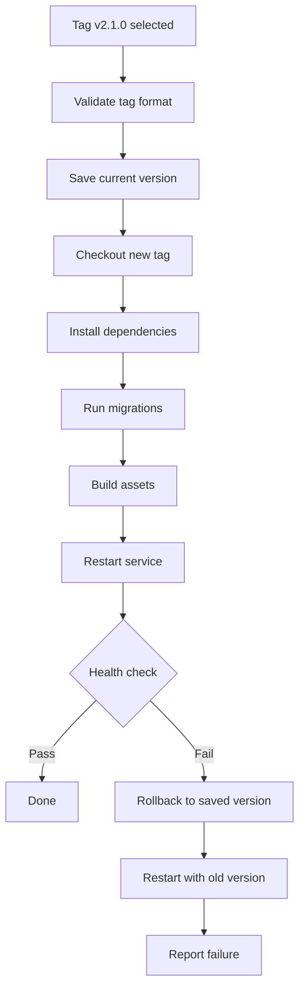

# How to Use Ansible to Deploy Applications from Git with Tags

Author: [nawazdhandala](https://www.github.com/nawazdhandala)

Tags: Ansible, Git, Deployment, Release Management

Description: Learn how to use Ansible for tag-based application deployments from Git with build steps, database migrations, service restarts, and automated rollbacks.

---

Tag-based deployment from Git is one of the most reliable deployment strategies. Each release gets a Git tag, and deploying means checking out a specific tag. This gives you immutable, reproducible deployments with easy rollback capability. This post covers the complete workflow from tag selection to post-deployment verification.

## Basic Tag-Based Deployment

```yaml
# playbook-tag-deploy.yml
# Deploys an application by checking out a specific Git tag
- name: Deploy application from Git tag
  hosts: webservers
  become: true
  vars:
    app_name: myapp
    app_repo: "https://github.com/example/myapp.git"
    app_dir: /opt/myapp
    app_version: "{{ version }}"

  tasks:
    - name: Store previous version
      ansible.builtin.shell: "cd {{ app_dir }} && git describe --tags --exact-match 2>/dev/null || echo 'none'"
      register: prev_version
      changed_when: false
      failed_when: false

    - name: Checkout tagged version
      ansible.builtin.git:
        repo: "{{ app_repo }}"
        dest: "{{ app_dir }}"
        version: "{{ app_version }}"
        force: true
      register: git_result

    - name: Show deployment status
      ansible.builtin.debug:
        msg: "{{ prev_version.stdout }} -> {{ app_version }} (changed: {{ git_result.changed }})"
```

Usage: `ansible-playbook playbook-tag-deploy.yml -e "version=v2.1.0"`

## Complete Deployment Pipeline

```yaml
# playbook-full-pipeline.yml
# Full deployment pipeline: validate, deploy, build, migrate, test, notify
- name: Full tag deployment pipeline
  hosts: webservers
  become: true
  serial: "50%"
  vars:
    app_version: "{{ version }}"
    app_dir: /opt/webapp
    app_user: webapp
    app_service: webapp

  pre_tasks:
    - name: Validate version format
      ansible.builtin.assert:
        that:
          - app_version is match('^v[0-9]+\.[0-9]+\.[0-9]+')
        fail_msg: "Version must match pattern v0.0.0, got: {{ app_version }}"
      run_once: true

  tasks:
    - name: Record deployment start
      ansible.builtin.set_fact:
        deploy_start: "{{ lookup('pipe', 'date +%s') }}"

    - name: Save current version for rollback
      ansible.builtin.shell: "cd {{ app_dir }} && git describe --tags 2>/dev/null || echo 'unknown'"
      register: rollback_version
      changed_when: false

    - name: Deploy new version
      block:
        - name: Pull code at tagged version
          ansible.builtin.git:
            repo: "https://github.com/example/webapp.git"
            dest: "{{ app_dir }}"
            version: "{{ app_version }}"
            force: true
          register: code_pull

        - name: Install system packages
          ansible.builtin.apt:
            name: "{{ item }}"
            state: present
          loop:
            - build-essential
            - libpq-dev
          when: code_pull.changed

        - name: Install Python dependencies
          ansible.builtin.pip:
            requirements: "{{ app_dir }}/requirements.txt"
            virtualenv: "{{ app_dir }}/venv"
            virtualenv_python: python3
          when: code_pull.changed

        - name: Run database migrations
          ansible.builtin.shell: |
            cd {{ app_dir }}
            source venv/bin/activate
            python manage.py migrate --noinput
          become_user: "{{ app_user }}"
          when: code_pull.changed

        - name: Build static assets
          ansible.builtin.shell: |
            cd {{ app_dir }}
            source venv/bin/activate
            python manage.py collectstatic --noinput
          become_user: "{{ app_user }}"
          when: code_pull.changed

        - name: Restart application
          ansible.builtin.systemd:
            name: "{{ app_service }}"
            state: restarted
          when: code_pull.changed

        - name: Wait for application health
          ansible.builtin.uri:
            url: "http://localhost:8080/health"
            status_code: 200
          retries: 15
          delay: 2

      rescue:
        - name: Rollback to previous version
          ansible.builtin.git:
            repo: "https://github.com/example/webapp.git"
            dest: "{{ app_dir }}"
            version: "{{ rollback_version.stdout }}"
            force: true

        - name: Restart with rollback version
          ansible.builtin.systemd:
            name: "{{ app_service }}"
            state: restarted

        - name: Fail with rollback notice
          ansible.builtin.fail:
            msg: "Deployment of {{ app_version }} failed. Rolled back to {{ rollback_version.stdout }}"

    - name: Calculate deployment duration
      ansible.builtin.set_fact:
        deploy_duration: "{{ lookup('pipe', 'date +%s') | int - deploy_start | int }}"

    - name: Report success
      ansible.builtin.debug:
        msg: "Deployed {{ app_version }} in {{ deploy_duration }}s"
```

## Deployment Pipeline Flow



## Multi-Service Tag Deployment

Deploy multiple services that need coordinated versions:

```yaml
# playbook-multi-service.yml
# Deploys multiple interdependent services at specific tagged versions
- name: Deploy microservices
  hosts: webservers
  become: true
  vars:
    release:
      api:
        repo: "https://github.com/example/api.git"
        version: "v3.2.0"
        dest: /opt/api
        service: api-server
      worker:
        repo: "https://github.com/example/worker.git"
        version: "v2.1.0"
        dest: /opt/worker
        service: worker-process
      frontend:
        repo: "https://github.com/example/frontend.git"
        version: "v4.0.0"
        dest: /opt/frontend
        service: null

  tasks:
    - name: Deploy each service
      ansible.builtin.git:
        repo: "{{ item.value.repo }}"
        dest: "{{ item.value.dest }}"
        version: "{{ item.value.version }}"
        force: true
        depth: 1
      loop: "{{ release | dict2items }}"
      loop_control:
        label: "{{ item.key }}@{{ item.value.version }}"
      register: deploy_results

    - name: Build services that changed
      ansible.builtin.shell: "cd {{ item.item.value.dest }} && make build"
      loop: "{{ deploy_results.results }}"
      when: item.changed
      loop_control:
        label: "{{ item.item.key }}"

    - name: Restart services that changed
      ansible.builtin.systemd:
        name: "{{ item.item.value.service }}"
        state: restarted
      loop: "{{ deploy_results.results }}"
      when: item.changed and item.item.value.service is not none
      loop_control:
        label: "{{ item.item.key }}"
```

## Deployment Version Tracking

Keep a record of what is deployed:

```yaml
# playbook-version-tracking.yml
# Tracks deployment versions in a JSON file for auditing
- name: Deploy with version tracking
  hosts: webservers
  become: true
  vars:
    app_version: "{{ version }}"

  tasks:
    - name: Deploy application
      ansible.builtin.git:
        repo: "https://github.com/example/webapp.git"
        dest: /opt/webapp
        version: "{{ app_version }}"
        force: true
      register: deploy

    - name: Update deployment record
      ansible.builtin.copy:
        content: |
          {{ {
            'version': app_version,
            'commit': deploy.after,
            'deployed_at': lookup('pipe', 'date -u +%Y-%m-%dT%H:%M:%SZ'),
            'deployed_by': lookup('env', 'USER'),
            'host': inventory_hostname
          } | to_nice_json(indent=2) }}
        dest: /opt/webapp/DEPLOYMENT.json
      when: deploy.changed

    - name: Append to deployment history
      ansible.builtin.lineinfile:
        path: /var/log/deployments.log
        line: "{{ lookup('pipe', 'date -u +%Y-%m-%dT%H:%M:%SZ') }} {{ app_version }} {{ deploy.after[:12] }} {{ inventory_hostname }}"
        create: true
      when: deploy.changed
```

## Canary Deployment with Tags

Deploy to a subset first, then expand:

```yaml
# playbook-canary.yml
# Canary deployment: deploys to one server first, validates, then rolls out to all
- name: Canary deployment
  hosts: webservers[0]
  become: true
  vars:
    app_version: "{{ version }}"

  tasks:
    - name: Deploy canary
      ansible.builtin.git:
        repo: "https://github.com/example/webapp.git"
        dest: /opt/webapp
        version: "{{ app_version }}"
        force: true

    - name: Wait and verify canary
      ansible.builtin.uri:
        url: "http://localhost:8080/health"
        status_code: 200
      retries: 20
      delay: 3

- name: Validate canary metrics
  hosts: localhost
  gather_facts: false

  tasks:
    - name: Wait for metrics to stabilize
      ansible.builtin.pause:
        minutes: 5
        prompt: "Canary deployed. Check metrics and press Enter to continue or Ctrl+C to abort"

- name: Full rollout
  hosts: webservers[1:]
  become: true
  serial: 2
  vars:
    app_version: "{{ version }}"

  tasks:
    - name: Deploy to remaining servers
      ansible.builtin.git:
        repo: "https://github.com/example/webapp.git"
        dest: /opt/webapp
        version: "{{ app_version }}"
        force: true

    - name: Health check
      ansible.builtin.uri:
        url: "http://localhost:8080/health"
        status_code: 200
      retries: 10
      delay: 3
```

## Summary

Tag-based Git deployment with Ansible gives you reproducible, auditable deployments with built-in rollback capability. The core workflow is: validate the tag, save the current version, checkout the new tag, run build steps, restart services, and verify health. Use `block/rescue` for automatic rollback on failure. Track deployments in a log file or JSON record for auditing. For production environments, use serial deployment, canary releases, or blue-green patterns to minimize risk. Always register the git module output and use `.changed` to skip unnecessary build and restart steps when the code has not actually changed.
