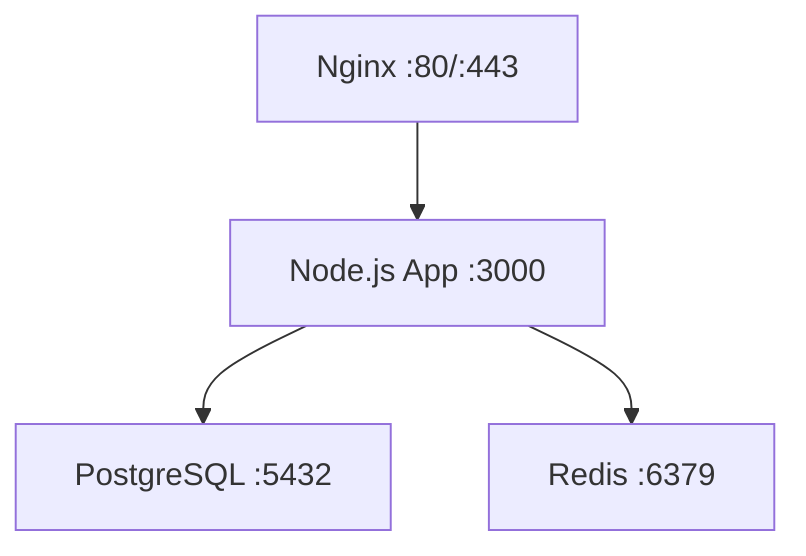

# How to Use Ansible to Deploy Applications with Docker Compose

Author: [nawazdhandala](https://www.github.com/nawazdhandala)

Tags: Ansible, Docker, Docker Compose, Deployment, DevOps

Description: Learn how to automate Docker Compose application deployments using Ansible playbooks for consistent multi-container deployments across environments.

---

Docker Compose is the go-to tool for defining and running multi-container applications on a single host. But deploying Compose stacks to multiple servers, managing environment-specific configurations, and handling secrets across environments still requires manual effort. Ansible bridges that gap by automating the entire deployment lifecycle.

In this post, I will show you how to build an Ansible playbook that installs Docker, deploys a Docker Compose application, manages environment variables securely, and handles rolling updates.

## What We Are Deploying

For this example, we are deploying a typical web application stack: a Node.js API server, a PostgreSQL database, a Redis cache, and an Nginx reverse proxy. The Compose file defines all four services, and Ansible handles getting everything onto the target servers.



## Project Structure

```
deploy-compose/
  inventory/
    hosts.yml
    group_vars/
      production.yml
      staging.yml
  roles/
    docker_install/
      tasks/
        main.yml
    app_deploy/
      tasks/
        main.yml
      templates/
        docker-compose.yml.j2
        .env.j2
        nginx.conf.j2
      defaults/
        main.yml
  playbook.yml
```

## Docker Installation Role

First, we need Docker and Docker Compose installed on the target servers.

```yaml
# roles/docker_install/tasks/main.yml
---
- name: Install required packages
  ansible.builtin.apt:
    name:
      - apt-transport-https
      - ca-certificates
      - curl
      - gnupg
      - lsb-release
      - python3-pip
    state: present
    update_cache: yes
  become: true

- name: Add Docker GPG key
  ansible.builtin.apt_key:
    url: https://download.docker.com/linux/ubuntu/gpg
    state: present
  become: true

- name: Add Docker repository
  ansible.builtin.apt_repository:
    repo: "deb https://download.docker.com/linux/ubuntu {{ ansible_distribution_release }} stable"
    state: present
  become: true

- name: Install Docker Engine and Compose plugin
  ansible.builtin.apt:
    name:
      - docker-ce
      - docker-ce-cli
      - containerd.io
      - docker-compose-plugin
    state: present
    update_cache: yes
  become: true

- name: Install Docker Python library for Ansible modules
  ansible.builtin.pip:
    name:
      - docker
      - docker-compose
    state: present
  become: true

- name: Add deploy user to docker group
  ansible.builtin.user:
    name: "{{ ansible_user }}"
    groups: docker
    append: yes
  become: true

- name: Ensure Docker is running
  ansible.builtin.systemd:
    name: docker
    state: started
    enabled: true
  become: true
```

## Application Deployment Variables

```yaml
# roles/app_deploy/defaults/main.yml
app_name: "myapp"
app_deploy_dir: "/opt/{{ app_name }}"
app_image: "myregistry.com/myapp"
app_image_tag: "latest"

# Database settings
db_name: "myapp_production"
db_user: "myapp"
db_password: "changeme"
db_port: 5432

# Redis settings
redis_port: 6379

# App settings
app_port: 3000
app_env: "production"
app_secret_key: "changeme"
node_env: "production"

# Nginx settings
nginx_server_name: "myapp.com"
nginx_client_max_body_size: "10m"

# Docker settings
docker_registry: ""
docker_registry_username: ""
docker_registry_password: ""
```

## Docker Compose Template

This Jinja2 template generates the `docker-compose.yml` file with environment-specific values.

```yaml
# roles/app_deploy/templates/docker-compose.yml.j2
# Docker Compose configuration for {{ app_name }}
# Generated by Ansible - do not edit manually

version: "3.8"

services:
  app:
    image: {{ app_image }}:{{ app_image_tag }}
    container_name: {{ app_name }}_app
    restart: unless-stopped
    env_file:
      - .env
    depends_on:
      db:
        condition: service_healthy
      redis:
        condition: service_healthy
    networks:
      - app_network
    healthcheck:
      test: ["CMD", "curl", "-f", "http://localhost:{{ app_port }}/health"]
      interval: 30s
      timeout: 10s
      retries: 3
      start_period: 40s

  db:
    image: postgres:16-alpine
    container_name: {{ app_name }}_db
    restart: unless-stopped
    environment:
      POSTGRES_DB: {{ db_name }}
      POSTGRES_USER: {{ db_user }}
      POSTGRES_PASSWORD: {{ db_password }}
    volumes:
      - postgres_data:/var/lib/postgresql/data
    networks:
      - app_network
    healthcheck:
      test: ["CMD-SHELL", "pg_isready -U {{ db_user }} -d {{ db_name }}"]
      interval: 10s
      timeout: 5s
      retries: 5

  redis:
    image: redis:7-alpine
    container_name: {{ app_name }}_redis
    restart: unless-stopped
    command: redis-server --maxmemory 256mb --maxmemory-policy allkeys-lru
    volumes:
      - redis_data:/data
    networks:
      - app_network
    healthcheck:
      test: ["CMD", "redis-cli", "ping"]
      interval: 10s
      timeout: 5s
      retries: 5

  nginx:
    image: nginx:alpine
    container_name: {{ app_name }}_nginx
    restart: unless-stopped
    ports:
      - "80:80"
      - "443:443"
    volumes:
      - ./nginx.conf:/etc/nginx/conf.d/default.conf:ro
    depends_on:
      app:
        condition: service_healthy
    networks:
      - app_network

volumes:
  postgres_data:
    driver: local
  redis_data:
    driver: local

networks:
  app_network:
    driver: bridge
```

## Environment File Template

```bash
# roles/app_deploy/templates/.env.j2
# Application environment variables
# Generated by Ansible - do not edit manually

NODE_ENV={{ node_env }}
APP_ENV={{ app_env }}
APP_PORT={{ app_port }}
APP_SECRET_KEY={{ app_secret_key }}

# Database connection
DATABASE_URL=postgresql://{{ db_user }}:{{ db_password }}@db:{{ db_port }}/{{ db_name }}

# Redis connection
REDIS_URL=redis://redis:{{ redis_port }}
```

## Nginx Configuration Template

```nginx
# roles/app_deploy/templates/nginx.conf.j2
server {
    listen 80;
    server_name {{ nginx_server_name }};
    client_max_body_size {{ nginx_client_max_body_size }};

    location / {
        proxy_pass http://app:{{ app_port }};
        proxy_set_header Host $host;
        proxy_set_header X-Real-IP $remote_addr;
        proxy_set_header X-Forwarded-For $proxy_add_x_forwarded_for;
        proxy_set_header X-Forwarded-Proto $scheme;
    }
}
```

## Deployment Tasks

This is where the main deployment logic lives. It creates the deployment directory, pulls the latest images, deploys the Compose stack, and cleans up old images.

```yaml
# roles/app_deploy/tasks/main.yml
---
- name: Create deployment directory
  ansible.builtin.file:
    path: "{{ app_deploy_dir }}"
    state: directory
    owner: "{{ ansible_user }}"
    group: "{{ ansible_user }}"
    mode: "0750"
  become: true

- name: Log in to Docker registry
  community.docker.docker_login:
    registry_url: "{{ docker_registry }}"
    username: "{{ docker_registry_username }}"
    password: "{{ docker_registry_password }}"
  when: docker_registry | length > 0

- name: Pull latest application image
  community.docker.docker_image:
    name: "{{ app_image }}"
    tag: "{{ app_image_tag }}"
    source: pull
    force_source: yes

- name: Deploy docker-compose.yml
  ansible.builtin.template:
    src: docker-compose.yml.j2
    dest: "{{ app_deploy_dir }}/docker-compose.yml"
    owner: "{{ ansible_user }}"
    group: "{{ ansible_user }}"
    mode: "0640"

- name: Deploy environment file
  ansible.builtin.template:
    src: .env.j2
    dest: "{{ app_deploy_dir }}/.env"
    owner: "{{ ansible_user }}"
    group: "{{ ansible_user }}"
    mode: "0600"

- name: Deploy Nginx configuration
  ansible.builtin.template:
    src: nginx.conf.j2
    dest: "{{ app_deploy_dir }}/nginx.conf"
    owner: "{{ ansible_user }}"
    group: "{{ ansible_user }}"
    mode: "0644"

- name: Start application stack
  ansible.builtin.command:
    cmd: docker compose up -d --remove-orphans
    chdir: "{{ app_deploy_dir }}"
  register: compose_result
  changed_when: "'Started' in compose_result.stderr or 'Creating' in compose_result.stderr"

- name: Wait for application to be healthy
  ansible.builtin.uri:
    url: "http://localhost/health"
    status_code: 200
  register: health_check
  until: health_check.status == 200
  retries: 30
  delay: 5

- name: Clean up unused Docker images
  ansible.builtin.command: docker image prune -af --filter "until=168h"
  changed_when: false
```

## Environment-Specific Variables

```yaml
# inventory/group_vars/production.yml
app_image_tag: "v2.1.0"
app_env: "production"
node_env: "production"
db_password: "{{ vault_db_password }}"
app_secret_key: "{{ vault_app_secret_key }}"
nginx_server_name: "myapp.com"

# inventory/group_vars/staging.yml
# app_image_tag: "develop"
# app_env: "staging"
# node_env: "staging"
# nginx_server_name: "staging.myapp.com"
```

## The Playbook

```yaml
# playbook.yml
---
- name: Deploy application with Docker Compose
  hosts: app_servers
  roles:
    - docker_install
    - app_deploy
```

## Running the Deployment

```bash
# Deploy to production
ansible-playbook -i inventory/hosts.yml playbook.yml --limit production

# Deploy a specific version
ansible-playbook -i inventory/hosts.yml playbook.yml -e "app_image_tag=v2.2.0"

# Deploy with vault for secrets
ansible-playbook -i inventory/hosts.yml playbook.yml --ask-vault-pass
```

## Rolling Back

If something goes wrong, you can roll back by deploying the previous image tag:

```bash
# Roll back to the previous version
ansible-playbook -i inventory/hosts.yml playbook.yml -e "app_image_tag=v2.0.0"
```

## Summary

Using Ansible to deploy Docker Compose applications gives you the best of both worlds: the simplicity of Compose for defining multi-container applications, and the power of Ansible for managing deployments across multiple servers and environments. The template approach means the same Compose file adapts to staging, production, and any other environment you need, with secrets handled securely through Ansible Vault.
