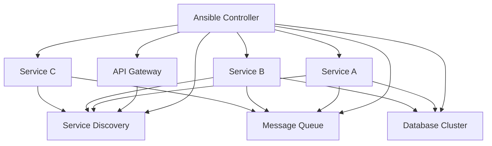

# How to Use Ansible to Deploy Microservices Architecture

Author: [nawazdhandala](https://www.github.com/nawazdhandala)

Tags: Ansible, Microservices, Docker, Kubernetes, DevOps

Description: A hands-on guide to deploying microservices architecture with Ansible, covering service deployment, configuration management, and orchestration patterns.

---

Deploying microservices is fundamentally different from deploying monolithic applications. Instead of one artifact going to one set of servers, you have dozens of services, each with its own configuration, dependencies, and deployment cadence. Ansible handles this well if you structure your automation around the right patterns.

I have used Ansible to manage microservices deployments ranging from five services on a few VMs to forty-plus services across Kubernetes clusters. The key is treating each service as a role while having a top-level orchestration layer that coordinates the deployment order and handles cross-service concerns.

## Architecture Overview

A typical microservices deployment managed by Ansible looks like this:



## Project Structure

Organize your Ansible project with one role per microservice:

```
microservices-deploy/
  inventories/
    production/
      hosts.yml
      group_vars/
        all.yml
        api_gateway.yml
        services.yml
    staging/
  roles/
    common/             # Shared setup (Docker, monitoring agent)
    api_gateway/        # Kong, Traefik, or custom gateway
    service_discovery/  # Consul, etcd
    user_service/       # Individual microservice
    order_service/
    payment_service/
    notification_service/
  playbooks/
    deploy_all.yml
    deploy_service.yml
    rollback.yml
  site.yml
```

## Common Role for Shared Infrastructure

Every microservice host needs Docker, monitoring agents, and log shipping:

```yaml
# roles/common/tasks/main.yml
# Install shared dependencies on all microservice hosts
- name: Install Docker
  ansible.builtin.apt:
    name:
      - docker.io
      - docker-compose-plugin
    state: present
    update_cache: true

- name: Start Docker service
  ansible.builtin.service:
    name: docker
    state: started
    enabled: true

- name: Add deploy user to docker group
  ansible.builtin.user:
    name: "{{ deploy_user }}"
    groups: docker
    append: true

- name: Create shared Docker network
  community.docker.docker_network:
    name: "{{ docker_network_name }}"
    driver: bridge

- name: Deploy log shipping agent
  ansible.builtin.template:
    src: filebeat.yml.j2
    dest: /etc/filebeat/filebeat.yml
  notify: restart filebeat
```

## Microservice Role Pattern

Each microservice follows the same structure:

```yaml
# roles/user_service/defaults/main.yml
# Default configuration for the user service
user_service_image: "registry.example.com/user-service"
user_service_tag: "latest"
user_service_port: 8001
user_service_replicas: 2
user_service_env:
  DATABASE_URL: "postgresql://{{ db_host }}:5432/users"
  REDIS_URL: "redis://{{ redis_host }}:6379/0"
  LOG_LEVEL: "info"
  SERVICE_NAME: "user-service"
user_service_health_check_path: "/health"
user_service_memory_limit: "512m"
user_service_cpu_limit: "0.5"
```

```yaml
# roles/user_service/tasks/main.yml
# Deploy the user service as a Docker container
- name: Pull latest service image
  community.docker.docker_image:
    name: "{{ user_service_image }}"
    tag: "{{ user_service_tag }}"
    source: pull
    force_source: true

- name: Deploy user service container
  community.docker.docker_container:
    name: user-service
    image: "{{ user_service_image }}:{{ user_service_tag }}"
    state: started
    restart_policy: unless-stopped
    networks:
      - name: "{{ docker_network_name }}"
    ports:
      - "{{ user_service_port }}:8080"
    env: "{{ user_service_env }}"
    memory: "{{ user_service_memory_limit }}"
    cpus: "{{ user_service_cpu_limit }}"
    healthcheck:
      test: ["CMD", "curl", "-f", "http://localhost:8080{{ user_service_health_check_path }}"]
      interval: 30s
      timeout: 10s
      retries: 3
      start_period: 40s
    labels:
      service: "user-service"
      version: "{{ user_service_tag }}"
      managed_by: "ansible"
  register: container_result

- name: Wait for service to be healthy
  ansible.builtin.uri:
    url: "http://127.0.0.1:{{ user_service_port }}{{ user_service_health_check_path }}"
    status_code: 200
  register: health_check
  until: health_check.status == 200
  retries: 30
  delay: 5

- name: Register service with service discovery
  ansible.builtin.uri:
    url: "http://{{ consul_host }}:8500/v1/agent/service/register"
    method: PUT
    body_format: json
    body:
      Name: "user-service"
      Port: "{{ user_service_port }}"
      Check:
        HTTP: "http://{{ ansible_host }}:{{ user_service_port }}{{ user_service_health_check_path }}"
        Interval: "30s"
    status_code: 200
```

## Orchestration Playbook

The top-level playbook deploys services in the correct order:

```yaml
# playbooks/deploy_all.yml
# Deploy all microservices in dependency order
- name: Deploy infrastructure services
  hosts: infrastructure
  become: true
  roles:
    - common
    - service_discovery
    - message_queue

- name: Deploy database layer
  hosts: databases
  become: true
  serial: 1  # Rolling update, one at a time
  roles:
    - common
    - database

- name: Deploy backend services
  hosts: backend_services
  become: true
  serial: "50%"  # Deploy to half the hosts at a time
  roles:
    - common
    - user_service
    - order_service
    - payment_service

- name: Deploy frontend gateway
  hosts: api_gateway
  become: true
  serial: 1
  roles:
    - common
    - api_gateway

- name: Run integration smoke tests
  hosts: localhost
  tasks:
    - name: Test API endpoint
      ansible.builtin.uri:
        url: "https://api.example.com/health"
        status_code: 200
      register: api_health

    - name: Verify all services are registered
      ansible.builtin.uri:
        url: "http://{{ consul_host }}:8500/v1/agent/services"
      register: services

    - name: Assert expected services are registered
      ansible.builtin.assert:
        that:
          - "'user-service' in services.json"
          - "'order-service' in services.json"
          - "'payment-service' in services.json"
```

## Single Service Deployment

Deploy a specific service without touching anything else:

```yaml
# playbooks/deploy_service.yml
# Deploy a single microservice by name
- name: Deploy single service
  hosts: "{{ target_hosts }}"
  become: true
  vars:
    service_name: "{{ service | mandatory }}"
  roles:
    - role: "{{ service_name }}"
```

Usage:

```bash
# Deploy only the user service
ansible-playbook playbooks/deploy_service.yml \
  -e service=user_service \
  -e target_hosts=backend_services \
  -e user_service_tag=v2.1.0

# Deploy with a specific image tag
ansible-playbook playbooks/deploy_service.yml \
  -e service=order_service \
  -e target_hosts=backend_services \
  -e order_service_tag=v1.5.3
```

## Rolling Deployments

Handle zero-downtime deployments with serial execution and health checks:

```yaml
# playbooks/rolling_deploy.yml
# Zero-downtime rolling deployment of a microservice
- name: Rolling deployment
  hosts: "{{ target_hosts }}"
  become: true
  serial: 1
  max_fail_percentage: 0
  tasks:
    - name: Remove from load balancer
      ansible.builtin.uri:
        url: "http://{{ lb_api }}/api/servers/{{ inventory_hostname }}/disable"
        method: POST

    - name: Wait for connections to drain
      ansible.builtin.pause:
        seconds: 30

    - name: Deploy new version
      ansible.builtin.include_role:
        name: "{{ service_name }}"

    - name: Run health check
      ansible.builtin.uri:
        url: "http://127.0.0.1:{{ service_port }}/health"
        status_code: 200
      register: health
      until: health.status == 200
      retries: 20
      delay: 5

    - name: Re-enable in load balancer
      ansible.builtin.uri:
        url: "http://{{ lb_api }}/api/servers/{{ inventory_hostname }}/enable"
        method: POST
```

## Environment-Specific Configuration

Use group variables to manage per-environment settings:

```yaml
# inventories/production/group_vars/services.yml
# Production configuration for all microservices
db_host: prod-db-cluster.internal
redis_host: prod-redis.internal
consul_host: prod-consul.internal
docker_network_name: microservices
deploy_user: deploy

user_service_tag: "v2.1.0"
user_service_replicas: 3
user_service_memory_limit: "1g"

order_service_tag: "v1.8.2"
order_service_replicas: 3

payment_service_tag: "v3.0.1"
payment_service_replicas: 2
payment_service_env:
  STRIPE_API_KEY: "{{ vault_stripe_api_key }}"
  PAYMENT_WEBHOOK_SECRET: "{{ vault_payment_webhook_secret }}"
```

## Conclusion

Deploying microservices with Ansible works well when you follow a consistent pattern: one role per service, shared infrastructure in a common role, orchestration playbooks that handle deployment order, and rolling updates for zero downtime. The key is keeping each service role self-contained while using inventory variables to manage environment-specific configuration. This approach scales from a handful of services to dozens without becoming unmanageable.
