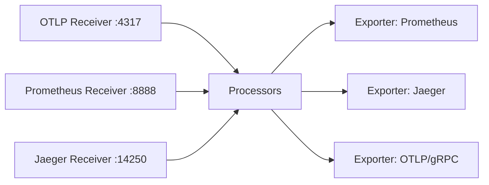

# How to Use Ansible to Deploy OpenTelemetry Collector

Author: [nawazdhandala](https://www.github.com/nawazdhandala)

Tags: Ansible, OpenTelemetry, Observability, Monitoring, DevOps

Description: Automate the deployment of OpenTelemetry Collector using Ansible for unified collection of traces, metrics, and logs across your infrastructure.

---

OpenTelemetry (OTel) is becoming the industry standard for observability data collection. The OpenTelemetry Collector is a vendor-agnostic agent that receives, processes, and exports traces, metrics, and logs. It can replace multiple single-purpose agents (like Prometheus exporters, Jaeger agents, and log shippers) with a single, unified collector. Deploying the OTel Collector across your infrastructure with Ansible gives you consistent observability everywhere.

This post covers building an Ansible role that installs the OpenTelemetry Collector, configures its pipeline for traces, metrics, and logs, and sets up exporters for popular backends.

## OpenTelemetry Collector Pipeline

The collector uses a pipeline model with three stages: receivers (ingest data), processors (transform data), and exporters (send data to backends).



## Project Structure

```
otel-collector/
  inventory/
    hosts.yml
  roles/
    otel_collector/
      tasks/
        main.yml
        install.yml
        configure.yml
      templates/
        otel-collector.yml.j2
        otel-collector.service.j2
      defaults/
        main.yml
      handlers/
        main.yml
  playbook.yml
```

## Default Variables

```yaml
# roles/otel_collector/defaults/main.yml
# Use the "contrib" distribution for more receivers/exporters
otel_collector_distribution: "otelcol-contrib"
otel_collector_version: "0.91.0"
otel_collector_platform: "linux_amd64"

# System user
otel_collector_user: "otel"
otel_collector_group: "otel"

# Directories
otel_collector_install_dir: "/usr/local/bin"
otel_collector_config_dir: "/etc/otel-collector"
otel_collector_data_dir: "/var/lib/otel-collector"

# Receivers
otel_receivers:
  otlp:
    protocols:
      grpc:
        endpoint: "0.0.0.0:4317"
      http:
        endpoint: "0.0.0.0:4318"
  prometheus:
    config:
      scrape_configs:
        - job_name: "otel-collector"
          scrape_interval: 10s
          static_configs:
            - targets: ["localhost:8888"]
  hostmetrics:
    collection_interval: 15s
    scrapers:
      cpu: {}
      memory: {}
      disk: {}
      network: {}
      filesystem: {}
      load: {}

# Processors
otel_processors:
  batch:
    timeout: 5s
    send_batch_size: 1024
    send_batch_max_size: 2048
  memory_limiter:
    check_interval: 1s
    limit_mib: 512
    spike_limit_mib: 128
  resource:
    attributes:
      - key: host.name
        from_attribute: host.name
        action: upsert
      - key: environment
        value: "production"
        action: insert

# Exporters
otel_exporters:
  otlp:
    endpoint: "tempo.example.com:4317"
    tls:
      insecure: true
  prometheus:
    endpoint: "0.0.0.0:8889"
    namespace: "otel"
  logging:
    loglevel: info

# Pipeline configuration
otel_pipelines:
  traces:
    receivers: ["otlp"]
    processors: ["memory_limiter", "batch"]
    exporters: ["otlp", "logging"]
  metrics:
    receivers: ["otlp", "hostmetrics", "prometheus"]
    processors: ["memory_limiter", "resource", "batch"]
    exporters: ["prometheus"]
  logs:
    receivers: ["otlp"]
    processors: ["memory_limiter", "batch"]
    exporters: ["logging"]

# Extensions
otel_extensions:
  health_check:
    endpoint: "0.0.0.0:13133"
  zpages:
    endpoint: "0.0.0.0:55679"
```

## Installation Tasks

```yaml
# roles/otel_collector/tasks/install.yml
---
- name: Create otel group
  ansible.builtin.group:
    name: "{{ otel_collector_group }}"
    system: true
    state: present
  become: true

- name: Create otel user
  ansible.builtin.user:
    name: "{{ otel_collector_user }}"
    group: "{{ otel_collector_group }}"
    shell: /usr/sbin/nologin
    system: true
    create_home: false
  become: true

- name: Create OTel Collector directories
  ansible.builtin.file:
    path: "{{ item }}"
    state: directory
    owner: "{{ otel_collector_user }}"
    group: "{{ otel_collector_group }}"
    mode: "0755"
  loop:
    - "{{ otel_collector_config_dir }}"
    - "{{ otel_collector_data_dir }}"
  become: true

- name: Check installed version
  ansible.builtin.command: "{{ otel_collector_install_dir }}/{{ otel_collector_distribution }} --version"
  register: current_version
  changed_when: false
  failed_when: false

- name: Download OpenTelemetry Collector
  ansible.builtin.get_url:
    url: "https://github.com/open-telemetry/opentelemetry-collector-releases/releases/download/v{{ otel_collector_version }}/{{ otel_collector_distribution }}_{{ otel_collector_version }}_{{ otel_collector_platform }}.tar.gz"
    dest: "/tmp/otel-collector.tar.gz"
    mode: "0644"
  when: current_version.rc != 0 or otel_collector_version not in (current_version.stdout | default(''))

- name: Extract OTel Collector
  ansible.builtin.unarchive:
    src: /tmp/otel-collector.tar.gz
    dest: /tmp/
    remote_src: true
  when: current_version.rc != 0 or otel_collector_version not in (current_version.stdout | default(''))

- name: Install OTel Collector binary
  ansible.builtin.copy:
    src: "/tmp/{{ otel_collector_distribution }}"
    dest: "{{ otel_collector_install_dir }}/{{ otel_collector_distribution }}"
    owner: root
    group: root
    mode: "0755"
    remote_src: true
  become: true
  notify: Restart otel-collector
  when: current_version.rc != 0 or otel_collector_version not in (current_version.stdout | default(''))

- name: Clean up download
  ansible.builtin.file:
    path: /tmp/otel-collector.tar.gz
    state: absent
```

## Configuration Tasks

```yaml
# roles/otel_collector/tasks/configure.yml
---
- name: Deploy OTel Collector configuration
  ansible.builtin.template:
    src: otel-collector.yml.j2
    dest: "{{ otel_collector_config_dir }}/config.yml"
    owner: "{{ otel_collector_user }}"
    group: "{{ otel_collector_group }}"
    mode: "0640"
  become: true
  notify: Restart otel-collector

- name: Validate OTel Collector configuration
  ansible.builtin.command: >
    {{ otel_collector_install_dir }}/{{ otel_collector_distribution }}
    validate
    --config {{ otel_collector_config_dir }}/config.yml
  become: true
  become_user: "{{ otel_collector_user }}"
  changed_when: false

- name: Deploy systemd service
  ansible.builtin.template:
    src: otel-collector.service.j2
    dest: /etc/systemd/system/otel-collector.service
    owner: root
    group: root
    mode: "0644"
  become: true
  notify: Restart otel-collector

- name: Enable and start OTel Collector
  ansible.builtin.systemd:
    name: otel-collector
    state: started
    enabled: true
    daemon_reload: true
  become: true

- name: Verify OTel Collector health
  ansible.builtin.uri:
    url: "http://localhost:13133"
    status_code: 200
  register: health_check
  until: health_check.status == 200
  retries: 10
  delay: 3
```

## OTel Collector Configuration Template

```yaml
# roles/otel_collector/templates/otel-collector.yml.j2
# OpenTelemetry Collector configuration - managed by Ansible

receivers:

  {{ name }}:
{{ config | to_nice_yaml(indent=2) | indent(4, false) }}


processors:

  {{ name }}:
{{ config | to_nice_yaml(indent=2) | indent(4, false) }}


exporters:

  {{ name }}:
{{ config | to_nice_yaml(indent=2) | indent(4, false) }}


extensions:

  {{ name }}:
{{ config | to_nice_yaml(indent=2) | indent(4, false) }}


service:
  extensions: [{{ otel_extensions.keys() | list | join(', ') }}]
  pipelines:

    {{ pipeline_name }}:
      receivers: {{ pipeline_config.receivers | to_json }}
      processors: {{ pipeline_config.processors | to_json }}
      exporters: {{ pipeline_config.exporters | to_json }}


  telemetry:
    logs:
      level: info
    metrics:
      address: 0.0.0.0:8888
```

## Systemd Service Template

```ini
# roles/otel_collector/templates/otel-collector.service.j2
[Unit]
Description=OpenTelemetry Collector
Documentation=https://opentelemetry.io/docs/collector/
After=network-online.target
Wants=network-online.target

[Service]
Type=simple
User={{ otel_collector_user }}
Group={{ otel_collector_group }}
ExecStart={{ otel_collector_install_dir }}/{{ otel_collector_distribution }} --config {{ otel_collector_config_dir }}/config.yml
Restart=always
RestartSec=5

# Security hardening
NoNewPrivileges=true
ProtectSystem=full
ProtectHome=true

# Resource limits
MemoryLimit=1G

[Install]
WantedBy=multi-user.target
```

## Main Tasks

```yaml
# roles/otel_collector/tasks/main.yml
---
- name: Install OpenTelemetry Collector
  ansible.builtin.include_tasks: install.yml

- name: Configure OpenTelemetry Collector
  ansible.builtin.include_tasks: configure.yml
```

## Handlers

```yaml
# roles/otel_collector/handlers/main.yml
---
- name: Restart otel-collector
  ansible.builtin.systemd:
    name: otel-collector
    state: restarted
    daemon_reload: true
  become: true
```

## The Playbook

```yaml
# playbook.yml
---
- name: Deploy OpenTelemetry Collector
  hosts: all
  become: true
  vars:
    otel_exporters:
      otlp:
        endpoint: "otel-backend.internal:4317"
        tls:
          insecure: true
      prometheus:
        endpoint: "0.0.0.0:8889"
        namespace: "otel"
    otel_pipelines:
      traces:
        receivers: ["otlp"]
        processors: ["memory_limiter", "batch"]
        exporters: ["otlp"]
      metrics:
        receivers: ["otlp", "hostmetrics"]
        processors: ["memory_limiter", "resource", "batch"]
        exporters: ["prometheus"]
  roles:
    - otel_collector
```

## Running the Deployment

```bash
# Deploy OTel Collector
ansible-playbook -i inventory/hosts.yml playbook.yml

# Verify the collector is running
curl http://localhost:13133  # Health check
curl http://localhost:8888/metrics  # Internal metrics
curl http://localhost:8889/metrics  # Prometheus exporter
```

## Summary

The OpenTelemetry Collector is a forward-looking choice for observability because it supports all three pillars (traces, metrics, logs) in a single agent. The Ansible role in this post handles the full deployment lifecycle: binary installation with version management, YAML configuration with pipeline definitions, and systemd integration. The pipeline-based configuration model lets you mix and match receivers, processors, and exporters to fit your exact observability stack, whether you use Jaeger for traces, Prometheus for metrics, or an all-in-one platform.
