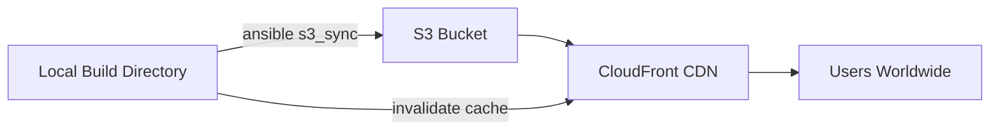

# How to Use Ansible to Deploy Static Sites to S3

Author: [nawazdhandala](https://www.github.com/nawazdhandala)

Tags: Ansible, AWS, S3, Static Sites, DevOps

Description: Automate static website deployments to AWS S3 using Ansible playbooks, including CloudFront distribution setup and cache invalidation.

---

Static site generators like Hugo, Jekyll, and Next.js produce HTML, CSS, and JavaScript files that can be served directly from AWS S3. This is cheap, fast, and highly available. But deploying to S3 involves more than just uploading files. You need to configure the bucket for static website hosting, set correct content types, manage CloudFront cache invalidation, and handle different environments.

Ansible can automate all of this, giving you a one-command deployment pipeline for your static sites.

## What the Playbook Does

Our Ansible playbook will:

1. Create an S3 bucket configured for static website hosting.
2. Set the bucket policy for public read access.
3. Sync the local build directory to S3, setting correct content types.
4. Optionally create a CloudFront distribution for CDN delivery.
5. Invalidate the CloudFront cache after deployment.



## Prerequisites

You need the AWS Ansible collection and boto3 installed:

```bash
# Install the AWS Ansible collection
ansible-galaxy collection install amazon.aws

# Install boto3 for Python
pip install boto3 botocore
```

## Project Structure

```
s3-static-deploy/
  inventory/
    hosts.yml
  roles/
    s3_static_site/
      tasks/
        main.yml
        cloudfront.yml
      defaults/
        main.yml
  playbook.yml
```

## Default Variables

```yaml
# roles/s3_static_site/defaults/main.yml
# S3 bucket configuration
s3_bucket_name: "my-static-site"
s3_region: "us-east-1"

# Local path to the built static site
s3_local_build_dir: "./build"

# Website configuration
s3_index_document: "index.html"
s3_error_document: "404.html"

# Cache control headers for different file types
s3_cache_rules:
  - pattern: "*.html"
    cache_control: "public, max-age=300"
  - pattern: "*.css"
    cache_control: "public, max-age=31536000, immutable"
  - pattern: "*.js"
    cache_control: "public, max-age=31536000, immutable"
  - pattern: "*.png"
    cache_control: "public, max-age=31536000"
  - pattern: "*.jpg"
    cache_control: "public, max-age=31536000"
  - pattern: "*.svg"
    cache_control: "public, max-age=31536000"
  - pattern: "*.woff2"
    cache_control: "public, max-age=31536000"

# CloudFront settings
s3_cloudfront_enabled: false
s3_cloudfront_domain_aliases: []
s3_cloudfront_ssl_cert_arn: ""
s3_cloudfront_price_class: "PriceClass_100"

# AWS credentials (better to use environment variables or IAM roles)
aws_access_key: "{{ lookup('env', 'AWS_ACCESS_KEY_ID') }}"
aws_secret_key: "{{ lookup('env', 'AWS_SECRET_ACCESS_KEY') }}"
```

## Main Deployment Tasks

```yaml
# roles/s3_static_site/tasks/main.yml
---
- name: Create S3 bucket
  amazon.aws.s3_bucket:
    name: "{{ s3_bucket_name }}"
    region: "{{ s3_region }}"
    state: present
    public_access:
      block_public_acls: false
      block_public_policy: false
      ignore_public_acls: false
      restrict_public_buckets: false
    aws_access_key: "{{ aws_access_key }}"
    aws_secret_key: "{{ aws_secret_key }}"

- name: Configure bucket for static website hosting
  amazon.aws.s3_website:
    name: "{{ s3_bucket_name }}"
    region: "{{ s3_region }}"
    state: present
    suffix: "{{ s3_index_document }}"
    error_key: "{{ s3_error_document }}"
    aws_access_key: "{{ aws_access_key }}"
    aws_secret_key: "{{ aws_secret_key }}"

- name: Set bucket policy for public read access
  amazon.aws.s3_bucket:
    name: "{{ s3_bucket_name }}"
    region: "{{ s3_region }}"
    policy: |
      {
        "Version": "2012-10-17",
        "Statement": [
          {
            "Sid": "PublicReadGetObject",
            "Effect": "Allow",
            "Principal": "*",
            "Action": "s3:GetObject",
            "Resource": "arn:aws:s3:::{{ s3_bucket_name }}/*"
          }
        ]
      }
    aws_access_key: "{{ aws_access_key }}"
    aws_secret_key: "{{ aws_secret_key }}"

- name: Sync HTML files with short cache
  amazon.aws.s3_sync:
    bucket: "{{ s3_bucket_name }}"
    region: "{{ s3_region }}"
    file_root: "{{ s3_local_build_dir }}"
    include: "*.html"
    cache_control: "public, max-age=300"
    delete: false
    aws_access_key: "{{ aws_access_key }}"
    aws_secret_key: "{{ aws_secret_key }}"
  register: html_sync

- name: Sync CSS files with long cache
  amazon.aws.s3_sync:
    bucket: "{{ s3_bucket_name }}"
    region: "{{ s3_region }}"
    file_root: "{{ s3_local_build_dir }}"
    include: "*.css"
    cache_control: "public, max-age=31536000, immutable"
    delete: false
    aws_access_key: "{{ aws_access_key }}"
    aws_secret_key: "{{ aws_secret_key }}"
  register: css_sync

- name: Sync JavaScript files with long cache
  amazon.aws.s3_sync:
    bucket: "{{ s3_bucket_name }}"
    region: "{{ s3_region }}"
    file_root: "{{ s3_local_build_dir }}"
    include: "*.js"
    cache_control: "public, max-age=31536000, immutable"
    delete: false
    aws_access_key: "{{ aws_access_key }}"
    aws_secret_key: "{{ aws_secret_key }}"
  register: js_sync

- name: Sync image files with long cache
  amazon.aws.s3_sync:
    bucket: "{{ s3_bucket_name }}"
    region: "{{ s3_region }}"
    file_root: "{{ s3_local_build_dir }}"
    include: "*.png,*.jpg,*.jpeg,*.gif,*.svg,*.ico,*.webp"
    cache_control: "public, max-age=31536000"
    delete: false
    aws_access_key: "{{ aws_access_key }}"
    aws_secret_key: "{{ aws_secret_key }}"
  register: image_sync

- name: Sync font files
  amazon.aws.s3_sync:
    bucket: "{{ s3_bucket_name }}"
    region: "{{ s3_region }}"
    file_root: "{{ s3_local_build_dir }}"
    include: "*.woff,*.woff2,*.ttf,*.eot"
    cache_control: "public, max-age=31536000"
    delete: false
    aws_access_key: "{{ aws_access_key }}"
    aws_secret_key: "{{ aws_secret_key }}"
  register: font_sync

- name: Remove old files from S3 that are not in build
  amazon.aws.s3_sync:
    bucket: "{{ s3_bucket_name }}"
    region: "{{ s3_region }}"
    file_root: "{{ s3_local_build_dir }}"
    delete: true
    aws_access_key: "{{ aws_access_key }}"
    aws_secret_key: "{{ aws_secret_key }}"

- name: Display deployment summary
  ansible.builtin.debug:
    msg: |
      Deployment complete!
      S3 Website URL: http://{{ s3_bucket_name }}.s3-website-{{ s3_region }}.amazonaws.com
      Files synced: HTML={{ html_sync.filelist_actionable | default([]) | length }},
      CSS={{ css_sync.filelist_actionable | default([]) | length }},
      JS={{ js_sync.filelist_actionable | default([]) | length }},
      Images={{ image_sync.filelist_actionable | default([]) | length }}

- name: Set up CloudFront distribution
  ansible.builtin.include_tasks: cloudfront.yml
  when: s3_cloudfront_enabled
```

## CloudFront Distribution Tasks

```yaml
# roles/s3_static_site/tasks/cloudfront.yml
---
- name: Create CloudFront distribution
  amazon.aws.cloudfront_distribution:
    state: present
    caller_reference: "{{ s3_bucket_name }}-{{ ansible_date_time.epoch }}"
    origins:
      - id: "S3-{{ s3_bucket_name }}"
        domain_name: "{{ s3_bucket_name }}.s3-website-{{ s3_region }}.amazonaws.com"
        custom_origin_config:
          http_port: 80
          https_port: 443
          origin_protocol_policy: http-only
    default_cache_behavior:
      target_origin_id: "S3-{{ s3_bucket_name }}"
      viewer_protocol_policy: redirect-to-https
      allowed_methods:
        items: ["GET", "HEAD"]
        cached_methods: ["GET", "HEAD"]
      compress: true
      forwarded_values:
        query_string: false
        cookies:
          forward: none
    default_root_object: "{{ s3_index_document }}"
    price_class: "{{ s3_cloudfront_price_class }}"
    enabled: true
    aliases:
      items: "{{ s3_cloudfront_domain_aliases }}"
    viewer_certificate:
      acm_certificate_arn: "{{ s3_cloudfront_ssl_cert_arn }}"
      ssl_support_method: sni-only
      minimum_protocol_version: TLSv1.2_2021
    aws_access_key: "{{ aws_access_key }}"
    aws_secret_key: "{{ aws_secret_key }}"
  register: cf_distribution
  when: s3_cloudfront_domain_aliases | length > 0

- name: Invalidate CloudFront cache
  ansible.builtin.command: >
    aws cloudfront create-invalidation
    --distribution-id {{ cf_distribution.id | default('') }}
    --paths "/*"
  environment:
    AWS_ACCESS_KEY_ID: "{{ aws_access_key }}"
    AWS_SECRET_ACCESS_KEY: "{{ aws_secret_key }}"
    AWS_DEFAULT_REGION: "{{ s3_region }}"
  when: cf_distribution is defined and cf_distribution.id is defined
  changed_when: true
```

## The Playbook

```yaml
# playbook.yml
---
- name: Deploy static site to S3
  hosts: localhost
  connection: local
  vars:
    s3_bucket_name: "my-company-website"
    s3_region: "us-east-1"
    s3_local_build_dir: "../website/build"
    s3_cloudfront_enabled: true
    s3_cloudfront_domain_aliases:
      - "www.mycompany.com"
    s3_cloudfront_ssl_cert_arn: "arn:aws:acm:us-east-1:123456789:certificate/abc-123"
  roles:
    - s3_static_site
```

## Running the Deployment

```bash
# Build your static site first
cd ../website && npm run build && cd ../s3-static-deploy

# Deploy to S3
ansible-playbook playbook.yml

# Deploy to a different environment
ansible-playbook playbook.yml -e "s3_bucket_name=staging-website"
```

## Handling Multiple Environments

You can use Ansible's variable precedence to manage different environments:

```yaml
# inventory/group_vars/production.yml
s3_bucket_name: "prod-mycompany-website"
s3_cloudfront_enabled: true

# inventory/group_vars/staging.yml
s3_bucket_name: "staging-mycompany-website"
s3_cloudfront_enabled: false
```

## Summary

Deploying static sites to S3 with Ansible gives you a repeatable, environment-aware deployment process. The separate sync operations for different file types ensure that cache headers are set correctly, so HTML pages are refreshed quickly while static assets are cached aggressively. Adding CloudFront on top gives you global CDN delivery with automatic cache invalidation on each deployment.
