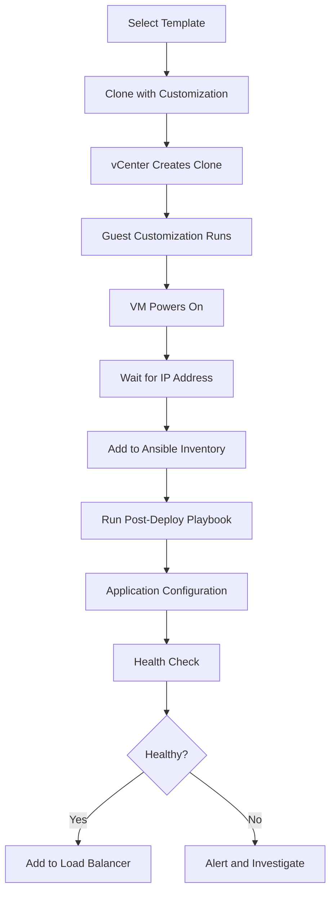

# How to Use Ansible to Deploy VMs from Templates

Author: [nawazdhandala](https://www.github.com/nawazdhandala)

Tags: Ansible, VMware, Templates, Deployment, vSphere

Description: Learn how to deploy VMware virtual machines from templates using Ansible with guest customization, bulk deployments, and post-deploy configuration.

---

Deploying VMs from templates is the bread and butter of VMware provisioning. You take your golden image, clone it with customization, and have a production-ready server in minutes. Doing this with Ansible means the entire process is codified, repeatable, and can be triggered by a CI/CD pipeline or a simple command. This guide covers everything from basic template deployments to complex multi-tier application stacks.

## Basic Deployment from a Template

The simplest deployment uses the `community.vmware.vmware_guest` module with the `template` parameter.

```yaml
# deploy-from-template.yml
---
- name: Deploy a VM from a template
  hosts: localhost
  gather_facts: false

  module_defaults:
    group/community.vmware.vmware:
      hostname: "{{ vcenter_hostname }}"
      username: "{{ vcenter_username }}"
      password: "{{ vcenter_password }}"
      validate_certs: false

  vars:
    vcenter_hostname: "vcenter.example.com"
    vcenter_username: "administrator@vsphere.local"
    vcenter_password: "{{ vault_vcenter_password }}"

  tasks:
    - name: Deploy VM from RHEL 9 template
      community.vmware.vmware_guest:
        name: "web-server-01"
        template: "golden-rhel9-base"
        state: poweredon
        datacenter: "DC01"
        cluster: "Production"
        folder: "/DC01/vm/Production/WebServers"
        datastore: "vsanDatastore"
        wait_for_ip_address: true
        wait_for_ip_address_timeout: 600
      register: deploy_result

    - name: Display deployed VM information
      ansible.builtin.debug:
        msg: >
          VM deployed: {{ deploy_result.instance.hw_name }}
          IP: {{ deploy_result.instance.ipv4 }}
          UUID: {{ deploy_result.instance.hw_product_uuid }}
```

## Deployment with Guest Customization

Guest customization sets the hostname, IP address, DNS, and domain membership during deployment so the VM comes up with its own identity.

```yaml
# deploy-customized.yml
---
- name: Deploy customized VM from template
  hosts: localhost
  gather_facts: false

  module_defaults:
    group/community.vmware.vmware:
      hostname: "{{ vcenter_hostname }}"
      username: "{{ vcenter_username }}"
      password: "{{ vcenter_password }}"
      validate_certs: false

  vars:
    vcenter_hostname: "vcenter.example.com"
    vcenter_username: "administrator@vsphere.local"
    vcenter_password: "{{ vault_vcenter_password }}"

  tasks:
    - name: Deploy VM with full guest customization
      community.vmware.vmware_guest:
        name: "prod-app-05"
        template: "golden-rhel9-base"
        state: poweredon
        datacenter: "DC01"
        cluster: "Production"
        folder: "/DC01/vm/Production/AppServers"
        datastore: "vsanDatastore"
        # Override template hardware if needed
        hardware:
          memory_mb: 8192
          num_cpus: 4
        # Network customization
        networks:
          - name: "VLAN-100-Production"
            device_type: vmxnet3
            ip: "10.100.1.55"
            netmask: "255.255.255.0"
            gateway: "10.100.1.1"
            dns_servers:
              - "10.100.1.10"
              - "10.100.1.11"
            domain: "prod.example.com"
            connected: true
            start_connected: true
        # Guest OS customization
        customization:
          hostname: "prod-app-05"
          domain: "prod.example.com"
          dns_servers:
            - "10.100.1.10"
            - "10.100.1.11"
          dns_suffix:
            - "prod.example.com"
            - "example.com"
        wait_for_ip_address: true
        wait_for_ip_address_timeout: 600
      register: deployed_vm

    - name: Show deployment result
      ansible.builtin.debug:
        msg: "{{ deployed_vm.instance.hw_name }} ready at {{ deployed_vm.instance.ipv4 }}"
```

## Deploying a Multi-Tier Application Stack

Real-world deployments usually involve multiple VMs with different roles. Define the entire stack in variables.

```yaml
# deploy-application-stack.yml
---
- name: Deploy complete application stack from templates
  hosts: localhost
  gather_facts: false

  module_defaults:
    group/community.vmware.vmware:
      hostname: "{{ vcenter_hostname }}"
      username: "{{ vcenter_username }}"
      password: "{{ vcenter_password }}"
      validate_certs: false

  vars:
    vcenter_hostname: "vcenter.example.com"
    vcenter_username: "administrator@vsphere.local"
    vcenter_password: "{{ vault_vcenter_password }}"
    environment: "staging"
    base_ip: "10.150.1"

    # Application stack definition
    app_stack:
      - name: "{{ environment }}-lb-01"
        template: "golden-rhel9-base"
        role: loadbalancer
        cpus: 2
        memory_mb: 4096
        ip: "{{ base_ip }}.10"
        folder: "/DC01/vm/{{ environment | capitalize }}/LoadBalancers"
      - name: "{{ environment }}-web-01"
        template: "golden-rhel9-web"
        role: webserver
        cpus: 2
        memory_mb: 4096
        ip: "{{ base_ip }}.20"
        folder: "/DC01/vm/{{ environment | capitalize }}/WebServers"
      - name: "{{ environment }}-web-02"
        template: "golden-rhel9-web"
        role: webserver
        cpus: 2
        memory_mb: 4096
        ip: "{{ base_ip }}.21"
        folder: "/DC01/vm/{{ environment | capitalize }}/WebServers"
      - name: "{{ environment }}-app-01"
        template: "golden-rhel9-app"
        role: appserver
        cpus: 4
        memory_mb: 8192
        ip: "{{ base_ip }}.30"
        folder: "/DC01/vm/{{ environment | capitalize }}/AppServers"
      - name: "{{ environment }}-db-01"
        template: "golden-rhel9-db"
        role: database
        cpus: 8
        memory_mb: 32768
        ip: "{{ base_ip }}.40"
        folder: "/DC01/vm/{{ environment | capitalize }}/Databases"

  tasks:
    # Create folders for the environment first
    - name: Ensure VM folders exist
      community.vmware.vmware_folder:
        datacenter_name: "DC01"
        folder_name: "{{ item }}"
        folder_type: vm
        state: present
      loop:
        - "{{ environment | capitalize }}"
        - "{{ environment | capitalize }}/LoadBalancers"
        - "{{ environment | capitalize }}/WebServers"
        - "{{ environment | capitalize }}/AppServers"
        - "{{ environment | capitalize }}/Databases"
      ignore_errors: true

    # Deploy all VMs from their respective templates
    - name: Deploy all stack VMs
      community.vmware.vmware_guest:
        name: "{{ item.name }}"
        template: "{{ item.template }}"
        state: poweredon
        datacenter: "DC01"
        cluster: "Production"
        folder: "{{ item.folder }}"
        datastore: "vsanDatastore"
        hardware:
          memory_mb: "{{ item.memory_mb }}"
          num_cpus: "{{ item.cpus }}"
        networks:
          - name: "VLAN-150-Staging"
            ip: "{{ item.ip }}"
            netmask: "255.255.255.0"
            gateway: "{{ base_ip }}.1"
        customization:
          hostname: "{{ item.name }}"
          domain: "{{ environment }}.example.com"
          dns_servers:
            - "{{ base_ip }}.5"
        wait_for_ip_address: true
        wait_for_ip_address_timeout: 600
      loop: "{{ app_stack }}"
      register: deployed_stack

    # Build a summary of the deployed environment
    - name: Display deployment summary
      ansible.builtin.debug:
        msg: "{{ item.item.name }} ({{ item.item.role }}) -> {{ item.instance.ipv4 }}"
      loop: "{{ deployed_stack.results }}"
```

## Deployment Workflow

Here is the full workflow from template to running application.



## Post-Deployment Configuration

After VMs are deployed, run additional configuration specific to their role.

```yaml
# post-deploy-config.yml
---
- name: Post-deployment configuration
  hosts: localhost
  gather_facts: false

  tasks:
    # Add newly deployed VMs to in-memory inventory groups
    - name: Add VMs to inventory based on role
      ansible.builtin.add_host:
        name: "{{ item.instance.ipv4 }}"
        groups: "{{ item.item.role }}"
        vm_name: "{{ item.item.name }}"
      loop: "{{ deployed_stack.results }}"
      when: item.changed

# Configure web servers
- name: Configure web server role
  hosts: webserver
  become: true
  tasks:
    - name: Install and configure nginx
      ansible.builtin.dnf:
        name: nginx
        state: present

    - name: Enable nginx
      ansible.builtin.systemd:
        name: nginx
        enabled: true
        state: started

# Configure database servers
- name: Configure database role
  hosts: database
  become: true
  tasks:
    - name: Install PostgreSQL
      ansible.builtin.dnf:
        name:
          - postgresql-server
          - postgresql
        state: present

    - name: Initialize PostgreSQL
      ansible.builtin.command:
        cmd: postgresql-setup --initdb
        creates: /var/lib/pgsql/data/PG_VERSION
```

## Using Customization Specifications

For more complex customizations, use vCenter's built-in customization specifications.

```yaml
# deploy-with-custspec.yml
- name: Deploy VM using a vCenter customization specification
  community.vmware.vmware_guest:
    hostname: "{{ vcenter_hostname }}"
    username: "{{ vcenter_username }}"
    password: "{{ vcenter_password }}"
    validate_certs: false
    name: "prod-web-10"
    template: "golden-rhel9-base"
    state: poweredon
    datacenter: "DC01"
    cluster: "Production"
    folder: "/DC01/vm/Production/WebServers"
    datastore: "vsanDatastore"
    # Use a pre-defined customization spec from vCenter
    customization_spec: "Linux-Standard-CustomSpec"
    # Override specific network settings
    networks:
      - name: "VLAN-100-Production"
        ip: "10.100.1.60"
        netmask: "255.255.255.0"
        gateway: "10.100.1.1"
    wait_for_ip_address: true
```

## Tear Down Deployed Environments

When a staging or test environment is no longer needed, clean it up.

```yaml
# teardown-stack.yml
- name: Tear down the application stack
  hosts: localhost
  gather_facts: false

  tasks:
    - name: Power off and remove all stack VMs
      community.vmware.vmware_guest:
        hostname: "{{ vcenter_hostname }}"
        username: "{{ vcenter_username }}"
        password: "{{ vcenter_password }}"
        validate_certs: false
        name: "{{ item.name }}"
        datacenter: "DC01"
        state: absent
        force: true
      loop: "{{ app_stack }}"
```

Deploying VMs from templates with Ansible transforms what used to be a multi-step manual process into a single command that provisions entire environments. The combination of template-based cloning, guest customization, and post-deployment configuration gives you a complete provisioning pipeline. Start with single VM deployments, build up to multi-tier stacks, and eventually integrate with your CI/CD pipeline for on-demand environment creation.
