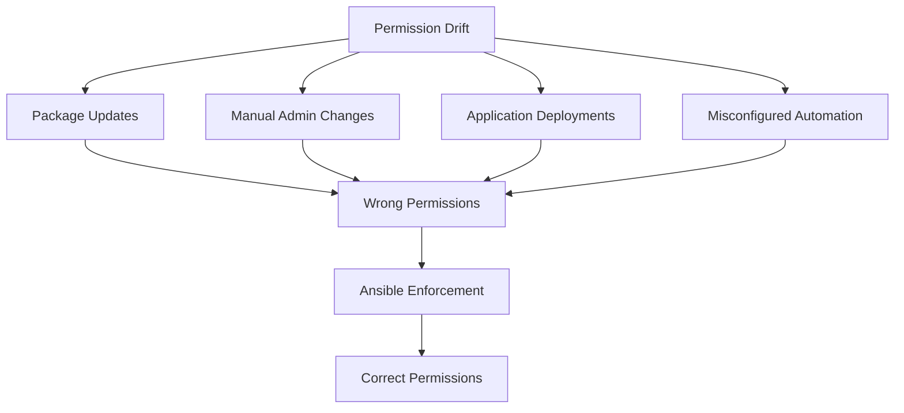

# How to Use Ansible to Enforce File System Permissions

Author: [nawazdhandala](https://www.github.com/nawazdhandala)

Tags: Ansible, File Permissions, Security, Linux, Compliance

Description: Use Ansible to audit and enforce file system permissions across your Linux servers for consistent security posture and compliance adherence.

---

File permissions are the first line of defense on a Linux system. Incorrectly set permissions can let unprivileged users read sensitive configuration files, modify system binaries, or escalate their privileges. The challenge is that permissions drift over time. Package updates, manual administration, and application deployments can all leave files with overly permissive settings.

Ansible lets you define the correct permissions once and enforce them everywhere, every time. In this post, I will show you how to audit, set, and continuously enforce file system permissions across your infrastructure.

## Common Permission Problems

Before writing playbooks, it helps to understand what "wrong" looks like. Here are the most common permission issues I see in the wild:

- World-readable private keys (`/etc/ssl/private/*.key` with mode 644 instead of 600)
- World-writable directories without sticky bit (`/tmp` without the sticky bit)
- SUID/SGID bits on unnecessary binaries
- Configuration files readable by all users (database passwords, API keys)
- Log files with overly permissive write access



## Enforcing Critical File Permissions

Let's start with a playbook that enforces correct permissions on the most security-sensitive files.

This playbook sets proper permissions on critical system files:

```yaml
# enforce_permissions.yml - Enforce permissions on critical files
---
- name: Enforce file system permissions
  hosts: all
  become: true

  tasks:
    - name: Set permissions on /etc/passwd
      ansible.builtin.file:
        path: /etc/passwd
        owner: root
        group: root
        mode: '0644'

    - name: Set permissions on /etc/shadow
      ansible.builtin.file:
        path: /etc/shadow
        owner: root
        group: shadow
        mode: '0640'

    - name: Set permissions on /etc/group
      ansible.builtin.file:
        path: /etc/group
        owner: root
        group: root
        mode: '0644'

    - name: Set permissions on /etc/gshadow
      ansible.builtin.file:
        path: /etc/gshadow
        owner: root
        group: shadow
        mode: '0640'

    - name: Set permissions on SSH configuration
      ansible.builtin.file:
        path: /etc/ssh/sshd_config
        owner: root
        group: root
        mode: '0600'

    - name: Set permissions on SSH host private keys
      ansible.builtin.file:
        path: "{{ item }}"
        owner: root
        group: root
        mode: '0600'
      with_fileglob:
        - /etc/ssh/ssh_host_*_key

    - name: Set permissions on SSH host public keys
      ansible.builtin.file:
        path: "{{ item }}"
        owner: root
        group: root
        mode: '0644'
      with_fileglob:
        - /etc/ssh/ssh_host_*_key.pub

    - name: Set permissions on crontab files
      ansible.builtin.file:
        path: "{{ item }}"
        owner: root
        group: root
        mode: '0600'
      loop:
        - /etc/crontab
      failed_when: false

    - name: Set permissions on cron directories
      ansible.builtin.file:
        path: "{{ item }}"
        owner: root
        group: root
        mode: '0700'
      loop:
        - /etc/cron.d
        - /etc/cron.daily
        - /etc/cron.hourly
        - /etc/cron.weekly
        - /etc/cron.monthly
      failed_when: false
```

## Securing SSL/TLS Certificate Files

Private keys need strict permissions. A world-readable private key is a critical vulnerability.

This playbook enforces permissions on all SSL/TLS related files:

```yaml
# ssl_permissions.yml - Enforce SSL file permissions
---
- name: Enforce SSL/TLS file permissions
  hosts: all
  become: true

  tasks:
    - name: Find all private key files
      ansible.builtin.find:
        paths:
          - /etc/ssl/private
          - /etc/pki/tls/private
          - /etc/letsencrypt/live
        patterns: "*.key,*.pem,privkey*.pem"
        recurse: true
      register: private_keys

    - name: Restrict private key permissions
      ansible.builtin.file:
        path: "{{ item.path }}"
        owner: root
        group: root
        mode: '0600'
      loop: "{{ private_keys.files }}"

    - name: Set permissions on SSL directories
      ansible.builtin.file:
        path: "{{ item }}"
        owner: root
        group: root
        mode: '0700'
      loop:
        - /etc/ssl/private
        - /etc/pki/tls/private
      failed_when: false

    - name: Set permissions on certificate files (public)
      ansible.builtin.find:
        paths:
          - /etc/ssl/certs
          - /etc/pki/tls/certs
        patterns: "*.crt,*.pem"
        recurse: true
      register: cert_files

    - name: Set certificate file permissions
      ansible.builtin.file:
        path: "{{ item.path }}"
        owner: root
        group: root
        mode: '0644'
      loop: "{{ cert_files.files }}"
```

## Finding and Removing World-Writable Files

World-writable files outside of expected locations (like /tmp) are a red flag.

This playbook finds and reports world-writable files:

```yaml
# find_world_writable.yml - Find world-writable files
---
- name: Find world-writable files
  hosts: all
  become: true

  vars:
    excluded_dirs:
      - /proc
      - /sys
      - /dev
      - /tmp
      - /var/tmp
      - /run

  tasks:
    - name: Find world-writable files (excluding expected locations)
      ansible.builtin.shell: |
        find / \
          -path {{ dir }} -prune -o  \
          -type f -perm -0002 -print 2>/dev/null
      register: world_writable_files
      changed_when: false

    - name: Report world-writable files
      ansible.builtin.debug:
        msg: "World-writable files on {{ inventory_hostname }}: {{ world_writable_files.stdout_lines }}"
      when: world_writable_files.stdout_lines | length > 0

    - name: Remove world-writable bit from unexpected files
      ansible.builtin.file:
        path: "{{ item }}"
        mode: "o-w"
      loop: "{{ world_writable_files.stdout_lines }}"
      when: world_writable_files.stdout_lines | length > 0
```

## Auditing SUID/SGID Binaries

SUID and SGID bits allow programs to run with elevated privileges. Unauthorized SUID binaries are a common privilege escalation vector.

This playbook audits SUID/SGID binaries against a known-good list:

```yaml
# audit_suid.yml - Audit SUID/SGID binaries
---
- name: Audit SUID/SGID binaries
  hosts: all
  become: true

  vars:
    # Known legitimate SUID binaries
    expected_suid_binaries:
      - /usr/bin/sudo
      - /usr/bin/passwd
      - /usr/bin/chfn
      - /usr/bin/chsh
      - /usr/bin/newgrp
      - /usr/bin/gpasswd
      - /usr/bin/su
      - /usr/lib/openssh/ssh-keysign
      - /usr/lib/dbus-1.0/dbus-daemon-launch-helper
      - /usr/bin/mount
      - /usr/bin/umount
      - /usr/bin/pkexec

  tasks:
    - name: Find all SUID binaries
      ansible.builtin.shell: find / -perm -4000 -type f 2>/dev/null
      register: suid_binaries
      changed_when: false

    - name: Find all SGID binaries
      ansible.builtin.shell: find / -perm -2000 -type f 2>/dev/null
      register: sgid_binaries
      changed_when: false

    - name: Identify unexpected SUID binaries
      ansible.builtin.set_fact:
        unexpected_suid: "{{ suid_binaries.stdout_lines | difference(expected_suid_binaries) }}"

    - name: Report unexpected SUID binaries
      ansible.builtin.debug:
        msg: "ALERT: Unexpected SUID binaries on {{ inventory_hostname }}: {{ unexpected_suid }}"
      when: unexpected_suid | length > 0

    - name: Remove SUID from unauthorized binaries
      ansible.builtin.file:
        path: "{{ item }}"
        mode: "u-s"
      loop: "{{ unexpected_suid }}"
      when:
        - unexpected_suid | length > 0
        - remove_unauthorized_suid | default(false) | bool
```

## Directory Permission Enforcement

Certain directories need specific permissions to prevent unauthorized access.

This playbook enforces directory permissions:

```yaml
# directory_permissions.yml - Enforce directory permissions
---
- name: Enforce directory permissions
  hosts: all
  become: true

  vars:
    directory_permissions:
      - path: /root
        owner: root
        group: root
        mode: '0700'
      - path: /etc/ssh
        owner: root
        group: root
        mode: '0755'
      - path: /var/log
        owner: root
        group: syslog
        mode: '0775'
      - path: /tmp
        owner: root
        group: root
        mode: '1777'  # Sticky bit
      - path: /var/tmp
        owner: root
        group: root
        mode: '1777'  # Sticky bit
      - path: /boot
        owner: root
        group: root
        mode: '0755'
      - path: /etc/sudoers.d
        owner: root
        group: root
        mode: '0750'

  tasks:
    - name: Set directory permissions
      ansible.builtin.file:
        path: "{{ item.path }}"
        owner: "{{ item.owner }}"
        group: "{{ item.group }}"
        mode: "{{ item.mode }}"
        state: directory
      loop: "{{ directory_permissions }}"
      failed_when: false
```

## Home Directory Permissions

User home directories should not be readable by other users.

This playbook enforces home directory permissions:

```yaml
# home_permissions.yml - Enforce home directory permissions
---
- name: Enforce home directory permissions
  hosts: all
  become: true

  tasks:
    - name: Get list of user home directories
      ansible.builtin.shell: |
        awk -F: '$3 >= 1000 && $3 < 65534 {print $6}' /etc/passwd
      register: home_dirs
      changed_when: false

    - name: Set home directory permissions to 750
      ansible.builtin.file:
        path: "{{ item }}"
        mode: '0750'
      loop: "{{ home_dirs.stdout_lines }}"
      when: item != ""
      failed_when: false

    - name: Check for .ssh directory permissions
      ansible.builtin.find:
        paths: "{{ home_dirs.stdout_lines }}"
        patterns: ".ssh"
        file_type: directory
        hidden: true
      register: ssh_dirs
      failed_when: false

    - name: Fix .ssh directory permissions
      ansible.builtin.file:
        path: "{{ item.path }}"
        mode: '0700'
      loop: "{{ ssh_dirs.files }}"
      when: ssh_dirs.files | length > 0

    - name: Find authorized_keys files
      ansible.builtin.find:
        paths: "{{ home_dirs.stdout_lines }}"
        patterns: "authorized_keys"
        recurse: true
        hidden: true
      register: authkeys_files
      failed_when: false

    - name: Fix authorized_keys permissions
      ansible.builtin.file:
        path: "{{ item.path }}"
        mode: '0600'
      loop: "{{ authkeys_files.files }}"
```

## Building a Permission Enforcement Role

For regular use, package this as a role:

```yaml
# roles/file_permissions/defaults/main.yml
---
permissions_enforce_system_files: true
permissions_enforce_ssl: true
permissions_enforce_home_dirs: true
permissions_audit_suid: true
permissions_remove_world_writable: true
permissions_report_only: false  # Set to true for audit mode
```

```yaml
# roles/file_permissions/tasks/main.yml
---
- name: Enforce system file permissions
  ansible.builtin.include_tasks: system_files.yml
  when: permissions_enforce_system_files

- name: Enforce SSL permissions
  ansible.builtin.include_tasks: ssl_files.yml
  when: permissions_enforce_ssl

- name: Enforce home directory permissions
  ansible.builtin.include_tasks: home_dirs.yml
  when: permissions_enforce_home_dirs

- name: Audit SUID binaries
  ansible.builtin.include_tasks: suid_audit.yml
  when: permissions_audit_suid

- name: Handle world-writable files
  ansible.builtin.include_tasks: world_writable.yml
  when: permissions_remove_world_writable
```

## Compliance Reporting

Generate a compliance report for audit purposes:

```yaml
# permission_report.yml - Generate compliance report
---
- name: Permission compliance report
  hosts: all
  become: true

  tasks:
    - name: Check critical file permissions
      ansible.builtin.stat:
        path: "{{ item.path }}"
      loop:
        - { path: "/etc/passwd", expected_mode: "0644" }
        - { path: "/etc/shadow", expected_mode: "0640" }
        - { path: "/etc/ssh/sshd_config", expected_mode: "0600" }
      register: file_stats

    - name: Evaluate compliance
      ansible.builtin.set_fact:
        compliance_results: >-
          
          
          
          
          
          {{ results.append({'file': item.item.path, 'expected': expected, 'actual': actual, 'status': status}) }}
          
          {{ results }}

    - name: Display compliance report
      ansible.builtin.debug:
        msg: "{{ item }}"
      loop: "{{ compliance_results }}"
```

## Key Takeaways

1. **Run permission enforcement regularly.** Permissions drift constantly. Schedule Ansible runs to catch and fix drift before it becomes a problem.
2. **Start with audit mode.** Before enforcing, run in report-only mode to see what would change. Fixing permissions on the wrong files can break applications.
3. **Focus on the high-value targets.** Private keys, shadow files, and SSH configuration are the most critical. Get those right first.
4. **Track SUID binaries.** Any new SUID binary is suspicious. Maintain a baseline and alert on changes.
5. **Do not forget about new files.** Enforcing permissions on existing files is not enough if new files are created with wrong permissions. Use umask settings and directory default ACLs to handle new files.

File permission enforcement with Ansible turns a tedious manual audit into an automated, continuous process. Define the correct state once, and let Ansible maintain it everywhere.
