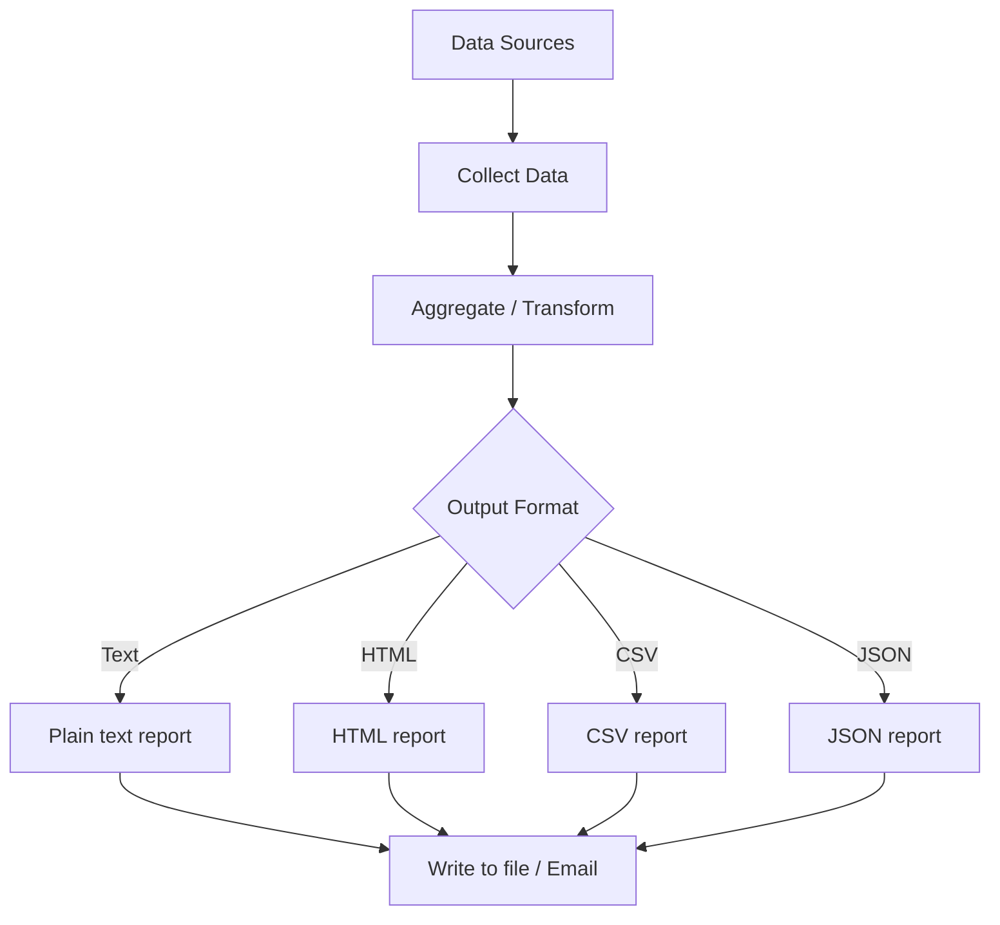

# How to Use Ansible to Generate Reports from Data

Author: [nawazdhandala](https://www.github.com/nawazdhandala)

Tags: Ansible, Reporting, Templates, Automation

Description: Learn how to use Ansible to generate infrastructure reports from gathered facts, API data, and custom variables using Jinja2 templates and data aggregation.

---

Ansible is not just a configuration management tool. It is also a powerful data collection and reporting engine. You can gather information from every host in your fleet, aggregate the data, and generate reports in any format you need. This post shows practical patterns for building reports with Ansible.

## Basic Report from Gathered Facts

The simplest report comes from collecting facts across all hosts:

```yaml
# playbook-basic-report.yml
# Gathers facts from all hosts and generates a text infrastructure report
- name: Gather facts from all hosts
  hosts: all
  gather_facts: true

- name: Generate infrastructure report
  hosts: localhost
  gather_facts: false

  tasks:
    - name: Build report data
      ansible.builtin.set_fact:
        report_data: >-
          
          
          
          
          
          
          
          {{ result }}

    - name: Generate text report
      ansible.builtin.copy:
        content: |
          ====================================
          Infrastructure Report
          Generated: {{ ansible_date_time.iso8601 | default(lookup('pipe', 'date -u +%Y-%m-%dT%H:%M:%SZ')) }}
          ====================================

          Total Hosts: {{ report_data | length }}

          
          Host: {{ host.hostname }}
            OS:        {{ host.os }}
            Kernel:    {{ host.kernel }}
            CPUs:      {{ host.cpus }}
            Memory:    {{ host.memory_gb }} GB
            Uptime:    {{ host.uptime_days }} days
          

          ====================================
          Summary
          ====================================
          Total CPUs:    {{ report_data | map(attribute='cpus') | sum }}
          Total Memory:  {{ report_data | map(attribute='memory_gb') | sum | round(1) }} GB
          Avg Uptime:    {{ (report_data | map(attribute='uptime_days') | sum / report_data | length) | round(1) }} days
        dest: /tmp/infrastructure_report.txt

    - name: Show report location
      ansible.builtin.debug:
        msg: "Report written to /tmp/infrastructure_report.txt"
```

## Generating HTML Reports

For a richer format, generate HTML:

```yaml
# playbook-html-report.yml
# Generates an HTML infrastructure report with a styled table
- name: Gather data
  hosts: all
  gather_facts: true

- name: Generate HTML report
  hosts: localhost
  gather_facts: false

  tasks:
    - name: Build host data
      ansible.builtin.set_fact:
        hosts_data: >-
          
          
          
          
          
          
          
          {{ result }}

    - name: Write HTML report
      ansible.builtin.copy:
        content: |
          <!DOCTYPE html>
          <html>
          <head>
            <title>Infrastructure Report</title>
            <style>
              body { font-family: Arial, sans-serif; margin: 20px; }
              table { border-collapse: collapse; width: 100%; }
              th, td { border: 1px solid #ddd; padding: 8px; text-align: left; }
              th { background-color: #4CAF50; color: white; }
              tr:nth-child(even) { background-color: #f2f2f2; }
              .summary { background: #e7f3fe; padding: 15px; border-radius: 5px; margin: 20px 0; }
            </style>
          </head>
          <body>
            <h1>Infrastructure Report</h1>
            <div class="summary">
              <strong>Total Hosts:</strong> {{ hosts_data | length }} |
              <strong>Total CPUs:</strong> {{ hosts_data | map(attribute='cpus') | sum }} |
              <strong>Total Memory:</strong> {{ hosts_data | map(attribute='mem_gb') | sum | round(1) }} GB
            </div>
            <table>
              <tr>
                <th>Hostname</th>
                <th>IP Address</th>
                <th>OS</th>
                <th>CPUs</th>
                <th>Memory (GB)</th>
                <th>Root Disk (GB)</th>
              </tr>
              
              <tr>
                <td>{{ host.name }}</td>
                <td>{{ host.ip }}</td>
                <td>{{ host.os }}</td>
                <td>{{ host.cpus }}</td>
                <td>{{ host.mem_gb }}</td>
                <td>{{ host.disk_gb }}</td>
              </tr>
              
            </table>
          </body>
          </html>
        dest: /tmp/infrastructure_report.html
```

## Report Generation Flow



## Generating CSV Reports

CSV is useful for importing into spreadsheets:

```yaml
# playbook-csv-report.yml
# Generates a CSV report of all hosts with key metrics
- name: Gather data
  hosts: all
  gather_facts: true

- name: Generate CSV report
  hosts: localhost
  gather_facts: false

  tasks:
    - name: Write CSV report
      ansible.builtin.copy:
        content: |
          hostname,ip_address,os,os_version,cpus,memory_mb,uptime_seconds
          
          
          
          {{ host }},{{ f.get('default_ipv4', {}).get('address', 'N/A') }},{{ f.get('distribution', 'N/A') }},{{ f.get('distribution_version', 'N/A') }},{{ f.get('processor_vcpus', 0) }},{{ f.get('memtotal_mb', 0) }},{{ f.get('uptime_seconds', 0) }}
          
          
        dest: /tmp/infrastructure_report.csv
```

## Service Status Report

```yaml
# playbook-service-report.yml
# Collects service status from all hosts and generates a status matrix report
- name: Collect service status
  hosts: all
  gather_facts: false

  tasks:
    - name: Check critical services
      ansible.builtin.service_facts:

    - name: Store service status
      ansible.builtin.set_fact:
        critical_services:
          nginx: "{{ ansible_facts.services.get('nginx.service', {}).get('state', 'not installed') }}"
          postgresql: "{{ ansible_facts.services.get('postgresql.service', {}).get('state', 'not installed') }}"
          docker: "{{ ansible_facts.services.get('docker.service', {}).get('state', 'not installed') }}"
          sshd: "{{ ansible_facts.services.get('sshd.service', {}).get('state', 'not installed') }}"

- name: Generate service report
  hosts: localhost
  gather_facts: false

  tasks:
    - name: Build service matrix
      ansible.builtin.set_fact:
        service_report: >-
          
          
          
          
          
          
          {{ result }}

    - name: Write service status report
      ansible.builtin.copy:
        content: |
          Service Status Report
          =====================

          
          {{ entry.host }}:
          
            {{ "%-20s" | format(service) }} {{ state }}
          
          

          Summary:
          
          
          {{ svc }}: {{ all_services | selectattr(svc, 'equalto', 'running') | list | length }}/{{ all_services | length }} running
          
        dest: /tmp/service_report.txt
```

## Compliance Report

```yaml
# playbook-compliance-report.yml
# Generates a compliance report checking security requirements across all hosts
- name: Compliance checks
  hosts: all
  become: true
  gather_facts: true

  tasks:
    - name: Check password policy
      ansible.builtin.shell: "grep -c 'PASS_MAX_DAYS' /etc/login.defs"
      register: password_policy
      changed_when: false
      failed_when: false

    - name: Check SSH root login
      ansible.builtin.shell: "grep -c 'PermitRootLogin no' /etc/ssh/sshd_config"
      register: ssh_root
      changed_when: false
      failed_when: false

    - name: Check firewall status
      ansible.builtin.shell: "systemctl is-active firewalld || systemctl is-active ufw"
      register: firewall_status
      changed_when: false
      failed_when: false

- name: Generate compliance report
  hosts: localhost
  gather_facts: false

  tasks:
    - name: Build compliance data
      ansible.builtin.set_fact:
        compliance: >-
          
          
          
          
          
          {{ result }}

    - name: Write compliance report
      ansible.builtin.copy:
        content: |
          Security Compliance Report
          ==========================

          
          {{ entry.host }} [{{ entry.score }}]
          
            {{ "[PASS]" if passed else "[FAIL]" }} {{ check }}
          
          
        dest: /tmp/compliance_report.txt
```

## Emailing Reports

```yaml
# playbook-email-report.yml
# Generates a report and emails it using the community.general.mail module
- name: Email report
  hosts: localhost
  gather_facts: false

  tasks:
    - name: Send report via email
      community.general.mail:
        host: smtp.example.com
        port: 587
        username: "{{ lookup('env', 'SMTP_USER') }}"
        password: "{{ lookup('env', 'SMTP_PASS') }}"
        to: ops-team@example.com
        subject: "Infrastructure Report - {{ lookup('pipe', 'date +%Y-%m-%d') }}"
        body: "{{ lookup('file', '/tmp/infrastructure_report.txt') }}"
        attach:
          - /tmp/infrastructure_report.csv
          - /tmp/infrastructure_report.html
```

## Summary

Ansible is a natural fit for report generation because it already collects data from your entire infrastructure. Use `gather_facts` for system information, `service_facts` for service status, and custom shell commands for specific checks. Aggregate the data on localhost using Jinja2 expressions, then output in whatever format you need: text for quick reviews, HTML for web dashboards, CSV for spreadsheet analysis, or JSON for API consumption. Combine with email modules or webhook calls to deliver reports automatically as part of your regular automation runs.
