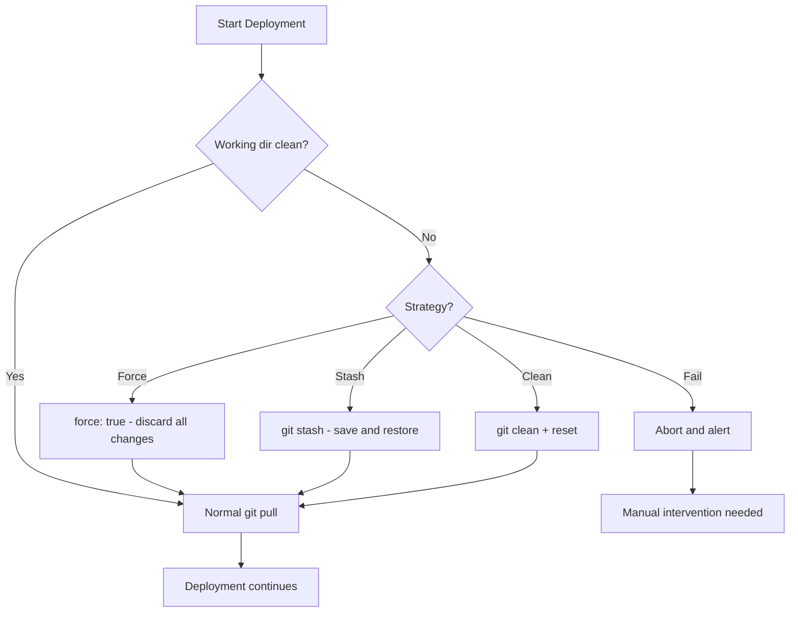

# How to Use Ansible to Handle Git Conflicts During Deployment

Author: [nawazdhandala](https://www.github.com/nawazdhandala)

Tags: Ansible, Git, Conflict Resolution, Deployment

Description: Learn how to handle Git conflicts during Ansible deployments using force checkout, stash strategies, and clean workspace patterns for reliable code updates.

---

Git conflicts during deployment happen more often than you might think. Someone edited a file directly on the server, a previous deployment left uncommitted changes, or the working directory has modifications from runtime (log files, cache files, uploaded content). This post covers strategies for detecting and handling these conflicts in Ansible.

## Why Conflicts Happen

Common causes of Git conflicts during automated deployment:
- Manual edits on production servers (the dreaded "hotfix in production")
- Generated files in the repository directory (logs, cache, compiled bytecode)
- Failed previous deployments that left partial changes
- File permission changes that Git tracks

## Detecting Conflicts Before They Block You

Check the state of the working directory before attempting deployment:

```yaml
# playbook-detect-conflicts.yml
# Checks for local modifications before attempting a Git pull
- name: Pre-deployment conflict check
  hosts: webservers
  become: true
  vars:
    app_dir: /opt/myapp

  tasks:
    - name: Check if repository exists
      ansible.builtin.stat:
        path: "{{ app_dir }}/.git"
      register: git_dir

    - name: Check for local modifications
      ansible.builtin.shell: "cd {{ app_dir }} && git status --porcelain"
      register: git_status
      changed_when: false
      when: git_dir.stat.exists

    - name: Check for untracked files
      ansible.builtin.shell: "cd {{ app_dir }} && git status --porcelain | grep '^??' | wc -l"
      register: untracked_count
      changed_when: false
      when: git_dir.stat.exists

    - name: Report working directory state
      ansible.builtin.debug:
        msg: |
          Repository: {{ 'exists' if git_dir.stat.exists else 'NOT FOUND' }}
          Modified files: {{ git_status.stdout_lines | default([]) | length }}
          Untracked files: {{ untracked_count.stdout | default('0') }}
          
          Changes detected:
          {{ git_status.stdout }}
          
      when: git_dir.stat.exists
```

## Conflict Handling Flow



## Strategy 1: Force Checkout (Most Common)

The simplest approach: discard all local changes and force checkout:

```yaml
# playbook-force-strategy.yml
# Uses force checkout to overwrite any local changes during deployment
- name: Deploy with force strategy
  hosts: webservers
  become: true

  tasks:
    - name: Force deploy (discard all local changes)
      ansible.builtin.git:
        repo: "https://github.com/example/myapp.git"
        dest: /opt/myapp
        version: v2.1.0
        force: true
      register: deploy_result

    - name: Report
      ansible.builtin.debug:
        msg: "Deployed {{ deploy_result.after[:12] }} (forced: any local changes were discarded)"
```

## Strategy 2: Stash and Restore

Save local changes, deploy, then reapply:

```yaml
# playbook-stash-strategy.yml
# Stashes local changes before deployment and optionally restores them after
- name: Deploy with stash strategy
  hosts: webservers
  become: true
  vars:
    app_dir: /opt/myapp

  tasks:
    - name: Check for local changes
      ansible.builtin.shell: "cd {{ app_dir }} && git status --porcelain"
      register: git_status
      changed_when: false

    - name: Stash local changes if any
      ansible.builtin.shell: |
        cd {{ app_dir }}
        git stash save "ansible-deploy-$(date +%Y%m%d-%H%M%S)"
      when: git_status.stdout | length > 0
      register: stash_result

    - name: Deploy new version
      ansible.builtin.git:
        repo: "https://github.com/example/myapp.git"
        dest: "{{ app_dir }}"
        version: v2.1.0

    - name: Attempt to restore stashed changes
      ansible.builtin.shell: |
        cd {{ app_dir }}
        git stash pop
      when: stash_result is defined and stash_result.changed
      register: stash_pop
      failed_when: false

    - name: Report stash pop result
      ansible.builtin.debug:
        msg: >-
          
          Local changes were restored successfully.
          
          Could not restore local changes (conflict). Changes saved in stash.
          
          No local changes to restore.
          
```

## Strategy 3: Clean Workspace

Reset everything to a known state:

```yaml
# playbook-clean-strategy.yml
# Completely cleans the workspace before deploying fresh code
- name: Deploy with clean workspace strategy
  hosts: webservers
  become: true
  vars:
    app_dir: /opt/myapp

  tasks:
    - name: Reset tracked file changes
      ansible.builtin.shell: "cd {{ app_dir }} && git checkout -- ."
      changed_when: true
      failed_when: false

    - name: Remove untracked files (excluding gitignored ones)
      ansible.builtin.shell: "cd {{ app_dir }} && git clean -fd"
      changed_when: true
      failed_when: false

    - name: Deploy
      ansible.builtin.git:
        repo: "https://github.com/example/myapp.git"
        dest: "{{ app_dir }}"
        version: v2.1.0
```

## Strategy 4: Backup and Report

For servers where manual changes might be important:

```yaml
# playbook-backup-strategy.yml
# Backs up local modifications before deployment and creates a diff report
- name: Deploy with backup strategy
  hosts: webservers
  become: true
  vars:
    app_dir: /opt/myapp
    backup_dir: /opt/deploy-backups

  tasks:
    - name: Check for modifications
      ansible.builtin.shell: "cd {{ app_dir }} && git diff --stat"
      register: git_diff
      changed_when: false

    - name: Create backup of modified files
      when: git_diff.stdout | length > 0
      block:
        - name: Create backup directory
          ansible.builtin.file:
            path: "{{ backup_dir }}/{{ lookup('pipe', 'date +%Y%m%d-%H%M%S') }}"
            state: directory
          register: backup_path

        - name: Save diff to backup
          ansible.builtin.shell: |
            cd {{ app_dir }}
            git diff > "{{ backup_path.path }}/changes.diff"
            git diff --name-only | while read f; do
              mkdir -p "{{ backup_path.path }}/$(dirname $f)"
              cp "$f" "{{ backup_path.path }}/$f" 2>/dev/null || true
            done

        - name: Log what was backed up
          ansible.builtin.debug:
            msg: "Backed up local changes to {{ backup_path.path }}"

    - name: Force deploy
      ansible.builtin.git:
        repo: "https://github.com/example/myapp.git"
        dest: "{{ app_dir }}"
        version: v2.1.0
        force: true
```

## Handling Specific File Conflicts

Preserve certain files while force-deploying everything else:

```yaml
# playbook-selective-preserve.yml
# Preserves specific local files during force deployment
- name: Deploy with selective file preservation
  hosts: webservers
  become: true
  vars:
    app_dir: /opt/myapp
    preserve_files:
      - config/local.yml
      - .env
      - data/uploads

  tasks:
    - name: Backup files to preserve
      ansible.builtin.shell: |
        mkdir -p /tmp/deploy-preserve
        cd {{ app_dir }}
        for f in {{ preserve_files | join(' ') }}; do
          if [ -e "$f" ]; then
            mkdir -p "/tmp/deploy-preserve/$(dirname $f)"
            cp -a "$f" "/tmp/deploy-preserve/$f"
          fi
        done
      changed_when: false

    - name: Force deploy
      ansible.builtin.git:
        repo: "https://github.com/example/myapp.git"
        dest: "{{ app_dir }}"
        version: v2.1.0
        force: true

    - name: Restore preserved files
      ansible.builtin.shell: |
        cd /tmp/deploy-preserve
        for f in {{ preserve_files | join(' ') }}; do
          if [ -e "$f" ]; then
            mkdir -p "{{ app_dir }}/$(dirname $f)"
            cp -a "$f" "{{ app_dir }}/$f"
          fi
        done
      changed_when: false

    - name: Cleanup
      ansible.builtin.file:
        path: /tmp/deploy-preserve
        state: absent
```

## Preventing Conflicts Proactively

The best approach is preventing conflicts in the first place:

```yaml
# playbook-prevent-conflicts.yml
# Sets up repository configuration to prevent common conflict scenarios
- name: Set up conflict prevention
  hosts: webservers
  become: true

  tasks:
    - name: Make repository read-only to non-deploy users
      ansible.builtin.file:
        path: /opt/myapp
        owner: deploy
        group: deploy
        recurse: true

    - name: Add runtime directories to .gitignore
      ansible.builtin.lineinfile:
        path: /opt/myapp/.git/info/exclude
        line: "{{ item }}"
        create: true
      loop:
        - "*.log"
        - "*.pyc"
        - "__pycache__/"
        - ".cache/"
        - "uploads/"
        - "tmp/"

    - name: Set core.filemode to false (ignore permission changes)
      community.general.git_config:
        name: core.filemode
        value: "false"
        scope: local
        repo: /opt/myapp
```

## Summary

Git conflicts during deployment are inevitable, but they are manageable with the right strategy. For most production deployments, `force: true` is the correct approach because the Git repository should be the single source of truth. Use the stash strategy when you need to preserve local modifications temporarily. Use the backup strategy when local changes might contain important manual fixes that need to be reviewed. The selective preservation pattern handles cases where certain local files (like environment configs) should survive deployments. And the best long-term approach is preventing conflicts proactively by controlling file permissions, using `.gitignore` for runtime files, and making the deployment user the only one that modifies the repository directory.
