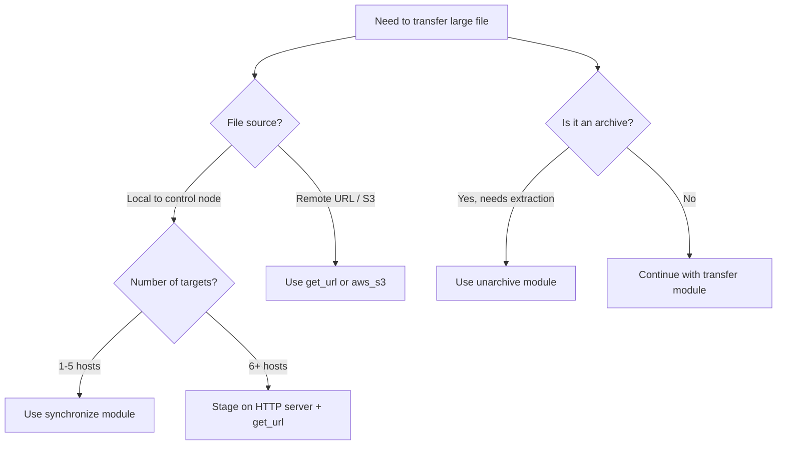

# How to Use Ansible to Handle Large File Transfers

Author: [nawazdhandala](https://www.github.com/nawazdhandala)

Tags: Ansible, File Transfer, Performance, DevOps

Description: Practical techniques for transferring large files with Ansible including synchronize, get_url, and chunked approaches.

---

Transferring large files with Ansible can be surprisingly painful if you stick to the defaults. The `copy` module works fine for small config files, but try pushing a 2 GB database dump or a large application archive through it and you will quickly run into performance issues and timeouts. This post covers the practical approaches for handling large file transfers without losing your mind.

## Why the copy Module Struggles with Large Files

The `copy` module has a fundamental limitation for large files: it computes a checksum on the local file, transfers the entire file over the SSH connection, and then verifies the checksum on the remote side. For files above a few hundred megabytes, this process is slow and memory-hungry. The module also base64-encodes the content during transfer, which inflates the payload by roughly 33%.

For anything beyond about 100 MB, you should reach for other tools.

## The synchronize Module

The `synchronize` module wraps `rsync`, which is purpose-built for efficient file transfers. It uses delta compression, meaning it only sends the parts of a file that changed. For initial transfers, it is still faster than `copy` because it does not base64-encode the data.

Here is a basic example that syncs a large directory to remote hosts:

```yaml
# Sync a large application directory to remote hosts using rsync
- name: Sync application bundle to servers
  ansible.posix.synchronize:
    src: /opt/releases/myapp-v2.5.0/
    dest: /opt/myapp/
    archive: yes
    compress: yes
    delete: yes
  become: yes
  become_user: appuser
```

Key parameters explained:

- `archive: yes` preserves permissions, timestamps, symlinks, and recursion
- `compress: yes` compresses data during transfer, which helps on slower networks
- `delete: yes` removes files on the destination that do not exist on the source

For a single large file:

```yaml
# Transfer a large database backup file
- name: Copy database dump to target server
  ansible.posix.synchronize:
    src: /backups/db_dump_20260221.sql.gz
    dest: /tmp/db_dump_20260221.sql.gz
    checksum: yes
```

The `checksum: yes` parameter forces rsync to use checksums instead of timestamps for deciding if the file needs updating. This is slower but more reliable.

## Transferring from a Remote URL with get_url

If the file is hosted on an HTTP server, S3 bucket, or artifact repository, skip the control node entirely and have each target download the file directly. This is almost always faster because it parallelizes naturally.

```yaml
# Download a large file directly to the target host
- name: Download application archive from artifact server
  ansible.builtin.get_url:
    url: https://artifacts.example.com/releases/myapp-v2.5.0.tar.gz
    dest: /opt/releases/myapp-v2.5.0.tar.gz
    checksum: sha256:a1b2c3d4e5f6...
    timeout: 300
    mode: '0644'
```

The `checksum` parameter is important for large downloads. It verifies the file integrity and also makes the task idempotent. If the file already exists with the correct checksum, Ansible skips the download.

For S3 downloads, use the `amazon.aws.aws_s3` module:

```yaml
# Download a large file from S3 directly to the target
- name: Download database dump from S3
  amazon.aws.aws_s3:
    bucket: my-backups
    object: /db/dump_20260221.sql.gz
    dest: /tmp/dump_20260221.sql.gz
    mode: get
```

## Using unarchive for Archive Transfers

If you are transferring and extracting an archive, the `unarchive` module handles both steps:

```yaml
# Transfer and extract a tar archive in one step
- name: Deploy application from archive
  ansible.builtin.unarchive:
    src: /opt/releases/myapp-v2.5.0.tar.gz
    dest: /opt/myapp/
    owner: appuser
    group: appuser
    creates: /opt/myapp/version.txt
```

The `creates` parameter makes this idempotent. If `/opt/myapp/version.txt` already exists, the task is skipped entirely. You can also set `remote_src: yes` if the archive is already on the target machine.

## Increasing SSH Timeouts

Large transfers often hit the default connection timeout. You can adjust this at several levels.

In your playbook:

```yaml
# Set longer timeouts for plays that involve large transfers
- hosts: app_servers
  gather_facts: no
  vars:
    ansible_ssh_timeout: 120
    ansible_command_timeout: 600
  tasks:
    - name: Transfer large file
      ansible.posix.synchronize:
        src: /data/bigfile.tar.gz
        dest: /data/bigfile.tar.gz
```

Or in `ansible.cfg`:

```ini
# ansible.cfg - increase timeouts globally for large transfer workloads
[defaults]
timeout = 120

[ssh_connection]
ssh_args = -o ServerAliveInterval=30 -o ServerAliveCountMax=20
```

The `ServerAliveInterval` sends a keepalive packet every 30 seconds, and `ServerAliveCountMax=20` allows up to 20 missed keepalives before disconnecting. This gives you a 10-minute window of inactivity, which is usually enough for large transfers to complete.

## Staging Files on a Local HTTP Server

For very large files going to many hosts, the most efficient approach is to stage the file on a local HTTP server and let all targets pull from it simultaneously. This avoids the bottleneck of the control node's outbound bandwidth.

```yaml
# Step 1: Start a temporary HTTP server on the control node
- name: Start temporary file server
  hosts: localhost
  tasks:
    - name: Create staging directory
      ansible.builtin.file:
        path: /tmp/staging
        state: directory

    - name: Copy file to staging
      ansible.builtin.copy:
        src: /opt/releases/myapp-v2.5.0.tar.gz
        dest: /tmp/staging/myapp-v2.5.0.tar.gz
        remote_src: yes

    - name: Start HTTP server in background
      ansible.builtin.shell: |
        cd /tmp/staging && python3 -m http.server 8888 &
      async: 3600
      poll: 0

# Step 2: Have all targets download from the staging server
- name: Deploy to all servers
  hosts: app_servers
  tasks:
    - name: Download archive from staging server
      ansible.builtin.get_url:
        url: "http://{{ hostvars['localhost'].ansible_default_ipv4.address }}:8888/myapp-v2.5.0.tar.gz"
        dest: /opt/releases/myapp-v2.5.0.tar.gz
        timeout: 300
```

## Using async for Parallel Transfers

If you must use the `copy` or `synchronize` module for large files across many hosts, async execution prevents serial bottlenecks:

```yaml
# Start the transfer asynchronously on all hosts
- name: Start large file transfer (async)
  ansible.posix.synchronize:
    src: /opt/releases/bigapp.tar.gz
    dest: /opt/releases/bigapp.tar.gz
  async: 1800
  poll: 0
  register: transfer_job

# Do other work here while the transfer runs...
- name: Run pre-deployment checks
  ansible.builtin.command: /opt/scripts/pre_deploy_check.sh

# Wait for the transfer to complete
- name: Wait for transfer to finish
  ansible.builtin.async_status:
    jid: "{{ transfer_job.ansible_job_id }}"
  register: transfer_result
  until: transfer_result.finished
  retries: 60
  delay: 30
```

## Transfer Strategy Decision Guide



## Quick Comparison

| Method | Best For | Idempotent | Speed |
|--------|----------|------------|-------|
| copy | Files < 100 MB | Yes | Slow for large files |
| synchronize | Large files, directories | Yes | Fast (delta transfer) |
| get_url | Files on HTTP/HTTPS | Yes (with checksum) | Fast (parallel) |
| unarchive | Archives that need extraction | Yes (with creates) | Medium |
| command + scp/rsync | Edge cases | Manual | Varies |

The bottom line: for large file transfers, avoid `copy`, use `synchronize` for direct transfers, and use `get_url` when you can stage the file on an HTTP endpoint. Always set appropriate timeouts and consider your network topology when choosing between push and pull models.
