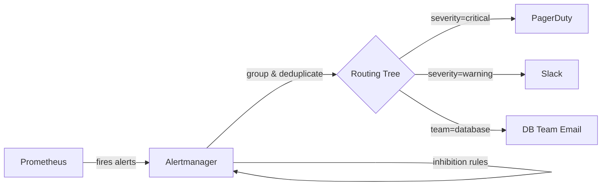

# How to Use Ansible to Install and Configure Alertmanager

Author: [nawazdhandala](https://www.github.com/nawazdhandala)

Tags: Ansible, Alertmanager, Prometheus, Monitoring, DevOps

Description: Automate Prometheus Alertmanager installation and routing configuration using Ansible for reliable alert notification delivery.

---

Prometheus collects metrics and evaluates alerting rules, but it does not send notifications directly. That job belongs to Alertmanager, which receives alerts from Prometheus, deduplicates them, groups related alerts together, and routes them to the right notification channels (Slack, PagerDuty, email, webhooks, and more). Getting Alertmanager's routing configuration right is critical because a misconfigured routing tree means alerts either get lost or flood the wrong people.

This post covers building an Ansible role that installs Alertmanager and configures its routing, receivers, and inhibition rules.

## How Alertmanager Works



Alertmanager's routing is tree-based. Each alert enters at the root route and travels down the tree based on label matching. When it finds a matching route, the alert is sent to the configured receiver.

## Project Structure

```
alertmanager/
  inventory/
    hosts.yml
  roles/
    alertmanager/
      tasks/
        main.yml
        install.yml
        configure.yml
      templates/
        alertmanager.yml.j2
        alertmanager.service.j2
      defaults/
        main.yml
      handlers/
        main.yml
  playbook.yml
```

## Default Variables

```yaml
# roles/alertmanager/defaults/main.yml
alertmanager_version: "0.26.0"
alertmanager_platform: "linux-amd64"

# System user
alertmanager_user: "alertmanager"
alertmanager_group: "alertmanager"

# Directories
alertmanager_install_dir: "/usr/local/bin"
alertmanager_config_dir: "/etc/alertmanager"
alertmanager_data_dir: "/var/lib/alertmanager"

# Network settings
alertmanager_listen_address: "0.0.0.0"
alertmanager_port: 9093
alertmanager_cluster_port: 9094

# Global settings
alertmanager_resolve_timeout: "5m"

# SMTP settings for email notifications
alertmanager_smtp_smarthost: "smtp.gmail.com:587"
alertmanager_smtp_from: "alertmanager@example.com"
alertmanager_smtp_auth_username: ""
alertmanager_smtp_auth_password: ""
alertmanager_smtp_require_tls: true

# Slack settings
alertmanager_slack_api_url: ""

# PagerDuty settings
alertmanager_pagerduty_service_key: ""

# Route configuration
alertmanager_route:
  group_by: ['alertname', 'job']
  group_wait: "30s"
  group_interval: "5m"
  repeat_interval: "4h"
  receiver: "default"
  routes:
    - match:
        severity: critical
      receiver: "pagerduty"
      repeat_interval: "1h"
    - match:
        severity: warning
      receiver: "slack"
      repeat_interval: "4h"

# Receivers configuration
alertmanager_receivers:
  - name: "default"
    email_configs:
      - to: "ops@example.com"
        send_resolved: true
  - name: "slack"
    slack_configs:
      - channel: "#alerts"
        send_resolved: true
        title: '{{ "{{ .GroupLabels.alertname }}" }}'
        text: '{{ "{{ range .Alerts }}{{ .Annotations.summary }}\n{{ end }}" }}'
  - name: "pagerduty"
    pagerduty_configs:
      - service_key: "{{ alertmanager_pagerduty_service_key }}"
        send_resolved: true

# Inhibition rules
alertmanager_inhibit_rules:
  - source_match:
      severity: "critical"
    target_match:
      severity: "warning"
    equal: ['alertname', 'instance']
```

## Installation Tasks

```yaml
# roles/alertmanager/tasks/install.yml
---
- name: Create alertmanager group
  ansible.builtin.group:
    name: "{{ alertmanager_group }}"
    system: true
    state: present
  become: true

- name: Create alertmanager user
  ansible.builtin.user:
    name: "{{ alertmanager_user }}"
    group: "{{ alertmanager_group }}"
    shell: /usr/sbin/nologin
    system: true
    create_home: false
  become: true

- name: Create Alertmanager directories
  ansible.builtin.file:
    path: "{{ item }}"
    state: directory
    owner: "{{ alertmanager_user }}"
    group: "{{ alertmanager_group }}"
    mode: "0755"
  loop:
    - "{{ alertmanager_config_dir }}"
    - "{{ alertmanager_config_dir }}/templates"
    - "{{ alertmanager_data_dir }}"
  become: true

- name: Check installed Alertmanager version
  ansible.builtin.command: "{{ alertmanager_install_dir }}/alertmanager --version"
  register: current_version
  changed_when: false
  failed_when: false

- name: Download Alertmanager
  ansible.builtin.get_url:
    url: "https://github.com/prometheus/alertmanager/releases/download/v{{ alertmanager_version }}/alertmanager-{{ alertmanager_version }}.{{ alertmanager_platform }}.tar.gz"
    dest: "/tmp/alertmanager-{{ alertmanager_version }}.tar.gz"
    mode: "0644"
  when: current_version.rc != 0 or alertmanager_version not in (current_version.stdout | default(''))

- name: Extract Alertmanager
  ansible.builtin.unarchive:
    src: "/tmp/alertmanager-{{ alertmanager_version }}.tar.gz"
    dest: /tmp/
    remote_src: true
  when: current_version.rc != 0 or alertmanager_version not in (current_version.stdout | default(''))

- name: Install Alertmanager binaries
  ansible.builtin.copy:
    src: "/tmp/alertmanager-{{ alertmanager_version }}.{{ alertmanager_platform }}/{{ item }}"
    dest: "{{ alertmanager_install_dir }}/{{ item }}"
    owner: root
    group: root
    mode: "0755"
    remote_src: true
  loop:
    - alertmanager
    - amtool
  become: true
  notify: Restart alertmanager
  when: current_version.rc != 0 or alertmanager_version not in (current_version.stdout | default(''))

- name: Clean up download artifacts
  ansible.builtin.file:
    path: "{{ item }}"
    state: absent
  loop:
    - "/tmp/alertmanager-{{ alertmanager_version }}.tar.gz"
    - "/tmp/alertmanager-{{ alertmanager_version }}.{{ alertmanager_platform }}"
```

## Configuration Tasks

```yaml
# roles/alertmanager/tasks/configure.yml
---
- name: Deploy Alertmanager configuration
  ansible.builtin.template:
    src: alertmanager.yml.j2
    dest: "{{ alertmanager_config_dir }}/alertmanager.yml"
    owner: "{{ alertmanager_user }}"
    group: "{{ alertmanager_group }}"
    mode: "0640"
    validate: "{{ alertmanager_install_dir }}/amtool check-config %s"
  become: true
  notify: Reload alertmanager

- name: Deploy systemd service
  ansible.builtin.template:
    src: alertmanager.service.j2
    dest: /etc/systemd/system/alertmanager.service
    owner: root
    group: root
    mode: "0644"
  become: true
  notify: Restart alertmanager

- name: Enable and start Alertmanager
  ansible.builtin.systemd:
    name: alertmanager
    state: started
    enabled: true
    daemon_reload: true
  become: true

- name: Verify Alertmanager is healthy
  ansible.builtin.uri:
    url: "http://localhost:{{ alertmanager_port }}/-/healthy"
    status_code: 200
  register: health_check
  until: health_check.status == 200
  retries: 10
  delay: 3
```

## Alertmanager Configuration Template

```yaml
# roles/alertmanager/templates/alertmanager.yml.j2
# Alertmanager configuration - managed by Ansible

global:
  resolve_timeout: {{ alertmanager_resolve_timeout }}

  smtp_smarthost: '{{ alertmanager_smtp_smarthost }}'
  smtp_from: '{{ alertmanager_smtp_from }}'

  smtp_auth_username: '{{ alertmanager_smtp_auth_username }}'
  smtp_auth_password: '{{ alertmanager_smtp_auth_password }}'

  smtp_require_tls: {{ alertmanager_smtp_require_tls | lower }}


  slack_api_url: '{{ alertmanager_slack_api_url }}'


route:
  group_by: {{ alertmanager_route.group_by | to_json }}
  group_wait: {{ alertmanager_route.group_wait }}
  group_interval: {{ alertmanager_route.group_interval }}
  repeat_interval: {{ alertmanager_route.repeat_interval }}
  receiver: {{ alertmanager_route.receiver }}

  routes:

    - match:

        {{ key }}: {{ value }}

      receiver: {{ route.receiver }}

      repeat_interval: {{ route.repeat_interval }}


      continue: {{ route.continue | lower }}




receivers:

  - name: '{{ receiver.name }}'

    email_configs:

      - to: '{{ email.to }}'
        send_resolved: {{ email.send_resolved | default(true) | lower }}



    slack_configs:

      - channel: '{{ slack.channel }}'
        send_resolved: {{ slack.send_resolved | default(true) | lower }}

        title: '{{ slack.title }}'


        text: '{{ slack.text }}'




    pagerduty_configs:

      - service_key: '{{ pd.service_key }}'
        send_resolved: {{ pd.send_resolved | default(true) | lower }}



    webhook_configs:

      - url: '{{ webhook.url }}'
        send_resolved: {{ webhook.send_resolved | default(true) | lower }}





inhibit_rules:

  - source_match:

      {{ key }}: '{{ value }}'

    target_match:

      {{ key }}: '{{ value }}'

    equal: {{ rule.equal | to_json }}


```

## Systemd Service Template

```ini
# roles/alertmanager/templates/alertmanager.service.j2
[Unit]
Description=Prometheus Alertmanager
Documentation=https://prometheus.io/docs/alerting/alertmanager/
Wants=network-online.target
After=network-online.target

[Service]
Type=simple
User={{ alertmanager_user }}
Group={{ alertmanager_group }}
ExecReload=/bin/kill -HUP $MAINPID
ExecStart={{ alertmanager_install_dir }}/alertmanager \
  --config.file={{ alertmanager_config_dir }}/alertmanager.yml \
  --storage.path={{ alertmanager_data_dir }} \
  --web.listen-address={{ alertmanager_listen_address }}:{{ alertmanager_port }} \
  --cluster.listen-address={{ alertmanager_listen_address }}:{{ alertmanager_cluster_port }}

SyslogIdentifier=alertmanager
Restart=always
RestartSec=5

NoNewPrivileges=true
ProtectSystem=full
ProtectHome=true

[Install]
WantedBy=multi-user.target
```

## Main Tasks

```yaml
# roles/alertmanager/tasks/main.yml
---
- name: Install Alertmanager
  ansible.builtin.include_tasks: install.yml

- name: Configure Alertmanager
  ansible.builtin.include_tasks: configure.yml
```

## Handlers

```yaml
# roles/alertmanager/handlers/main.yml
---
- name: Restart alertmanager
  ansible.builtin.systemd:
    name: alertmanager
    state: restarted
    daemon_reload: true
  become: true

- name: Reload alertmanager
  ansible.builtin.systemd:
    name: alertmanager
    state: reloaded
  become: true
```

## Running and Testing

```bash
# Deploy Alertmanager
ansible-playbook -i inventory/hosts.yml playbook.yml

# Check Alertmanager status
curl http://alertmanager:9093/-/healthy

# View active alerts
amtool --alertmanager.url=http://localhost:9093 alert

# Send a test alert
curl -X POST http://localhost:9093/api/v2/alerts \
  -H "Content-Type: application/json" \
  -d '[{
    "labels": {"alertname": "TestAlert", "severity": "warning"},
    "annotations": {"summary": "This is a test alert"}
  }]'
```

## Summary

Alertmanager is the notification backbone of a Prometheus monitoring stack. The Ansible role in this post handles the full lifecycle: installation with version management, configuration with validated routing trees, and systemd integration. The template-driven configuration makes it easy to add new receivers and routes as your alerting needs evolve, while the `amtool check-config` validation step ensures you never deploy a broken configuration.
