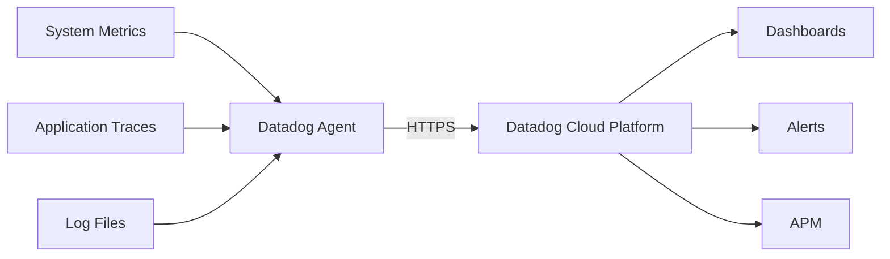

# How to Use Ansible to Install and Configure Datadog Agent

Author: [nawazdhandala](https://www.github.com/nawazdhandala)

Tags: Ansible, Datadog, Monitoring, APM, DevOps

Description: Automate Datadog Agent deployment and integration configuration using Ansible for full-stack observability across your infrastructure.

---

Datadog is a cloud-based monitoring and observability platform that provides infrastructure monitoring, application performance monitoring (APM), log management, and synthetic testing. The Datadog Agent runs on your servers and collects metrics, traces, and logs, sending them to the Datadog cloud platform. While Datadog provides its own Ansible role, understanding how to build and customize one gives you more control over the deployment process and lets you integrate it with your existing automation.

This post covers deploying the Datadog Agent with Ansible, configuring integrations, managing check configurations, and setting up APM and log collection.

## What the Datadog Agent Collects

The Datadog Agent has three main components:

- **Agent Core**: Collects system metrics (CPU, memory, disk, network) and runs integration checks.
- **Trace Agent**: Receives application traces for APM (distributed tracing).
- **Log Agent**: Collects and forwards log files.



## Project Structure

```
datadog/
  inventory/
    hosts.yml
  roles/
    datadog_agent/
      tasks/
        main.yml
        install.yml
        configure.yml
        integrations.yml
      templates/
        datadog.yaml.j2
        conf.d/
          nginx.yaml.j2
          postgres.yaml.j2
          http_check.yaml.j2
      defaults/
        main.yml
      handlers/
        main.yml
  playbook.yml
```

## Default Variables

```yaml
# roles/datadog_agent/defaults/main.yml
# Datadog API key (required)
datadog_api_key: ""
datadog_site: "datadoghq.com"

# Agent version
datadog_agent_version: "latest"

# Agent settings
datadog_hostname: ""
datadog_tags: []
datadog_env: "production"
datadog_service: ""

# APM (tracing) settings
datadog_apm_enabled: true
datadog_apm_port: 8126

# Log collection settings
datadog_logs_enabled: true
datadog_logs_config:
  container_collect_all: false

# Process monitoring
datadog_process_enabled: true
datadog_process_collection_enabled: true

# Network Performance Monitoring
datadog_npm_enabled: false

# Integration configurations
datadog_integrations: []

# Log sources to collect
datadog_log_sources: []

# Custom checks
datadog_custom_checks: []

# HTTP check endpoints
datadog_http_checks: []

# Resource limits
datadog_agent_memory_limit: "512M"
```

## Installation Tasks

```yaml
# roles/datadog_agent/tasks/install.yml
---
- name: Install prerequisites
  ansible.builtin.apt:
    name:
      - apt-transport-https
      - curl
      - gnupg
    state: present
    update_cache: yes
  become: true

- name: Add Datadog GPG key
  ansible.builtin.apt_key:
    url: "https://keys.datadoghq.com/DATADOG_APT_KEY_CURRENT.public"
    state: present
  become: true

- name: Add Datadog signing keys
  ansible.builtin.apt_key:
    url: "https://keys.datadoghq.com/DATADOG_APT_KEY_{{ item }}.public"
    state: present
  loop:
    - "382E94DE"
    - "F14F620E"
  become: true

- name: Add Datadog repository
  ansible.builtin.apt_repository:
    repo: "deb [signed-by=/usr/share/keyrings/datadog-archive-keyring.gpg] https://apt.datadoghq.com/ stable 7"
    state: present
    filename: datadog
  become: true

- name: Install Datadog Agent
  ansible.builtin.apt:
    name: "datadog-agent={{ datadog_agent_version }}"
    state: "{{ 'present' if datadog_agent_version != 'latest' else 'latest' }}"
    update_cache: yes
  become: true
  environment:
    DD_API_KEY: "{{ datadog_api_key }}"
  notify: Restart datadog-agent
```

## Configuration Tasks

```yaml
# roles/datadog_agent/tasks/configure.yml
---
- name: Deploy Datadog Agent configuration
  ansible.builtin.template:
    src: datadog.yaml.j2
    dest: /etc/datadog-agent/datadog.yaml
    owner: dd-agent
    group: dd-agent
    mode: "0640"
  become: true
  notify: Restart datadog-agent

- name: Create conf.d directory for integrations
  ansible.builtin.file:
    path: /etc/datadog-agent/conf.d
    state: directory
    owner: dd-agent
    group: dd-agent
    mode: "0755"
  become: true

- name: Add dd-agent to required groups
  ansible.builtin.user:
    name: dd-agent
    groups: "{{ item }}"
    append: yes
  loop:
    - adm
    - docker
  become: true
  ignore_errors: yes

- name: Configure log collection sources
  ansible.builtin.copy:
    dest: "/etc/datadog-agent/conf.d/{{ item.name }}.d/conf.yaml"
    content: |
      logs:
        - type: file
          path: {{ item.path }}
          service: {{ item.service }}
          source: {{ item.source }}
      
          log_processing_rules:
      
            - type: {{ rule.type }}
              name: {{ rule.name }}
              pattern: '{{ rule.pattern }}'
      
      
    owner: dd-agent
    group: dd-agent
    mode: "0640"
  loop: "{{ datadog_log_sources }}"
  become: true
  notify: Restart datadog-agent
  when: datadog_logs_enabled and datadog_log_sources | length > 0
```

## Integration Configuration Tasks

```yaml
# roles/datadog_agent/tasks/integrations.yml
---
- name: Configure Nginx integration
  ansible.builtin.template:
    src: conf.d/nginx.yaml.j2
    dest: /etc/datadog-agent/conf.d/nginx.d/conf.yaml
    owner: dd-agent
    group: dd-agent
    mode: "0640"
  become: true
  when: "'nginx' in datadog_integrations | map(attribute='name') | list"
  notify: Restart datadog-agent

- name: Configure PostgreSQL integration
  ansible.builtin.template:
    src: conf.d/postgres.yaml.j2
    dest: /etc/datadog-agent/conf.d/postgres.d/conf.yaml
    owner: dd-agent
    group: dd-agent
    mode: "0640"
  become: true
  when: "'postgres' in datadog_integrations | map(attribute='name') | list"
  notify: Restart datadog-agent

- name: Configure HTTP check integration
  ansible.builtin.template:
    src: conf.d/http_check.yaml.j2
    dest: /etc/datadog-agent/conf.d/http_check.d/conf.yaml
    owner: dd-agent
    group: dd-agent
    mode: "0640"
  become: true
  when: datadog_http_checks | length > 0
  notify: Restart datadog-agent
```

## Datadog Agent Configuration Template

```yaml
# roles/datadog_agent/templates/datadog.yaml.j2
# Datadog Agent configuration - managed by Ansible

# API key for authentication with Datadog
api_key: {{ datadog_api_key }}

# Datadog site
site: {{ datadog_site }}


# Override the detected hostname
hostname: {{ datadog_hostname }}


# Tags applied to all metrics from this host
tags:
  - env:{{ datadog_env }}

  - service:{{ datadog_service }}


  - {{ tag }}


# APM configuration
apm_config:
  enabled: {{ datadog_apm_enabled | lower }}
  apm_dd_url: https://trace.agent.{{ datadog_site }}

  receiver_port: {{ datadog_apm_port }}


# Log collection configuration
logs_enabled: {{ datadog_logs_enabled | lower }}

logs_config:
  container_collect_all: {{ datadog_logs_config.container_collect_all | default(false) | lower }}


# Process monitoring
process_config:
  process_collection:
    enabled: {{ datadog_process_collection_enabled | lower }}


# Network Performance Monitoring
network_config:
  enabled: true


# Disable sending hostname with metrics (use tags instead)
enable_metadata_collection: true

# Security
cmd_port: 5001
```

## Nginx Integration Template

```yaml
# roles/datadog_agent/templates/conf.d/nginx.yaml.j2
# Nginx integration - managed by Ansible
init_config:

instances:


  - nginx_status_url: {{ integration.status_url | default('http://localhost/nginx_status') }}

    tags:

      - {{ tag }}




```

## PostgreSQL Integration Template

```yaml
# roles/datadog_agent/templates/conf.d/postgres.yaml.j2
# PostgreSQL integration - managed by Ansible
init_config:

instances:


  - host: {{ integration.host | default('localhost') }}
    port: {{ integration.port | default(5432) }}
    username: {{ integration.username }}
    password: {{ integration.password }}
    dbname: {{ integration.dbname | default('postgres') }}
    collect_activity_metrics: true
    collect_database_size_metrics: true

    tags:

      - {{ tag }}




```

## HTTP Check Template

```yaml
# roles/datadog_agent/templates/conf.d/http_check.yaml.j2
# HTTP check integration - managed by Ansible
init_config:

instances:

  - name: {{ check.name }}
    url: {{ check.url }}
    method: {{ check.method | default('GET') }}
    timeout: {{ check.timeout | default(10) }}

    http_response_status_code: {{ check.http_response_status_code }}


    check_certificate_expiration: {{ check.check_certificate_expiration | lower }}
    days_warning: {{ check.days_warning | default(14) }}
    days_critical: {{ check.days_critical | default(7) }}


    tags:

      - {{ tag }}




```

## Main Tasks

```yaml
# roles/datadog_agent/tasks/main.yml
---
- name: Validate API key is provided
  ansible.builtin.assert:
    that:
      - datadog_api_key | length > 0
    fail_msg: "datadog_api_key must be set. Use Ansible Vault to store it securely."

- name: Install Datadog Agent
  ansible.builtin.include_tasks: install.yml

- name: Configure Datadog Agent
  ansible.builtin.include_tasks: configure.yml

- name: Configure Datadog integrations
  ansible.builtin.include_tasks: integrations.yml

- name: Enable and start Datadog Agent
  ansible.builtin.systemd:
    name: datadog-agent
    state: started
    enabled: true
  become: true

- name: Verify Datadog Agent status
  ansible.builtin.command: datadog-agent status
  become: true
  changed_when: false
  register: agent_status

- name: Display agent status summary
  ansible.builtin.debug:
    msg: "Datadog Agent is running. API key connected: {{ 'yes' if 'API Key ending' in agent_status.stdout else 'no' }}"
```

## Handlers

```yaml
# roles/datadog_agent/handlers/main.yml
---
- name: Restart datadog-agent
  ansible.builtin.systemd:
    name: datadog-agent
    state: restarted
  become: true
```

## The Playbook

```yaml
# playbook.yml
---
- name: Deploy Datadog Agent
  hosts: all
  become: true
  vars:
    datadog_api_key: "{{ vault_datadog_api_key }}"
    datadog_env: "production"
    datadog_tags:
      - "team:platform"
      - "region:us-east-1"
    datadog_integrations:
      - name: nginx
        status_url: "http://localhost/nginx_status"
    datadog_http_checks:
      - name: "Main Website"
        url: "https://www.mycompany.com"
        check_certificate_expiration: true
        days_warning: 30
        days_critical: 7
        tags:
          - "service:website"
    datadog_log_sources:
      - name: nginx_access
        path: "/var/log/nginx/access.log"
        service: "nginx"
        source: "nginx"
      - name: app_logs
        path: "/opt/myapp/logs/*.log"
        service: "myapp"
        source: "python"
  roles:
    - datadog_agent
```

## Running the Deployment

```bash
# Deploy with vault for the API key
ansible-playbook -i inventory/hosts.yml playbook.yml --ask-vault-pass

# Check agent status on all hosts
ansible all -i inventory/hosts.yml -m command -a "datadog-agent status" --become

# Check a specific integration
ansible all -i inventory/hosts.yml -m command -a "datadog-agent check nginx" --become
```

## Summary

The Datadog Agent Ansible role in this post gives you control over every aspect of the agent deployment: installation, core configuration, integration setup, log collection, and APM. By storing the API key in Ansible Vault and defining integrations as variables, you can deploy the same role across different environments with different configurations. The integration templates make it easy to add new monitoring checks without modifying the role itself, just add entries to the `datadog_integrations` or `datadog_http_checks` lists.
