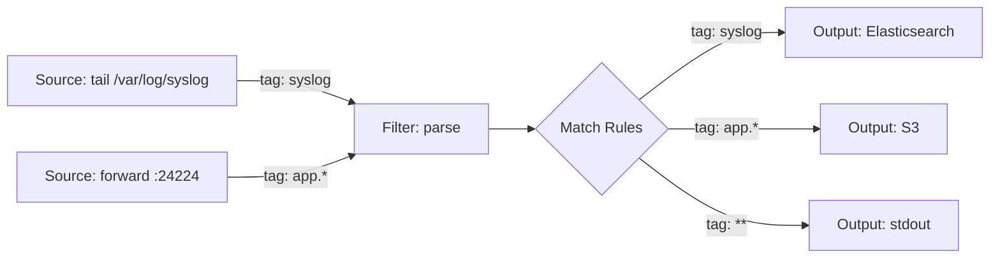

# How to Use Ansible to Install and Configure Fluentd

Author: [nawazdhandala](https://www.github.com/nawazdhandala)

Tags: Ansible, Fluentd, Log Management, DevOps

Description: Automate Fluentd installation and pipeline configuration using Ansible for flexible log collection, transformation, and forwarding across your infrastructure.

---

Fluentd is an open-source data collector that unifies log collection across your infrastructure. Unlike Filebeat, which is tightly coupled to the Elastic ecosystem, Fluentd is vendor-neutral and supports over 500 plugins for inputs, outputs, and transformations. It can ship logs to Elasticsearch, S3, Kafka, BigQuery, and many other destinations simultaneously. Ansible makes deploying and configuring Fluentd consistent across your server fleet.

This post covers building an Ansible role that installs Fluentd (via the td-agent package), configures input sources, applies filters, and routes logs to multiple outputs.

## Fluentd Architecture

Fluentd uses a tag-based routing system. Each log event has a tag, and the configuration file matches tags to determine which filters and outputs to apply.



## Project Structure

```
fluentd/
  inventory/
    hosts.yml
  roles/
    fluentd/
      tasks/
        main.yml
        install.yml
        configure.yml
        plugins.yml
      templates/
        td-agent.conf.j2
      defaults/
        main.yml
      handlers/
        main.yml
  playbook.yml
```

## Default Variables

```yaml
# roles/fluentd/defaults/main.yml
# Installation method: "td-agent" (recommended) or "gem"
fluentd_install_method: "td-agent"
fluentd_version: "4"

# Service settings
fluentd_user: "td-agent"
fluentd_group: "td-agent"
fluentd_config_dir: "/etc/td-agent"
fluentd_config_file: "/etc/td-agent/td-agent.conf"
fluentd_log_dir: "/var/log/td-agent"

# Buffer settings
fluentd_buffer_type: "file"
fluentd_buffer_path: "/var/log/td-agent/buffer"
fluentd_flush_interval: "5s"
fluentd_chunk_limit_size: "8m"
fluentd_total_limit_size: "2g"
fluentd_retry_max_interval: "30s"

# Input sources
fluentd_sources:
  - type: tail
    tag: "syslog"
    path: "/var/log/syslog"
    pos_file: "/var/log/td-agent/pos/syslog.pos"
    parse_type: "syslog"
  - type: tail
    tag: "app.access"
    path: "/var/log/app/access.log"
    pos_file: "/var/log/td-agent/pos/app-access.pos"
    parse_type: "json"

# Forward input (for receiving from other Fluentd/Fluent Bit instances)
fluentd_forward_input_enabled: true
fluentd_forward_port: 24224

# Output destinations
fluentd_outputs:
  - match: "**"
    type: "elasticsearch"
    host: "elasticsearch.example.com"
    port: 9200
    index_name: "fluentd"
    type_name: "_doc"

# Plugins to install
fluentd_plugins:
  - fluent-plugin-elasticsearch
  - fluent-plugin-s3

# System configuration
fluentd_workers: 2
```

## Installation Tasks

```yaml
# roles/fluentd/tasks/install.yml
---
- name: Install prerequisites
  ansible.builtin.apt:
    name:
      - curl
      - gnupg
    state: present
    update_cache: yes
  become: true

- name: Add Treasure Data GPG key
  ansible.builtin.apt_key:
    url: https://packages.treasuredata.com/GPG-KEY-td-agent
    state: present
  become: true

- name: Add td-agent repository
  ansible.builtin.apt_repository:
    repo: "deb http://packages.treasuredata.com/{{ fluentd_version }}/ubuntu/{{ ansible_distribution_release }}/ {{ ansible_distribution_release }} contrib"
    state: present
    filename: td-agent
  become: true

- name: Install td-agent
  ansible.builtin.apt:
    name: td-agent
    state: present
    update_cache: yes
  become: true

- name: Create position file directory
  ansible.builtin.file:
    path: /var/log/td-agent/pos
    state: directory
    owner: "{{ fluentd_user }}"
    group: "{{ fluentd_group }}"
    mode: "0755"
  become: true

- name: Create buffer directory
  ansible.builtin.file:
    path: "{{ fluentd_buffer_path }}"
    state: directory
    owner: "{{ fluentd_user }}"
    group: "{{ fluentd_group }}"
    mode: "0755"
  become: true
```

## Plugin Installation Tasks

```yaml
# roles/fluentd/tasks/plugins.yml
---
- name: Get installed plugins
  ansible.builtin.command: td-agent-gem list --local
  register: installed_plugins
  changed_when: false
  become: true

- name: Install Fluentd plugins
  ansible.builtin.command: "td-agent-gem install {{ item }}"
  loop: "{{ fluentd_plugins }}"
  when: item not in installed_plugins.stdout
  become: true
  notify: Restart fluentd
```

## Configuration Tasks

```yaml
# roles/fluentd/tasks/configure.yml
---
- name: Deploy Fluentd configuration
  ansible.builtin.template:
    src: td-agent.conf.j2
    dest: "{{ fluentd_config_file }}"
    owner: "{{ fluentd_user }}"
    group: "{{ fluentd_group }}"
    mode: "0640"
  become: true
  notify: Restart fluentd

- name: Validate Fluentd configuration
  ansible.builtin.command: "td-agent --dry-run -c {{ fluentd_config_file }}"
  become: true
  changed_when: false

- name: Grant td-agent access to log files
  ansible.builtin.user:
    name: "{{ fluentd_user }}"
    groups: adm
    append: yes
  become: true
```

## Fluentd Configuration Template

```
# roles/fluentd/templates/td-agent.conf.j2
# Fluentd configuration - managed by Ansible
# Do not edit this file manually

<system>
  workers {{ fluentd_workers }}
  log_level info
</system>

# Source: Internal monitoring
<source>
  @type monitor_agent
  bind 0.0.0.0
  port 24220
</source>


# Source: Forward input for receiving logs from other agents
<source>
  @type forward
  port {{ fluentd_forward_port }}
  bind 0.0.0.0
</source>



# Source: {{ source.tag }} from {{ source.path }}
<source>
  @type {{ source.type }}
  tag {{ source.tag }}
  path {{ source.path }}
  pos_file {{ source.pos_file }}
  read_from_head true
  <parse>
    @type {{ source.parse_type }}

    expression {{ source.expression }}


    format_firstline {{ source.format_firstline }}
    format1 {{ source.format1 | default('/^(?<message>.*)$/') }}

  </parse>
</source>



# Filter: Add hostname to all events
<filter **>
  @type record_transformer
  <record>
    hostname "#{Socket.gethostname}"
    environment "{{ ansible_env.get('APP_ENV', 'production') }}"
  </record>
</filter>


# Output: {{ output.type }} for tag pattern {{ output.match }}
<match {{ output.match }}>
  @type {{ output.type }}

  host {{ output.host }}
  port {{ output.port }}
  index_name {{ output.index_name }}
  type_name {{ output.type_name | default('_doc') }}
  logstash_format true
  logstash_prefix {{ output.index_name }}
  include_tag_key true
  reconnect_on_error true
  reload_on_failure true
  reload_connections false

  s3_bucket {{ output.bucket }}
  s3_region {{ output.region }}
  path logs/{{ output.match }}/
  time_slice_format %Y%m%d%H
  <format>
    @type json
  </format>

  <server>
    host {{ output.host }}
    port {{ output.port | default(24224) }}
  </server>


  <buffer>
    @type {{ fluentd_buffer_type }}

    path {{ fluentd_buffer_path }}/{{ output.match | replace('*', 'all') | replace('.', '_') }}

    flush_interval {{ fluentd_flush_interval }}
    chunk_limit_size {{ fluentd_chunk_limit_size }}
    total_limit_size {{ fluentd_total_limit_size }}
    retry_max_interval {{ fluentd_retry_max_interval }}
    flush_thread_count 2
    overflow_action block
  </buffer>
</match>


```

## Main Tasks

```yaml
# roles/fluentd/tasks/main.yml
---
- name: Install Fluentd
  ansible.builtin.include_tasks: install.yml

- name: Install Fluentd plugins
  ansible.builtin.include_tasks: plugins.yml

- name: Configure Fluentd
  ansible.builtin.include_tasks: configure.yml

- name: Enable and start Fluentd
  ansible.builtin.systemd:
    name: td-agent
    state: started
    enabled: true
  become: true
```

## Handlers

```yaml
# roles/fluentd/handlers/main.yml
---
- name: Restart fluentd
  ansible.builtin.systemd:
    name: td-agent
    state: restarted
  become: true
```

## The Playbook

```yaml
# playbook.yml
---
- name: Install and configure Fluentd
  hosts: app_servers
  become: true
  vars:
    fluentd_sources:
      - type: tail
        tag: "nginx.access"
        path: "/var/log/nginx/access.log"
        pos_file: "/var/log/td-agent/pos/nginx-access.pos"
        parse_type: "nginx"
      - type: tail
        tag: "app.logs"
        path: "/opt/myapp/logs/*.log"
        pos_file: "/var/log/td-agent/pos/app.pos"
        parse_type: "json"
    fluentd_outputs:
      - match: "nginx.*"
        type: "elasticsearch"
        host: "es.internal"
        port: 9200
        index_name: "nginx"
      - match: "app.*"
        type: "elasticsearch"
        host: "es.internal"
        port: 9200
        index_name: "application"
    fluentd_plugins:
      - fluent-plugin-elasticsearch
  roles:
    - fluentd
```

## Running the Deployment

```bash
# Deploy Fluentd
ansible-playbook -i inventory/hosts.yml playbook.yml

# Check Fluentd status
curl http://localhost:24220/api/plugins.json

# View Fluentd logs
journalctl -u td-agent -f
```

## Summary

Fluentd's plugin ecosystem and vendor-neutral design make it a flexible choice for log aggregation. The Ansible role in this post handles td-agent installation, plugin management, and template-driven configuration that supports multiple input sources and output destinations. The tag-based routing system means you can send different log types to different destinations, and the buffering configuration ensures logs are not lost during network disruptions.
