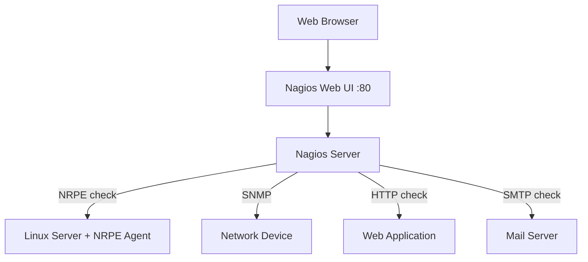

# How to Use Ansible to Install and Configure Nagios

Author: [nawazdhandala](https://www.github.com/nawazdhandala)

Tags: Ansible, Nagios, Monitoring, Infrastructure, DevOps

Description: Automate the deployment of Nagios Core monitoring server and NRPE agents using Ansible for reliable infrastructure health monitoring and alerting.

---

Nagios is one of the oldest and most battle-tested monitoring systems in existence. First released in 1999, it has been monitoring infrastructure reliably for over two decades. While newer tools like Prometheus and Grafana get most of the attention, Nagios still powers monitoring at thousands of organizations, especially in environments with legacy systems, network devices, and traditional server infrastructure. Installing Nagios from source is notoriously tedious, which makes it an ideal candidate for Ansible automation.

This post covers deploying Nagios Core from source, configuring hosts and services, and deploying NRPE agents on monitored hosts.

## Architecture



## Project Structure

```
nagios/
  inventory/
    hosts.yml
  roles/
    nagios_server/
      tasks/
        main.yml
        install.yml
        configure.yml
        plugins.yml
      templates/
        nagios.cfg.j2
        cgi.cfg.j2
        hosts.cfg.j2
        services.cfg.j2
        contacts.cfg.j2
        commands.cfg.j2
      defaults/
        main.yml
      handlers/
        main.yml
    nagios_nrpe/
      tasks/
        main.yml
      templates/
        nrpe.cfg.j2
      defaults/
        main.yml
      handlers/
        main.yml
  playbook.yml
```

## Nagios Server Role

### Default Variables

```yaml
# roles/nagios_server/defaults/main.yml
nagios_version: "4.4.14"
nagios_plugins_version: "2.4.8"

# System settings
nagios_user: "nagios"
nagios_group: "nagios"
nagios_command_group: "nagcmd"

# Web interface settings
nagios_web_user: "nagiosadmin"
nagios_web_password: "changeme"

# Directories
nagios_home: "/usr/local/nagios"
nagios_config_dir: "/usr/local/nagios/etc"

# Check settings
nagios_check_interval: 5
nagios_retry_interval: 1
nagios_max_check_attempts: 5
nagios_notification_interval: 30

# Contacts
nagios_admin_email: "admin@example.com"

# Hosts to monitor
nagios_monitored_hosts:
  - name: "web-server-1"
    alias: "Web Server 1"
    address: "10.0.1.10"
    groups: ["web-servers"]
  - name: "db-server-1"
    alias: "Database Server 1"
    address: "10.0.2.10"
    groups: ["db-servers"]

# Services to monitor
nagios_services:
  - name: "PING"
    check_command: "check_ping!200.0,20%!500.0,60%"
    hostgroups: ["all"]
  - name: "SSH"
    check_command: "check_ssh"
    hostgroups: ["all"]
  - name: "HTTP"
    check_command: "check_http"
    hostgroups: ["web-servers"]
  - name: "CPU Load"
    check_command: "check_nrpe!check_load"
    hostgroups: ["all"]
  - name: "Disk Usage"
    check_command: "check_nrpe!check_disk"
    hostgroups: ["all"]
  - name: "Memory"
    check_command: "check_nrpe!check_mem"
    hostgroups: ["all"]
```

### Installation Tasks

```yaml
# roles/nagios_server/tasks/install.yml
---
- name: Install build dependencies
  ansible.builtin.apt:
    name:
      - build-essential
      - libgd-dev
      - libssl-dev
      - unzip
      - wget
      - apache2
      - php
      - libapache2-mod-php
      - php-gd
      - libperl-dev
      - daemon
      - autoconf
      - gettext
    state: present
    update_cache: yes
  become: true

- name: Create nagios user and groups
  ansible.builtin.group:
    name: "{{ item }}"
    state: present
  loop:
    - "{{ nagios_group }}"
    - "{{ nagios_command_group }}"
  become: true

- name: Create nagios user
  ansible.builtin.user:
    name: "{{ nagios_user }}"
    groups:
      - "{{ nagios_group }}"
      - "{{ nagios_command_group }}"
    shell: /bin/bash
    create_home: true
  become: true

- name: Add www-data to nagcmd group
  ansible.builtin.user:
    name: www-data
    groups: "{{ nagios_command_group }}"
    append: yes
  become: true

- name: Check if Nagios is already installed
  ansible.builtin.stat:
    path: "{{ nagios_home }}/bin/nagios"
  register: nagios_binary

- name: Download Nagios Core
  ansible.builtin.get_url:
    url: "https://github.com/NagiosEnterprises/nagioscore/archive/nagios-{{ nagios_version }}.tar.gz"
    dest: "/tmp/nagios-{{ nagios_version }}.tar.gz"
    mode: "0644"
  when: not nagios_binary.stat.exists

- name: Extract Nagios Core
  ansible.builtin.unarchive:
    src: "/tmp/nagios-{{ nagios_version }}.tar.gz"
    dest: /tmp/
    remote_src: true
  when: not nagios_binary.stat.exists

- name: Compile and install Nagios Core
  ansible.builtin.shell: |
    cd /tmp/nagioscore-nagios-{{ nagios_version }}
    ./configure --with-httpd-conf=/etc/apache2/sites-enabled --with-command-group={{ nagios_command_group }}
    make all
    make install
    make install-init
    make install-config
    make install-commandmode
    make install-webconf
  become: true
  when: not nagios_binary.stat.exists

- name: Create nagiosadmin htpasswd user
  ansible.builtin.command: >
    htpasswd -bc {{ nagios_home }}/etc/htpasswd.users
    {{ nagios_web_user }} {{ nagios_web_password }}
  become: true
  changed_when: true

- name: Enable Apache CGI module
  ansible.builtin.command: a2enmod cgi
  become: true
  changed_when: true
  notify: Restart apache

- name: Clean up Nagios source
  ansible.builtin.file:
    path: "{{ item }}"
    state: absent
  loop:
    - "/tmp/nagios-{{ nagios_version }}.tar.gz"
    - "/tmp/nagioscore-nagios-{{ nagios_version }}"
```

### Plugin Installation Tasks

```yaml
# roles/nagios_server/tasks/plugins.yml
---
- name: Check if Nagios plugins are installed
  ansible.builtin.stat:
    path: "{{ nagios_home }}/libexec/check_ping"
  register: plugins_installed

- name: Download Nagios Plugins
  ansible.builtin.get_url:
    url: "https://github.com/nagios-plugins/nagios-plugins/releases/download/release-{{ nagios_plugins_version }}/nagios-plugins-{{ nagios_plugins_version }}.tar.gz"
    dest: "/tmp/nagios-plugins-{{ nagios_plugins_version }}.tar.gz"
    mode: "0644"
  when: not plugins_installed.stat.exists

- name: Extract Nagios Plugins
  ansible.builtin.unarchive:
    src: "/tmp/nagios-plugins-{{ nagios_plugins_version }}.tar.gz"
    dest: /tmp/
    remote_src: true
  when: not plugins_installed.stat.exists

- name: Compile and install Nagios Plugins
  ansible.builtin.shell: |
    cd /tmp/nagios-plugins-{{ nagios_plugins_version }}
    ./configure --with-nagios-user={{ nagios_user }} --with-nagios-group={{ nagios_group }}
    make
    make install
  become: true
  when: not plugins_installed.stat.exists

- name: Install NRPE plugin (check_nrpe)
  ansible.builtin.apt:
    name: nagios-nrpe-plugin
    state: present
  become: true
```

### Configuration Tasks

```yaml
# roles/nagios_server/tasks/configure.yml
---
- name: Create configuration directories
  ansible.builtin.file:
    path: "{{ nagios_config_dir }}/{{ item }}"
    state: directory
    owner: "{{ nagios_user }}"
    group: "{{ nagios_group }}"
    mode: "0755"
  loop:
    - servers
    - services
  become: true

- name: Deploy hosts configuration
  ansible.builtin.template:
    src: hosts.cfg.j2
    dest: "{{ nagios_config_dir }}/servers/hosts.cfg"
    owner: "{{ nagios_user }}"
    group: "{{ nagios_group }}"
    mode: "0644"
  become: true
  notify: Validate and reload nagios

- name: Deploy services configuration
  ansible.builtin.template:
    src: services.cfg.j2
    dest: "{{ nagios_config_dir }}/services/services.cfg"
    owner: "{{ nagios_user }}"
    group: "{{ nagios_group }}"
    mode: "0644"
  become: true
  notify: Validate and reload nagios

- name: Deploy contacts configuration
  ansible.builtin.template:
    src: contacts.cfg.j2
    dest: "{{ nagios_config_dir }}/objects/contacts.cfg"
    owner: "{{ nagios_user }}"
    group: "{{ nagios_group }}"
    mode: "0644"
  become: true
  notify: Validate and reload nagios

- name: Deploy commands configuration
  ansible.builtin.template:
    src: commands.cfg.j2
    dest: "{{ nagios_config_dir }}/objects/commands.cfg"
    owner: "{{ nagios_user }}"
    group: "{{ nagios_group }}"
    mode: "0644"
  become: true
  notify: Validate and reload nagios

- name: Add server and service config dirs to nagios.cfg
  ansible.builtin.lineinfile:
    path: "{{ nagios_config_dir }}/nagios.cfg"
    line: "cfg_dir={{ nagios_config_dir }}/{{ item }}"
    state: present
  loop:
    - servers
    - services
  become: true
  notify: Validate and reload nagios
```

### Hosts Configuration Template

```ini
# roles/nagios_server/templates/hosts.cfg.j2
# Host definitions - managed by Ansible

# Host groups










define hostgroup {
    hostgroup_name  {{ group }}
    alias           {{ group | replace('-', ' ') | title }}
}


define hostgroup {
    hostgroup_name  all
    alias           All Servers
    members         {{ host.name }},

}

# Host definitions

define host {
    use                 linux-server
    host_name           {{ host.name }}
    alias               {{ host.alias }}
    address             {{ host.address }}
    hostgroups          {{ host.groups | join(',') }}
    max_check_attempts  {{ nagios_max_check_attempts }}
    check_interval      {{ nagios_check_interval }}
    retry_interval      {{ nagios_retry_interval }}
    notification_interval {{ nagios_notification_interval }}
}


```

### Services Configuration Template

```ini
# roles/nagios_server/templates/services.cfg.j2
# Service definitions - managed by Ansible


define service {
    use                 generic-service
    hostgroup_name      {{ service.hostgroups | join(',') }}
    service_description {{ service.name }}
    check_command       {{ service.check_command }}
    max_check_attempts  {{ nagios_max_check_attempts }}
    check_interval      {{ nagios_check_interval }}
    retry_interval      {{ nagios_retry_interval }}
    notification_interval {{ nagios_notification_interval }}
}


```

### Commands Configuration Template

```ini
# roles/nagios_server/templates/commands.cfg.j2
# Command definitions - managed by Ansible

define command {
    command_name    check_nrpe
    command_line    $USER1$/check_nrpe -H $HOSTADDRESS$ -c $ARG1$
}

define command {
    command_name    check_http
    command_line    $USER1$/check_http -H $HOSTADDRESS$
}

define command {
    command_name    check_ssh
    command_line    $USER1$/check_ssh $HOSTADDRESS$
}

define command {
    command_name    check_ping
    command_line    $USER1$/check_ping -H $HOSTADDRESS$ -w $ARG1$ -c $ARG2$ -p 5
}
```

### Main Tasks

```yaml
# roles/nagios_server/tasks/main.yml
---
- name: Install Nagios Core
  ansible.builtin.include_tasks: install.yml

- name: Install Nagios Plugins
  ansible.builtin.include_tasks: plugins.yml

- name: Configure Nagios
  ansible.builtin.include_tasks: configure.yml

- name: Enable and start Nagios
  ansible.builtin.systemd:
    name: nagios
    state: started
    enabled: true
  become: true
```

### Handlers

```yaml
# roles/nagios_server/handlers/main.yml
---
- name: Validate and reload nagios
  ansible.builtin.command: "{{ nagios_home }}/bin/nagios -v {{ nagios_config_dir }}/nagios.cfg"
  become: true
  changed_when: false
  notify: Reload nagios

- name: Reload nagios
  ansible.builtin.systemd:
    name: nagios
    state: reloaded
  become: true

- name: Restart apache
  ansible.builtin.systemd:
    name: apache2
    state: restarted
  become: true
```

## NRPE Agent Role

```yaml
# roles/nagios_nrpe/defaults/main.yml
nrpe_allowed_hosts:
  - "127.0.0.1"
  - "10.0.1.5"
nrpe_port: 5666

# Check commands
nrpe_commands:
  check_load: "/usr/lib/nagios/plugins/check_load -w 5.0,4.0,3.0 -c 10.0,6.0,4.0"
  check_disk: "/usr/lib/nagios/plugins/check_disk -w 20% -c 10% -p /"
  check_mem: "/usr/lib/nagios/plugins/check_mem -w 80 -c 90"
  check_procs: "/usr/lib/nagios/plugins/check_procs -w 250 -c 400"
  check_zombie: "/usr/lib/nagios/plugins/check_procs -w 5 -c 10 -s Z"
```

```yaml
# roles/nagios_nrpe/tasks/main.yml
---
- name: Install NRPE and Nagios plugins
  ansible.builtin.apt:
    name:
      - nagios-nrpe-server
      - nagios-plugins-basic
      - nagios-plugins-standard
    state: present
    update_cache: yes
  become: true

- name: Deploy NRPE configuration
  ansible.builtin.template:
    src: nrpe.cfg.j2
    dest: /etc/nagios/nrpe.cfg
    owner: root
    group: nagios
    mode: "0640"
  become: true
  notify: Restart nrpe

- name: Enable and start NRPE
  ansible.builtin.systemd:
    name: nagios-nrpe-server
    state: started
    enabled: true
  become: true
```

```ini
# roles/nagios_nrpe/templates/nrpe.cfg.j2
# NRPE configuration - managed by Ansible

server_port={{ nrpe_port }}
nrpe_user=nagios
nrpe_group=nagios
allowed_hosts={{ nrpe_allowed_hosts | join(',') }}
dont_blame_nrpe=0
allow_bash_command_substitution=0


command[{{ name }}]={{ command }}

```

## Running the Deployment

```bash
# Deploy the full Nagios stack
ansible-playbook -i inventory/hosts.yml playbook.yml --ask-vault-pass

# Access the web interface
# URL: http://nagios-server/nagios
# Credentials: nagiosadmin / <your password>
```

## Summary

Nagios may not be the trendiest monitoring tool, but it remains rock-solid for infrastructure monitoring. The Ansible roles in this post automate the most painful part of Nagios deployment: compiling from source, configuring hosts and services, and deploying NRPE agents. The template-driven approach means you define your monitored hosts and services as Ansible variables, and the configuration files are generated automatically. Adding a new host is as simple as adding an entry to the `nagios_monitored_hosts` list and running the playbook.
