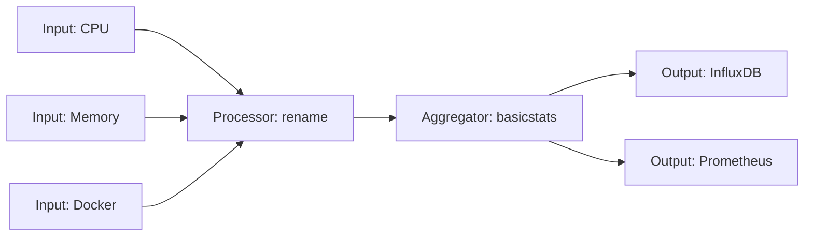

# How to Use Ansible to Install and Configure Telegraf

Author: [nawazdhandala](https://www.github.com/nawazdhandala)

Tags: Ansible, Telegraf, Monitoring, InfluxDB, DevOps

Description: Automate Telegraf agent deployment and metric collection configuration using Ansible for infrastructure monitoring with InfluxDB or Prometheus.

---

Telegraf is InfluxData's open-source agent for collecting, processing, and writing metrics. It supports over 300 input plugins covering everything from system metrics to database stats to application telemetry. Unlike Node Exporter which is Prometheus-specific, Telegraf can output to InfluxDB, Prometheus, Kafka, Elasticsearch, and many other systems. This flexibility makes it a solid choice if you want a single agent that feeds multiple monitoring backends.

This post walks through building an Ansible role that installs Telegraf and configures it with the input and output plugins your infrastructure needs.

## Telegraf's Plugin Architecture

Telegraf organizes its configuration around four plugin types:

- **Input plugins**: Collect metrics (CPU, memory, Docker, PostgreSQL, etc.)
- **Processor plugins**: Transform metrics (rename, add tags, aggregate)
- **Aggregator plugins**: Create aggregate metrics (mean, min, max, percentiles)
- **Output plugins**: Write metrics to destinations (InfluxDB, Prometheus, file)



## Project Structure

```
telegraf/
  inventory/
    hosts.yml
  roles/
    telegraf/
      tasks/
        main.yml
        install.yml
        configure.yml
      templates/
        telegraf.conf.j2
      defaults/
        main.yml
      handlers/
        main.yml
  playbook.yml
```

## Default Variables

```yaml
# roles/telegraf/defaults/main.yml
# InfluxData repository version
telegraf_version: "latest"

# Agent settings
telegraf_interval: "10s"
telegraf_round_interval: true
telegraf_metric_batch_size: 1000
telegraf_metric_buffer_limit: 10000
telegraf_flush_interval: "10s"
telegraf_hostname: ""
telegraf_omit_hostname: false

# Output configuration
telegraf_output_type: "influxdb_v2"

# InfluxDB v2 output settings
telegraf_influxdb_url: "http://localhost:8086"
telegraf_influxdb_token: ""
telegraf_influxdb_org: "myorg"
telegraf_influxdb_bucket: "metrics"

# Prometheus output settings (alternative)
telegraf_prometheus_listen: ":9273"
telegraf_prometheus_path: "/metrics"

# Global tags added to all metrics
telegraf_global_tags:
  environment: "production"
  datacenter: "us-east-1"

# Input plugins to enable
telegraf_inputs:
  - plugin: cpu
    config:
      percpu: true
      totalcpu: true
      collect_cpu_time: false
  - plugin: mem
    config: {}
  - plugin: disk
    config:
      ignore_fs:
        - tmpfs
        - devtmpfs
  - plugin: diskio
    config: {}
  - plugin: net
    config: {}
  - plugin: system
    config: {}
  - plugin: processes
    config: {}
  - plugin: kernel
    config: {}

# Additional custom inputs (empty by default)
telegraf_custom_inputs: []
```

## Installation Tasks

```yaml
# roles/telegraf/tasks/install.yml
---
- name: Install prerequisites
  ansible.builtin.apt:
    name:
      - curl
      - gnupg
      - apt-transport-https
    state: present
    update_cache: yes
  become: true

- name: Add InfluxData GPG key
  ansible.builtin.apt_key:
    url: https://repos.influxdata.com/influxdata-archive_compat.key
    state: present
  become: true

- name: Add InfluxData repository
  ansible.builtin.apt_repository:
    repo: "deb https://repos.influxdata.com/ubuntu {{ ansible_distribution_release }} stable"
    state: present
    filename: influxdata
  become: true

- name: Install Telegraf
  ansible.builtin.apt:
    name: "telegraf={{ telegraf_version }}"
    state: "{{ 'present' if telegraf_version != 'latest' else 'latest' }}"
    update_cache: yes
  become: true

- name: Add telegraf user to docker group
  ansible.builtin.user:
    name: telegraf
    groups: docker
    append: yes
  become: true
  when: telegraf_custom_inputs | selectattr('plugin', 'equalto', 'docker') | list | length > 0
  ignore_errors: yes
```

## Configuration Tasks

```yaml
# roles/telegraf/tasks/configure.yml
---
- name: Deploy Telegraf configuration
  ansible.builtin.template:
    src: telegraf.conf.j2
    dest: /etc/telegraf/telegraf.conf
    owner: telegraf
    group: telegraf
    mode: "0640"
  become: true
  notify: Restart telegraf

- name: Test Telegraf configuration
  ansible.builtin.command: telegraf --config /etc/telegraf/telegraf.conf --test
  become: true
  changed_when: false
  register: telegraf_test
  ignore_errors: yes

- name: Display test result
  ansible.builtin.debug:
    msg: "Telegraf config test: {{ 'PASSED' if telegraf_test.rc == 0 else 'FAILED' }}"
```

## Telegraf Configuration Template

```toml
# roles/telegraf/templates/telegraf.conf.j2
# Telegraf configuration - managed by Ansible
# Do not edit this file manually

# Global tags
[global_tags]

  {{ key }} = "{{ value }}"


# Agent configuration
[agent]
  interval = "{{ telegraf_interval }}"
  round_interval = {{ telegraf_round_interval | lower }}
  metric_batch_size = {{ telegraf_metric_batch_size }}
  metric_buffer_limit = {{ telegraf_metric_buffer_limit }}
  flush_interval = "{{ telegraf_flush_interval }}"

  hostname = "{{ telegraf_hostname }}"

  omit_hostname = {{ telegraf_omit_hostname | lower }}

###############################################################################
#                            OUTPUT PLUGINS                                   #
###############################################################################


# InfluxDB v2 output
[[outputs.influxdb_v2]]
  urls = ["{{ telegraf_influxdb_url }}"]
  token = "{{ telegraf_influxdb_token }}"
  organization = "{{ telegraf_influxdb_org }}"
  bucket = "{{ telegraf_influxdb_bucket }}"



# Prometheus output (exposes /metrics endpoint)
[[outputs.prometheus_client]]
  listen = "{{ telegraf_prometheus_listen }}"
  path = "{{ telegraf_prometheus_path }}"
  metric_version = 2



# InfluxDB v2 output (also writing to InfluxDB)
[[outputs.influxdb_v2]]
  urls = ["{{ telegraf_influxdb_url }}"]
  token = "{{ telegraf_influxdb_token }}"
  organization = "{{ telegraf_influxdb_org }}"
  bucket = "{{ telegraf_influxdb_bucket }}"


###############################################################################
#                            INPUT PLUGINS                                    #
###############################################################################


# Input: {{ input.plugin }}
[[inputs.{{ input.plugin }}]]


  [inputs.{{ input.plugin }}.{{ key }}]

    {{ subkey }} = {{ subvalue | to_json }}


  {{ key }} = {{ value | to_json }}

  {{ key }} = {{ value | lower }}

  {{ key }} = {{ value }}

  {{ key }} = "{{ value }}"






# Custom input: {{ input.plugin }}
[[inputs.{{ input.plugin }}]]



  [inputs.{{ input.plugin }}.{{ key }}]

    {{ subkey }} = {{ subvalue | to_json }}


  {{ key }} = {{ value | to_json }}

  {{ key }} = {{ value | lower }}

  {{ key }} = {{ value }}

  {{ key }} = "{{ value }}"





```

## Main Tasks

```yaml
# roles/telegraf/tasks/main.yml
---
- name: Install Telegraf
  ansible.builtin.include_tasks: install.yml

- name: Configure Telegraf
  ansible.builtin.include_tasks: configure.yml

- name: Enable and start Telegraf
  ansible.builtin.systemd:
    name: telegraf
    state: started
    enabled: true
  become: true
```

## Handlers

```yaml
# roles/telegraf/handlers/main.yml
---
- name: Restart telegraf
  ansible.builtin.systemd:
    name: telegraf
    state: restarted
  become: true
```

## The Playbook

```yaml
# playbook.yml
---
- name: Install and configure Telegraf
  hosts: all
  become: true
  vars:
    telegraf_output_type: "influxdb_v2"
    telegraf_influxdb_url: "http://influxdb.internal:8086"
    telegraf_influxdb_token: "{{ vault_influxdb_token }}"
    telegraf_influxdb_org: "mycompany"
    telegraf_influxdb_bucket: "infrastructure"
    telegraf_custom_inputs:
      - plugin: nginx
        config:
          urls:
            - "http://localhost/nginx_status"
      - plugin: postgresql
        config:
          address: "host=localhost user=telegraf dbname=postgres sslmode=disable"
  roles:
    - telegraf
```

## Running It

```bash
# Deploy Telegraf
ansible-playbook -i inventory/hosts.yml playbook.yml --ask-vault-pass

# Verify Telegraf is collecting metrics
telegraf --config /etc/telegraf/telegraf.conf --test --input-filter cpu:mem

# Check if Prometheus endpoint is working (if enabled)
curl http://localhost:9273/metrics
```

## Using Telegraf with Prometheus

If you are already using Prometheus and want Telegraf as a collector instead of Node Exporter, set the output to Prometheus:

```yaml
telegraf_output_type: "prometheus"
telegraf_prometheus_listen: ":9273"
```

Then add the Telegraf endpoint as a scrape target in your Prometheus configuration. This gives you access to Telegraf's much larger plugin ecosystem while keeping Prometheus as your metrics backend.

## Summary

Telegraf's massive plugin library and multi-output support make it one of the most flexible metric collection agents available. The Ansible role in this post handles installation from the InfluxData repository, template-driven configuration with support for any input or output plugin, and Docker group membership for container monitoring. Whether you are sending metrics to InfluxDB, Prometheus, or both, this role provides a consistent deployment mechanism across your entire fleet.
