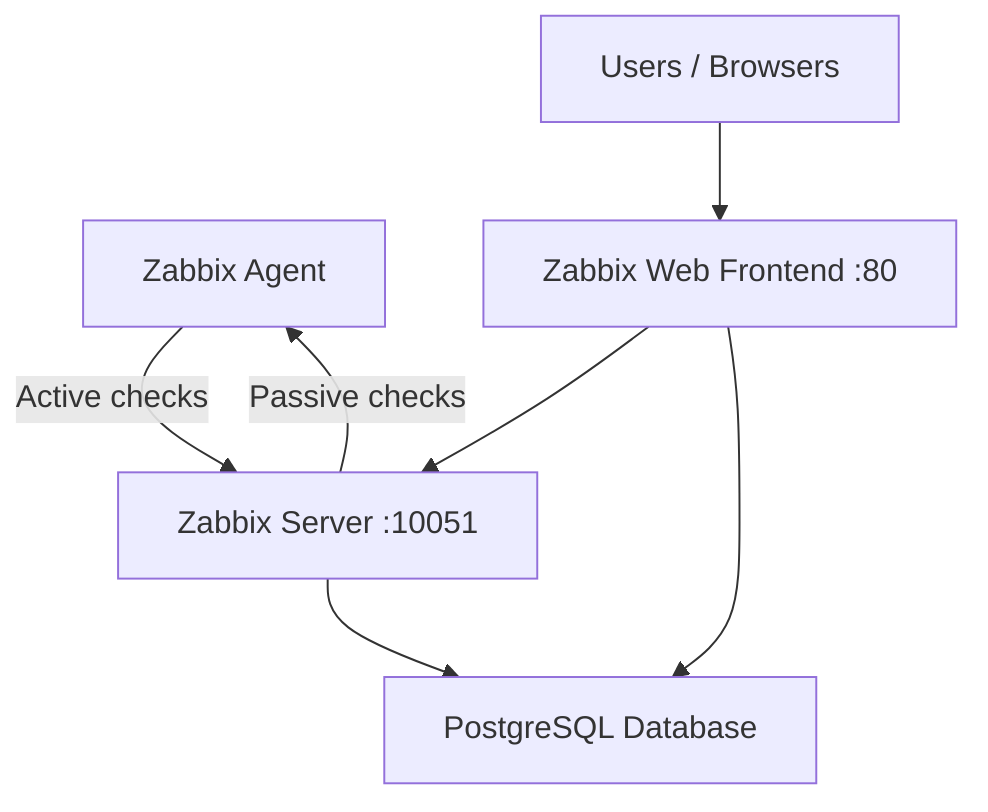

# How to Use Ansible to Install and Configure Zabbix

Author: [nawazdhandala](https://www.github.com/nawazdhandala)

Tags: Ansible, Zabbix, Monitoring, DevOps, Infrastructure

Description: Automate the deployment of Zabbix monitoring server and agents using Ansible for comprehensive infrastructure monitoring with alerting and visualization.

---

Zabbix is an enterprise-grade monitoring platform that has been around since 2001. It supports agent-based and agentless monitoring, auto-discovery, advanced alerting, and built-in visualization. While tools like Prometheus dominate the cloud-native space, Zabbix remains incredibly popular for traditional infrastructure monitoring where you need deep integration with network devices, VMware, SNMP, and Windows servers. Deploying Zabbix with Ansible ensures consistent installation across your server, database, and agent tiers.

This post covers deploying the full Zabbix stack: the Zabbix Server, the web frontend, a PostgreSQL database, and Zabbix agents on monitored hosts.

## Architecture



## Project Structure

```
zabbix/
  inventory/
    hosts.yml
  roles/
    zabbix_server/
      tasks/
        main.yml
      templates/
        zabbix_server.conf.j2
      defaults/
        main.yml
      handlers/
        main.yml
    zabbix_frontend/
      tasks/
        main.yml
      templates/
        zabbix_nginx.conf.j2
      defaults/
        main.yml
    zabbix_agent/
      tasks/
        main.yml
      templates/
        zabbix_agentd.conf.j2
      defaults/
        main.yml
      handlers/
        main.yml
  playbook.yml
```

## Zabbix Server Role

### Default Variables

```yaml
# roles/zabbix_server/defaults/main.yml
zabbix_version: "6.4"
zabbix_server_listen_port: 10051

# Database settings
zabbix_db_type: "postgresql"
zabbix_db_host: "localhost"
zabbix_db_name: "zabbix"
zabbix_db_user: "zabbix"
zabbix_db_password: "changeme"

# Performance tuning
zabbix_start_pollers: 10
zabbix_start_preprocessors: 5
zabbix_start_trappers: 5
zabbix_cache_size: "128M"
zabbix_history_cache_size: "64M"
zabbix_value_cache_size: "64M"
zabbix_trend_cache_size: "32M"

# Housekeeping
zabbix_housekeeping_frequency: 1
zabbix_max_housekeeper_delete: 5000
```

### Server Tasks

```yaml
# roles/zabbix_server/tasks/main.yml
---
- name: Install prerequisites
  ansible.builtin.apt:
    name:
      - wget
      - gnupg
      - postgresql
      - postgresql-contrib
      - python3-psycopg2
    state: present
    update_cache: yes
  become: true

- name: Download Zabbix repository package
  ansible.builtin.get_url:
    url: "https://repo.zabbix.com/zabbix/{{ zabbix_version }}/ubuntu/pool/main/z/zabbix-release/zabbix-release_{{ zabbix_version }}-1+ubuntu{{ ansible_distribution_version }}_all.deb"
    dest: /tmp/zabbix-release.deb
    mode: "0644"

- name: Install Zabbix repository
  ansible.builtin.apt:
    deb: /tmp/zabbix-release.deb
  become: true

- name: Install Zabbix Server
  ansible.builtin.apt:
    name:
      - zabbix-server-pgsql
      - zabbix-sql-scripts
    state: present
    update_cache: yes
  become: true

- name: Ensure PostgreSQL is running
  ansible.builtin.systemd:
    name: postgresql
    state: started
    enabled: true
  become: true

- name: Create Zabbix database user
  community.postgresql.postgresql_user:
    name: "{{ zabbix_db_user }}"
    password: "{{ zabbix_db_password }}"
    state: present
  become: true
  become_user: postgres

- name: Create Zabbix database
  community.postgresql.postgresql_db:
    name: "{{ zabbix_db_name }}"
    owner: "{{ zabbix_db_user }}"
    encoding: UTF-8
    state: present
  become: true
  become_user: postgres

- name: Check if Zabbix schema is already imported
  community.postgresql.postgresql_query:
    db: "{{ zabbix_db_name }}"
    login_user: "{{ zabbix_db_user }}"
    login_password: "{{ zabbix_db_password }}"
    query: "SELECT COUNT(*) FROM information_schema.tables WHERE table_schema = 'public'"
  register: schema_check
  ignore_errors: yes

- name: Import Zabbix database schema
  ansible.builtin.shell: >
    zcat /usr/share/zabbix-sql-scripts/postgresql/server.sql.gz |
    psql -h localhost -U {{ zabbix_db_user }} -d {{ zabbix_db_name }}
  environment:
    PGPASSWORD: "{{ zabbix_db_password }}"
  become: true
  when: schema_check.query_result[0].count | int < 5

- name: Deploy Zabbix Server configuration
  ansible.builtin.template:
    src: zabbix_server.conf.j2
    dest: /etc/zabbix/zabbix_server.conf
    owner: root
    group: zabbix
    mode: "0640"
  become: true
  notify: Restart zabbix-server

- name: Enable and start Zabbix Server
  ansible.builtin.systemd:
    name: zabbix-server
    state: started
    enabled: true
  become: true
```

### Server Configuration Template

```ini
# roles/zabbix_server/templates/zabbix_server.conf.j2
# Zabbix Server configuration - managed by Ansible

LogFile=/var/log/zabbix/zabbix_server.log
LogFileSize=0
PidFile=/run/zabbix/zabbix_server.pid
SocketDir=/run/zabbix

# Database settings
DBHost={{ zabbix_db_host }}
DBName={{ zabbix_db_name }}
DBUser={{ zabbix_db_user }}
DBPassword={{ zabbix_db_password }}

# Network settings
ListenPort={{ zabbix_server_listen_port }}

# Performance tuning
StartPollers={{ zabbix_start_pollers }}
StartPreprocessors={{ zabbix_start_preprocessors }}
StartTrappers={{ zabbix_start_trappers }}
CacheSize={{ zabbix_cache_size }}
HistoryCacheSize={{ zabbix_history_cache_size }}
ValueCacheSize={{ zabbix_value_cache_size }}
TrendCacheSize={{ zabbix_trend_cache_size }}

# Housekeeping
HousekeepingFrequency={{ zabbix_housekeeping_frequency }}
MaxHousekeeperDelete={{ zabbix_max_housekeeper_delete }}

# Timeout for agent checks
Timeout=10

# Alert scripts path
AlertScriptsPath=/usr/lib/zabbix/alertscripts
ExternalScripts=/usr/lib/zabbix/externalscripts
```

## Zabbix Frontend Role

```yaml
# roles/zabbix_frontend/defaults/main.yml
zabbix_frontend_server_name: "zabbix.example.com"
zabbix_frontend_port: 80
```

```yaml
# roles/zabbix_frontend/tasks/main.yml
---
- name: Install Zabbix frontend packages
  ansible.builtin.apt:
    name:
      - zabbix-frontend-php
      - zabbix-nginx-conf
      - php-fpm
      - php-pgsql
    state: present
    update_cache: yes
  become: true

- name: Deploy Nginx configuration for Zabbix
  ansible.builtin.template:
    src: zabbix_nginx.conf.j2
    dest: /etc/nginx/conf.d/zabbix.conf
    owner: root
    group: root
    mode: "0644"
  become: true
  notify: Restart nginx

- name: Remove default Nginx site
  ansible.builtin.file:
    path: /etc/nginx/sites-enabled/default
    state: absent
  become: true

- name: Enable and start PHP-FPM
  ansible.builtin.systemd:
    name: php-fpm
    state: started
    enabled: true
  become: true

- name: Enable and start Nginx
  ansible.builtin.systemd:
    name: nginx
    state: started
    enabled: true
  become: true
```

## Zabbix Agent Role

### Default Variables

```yaml
# roles/zabbix_agent/defaults/main.yml
zabbix_agent_version: "6.4"
zabbix_agent_server: "zabbix-server.example.com"
zabbix_agent_server_active: "zabbix-server.example.com"
zabbix_agent_hostname: "{{ ansible_hostname }}"
zabbix_agent_listen_port: 10050
zabbix_agent_allow_key: []
zabbix_agent_user_parameters: []
```

### Agent Tasks

```yaml
# roles/zabbix_agent/tasks/main.yml
---
- name: Download Zabbix repository package
  ansible.builtin.get_url:
    url: "https://repo.zabbix.com/zabbix/{{ zabbix_agent_version }}/ubuntu/pool/main/z/zabbix-release/zabbix-release_{{ zabbix_agent_version }}-1+ubuntu{{ ansible_distribution_version }}_all.deb"
    dest: /tmp/zabbix-release.deb
    mode: "0644"

- name: Install Zabbix repository
  ansible.builtin.apt:
    deb: /tmp/zabbix-release.deb
  become: true

- name: Install Zabbix Agent 2
  ansible.builtin.apt:
    name: zabbix-agent2
    state: present
    update_cache: yes
  become: true

- name: Deploy Zabbix Agent configuration
  ansible.builtin.template:
    src: zabbix_agentd.conf.j2
    dest: /etc/zabbix/zabbix_agent2.conf
    owner: root
    group: zabbix
    mode: "0640"
  become: true
  notify: Restart zabbix-agent2

- name: Enable and start Zabbix Agent
  ansible.builtin.systemd:
    name: zabbix-agent2
    state: started
    enabled: true
  become: true
```

### Agent Configuration Template

```ini
# roles/zabbix_agent/templates/zabbix_agentd.conf.j2
# Zabbix Agent 2 configuration - managed by Ansible

PidFile=/run/zabbix/zabbix_agent2.pid
LogFile=/var/log/zabbix/zabbix_agent2.log
LogFileSize=0

Server={{ zabbix_agent_server }}
ServerActive={{ zabbix_agent_server_active }}
Hostname={{ zabbix_agent_hostname }}
ListenPort={{ zabbix_agent_listen_port }}


AllowKey={{ key }}



UserParameter={{ param }}

```

## The Main Playbook

```yaml
# playbook.yml
---
- name: Deploy Zabbix Server and Frontend
  hosts: zabbix_server
  become: true
  vars:
    zabbix_db_password: "{{ vault_zabbix_db_password }}"
  roles:
    - zabbix_server
    - zabbix_frontend

- name: Deploy Zabbix Agent on all servers
  hosts: all
  become: true
  vars:
    zabbix_agent_server: "10.0.1.5"
    zabbix_agent_server_active: "10.0.1.5"
  roles:
    - zabbix_agent
```

## Running the Deployment

```bash
# Deploy the full Zabbix stack
ansible-playbook -i inventory/hosts.yml playbook.yml --ask-vault-pass

# Access the Zabbix web interface
# Default credentials: Admin / zabbix
# URL: http://zabbix-server:80
```

## Summary

Zabbix provides a complete monitoring solution with auto-discovery, alerting, and visualization built in. The Ansible roles in this post handle the full deployment: PostgreSQL database setup, Zabbix Server with performance tuning, the web frontend with Nginx, and Zabbix Agent 2 on all monitored hosts. By using Ansible variables for the server address and database credentials, you can deploy the same roles across development, staging, and production with different configurations.
