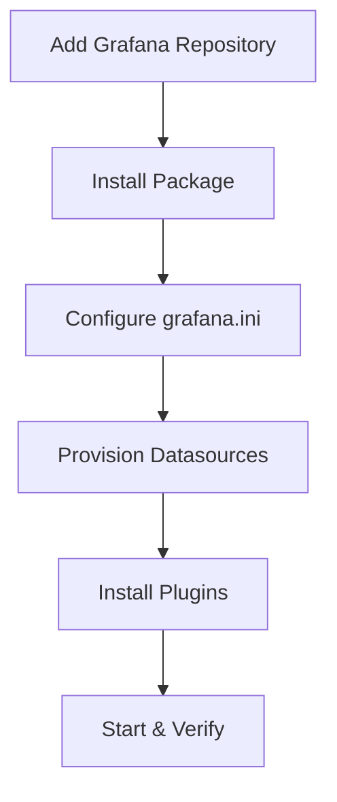

# How to Use Ansible to Install Grafana

Author: [nawazdhandala](https://www.github.com/nawazdhandala)

Tags: Ansible, Grafana, Monitoring, Visualization, DevOps

Description: Automate Grafana installation and initial setup using Ansible with datasource provisioning, plugin management, and secure defaults.

---

Grafana is the most popular open-source visualization platform for monitoring data. It connects to Prometheus, Elasticsearch, InfluxDB, and dozens of other data sources, giving you dashboards that make sense of your metrics. Installing Grafana manually is quick for one server, but when you need consistent deployments across environments with pre-configured datasources and plugins, Ansible is the right tool.

This post covers building an Ansible role that installs Grafana from the official repository, configures it with sensible defaults, provisions datasources automatically, and installs plugins.

## What the Role Does

1. Adds the Grafana APT repository and installs the package.
2. Configures `grafana.ini` with custom settings.
3. Provisions datasources automatically (no manual UI configuration).
4. Installs Grafana plugins.
5. Sets up systemd service and verifies it starts correctly.



## Project Structure

```
grafana-install/
  inventory/
    hosts.yml
  roles/
    grafana/
      tasks/
        main.yml
        install.yml
        configure.yml
        datasources.yml
        plugins.yml
      templates/
        grafana.ini.j2
        datasource.yml.j2
      defaults/
        main.yml
      handlers/
        main.yml
  playbook.yml
```

## Default Variables

```yaml
# roles/grafana/defaults/main.yml
# Grafana version (use "latest" or a specific version like "10.2.3")
grafana_version: "latest"

# Network settings
grafana_http_addr: "0.0.0.0"
grafana_http_port: 3000
grafana_domain: "grafana.example.com"
grafana_root_url: "http://{{ grafana_domain }}:{{ grafana_http_port }}"

# Security settings
grafana_admin_user: "admin"
grafana_admin_password: "changeme"
grafana_secret_key: "SW2YcwTIb9zpOOhoPsMm"
grafana_disable_gravatar: true
grafana_allow_sign_up: false

# Database settings (default: sqlite3)
grafana_database_type: "sqlite3"
grafana_database_host: ""
grafana_database_name: "grafana"
grafana_database_user: ""
grafana_database_password: ""

# SMTP settings for email alerts
grafana_smtp_enabled: false
grafana_smtp_host: "localhost:25"
grafana_smtp_user: ""
grafana_smtp_password: ""
grafana_smtp_from_address: "grafana@example.com"

# Datasources to provision
grafana_datasources:
  - name: Prometheus
    type: prometheus
    access: proxy
    url: http://localhost:9090
    is_default: true
    editable: false

# Plugins to install
grafana_plugins:
  - grafana-clock-panel
  - grafana-piechart-panel

# Log settings
grafana_log_mode: "console file"
grafana_log_level: "info"

# Anonymous access
grafana_anonymous_enabled: false
grafana_anonymous_org_role: "Viewer"
```

## Installation Tasks

```yaml
# roles/grafana/tasks/install.yml
---
- name: Install required packages
  ansible.builtin.apt:
    name:
      - apt-transport-https
      - software-properties-common
      - wget
    state: present
    update_cache: yes
  become: true

- name: Add Grafana GPG key
  ansible.builtin.apt_key:
    url: https://apt.grafana.com/gpg.key
    state: present
  become: true

- name: Add Grafana APT repository
  ansible.builtin.apt_repository:
    repo: "deb https://apt.grafana.com stable main"
    state: present
    filename: grafana
  become: true

- name: Install Grafana
  ansible.builtin.apt:
    name: "grafana={{ grafana_version }}"
    state: "{{ 'present' if grafana_version != 'latest' else 'latest' }}"
    update_cache: yes
  become: true
  notify: Restart grafana
```

## Configuration Tasks

```yaml
# roles/grafana/tasks/configure.yml
---
- name: Deploy Grafana configuration
  ansible.builtin.template:
    src: grafana.ini.j2
    dest: /etc/grafana/grafana.ini
    owner: root
    group: grafana
    mode: "0640"
  become: true
  notify: Restart grafana

- name: Create provisioning directories
  ansible.builtin.file:
    path: "/etc/grafana/provisioning/{{ item }}"
    state: directory
    owner: root
    group: grafana
    mode: "0755"
  loop:
    - datasources
    - dashboards
    - notifiers
  become: true
```

## Datasource Provisioning Tasks

```yaml
# roles/grafana/tasks/datasources.yml
---
- name: Deploy datasource provisioning file
  ansible.builtin.template:
    src: datasource.yml.j2
    dest: /etc/grafana/provisioning/datasources/ansible.yml
    owner: root
    group: grafana
    mode: "0640"
  become: true
  notify: Restart grafana
```

## Plugin Installation Tasks

```yaml
# roles/grafana/tasks/plugins.yml
---
- name: Get list of installed plugins
  ansible.builtin.command: grafana-cli plugins ls
  register: installed_plugins
  changed_when: false
  become: true

- name: Install Grafana plugins
  ansible.builtin.command: "grafana-cli plugins install {{ item }}"
  loop: "{{ grafana_plugins }}"
  when: item not in installed_plugins.stdout
  become: true
  notify: Restart grafana
```

## Grafana Configuration Template

```ini
# roles/grafana/templates/grafana.ini.j2
# Grafana configuration - managed by Ansible

[server]
http_addr = {{ grafana_http_addr }}
http_port = {{ grafana_http_port }}
domain = {{ grafana_domain }}
root_url = {{ grafana_root_url }}

[database]
type = {{ grafana_database_type }}

host = {{ grafana_database_host }}
name = {{ grafana_database_name }}
user = {{ grafana_database_user }}
password = {{ grafana_database_password }}


[security]
admin_user = {{ grafana_admin_user }}
admin_password = {{ grafana_admin_password }}
secret_key = {{ grafana_secret_key }}
disable_gravatar = {{ grafana_disable_gravatar | string | lower }}

[users]
allow_sign_up = {{ grafana_allow_sign_up | string | lower }}

[auth.anonymous]
enabled = {{ grafana_anonymous_enabled | string | lower }}

org_role = {{ grafana_anonymous_org_role }}



[smtp]
enabled = true
host = {{ grafana_smtp_host }}
user = {{ grafana_smtp_user }}
password = {{ grafana_smtp_password }}
from_address = {{ grafana_smtp_from_address }}


[log]
mode = {{ grafana_log_mode }}
level = {{ grafana_log_level }}

[analytics]
reporting_enabled = false
check_for_updates = true
```

## Datasource Provisioning Template

```yaml
# roles/grafana/templates/datasource.yml.j2
# Datasource provisioning - managed by Ansible
apiVersion: 1

deleteDatasources: []

datasources:

  - name: {{ ds.name }}
    type: {{ ds.type }}
    access: {{ ds.access | default('proxy') }}
    url: {{ ds.url }}
    isDefault: {{ ds.is_default | default(false) | string | lower }}
    editable: {{ ds.editable | default(false) | string | lower }}

    database: {{ ds.database }}


    basicAuth: true
    basicAuthUser: {{ ds.basic_auth_user }}
    secureJsonData:
      basicAuthPassword: {{ ds.basic_auth_password }}


    jsonData:

      {{ key }}: {{ value }}



```

## Main Tasks Entry Point

```yaml
# roles/grafana/tasks/main.yml
---
- name: Install Grafana
  ansible.builtin.include_tasks: install.yml

- name: Configure Grafana
  ansible.builtin.include_tasks: configure.yml

- name: Provision datasources
  ansible.builtin.include_tasks: datasources.yml

- name: Install plugins
  ansible.builtin.include_tasks: plugins.yml

- name: Enable and start Grafana
  ansible.builtin.systemd:
    name: grafana-server
    state: started
    enabled: true
    daemon_reload: true
  become: true

- name: Wait for Grafana to be ready
  ansible.builtin.uri:
    url: "http://localhost:{{ grafana_http_port }}/api/health"
    status_code: 200
  register: grafana_health
  until: grafana_health.status == 200
  retries: 15
  delay: 3
```

## Handlers

```yaml
# roles/grafana/handlers/main.yml
---
- name: Restart grafana
  ansible.builtin.systemd:
    name: grafana-server
    state: restarted
    daemon_reload: true
  become: true
```

## The Playbook

```yaml
# playbook.yml
---
- name: Install and configure Grafana
  hosts: monitoring
  become: true
  vars:
    grafana_admin_password: "{{ vault_grafana_admin_password }}"
    grafana_domain: "grafana.mycompany.com"
    grafana_datasources:
      - name: Prometheus
        type: prometheus
        access: proxy
        url: http://localhost:9090
        is_default: true
        editable: false
      - name: Loki
        type: loki
        access: proxy
        url: http://localhost:3100
        editable: false
    grafana_plugins:
      - grafana-clock-panel
      - grafana-piechart-panel
      - grafana-worldmap-panel
  roles:
    - grafana
```

## Running the Playbook

```bash
# Install Grafana with vault for secrets
ansible-playbook -i inventory/hosts.yml playbook.yml --ask-vault-pass

# Verify Grafana is running
curl http://monitoring-server:3000/api/health

# Check provisioned datasources
curl -u admin:password http://monitoring-server:3000/api/datasources
```

## Summary

This Ansible role gives you a fully configured Grafana installation with datasources provisioned automatically and plugins pre-installed. The provisioning approach means your Grafana instance is ready to use immediately after deployment, with no manual configuration needed through the web UI. Combined with the Prometheus installation role, you have a complete metrics pipeline deployed with a single Ansible command.
