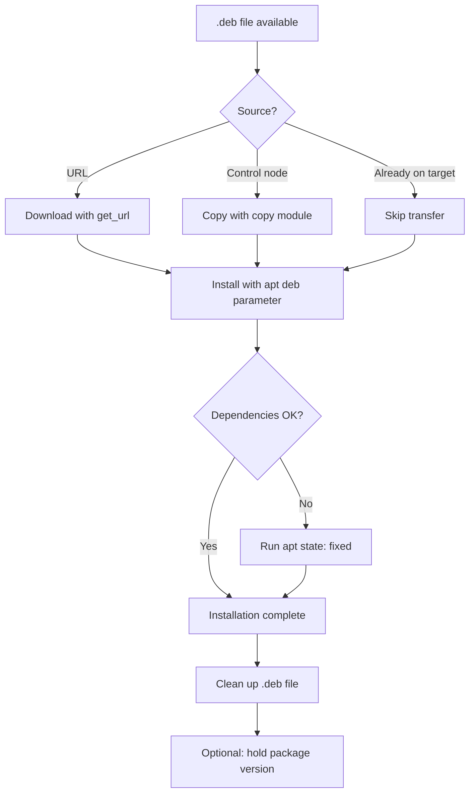

# How to Use Ansible to Install Packages from Local .deb Files

Author: [nawazdhandala](https://www.github.com/nawazdhandala)

Tags: Ansible, apt, Debian, Package Management

Description: How to install local .deb packages with Ansible using the apt module, including dependency handling and practical deployment patterns.

---

Not every package you need comes from an APT repository. Custom internal tools, commercial software, or one-off releases often come as `.deb` files. Ansible handles these smoothly with the `apt` module, but there are a few gotchas around dependency resolution and idempotency that you need to know about. This post covers the practical patterns for deploying `.deb` files with Ansible.

## Basic Installation with the apt Module

The `apt` module has a `deb` parameter that accepts a path to a local `.deb` file on the remote host:

```yaml
# Install a .deb file that is already on the remote host
- name: Install custom application
  ansible.builtin.apt:
    deb: /tmp/myapp_2.5.0_amd64.deb
```

But usually the `.deb` file starts on the control node or a download server. Here is the complete workflow of copying and installing:

```yaml
# Copy the .deb file to the target and install it
- name: Copy application .deb to target
  ansible.builtin.copy:
    src: packages/myapp_2.5.0_amd64.deb
    dest: /tmp/myapp_2.5.0_amd64.deb
    mode: '0644'

- name: Install application from .deb file
  ansible.builtin.apt:
    deb: /tmp/myapp_2.5.0_amd64.deb
```

## Downloading and Installing

If the `.deb` file is hosted on a web server:

```yaml
# Download and install a .deb from a URL
- name: Download application package
  ansible.builtin.get_url:
    url: https://releases.example.com/myapp/myapp_2.5.0_amd64.deb
    dest: /tmp/myapp_2.5.0_amd64.deb
    checksum: sha256:a1b2c3d4e5f6789...
    mode: '0644'

- name: Install downloaded .deb
  ansible.builtin.apt:
    deb: /tmp/myapp_2.5.0_amd64.deb
```

The `checksum` parameter verifies the download integrity and also makes the download idempotent. If the file already exists with the correct checksum, `get_url` skips the download.

You can also point `deb` directly at a URL:

```yaml
# Install .deb directly from a URL (apt downloads it)
- name: Install Slack desktop
  ansible.builtin.apt:
    deb: https://downloads.slack-edge.com/releases/linux/4.35.126/prod/x64/slack-desktop-4.35.126-amd64.deb
```

This is simpler but has downsides: no checksum verification, no caching, and the download happens every time Ansible checks whether the package needs installing.

## Handling Dependencies

The most common issue with `.deb` files is missing dependencies. The `apt` module with `deb` parameter handles this properly by running the equivalent of `apt install ./package.deb`, which resolves and installs dependencies from configured repositories.

However, if the required dependencies are not in any configured repository, you need to install them first:

```yaml
# Install dependencies before the .deb package
- name: Install dependencies for custom app
  ansible.builtin.apt:
    name:
      - libssl3
      - libcurl4
      - libjemalloc2
      - python3
    state: present
    update_cache: yes
    cache_valid_time: 3600

- name: Install custom application
  ansible.builtin.apt:
    deb: /tmp/myapp_2.5.0_amd64.deb
```

If dependencies fail to resolve, you can fix them after the fact:

```yaml
# Install the .deb (may leave broken deps)
- name: Install package
  ansible.builtin.apt:
    deb: /tmp/myapp_2.5.0_amd64.deb
  register: deb_install
  ignore_errors: yes

# Fix any broken dependencies
- name: Fix broken dependencies
  ansible.builtin.apt:
    state: fixed
  when: deb_install is failed
```

## Making Installation Idempotent

The `apt` module with `deb` is already idempotent in most cases. It checks if the package is already installed at the same or newer version and skips the installation if so. But if you want explicit control:

```yaml
# Check if the package is already installed at the right version
- name: Gather package facts
  ansible.builtin.package_facts:
    manager: apt

- name: Install myapp only if not at target version
  ansible.builtin.apt:
    deb: /tmp/myapp_2.5.0_amd64.deb
  when: >
    'myapp' not in ansible_facts.packages or
    ansible_facts.packages['myapp'][0].version != '2.5.0'
```

## Installing Multiple .deb Files

When you have several `.deb` files to install (for example, an application and its plugins):

```yaml
# Install multiple .deb files
- name: Copy application packages
  ansible.builtin.copy:
    src: "packages/{{ item }}"
    dest: "/tmp/{{ item }}"
    mode: '0644'
  loop:
    - myapp_2.5.0_amd64.deb
    - myapp-plugin-auth_1.2.0_amd64.deb
    - myapp-plugin-monitoring_1.1.0_amd64.deb

- name: Install application packages
  ansible.builtin.apt:
    deb: "/tmp/{{ item }}"
  loop:
    - myapp_2.5.0_amd64.deb
    - myapp-plugin-auth_1.2.0_amd64.deb
    - myapp-plugin-monitoring_1.1.0_amd64.deb
```

If the packages have inter-dependencies (plugin depends on main package), order matters. Install the base package first.

## Using dpkg Directly for Edge Cases

Sometimes you need more control than the `apt` module provides. The `command` module with `dpkg` gives you that:

```yaml
# Install with dpkg for more control
- name: Install package with dpkg
  ansible.builtin.command:
    cmd: dpkg -i /tmp/myapp_2.5.0_amd64.deb
  register: dpkg_result
  changed_when: dpkg_result.rc == 0
  failed_when: false

# Fix any dependency issues left by dpkg
- name: Resolve dependencies
  ansible.builtin.apt:
    state: fixed
  when: dpkg_result.rc != 0
```

This two-step approach (dpkg install, then apt fix) is how system administrators have been handling `.deb` files manually for decades. It works, but the `apt` module with `deb` is preferred because it handles both steps in one go.

## Building a .deb Deployment Role

Here is a reusable role for deploying `.deb` packages:

```yaml
# roles/install_deb/tasks/main.yml
# Parameters: deb_url, deb_name, deb_version, deb_checksum (optional)

- name: "Download {{ deb_name }} package"
  ansible.builtin.get_url:
    url: "{{ deb_url }}"
    dest: "/tmp/{{ deb_name }}_{{ deb_version }}.deb"
    checksum: "{{ deb_checksum | default(omit) }}"
    mode: '0644'
  when: deb_url is defined

- name: "Copy {{ deb_name }} package from control node"
  ansible.builtin.copy:
    src: "{{ deb_file }}"
    dest: "/tmp/{{ deb_name }}_{{ deb_version }}.deb"
    mode: '0644'
  when: deb_file is defined

- name: Gather package facts
  ansible.builtin.package_facts:
    manager: apt

- name: "Install {{ deb_name }} {{ deb_version }}"
  ansible.builtin.apt:
    deb: "/tmp/{{ deb_name }}_{{ deb_version }}.deb"
  when: >
    deb_name not in ansible_facts.packages or
    ansible_facts.packages[deb_name][0].version is version(deb_version, '<')
  notify: "{{ deb_handler | default(omit) }}"

- name: "Clean up {{ deb_name }} package file"
  ansible.builtin.file:
    path: "/tmp/{{ deb_name }}_{{ deb_version }}.deb"
    state: absent
  when: deb_cleanup | default(true)
```

Use the role:

```yaml
# Deploy a .deb package using the role
- name: Install monitoring agent
  ansible.builtin.include_role:
    name: install_deb
  vars:
    deb_name: datadog-agent
    deb_version: "7.50.0-1"
    deb_url: "https://s3.amazonaws.com/dd-agent/pool/d/da/datadog-agent_7.50.0-1_amd64.deb"
    deb_checksum: "sha256:abc123..."
    deb_handler: restart datadog-agent
```

## .deb Installation Workflow



## Cleaning Up After Installation

Always clean up the `.deb` file after installation to save disk space:

```yaml
# Clean up downloaded .deb files
- name: Remove downloaded packages
  ansible.builtin.file:
    path: "/tmp/{{ item }}"
    state: absent
  loop:
    - myapp_2.5.0_amd64.deb
    - myapp-plugin-auth_1.2.0_amd64.deb
```

## Common Issues and Solutions

**Issue: "dpkg: error: dpkg frontend lock was locked"**

Another process is using dpkg. Wait for it to finish:

```yaml
- name: Wait for dpkg lock
  ansible.builtin.shell: |
    while fuser /var/lib/dpkg/lock-frontend >/dev/null 2>&1; do sleep 5; done
  changed_when: false
  timeout: 300
```

**Issue: Package conflicts with an existing package**

Remove the conflicting package first, or use `dpkg --force-conflicts`:

```yaml
- name: Remove conflicting package
  ansible.builtin.apt:
    name: conflicting-package
    state: absent
    purge: yes

- name: Install replacement
  ansible.builtin.apt:
    deb: /tmp/replacement_1.0.0_amd64.deb
```

**Issue: Architecture mismatch**

Make sure you are deploying the right architecture. Check with a fact:

```yaml
- name: Fail if wrong architecture
  ansible.builtin.fail:
    msg: "This package requires amd64, but this host is {{ ansible_architecture }}"
  when: ansible_architecture != "x86_64"
```

Deploying `.deb` files with Ansible is straightforward once you get the dependency handling right. The `apt` module with the `deb` parameter is the cleanest approach for most cases, and wrapping it in a reusable role makes it easy to deploy any `.deb` package consistently across your fleet.
