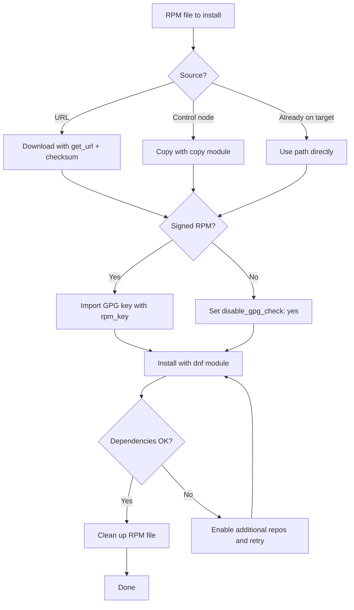

# How to Use Ansible to Install Packages from Local .rpm Files

Author: [nawazdhandala](https://www.github.com/nawazdhandala)

Tags: Ansible, RPM, RHEL, dnf, Package Management

Description: How to install local RPM packages on RHEL, CentOS, and Fedora using the Ansible dnf module with dependency handling strategies.

---

On Red Hat-based systems, `.rpm` files are the standard package format. While most software comes from repositories, plenty of vendor packages, internal tools, and third-party software are distributed as standalone RPM files. Ansible's `dnf` (and `yum`) modules handle RPM installation natively, but there are details around dependency resolution, GPG verification, and idempotency that you should get right. This post covers the practical approach.

## Basic Installation with the dnf Module

The `dnf` module accepts a local file path or URL as the package name:

```yaml
# Install an RPM file that is already on the remote host
- name: Install custom application from RPM
  ansible.builtin.dnf:
    name: /tmp/myapp-2.5.0-1.el9.x86_64.rpm
    state: present
    disable_gpg_check: yes
```

The `disable_gpg_check` parameter skips GPG signature verification. You need this for unsigned packages, which is common with internal or custom-built RPMs. For packages from trusted vendors, leave GPG checking enabled.

## Copy and Install Workflow

The typical workflow is to copy the RPM from the control node and then install it:

```yaml
# Copy the RPM file to the target host and install it
- name: Copy application RPM to target
  ansible.builtin.copy:
    src: packages/myapp-2.5.0-1.el9.x86_64.rpm
    dest: /tmp/myapp-2.5.0-1.el9.x86_64.rpm
    mode: '0644'

- name: Install application RPM
  ansible.builtin.dnf:
    name: /tmp/myapp-2.5.0-1.el9.x86_64.rpm
    state: present
    disable_gpg_check: yes
```

## Downloading and Installing from a URL

If the RPM is hosted on a web server or artifact repository:

```yaml
# Download the RPM file with checksum verification
- name: Download application RPM
  ansible.builtin.get_url:
    url: https://releases.example.com/myapp/myapp-2.5.0-1.el9.x86_64.rpm
    dest: /tmp/myapp-2.5.0-1.el9.x86_64.rpm
    checksum: sha256:a1b2c3d4e5f6789...
    mode: '0644'

- name: Install downloaded RPM
  ansible.builtin.dnf:
    name: /tmp/myapp-2.5.0-1.el9.x86_64.rpm
    state: present
    disable_gpg_check: yes
```

You can also pass the URL directly to dnf:

```yaml
# Install RPM directly from URL (dnf downloads it)
- name: Install EPEL release from URL
  ansible.builtin.dnf:
    name: https://dl.fedoraproject.org/pub/epel/epel-release-latest-9.noarch.rpm
    state: present
    disable_gpg_check: yes
```

The direct URL approach is simpler but less robust. There is no caching, no checksum verification, and the download happens each time Ansible checks the package state.

## Handling Dependencies

Unlike dpkg on Debian, the dnf module with a local RPM file automatically resolves dependencies from configured repositories. If your RPM depends on `libcurl` and `openssl`, dnf will install them from the system repos.

```yaml
# dnf handles dependency resolution automatically
- name: Install application with automatic dependency resolution
  ansible.builtin.dnf:
    name: /tmp/myapp-2.5.0-1.el9.x86_64.rpm
    state: present
    disable_gpg_check: yes
```

If dependencies are not available in any configured repository, install them first:

```yaml
# Install dependencies from a custom repo, then install the RPM
- name: Enable custom repository for dependencies
  ansible.builtin.yum_repository:
    name: myapp-deps
    description: MyApp Dependencies
    baseurl: https://packages.example.com/el/$releasever/$basearch/
    gpgcheck: no
    enabled: yes

- name: Install application RPM
  ansible.builtin.dnf:
    name: /tmp/myapp-2.5.0-1.el9.x86_64.rpm
    state: present
    disable_gpg_check: yes
```

## Installing Multiple RPM Files

When you have several RPMs that depend on each other, install them all in a single dnf transaction:

```yaml
# Copy all RPM files
- name: Copy application RPM files
  ansible.builtin.copy:
    src: "packages/{{ item }}"
    dest: "/tmp/{{ item }}"
    mode: '0644'
  loop:
    - myapp-2.5.0-1.el9.x86_64.rpm
    - myapp-libs-2.5.0-1.el9.x86_64.rpm
    - myapp-plugin-monitoring-1.1.0-1.el9.x86_64.rpm

# Install all in one transaction (handles inter-dependencies)
- name: Install all application RPMs
  ansible.builtin.dnf:
    name:
      - /tmp/myapp-libs-2.5.0-1.el9.x86_64.rpm
      - /tmp/myapp-2.5.0-1.el9.x86_64.rpm
      - /tmp/myapp-plugin-monitoring-1.1.0-1.el9.x86_64.rpm
    state: present
    disable_gpg_check: yes
```

Installing them in a single task with a list ensures dnf resolves all inter-dependencies correctly in one transaction.

## Using the rpm_key Module for GPG Verification

For production deployments, you should verify RPM signatures. Import the vendor's GPG key first:

```yaml
# Import the vendor GPG key and install the signed RPM
- name: Import vendor GPG key
  ansible.builtin.rpm_key:
    state: present
    key: https://packages.example.com/GPG-KEY-myapp

- name: Install signed RPM with GPG check
  ansible.builtin.dnf:
    name: /tmp/myapp-2.5.0-1.el9.x86_64.rpm
    state: present
```

Without `disable_gpg_check`, dnf will verify the RPM signature against the imported keys and refuse to install if the signature does not match.

## Making RPM Installation Idempotent

The `dnf` module is already idempotent for RPM files. It checks the package name and version against what is installed and only installs if needed. But you can add an explicit check for extra safety:

```yaml
# Explicit version check before installation
- name: Gather package facts
  ansible.builtin.package_facts:
    manager: rpm

- name: Install myapp only if needed
  ansible.builtin.dnf:
    name: /tmp/myapp-2.5.0-1.el9.x86_64.rpm
    state: present
    disable_gpg_check: yes
  when: >
    'myapp' not in ansible_facts.packages or
    ansible_facts.packages['myapp'][0].version is version('2.5.0', '<')
```

## Upgrading from an RPM File

If a newer version of the RPM replaces an older one, the dnf module handles it. When you pass a newer RPM file, dnf upgrades the package:

```yaml
# Upgrade an application using a newer RPM file
- name: Copy new version
  ansible.builtin.copy:
    src: packages/myapp-3.0.0-1.el9.x86_64.rpm
    dest: /tmp/myapp-3.0.0-1.el9.x86_64.rpm
    mode: '0644'

- name: Install/upgrade to new version
  ansible.builtin.dnf:
    name: /tmp/myapp-3.0.0-1.el9.x86_64.rpm
    state: present
    disable_gpg_check: yes
```

If you need to force a downgrade:

```yaml
# Downgrade to an older RPM version
- name: Downgrade myapp to stable version
  ansible.builtin.dnf:
    name: /tmp/myapp-2.4.0-1.el9.x86_64.rpm
    state: present
    allow_downgrade: yes
    disable_gpg_check: yes
```

## Building a Complete Deployment Playbook

Here is a full example that deploys a custom application from RPM with pre/post steps:

```yaml
# Deploy custom application from RPM
- name: Deploy MyApp
  hosts: app_servers
  become: yes
  vars:
    app_version: "2.5.0"
    app_release: "1.el9"
    rpm_base_url: "https://releases.example.com/myapp"
  tasks:
    - name: Import application GPG key
      ansible.builtin.rpm_key:
        state: present
        key: "{{ rpm_base_url }}/GPG-KEY-myapp"

    - name: Download application RPM
      ansible.builtin.get_url:
        url: "{{ rpm_base_url }}/myapp-{{ app_version }}-{{ app_release }}.x86_64.rpm"
        dest: "/tmp/myapp-{{ app_version }}-{{ app_release }}.x86_64.rpm"
        mode: '0644'

    - name: Stop application before upgrade
      ansible.builtin.systemd:
        name: myapp
        state: stopped
      ignore_errors: yes

    - name: Install application RPM
      ansible.builtin.dnf:
        name: "/tmp/myapp-{{ app_version }}-{{ app_release }}.x86_64.rpm"
        state: present
      register: install_result

    - name: Run post-install configuration
      ansible.builtin.command:
        cmd: /opt/myapp/bin/configure --defaults
      when: install_result.changed

    - name: Start application
      ansible.builtin.systemd:
        name: myapp
        state: started
        enabled: yes

    - name: Clean up RPM file
      ansible.builtin.file:
        path: "/tmp/myapp-{{ app_version }}-{{ app_release }}.x86_64.rpm"
        state: absent

    - name: Verify application is running
      ansible.builtin.uri:
        url: http://localhost:8080/health
        return_content: yes
      register: health_check
      retries: 5
      delay: 10
      until: health_check.status == 200
```

## RPM Installation Decision Flow



## Using the rpm Command for Edge Cases

For rare situations where the dnf module does not do what you need:

```yaml
# Query RPM information before installing
- name: Check RPM package info
  ansible.builtin.command:
    cmd: rpm -qip /tmp/myapp-2.5.0-1.el9.x86_64.rpm
  register: rpm_info
  changed_when: false

- name: Display RPM information
  ansible.builtin.debug:
    msg: "{{ rpm_info.stdout_lines }}"

# List RPM dependencies
- name: Check RPM dependencies
  ansible.builtin.command:
    cmd: rpm -qpR /tmp/myapp-2.5.0-1.el9.x86_64.rpm
  register: rpm_deps
  changed_when: false

- name: Display dependencies
  ansible.builtin.debug:
    msg: "{{ rpm_deps.stdout_lines }}"
```

## Tips for RPM Deployment

1. **Prefer `dnf` over `rpm` for installation.** The `dnf` module handles dependency resolution, while raw `rpm` does not.

2. **Always verify checksums for remote downloads.** Use the `checksum` parameter in `get_url` to ensure you got the right file.

3. **Import GPG keys before deployment.** This avoids interactive prompts during installation.

4. **Use version variables.** Centralize version numbers so updating to a new release requires changing one variable, not editing multiple tasks.

5. **Clean up RPM files after installation.** Leftover `.rpm` files in `/tmp` waste space and can confuse future deployments.

6. **Test with `--check` mode first.** Run `ansible-playbook deploy.yml --check` to see what would change without actually installing anything.

Installing RPMs with Ansible is straightforward once you handle GPG keys and dependencies properly. The `dnf` module does the heavy lifting, and wrapping it in a clean workflow with download, verification, installation, and cleanup gives you a reliable deployment process.
