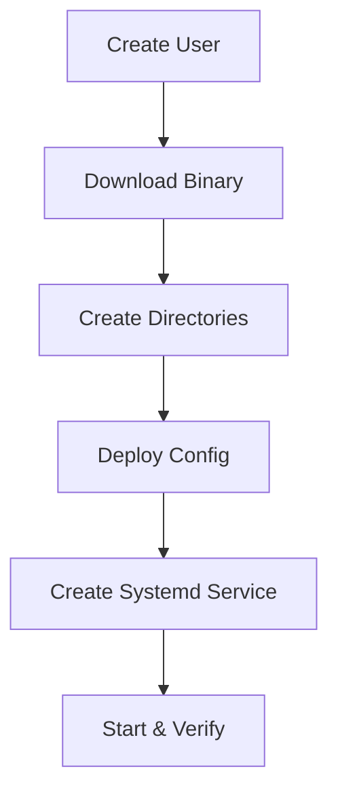

# How to Use Ansible to Install Prometheus

Author: [nawazdhandala](https://www.github.com/nawazdhandala)

Tags: Ansible, Prometheus, Monitoring, DevOps

Description: Automate the installation of Prometheus monitoring server using Ansible with proper user setup, systemd integration, and secure defaults.

---

Prometheus is the standard for metrics collection and monitoring in modern infrastructure. It pulls metrics from targets at regular intervals, stores them in a time-series database, and provides a powerful query language (PromQL) for analysis. Installing Prometheus by hand is not difficult, but doing it consistently across environments with proper permissions, service management, and data retention requires attention to detail.

This post walks through building an Ansible role that installs Prometheus from the official binaries, configures it with a systemd service, sets up data directories with correct permissions, and prepares it for adding scrape targets.

## What the Role Does

The Ansible role will:

1. Create a dedicated `prometheus` system user with no login shell.
2. Download and install the Prometheus binary.
3. Create configuration and data directories with proper ownership.
4. Deploy a base `prometheus.yml` configuration.
5. Set up a systemd service with resource limits.
6. Start Prometheus and verify it is working.



## Project Structure

```
prometheus-install/
  inventory/
    hosts.yml
  roles/
    prometheus/
      tasks/
        main.yml
        install.yml
        configure.yml
      templates/
        prometheus.yml.j2
        prometheus.service.j2
      defaults/
        main.yml
      handlers/
        main.yml
  playbook.yml
```

## Default Variables

```yaml
# roles/prometheus/defaults/main.yml
prometheus_version: "2.48.1"
prometheus_platform: "linux-amd64"

# System user
prometheus_user: "prometheus"
prometheus_group: "prometheus"

# Directories
prometheus_install_dir: "/usr/local/bin"
prometheus_config_dir: "/etc/prometheus"
prometheus_data_dir: "/var/lib/prometheus"

# Network settings
prometheus_listen_address: "0.0.0.0"
prometheus_listen_port: 9090

# Data retention
prometheus_retention_time: "30d"
prometheus_retention_size: "0"

# Scrape settings
prometheus_scrape_interval: "15s"
prometheus_evaluation_interval: "15s"

# Resource limits
prometheus_memory_limit: "2G"

# Basic scrape targets (self-monitoring)
prometheus_scrape_configs:
  - job_name: "prometheus"
    static_configs:
      - targets:
          - "localhost:{{ prometheus_listen_port }}"

# Alertmanager settings
prometheus_alertmanager_targets: []

# Rule files
prometheus_rule_files: []
```

## Installation Tasks

These tasks handle downloading and installing the Prometheus binary.

```yaml
# roles/prometheus/tasks/install.yml
---
- name: Create prometheus group
  ansible.builtin.group:
    name: "{{ prometheus_group }}"
    system: true
    state: present
  become: true

- name: Create prometheus user
  ansible.builtin.user:
    name: "{{ prometheus_user }}"
    group: "{{ prometheus_group }}"
    shell: /usr/sbin/nologin
    system: true
    create_home: false
  become: true

- name: Create Prometheus directories
  ansible.builtin.file:
    path: "{{ item }}"
    state: directory
    owner: "{{ prometheus_user }}"
    group: "{{ prometheus_group }}"
    mode: "0755"
  loop:
    - "{{ prometheus_config_dir }}"
    - "{{ prometheus_config_dir }}/rules"
    - "{{ prometheus_config_dir }}/file_sd"
    - "{{ prometheus_data_dir }}"
  become: true

- name: Check current Prometheus version
  ansible.builtin.command: "{{ prometheus_install_dir }}/prometheus --version"
  register: current_version
  changed_when: false
  failed_when: false

- name: Download Prometheus
  ansible.builtin.get_url:
    url: "https://github.com/prometheus/prometheus/releases/download/v{{ prometheus_version }}/prometheus-{{ prometheus_version }}.{{ prometheus_platform }}.tar.gz"
    dest: "/tmp/prometheus-{{ prometheus_version }}.tar.gz"
    mode: "0644"
  when: current_version.rc != 0 or prometheus_version not in (current_version.stdout | default(''))

- name: Extract Prometheus archive
  ansible.builtin.unarchive:
    src: "/tmp/prometheus-{{ prometheus_version }}.tar.gz"
    dest: /tmp/
    remote_src: true
  when: current_version.rc != 0 or prometheus_version not in (current_version.stdout | default(''))

- name: Install Prometheus binaries
  ansible.builtin.copy:
    src: "/tmp/prometheus-{{ prometheus_version }}.{{ prometheus_platform }}/{{ item }}"
    dest: "{{ prometheus_install_dir }}/{{ item }}"
    owner: root
    group: root
    mode: "0755"
    remote_src: true
  loop:
    - prometheus
    - promtool
  become: true
  notify: Restart prometheus
  when: current_version.rc != 0 or prometheus_version not in (current_version.stdout | default(''))

- name: Install console templates and libraries
  ansible.builtin.copy:
    src: "/tmp/prometheus-{{ prometheus_version }}.{{ prometheus_platform }}/{{ item }}"
    dest: "{{ prometheus_config_dir }}/{{ item }}"
    owner: "{{ prometheus_user }}"
    group: "{{ prometheus_group }}"
    mode: "0644"
    remote_src: true
  loop:
    - consoles
    - console_libraries
  become: true
  when: current_version.rc != 0 or prometheus_version not in (current_version.stdout | default(''))

- name: Clean up downloaded archive
  ansible.builtin.file:
    path: "{{ item }}"
    state: absent
  loop:
    - "/tmp/prometheus-{{ prometheus_version }}.tar.gz"
    - "/tmp/prometheus-{{ prometheus_version }}.{{ prometheus_platform }}"
```

## Configuration Tasks

```yaml
# roles/prometheus/tasks/configure.yml
---
- name: Deploy Prometheus configuration
  ansible.builtin.template:
    src: prometheus.yml.j2
    dest: "{{ prometheus_config_dir }}/prometheus.yml"
    owner: "{{ prometheus_user }}"
    group: "{{ prometheus_group }}"
    mode: "0644"
    validate: "{{ prometheus_install_dir }}/promtool check config %s"
  become: true
  notify: Reload prometheus

- name: Deploy systemd service file
  ansible.builtin.template:
    src: prometheus.service.j2
    dest: /etc/systemd/system/prometheus.service
    owner: root
    group: root
    mode: "0644"
  become: true
  notify: Restart prometheus

- name: Enable and start Prometheus
  ansible.builtin.systemd:
    name: prometheus
    state: started
    enabled: true
    daemon_reload: true
  become: true

- name: Verify Prometheus is running
  ansible.builtin.uri:
    url: "http://localhost:{{ prometheus_listen_port }}/-/healthy"
    status_code: 200
  register: health_check
  until: health_check.status == 200
  retries: 10
  delay: 3
```

## Prometheus Configuration Template

```yaml
# roles/prometheus/templates/prometheus.yml.j2
# Prometheus configuration
# Managed by Ansible

global:
  scrape_interval: {{ prometheus_scrape_interval }}
  evaluation_interval: {{ prometheus_evaluation_interval }}
  external_labels:
    monitor: 'ansible-managed'


rule_files:

  - "{{ rule_file }}"




alerting:
  alertmanagers:
    - static_configs:
        - targets:

            - "{{ target }}"



scrape_configs:

  - job_name: "{{ job.job_name }}"

    metrics_path: "{{ job.metrics_path }}"


    scrape_interval: {{ job.scrape_interval }}


    static_configs:

      - targets:

          - "{{ target }}"


        labels:

          {{ key }}: "{{ value }}"





    file_sd_configs:

      - files:

          - "{{ file }}"

        refresh_interval: {{ sd_config.refresh_interval | default('5m') }}



```

## Systemd Service Template

```ini
# roles/prometheus/templates/prometheus.service.j2
[Unit]
Description=Prometheus Monitoring System
Documentation=https://prometheus.io/docs/
Wants=network-online.target
After=network-online.target

[Service]
Type=simple
User={{ prometheus_user }}
Group={{ prometheus_group }}
ExecReload=/bin/kill -HUP $MAINPID
ExecStart={{ prometheus_install_dir }}/prometheus \
  --config.file={{ prometheus_config_dir }}/prometheus.yml \
  --storage.tsdb.path={{ prometheus_data_dir }} \
  --storage.tsdb.retention.time={{ prometheus_retention_time }} \

  --storage.tsdb.retention.size={{ prometheus_retention_size }} \

  --web.listen-address={{ prometheus_listen_address }}:{{ prometheus_listen_port }} \
  --web.console.templates={{ prometheus_config_dir }}/consoles \
  --web.console.libraries={{ prometheus_config_dir }}/console_libraries \
  --web.enable-lifecycle

SyslogIdentifier=prometheus
Restart=always
RestartSec=5
MemoryLimit={{ prometheus_memory_limit }}

# Security hardening
NoNewPrivileges=true
ProtectSystem=full
ProtectHome=true

[Install]
WantedBy=multi-user.target
```

## Main Tasks Entry Point

```yaml
# roles/prometheus/tasks/main.yml
---
- name: Install Prometheus
  ansible.builtin.include_tasks: install.yml

- name: Configure Prometheus
  ansible.builtin.include_tasks: configure.yml
```

## Handlers

```yaml
# roles/prometheus/handlers/main.yml
---
- name: Restart prometheus
  ansible.builtin.systemd:
    name: prometheus
    state: restarted
    daemon_reload: true
  become: true

- name: Reload prometheus
  ansible.builtin.systemd:
    name: prometheus
    state: reloaded
  become: true
```

## The Playbook

```yaml
# playbook.yml
---
- name: Install Prometheus
  hosts: monitoring
  become: true
  vars:
    prometheus_retention_time: "90d"
    prometheus_scrape_configs:
      - job_name: "prometheus"
        static_configs:
          - targets:
              - "localhost:9090"
      - job_name: "node"
        static_configs:
          - targets:
              - "10.0.1.10:9100"
              - "10.0.1.11:9100"
              - "10.0.1.12:9100"
            labels:
              env: "production"
  roles:
    - prometheus
```

## Running the Playbook

```bash
# Install and configure Prometheus
ansible-playbook -i inventory/hosts.yml playbook.yml

# Verify installation
curl http://monitoring-server:9090/-/healthy
curl http://monitoring-server:9090/api/v1/targets
```

## Summary

This Ansible role gives you a production-ready Prometheus installation with proper security hardening (dedicated user, systemd resource limits, filesystem protections), version management, and config validation using promtool. The configuration template supports static targets, file-based service discovery, and Alertmanager integration, covering the most common deployment scenarios. As your monitoring needs grow, you can extend the scrape configs and add rule files without changing the role itself.
