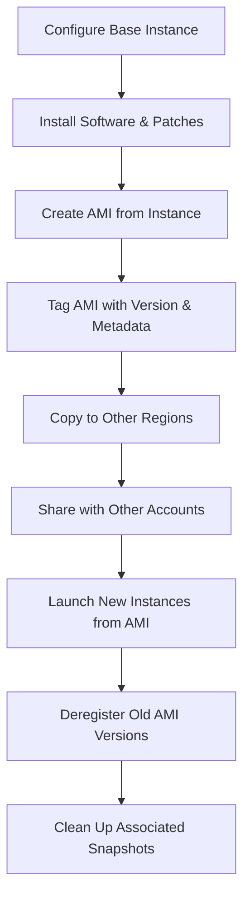

# How to Use Ansible to Manage AWS AMI Images

Author: [nawazdhandala](https://www.github.com/nawazdhandala)

Tags: Ansible, AWS, AMI, EC2, Infrastructure Automation

Description: Automate AWS AMI creation, deregistration, copying, and sharing with Ansible playbooks for consistent golden image management.

---

Amazon Machine Images (AMIs) are the foundation of every EC2 instance you launch. If you are building golden images for your organization, you need a reliable way to create them, track their versions, share them across accounts, and clean up the old ones. Doing this manually in the console works for a one-off, but it falls apart when you are maintaining images across multiple regions, accounts, and application versions. Ansible gives you a systematic approach to AMI lifecycle management.

## Prerequisites

You will need:

- Ansible 2.9+ with the `amazon.aws` collection
- AWS credentials with permissions for EC2 AMI operations (`ec2:CreateImage`, `ec2:DeregisterImage`, `ec2:DescribeImages`, `ec2:CopyImage`, `ec2:ModifyImageAttribute`)
- At least one running EC2 instance to create images from

```bash
# Install the required collection
ansible-galaxy collection install amazon.aws
```

## The AMI Lifecycle

A typical AMI workflow looks like this:



Each of these steps can be handled with Ansible modules, turning the entire process into a single playbook run.

## Creating an AMI from a Running Instance

The `amazon.aws.ec2_ami` module handles AMI creation:

```yaml
# create-ami.yml - Create an AMI from a running EC2 instance
---
- name: Create AMI from Instance
  hosts: localhost
  connection: local
  gather_facts: false

  vars:
    aws_region: us-east-1
    source_instance_id: "i-0abc123def456789"
    ami_name_prefix: "webapp"
    ami_version: "1.2.0"
    timestamp: "{{ lookup('pipe', 'date +%Y%m%d%H%M%S') }}"

  tasks:
    - name: Create AMI from the configured instance
      amazon.aws.ec2_ami:
        region: "{{ aws_region }}"
        instance_id: "{{ source_instance_id }}"
        name: "{{ ami_name_prefix }}-{{ ami_version }}-{{ timestamp }}"
        description: "{{ ami_name_prefix }} version {{ ami_version }} built on {{ timestamp }}"
        no_reboot: false
        wait: true
        wait_timeout: 1200
        tags:
          Name: "{{ ami_name_prefix }}-{{ ami_version }}"
          Version: "{{ ami_version }}"
          Application: "{{ ami_name_prefix }}"
          BuildTimestamp: "{{ timestamp }}"
          CreatedBy: ansible
        launch_permissions:
          group_names: []
      register: ami_result

    - name: Display the new AMI ID
      ansible.builtin.debug:
        msg: "AMI created: {{ ami_result.image_id }} ({{ ami_name_prefix }}-{{ ami_version }})"
```

The `no_reboot: false` setting is the default and the recommended approach. It tells AWS to reboot the instance before creating the image, which ensures a clean filesystem snapshot. Setting `no_reboot: true` is faster but risks data inconsistency if the instance has pending writes.

Including a timestamp in the AMI name prevents naming conflicts on repeated builds. AMI names must be unique within an account and region, so building version 1.2.0 twice without a timestamp would fail on the second attempt.

## Finding Existing AMIs

Before launching instances or cleaning up, you often need to find AMIs that match certain criteria:

```yaml
# find-amis.yml - Search for AMIs by tags and filters
---
- name: Find AMIs
  hosts: localhost
  connection: local
  gather_facts: false

  vars:
    aws_region: us-east-1
    app_name: webapp

  tasks:
    - name: Find all AMIs for our application
      amazon.aws.ec2_ami_info:
        region: "{{ aws_region }}"
        owners:
          - self
        filters:
          "tag:Application": "{{ app_name }}"
          "tag:CreatedBy": ansible
          state: available
      register: ami_list

    - name: Sort AMIs by creation date (newest first)
      ansible.builtin.set_fact:
        sorted_amis: "{{ ami_list.images | sort(attribute='creation_date', reverse=true) }}"

    - name: Display the latest AMI
      ansible.builtin.debug:
        msg: "Latest AMI: {{ sorted_amis[0].image_id }} - {{ sorted_amis[0].name }} ({{ sorted_amis[0].creation_date }})"
      when: sorted_amis | length > 0

    - name: List all versions
      ansible.builtin.debug:
        msg: "{{ item.image_id }}: {{ item.name }} ({{ item.creation_date }})"
      loop: "{{ sorted_amis }}"
```

This pattern is particularly useful in deployment playbooks where you want to always launch from the latest golden image without hardcoding an AMI ID.

## Copying an AMI to Another Region

For multi-region deployments or disaster recovery:

```yaml
# copy-ami-cross-region.yml - Copy an AMI to a different AWS region
---
- name: Copy AMI Cross Region
  hosts: localhost
  connection: local
  gather_facts: false

  vars:
    source_region: us-east-1
    dest_regions:
      - us-west-2
      - eu-west-1
    source_ami_id: "ami-0abc123def456789"

  tasks:
    - name: Get source AMI details
      amazon.aws.ec2_ami_info:
        region: "{{ source_region }}"
        image_ids:
          - "{{ source_ami_id }}"
      register: source_ami_info

    - name: Copy AMI to each destination region
      amazon.aws.ec2_ami_copy:
        region: "{{ item }}"
        source_region: "{{ source_region }}"
        source_image_id: "{{ source_ami_id }}"
        name: "{{ source_ami_info.images[0].name }}"
        description: "Copy of {{ source_ami_id }} from {{ source_region }}"
        encrypted: true
        tags:
          Name: "{{ source_ami_info.images[0].tags.Name | default('copied-ami') }}"
          SourceAMI: "{{ source_ami_id }}"
          SourceRegion: "{{ source_region }}"
          CreatedBy: ansible
        wait: true
        wait_timeout: 1800
      loop: "{{ dest_regions }}"
      register: copy_results

    - name: Show copied AMI IDs
      ansible.builtin.debug:
        msg: "{{ item.item }}: {{ item.image_id }}"
      loop: "{{ copy_results.results }}"
```

## Sharing AMIs with Other AWS Accounts

In multi-account environments, you build AMIs in a central tooling account and share them:

```yaml
# share-ami.yml - Share an AMI with specific AWS accounts
---
- name: Share AMI with Other Accounts
  hosts: localhost
  connection: local
  gather_facts: false

  vars:
    aws_region: us-east-1
    ami_id: "ami-0abc123def456789"
    target_accounts:
      - "111111111111"
      - "222222222222"
      - "333333333333"

  tasks:
    - name: Share AMI with target accounts
      amazon.aws.ec2_ami:
        region: "{{ aws_region }}"
        image_id: "{{ ami_id }}"
        state: present
        launch_permissions:
          user_ids: "{{ target_accounts }}"
      register: share_result

    - name: Confirm sharing
      ansible.builtin.debug:
        msg: "AMI {{ ami_id }} shared with {{ target_accounts | length }} accounts"

    - name: Get snapshot IDs from the AMI
      amazon.aws.ec2_ami_info:
        region: "{{ aws_region }}"
        image_ids:
          - "{{ ami_id }}"
      register: ami_info

    - name: Share associated snapshots (required for encrypted AMIs)
      amazon.aws.ec2_snapshot:
        region: "{{ aws_region }}"
        snapshot_id: "{{ item.1.ebs.snapshot_id }}"
        modify_attribute: createVolumePermission
        user_ids: "{{ target_accounts }}"
      loop: "{{ ami_info.images | subelements('block_device_mappings') }}"
      when: item.1.ebs is defined and item.1.ebs.snapshot_id is defined
```

A detail that trips people up: when you share an encrypted AMI, you also need to share the underlying EBS snapshots AND grant access to the KMS key used for encryption. The playbook above handles the snapshot sharing, but KMS key policies need to be managed separately.

## Deregistering Old AMIs and Cleaning Up Snapshots

Over time, old AMIs accumulate. Here is a cleanup playbook that keeps the N most recent versions and deregisters the rest:

```yaml
# cleanup-amis.yml - Deregister old AMIs and delete their snapshots
---
- name: Cleanup Old AMIs
  hosts: localhost
  connection: local
  gather_facts: false

  vars:
    aws_region: us-east-1
    app_name: webapp
    keep_count: 5

  tasks:
    - name: Find all AMIs for the application
      amazon.aws.ec2_ami_info:
        region: "{{ aws_region }}"
        owners:
          - self
        filters:
          "tag:Application": "{{ app_name }}"
          "tag:CreatedBy": ansible
      register: all_amis

    - name: Sort by creation date and identify AMIs to remove
      ansible.builtin.set_fact:
        amis_to_remove: "{{ (all_amis.images | sort(attribute='creation_date', reverse=true))[keep_count:] }}"

    - name: Report cleanup plan
      ansible.builtin.debug:
        msg: "Keeping {{ keep_count }} newest AMIs, removing {{ amis_to_remove | length }}"

    - name: Deregister old AMIs and delete snapshots
      amazon.aws.ec2_ami:
        region: "{{ aws_region }}"
        image_id: "{{ item.image_id }}"
        state: absent
        delete_snapshot: true
      loop: "{{ amis_to_remove }}"
      when: amis_to_remove | length > 0

    - name: Confirm cleanup
      ansible.builtin.debug:
        msg: "Deregistered {{ item.image_id }} ({{ item.name }})"
      loop: "{{ amis_to_remove }}"
      when: amis_to_remove | length > 0
```

The `delete_snapshot: true` parameter is important. Without it, deregistering an AMI leaves the underlying EBS snapshots behind, and you keep paying for that storage even though the AMI is gone.

## Building a Complete Golden Image Pipeline

Combining all the above into a single workflow:

```yaml
# golden-image-pipeline.yml - End to end AMI build pipeline
---
- name: Golden Image Build Pipeline
  hosts: localhost
  connection: local
  gather_facts: false

  vars:
    aws_region: us-east-1
    source_instance: "i-0abc123def456789"
    app_name: webapp
    version: "{{ lookup('env', 'APP_VERSION') | default('0.0.1') }}"
    keep_amis: 5
    copy_regions:
      - us-west-2

  tasks:
    - name: Create the golden image
      amazon.aws.ec2_ami:
        region: "{{ aws_region }}"
        instance_id: "{{ source_instance }}"
        name: "{{ app_name }}-{{ version }}-{{ lookup('pipe', 'date +%Y%m%d%H%M%S') }}"
        wait: true
        tags:
          Application: "{{ app_name }}"
          Version: "{{ version }}"
          CreatedBy: ansible
      register: new_ami

    - name: Copy to secondary regions
      amazon.aws.ec2_ami_copy:
        region: "{{ item }}"
        source_region: "{{ aws_region }}"
        source_image_id: "{{ new_ami.image_id }}"
        name: "{{ app_name }}-{{ version }}"
        encrypted: true
        wait: true
      loop: "{{ copy_regions }}"

    - name: Cleanup old AMIs in primary region
      include_tasks: cleanup-amis-tasks.yml
      vars:
        target_region: "{{ aws_region }}"
```

## Summary

Managing AMIs with Ansible transforms what is often a manual, undocumented process into a versioned, repeatable pipeline. The critical pieces are consistent tagging for discoverability, automated cross-region copying for resilience, proper snapshot cleanup to control costs, and a retention policy that keeps your account tidy. With these playbooks in place, your golden image process becomes just another step in your CI/CD pipeline.
