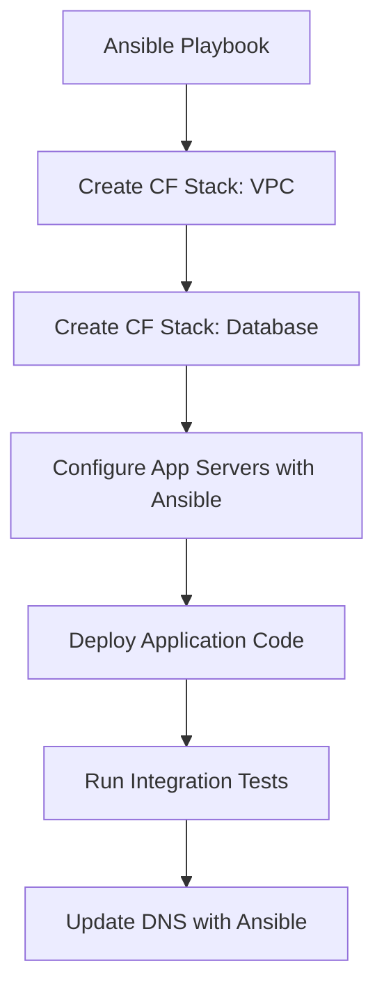

# How to Use Ansible to Manage AWS CloudFormation Stacks

Author: [nawazdhandala](https://www.github.com/nawazdhandala)

Tags: Ansible, AWS, CloudFormation, Infrastructure as Code, DevOps

Description: Learn how to create, update, and manage AWS CloudFormation stacks using Ansible for hybrid infrastructure automation workflows.

---

CloudFormation and Ansible are both infrastructure-as-code tools, but they solve different problems. CloudFormation excels at managing AWS resources with built-in dependency resolution and rollback. Ansible excels at orchestrating workflows, configuring servers, and integrating with non-AWS systems. Using them together gives you the best of both worlds.

This guide covers how to manage CloudFormation stacks from Ansible playbooks, pass parameters, handle outputs, and build hybrid automation workflows.

## Prerequisites

You need:

- Ansible 2.14+
- The `amazon.aws` collection
- AWS credentials with CloudFormation permissions
- Python boto3

```bash
# Install dependencies
ansible-galaxy collection install amazon.aws
pip install boto3 botocore
```

## Why Use Ansible with CloudFormation?

You might wonder why you would wrap CloudFormation in Ansible instead of using one or the other. Here are the common reasons:



Ansible orchestrates the workflow. CloudFormation manages the AWS resources. You get CloudFormation's rollback safety for resource creation and Ansible's flexibility for everything else.

## Creating a Stack from an Inline Template

The `amazon.aws.cloudformation` module creates and manages stacks:

```yaml
# create-stack.yml - Create a CloudFormation stack from inline template
---
- name: Create CloudFormation Stack
  hosts: localhost
  connection: local
  gather_facts: false

  vars:
    aws_region: us-east-1
    stack_name: myapp-vpc-stack
    vpc_cidr: 10.0.0.0/16
    environment: production

  tasks:
    # Create a VPC stack using an inline CloudFormation template
    - name: Create VPC CloudFormation stack
      amazon.aws.cloudformation:
        stack_name: "{{ stack_name }}"
        region: "{{ aws_region }}"
        state: present
        disable_rollback: false
        template_body: |
          AWSTemplateFormatVersion: '2010-09-09'
          Description: VPC infrastructure for myapp
          Parameters:
            VpcCidr:
              Type: String
              Default: '10.0.0.0/16'
            Environment:
              Type: String
          Resources:
            VPC:
              Type: AWS::EC2::VPC
              Properties:
                CidrBlock: !Ref VpcCidr
                EnableDnsSupport: true
                EnableDnsHostnames: true
                Tags:
                  - Key: Name
                    Value: !Sub '${Environment}-vpc'
                  - Key: Environment
                    Value: !Ref Environment
            InternetGateway:
              Type: AWS::EC2::InternetGateway
              Properties:
                Tags:
                  - Key: Name
                    Value: !Sub '${Environment}-igw'
            VPCGatewayAttachment:
              Type: AWS::EC2::VPCGatewayAttachment
              Properties:
                VpcId: !Ref VPC
                InternetGatewayId: !Ref InternetGateway
          Outputs:
            VpcId:
              Value: !Ref VPC
              Description: VPC ID
            IgwId:
              Value: !Ref InternetGateway
              Description: Internet Gateway ID
        template_parameters:
          VpcCidr: "{{ vpc_cidr }}"
          Environment: "{{ environment }}"
        tags:
          Environment: "{{ environment }}"
          ManagedBy: ansible
      register: stack_result

    - name: Show stack outputs
      ansible.builtin.debug:
        msg:
          - "VPC ID: {{ stack_result.stack_outputs.VpcId }}"
          - "IGW ID: {{ stack_result.stack_outputs.IgwId }}"
```

The stack outputs are available in `stack_result.stack_outputs`, which makes it easy to chain resources across stacks.

## Creating a Stack from a Template File

For larger templates, use separate files:

```yaml
# create-from-file.yml - Create stack from a template file
---
- name: Create Stack from File
  hosts: localhost
  connection: local
  gather_facts: false

  vars:
    aws_region: us-east-1
    environment: staging

  tasks:
    # Load the template from a file
    - name: Create database stack
      amazon.aws.cloudformation:
        stack_name: "myapp-{{ environment }}-database"
        region: "{{ aws_region }}"
        state: present
        template: templates/database.yml
        template_parameters:
          Environment: "{{ environment }}"
          DBInstanceClass: db.t3.medium
          DBName: myapp
          DBMasterUsername: admin
          DBMasterPassword: "{{ vault_db_password }}"
        tags:
          Environment: "{{ environment }}"
          Stack: database
      register: db_stack
```

## Creating a Stack from S3

For templates shared across teams, store them in S3:

```yaml
# Create stack from a template stored in S3
- name: Create stack from S3 template
  amazon.aws.cloudformation:
    stack_name: myapp-production-network
    region: us-east-1
    state: present
    template_url: https://s3.amazonaws.com/myapp-cf-templates/network-v2.yml
    template_parameters:
      VpcCidr: 10.0.0.0/16
      Environment: production
```

## Chaining Stacks Together

The real power comes from chaining stacks where one stack's outputs feed into another:

```yaml
# chained-stacks.yml - Build infrastructure layer by layer
---
- name: Deploy Infrastructure Layers
  hosts: localhost
  connection: local
  gather_facts: false

  vars:
    aws_region: us-east-1
    env: production

  tasks:
    # Layer 1: Networking
    - name: Create networking stack
      amazon.aws.cloudformation:
        stack_name: "myapp-{{ env }}-network"
        region: "{{ aws_region }}"
        state: present
        template: templates/network.yml
        template_parameters:
          Environment: "{{ env }}"
      register: network_stack

    # Layer 2: Security groups (depends on networking)
    - name: Create security stack
      amazon.aws.cloudformation:
        stack_name: "myapp-{{ env }}-security"
        region: "{{ aws_region }}"
        state: present
        template: templates/security.yml
        template_parameters:
          VpcId: "{{ network_stack.stack_outputs.VpcId }}"
          Environment: "{{ env }}"
      register: security_stack

    # Layer 3: Database (depends on networking and security)
    - name: Create database stack
      amazon.aws.cloudformation:
        stack_name: "myapp-{{ env }}-database"
        region: "{{ aws_region }}"
        state: present
        template: templates/database.yml
        template_parameters:
          VpcId: "{{ network_stack.stack_outputs.VpcId }}"
          SubnetIds: "{{ network_stack.stack_outputs.PrivateSubnetIds }}"
          SecurityGroupId: "{{ security_stack.stack_outputs.DBSecurityGroupId }}"
          Environment: "{{ env }}"
      register: db_stack

    # Layer 4: Application (depends on all previous layers)
    - name: Create application stack
      amazon.aws.cloudformation:
        stack_name: "myapp-{{ env }}-application"
        region: "{{ aws_region }}"
        state: present
        template: templates/application.yml
        template_parameters:
          VpcId: "{{ network_stack.stack_outputs.VpcId }}"
          SubnetIds: "{{ network_stack.stack_outputs.PublicSubnetIds }}"
          SecurityGroupId: "{{ security_stack.stack_outputs.AppSecurityGroupId }}"
          DBEndpoint: "{{ db_stack.stack_outputs.DBEndpoint }}"
          Environment: "{{ env }}"
      register: app_stack

    - name: Show application endpoint
      ansible.builtin.debug:
        msg: "App URL: {{ app_stack.stack_outputs.ApplicationURL }}"
```

## Waiting for Stack Completion

By default, the module waits for the stack to reach a complete state. You can control this:

```yaml
# Create stack and wait up to 30 minutes
- name: Create large infrastructure stack
  amazon.aws.cloudformation:
    stack_name: myapp-full-stack
    region: us-east-1
    state: present
    template: templates/full-stack.yml
    create_timeout: 30
  register: stack_result
```

The `create_timeout` is in minutes. RDS instances and other resources can take 10-15 minutes to create, so set this appropriately.

## Updating Stacks

When you change the template or parameters and run the playbook again, Ansible detects the changes and performs a stack update:

```yaml
# Update an existing stack with new parameters
- name: Scale up database
  amazon.aws.cloudformation:
    stack_name: myapp-production-database
    region: us-east-1
    state: present
    template: templates/database.yml
    template_parameters:
      Environment: production
      DBInstanceClass: db.r6g.xlarge
      DBName: myapp
```

CloudFormation handles the update, including rolling back if something fails.

## Getting Stack Information

Query existing stacks:

```yaml
# Get information about a CloudFormation stack
- name: Get stack facts
  amazon.aws.cloudformation_info:
    stack_name: myapp-production-network
    region: us-east-1
  register: stack_info

- name: Show stack status
  ansible.builtin.debug:
    msg:
      - "Status: {{ stack_info.cloudformation['myapp-production-network'].stack_description.stack_status }}"
      - "Outputs: {{ stack_info.cloudformation['myapp-production-network'].stack_outputs }}"
```

## Deleting Stacks

```yaml
# Delete a CloudFormation stack
- name: Delete staging stack
  amazon.aws.cloudformation:
    stack_name: myapp-staging-application
    region: us-east-1
    state: absent
```

When deleting stacks, do it in reverse order of creation. Delete the application stack first, then database, then security, then networking.

## Termination Protection

For production stacks, enable termination protection:

```yaml
# Create stack with termination protection
- name: Create protected production stack
  amazon.aws.cloudformation:
    stack_name: myapp-production-database
    region: us-east-1
    state: present
    template: templates/database.yml
    termination_protection: true
    template_parameters:
      Environment: production
```

## Wrapping Up

Using Ansible to manage CloudFormation stacks gives you an orchestration layer on top of CloudFormation's resource management. You can chain stacks together, mix CloudFormation with Ansible-native modules, and build complete deployment pipelines. The key is to use CloudFormation where it excels (AWS resource management with rollback) and Ansible where it excels (orchestration, configuration, and integration with non-AWS systems).
